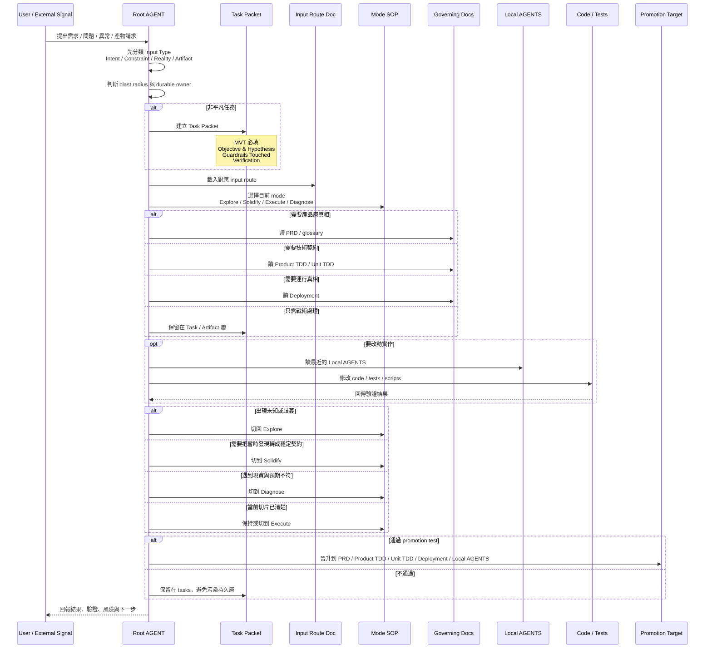

```mermaid
sequenceDiagram
    participant U as User / External Signal
    participant A as Root AGENT
    participant T as Task Packet
    participant R as Input Route Doc
    participant M as Mode SOP
    participant G as Governing Docs
    participant L as Local AGENTS
    participant C as Code / Tests
    participant P as Promotion Target

    U->>A: 提出需求 / 問題 / 異常 / 產物請求
    A->>A: 先分類 Input Type<br/>Intent / Constraint / Reality / Artifact
    A->>A: 判斷 blast radius 與 durable owner

    alt 非平凡任務
        A->>T: 建立 Task Packet
        Note over T: MVT 必填<br/>Objective & Hypothesis<br/>Guardrails Touched<br/>Verification
    end

    A->>R: 載入對應 input route
    A->>M: 選擇目前 mode<br/>Explore / Solidify / Execute / Diagnose

    alt 需要產品層真相
        A->>G: 讀 PRD / glossary
    else 需要技術契約
        A->>G: 讀 Product TDD / Unit TDD
    else 需要運行真相
        A->>G: 讀 Deployment
    else 只需戰術處理
        A->>T: 保留在 Task / Artifact 層
    end

    opt 要改動實作
        A->>L: 讀最近的 Local AGENTS
        A->>C: 修改 code / tests / scripts
        C-->>A: 回傳驗證結果
    end

    alt 出現未知或歧義
        A->>M: 切回 Explore
    else 需要把暫時發現轉成穩定契約
        A->>M: 切到 Solidify
    else 遇到現實與預期不符
        A->>M: 切到 Diagnose
    else 當前切片已清楚
        A->>M: 保持或切到 Execute
    end

    alt 通過 promotion test
        A->>P: 晉升到 PRD / Product TDD / Unit TDD / Deployment / Local AGENTS
    else 不通過
        A->>T: 保留在 tasks，避免污染持久層
    end

    A-->>U: 回報結果、驗證、風險與下一步

```