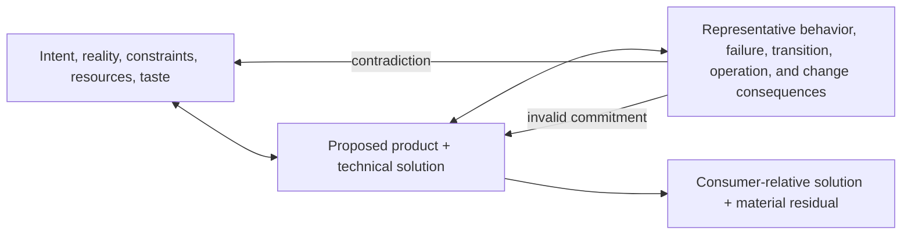

# Design

Design shapes possible futures into one coherent proposed solution. Use it
when intended product or system behavior, realization, or transition is
materially underdetermined, conflicting, or likely to become incoherent
through local choices. Design owns the evolving relation among forces,
commitments, and consequences; it does not own authority to mutate, proof,
implementation sequence, or durable project truth.

Relate Product/Technical claims, current repository and external reality,
deployment needs, stakeholders, resources, short- and long-horizon return on
investment, personal taste, and rebuttable design judgment. Challenge the
proposed arrangement through representative consequences and revise any side
of the relation. Cheap, reversible, local choices remain Implementation
freedom unless their consequence is material.

## Route Through Three Solution Projections

- [Product Design](product.md) shapes what users and stakeholders can perceive,
  do, understand, trust, recover from, and value.
- [Technical Design](technical.md) shapes how the system realizes, sustains,
  changes, and operates those obligations.
- [Test Design](test.md) shapes how material Product and Technical claims will
  be challenged and observed.

They are independent views of one solution, not phases or mandatory files.
Start from the local design pressure, then load only the methods, taste,
examples, and counter-pressure that could change that judgment.

## Return at the Useful Resolution

Design enough for the current bounded implementation horizon: the consumer
should not be forced to make a silent material Product, Technical, transition,
or verification-solution decision. Preserve material assumptions,
alternatives that remain live, consequences, and residuals; do not attempt a
complete upfront specification.

Choose the cheapest truthful carrier for collaboration and memory: prose,
table, topology, sequence, state model, pseudocode, prototype, or code. A
document is not required, but code must not hide rationale, rejected material
alternatives, or cross-owner obligations that future consumers cannot recover.
A proposed or realized arrangement remains unproved until the applicable
[Verification](../../verification/index.md) qualifies its claims.
