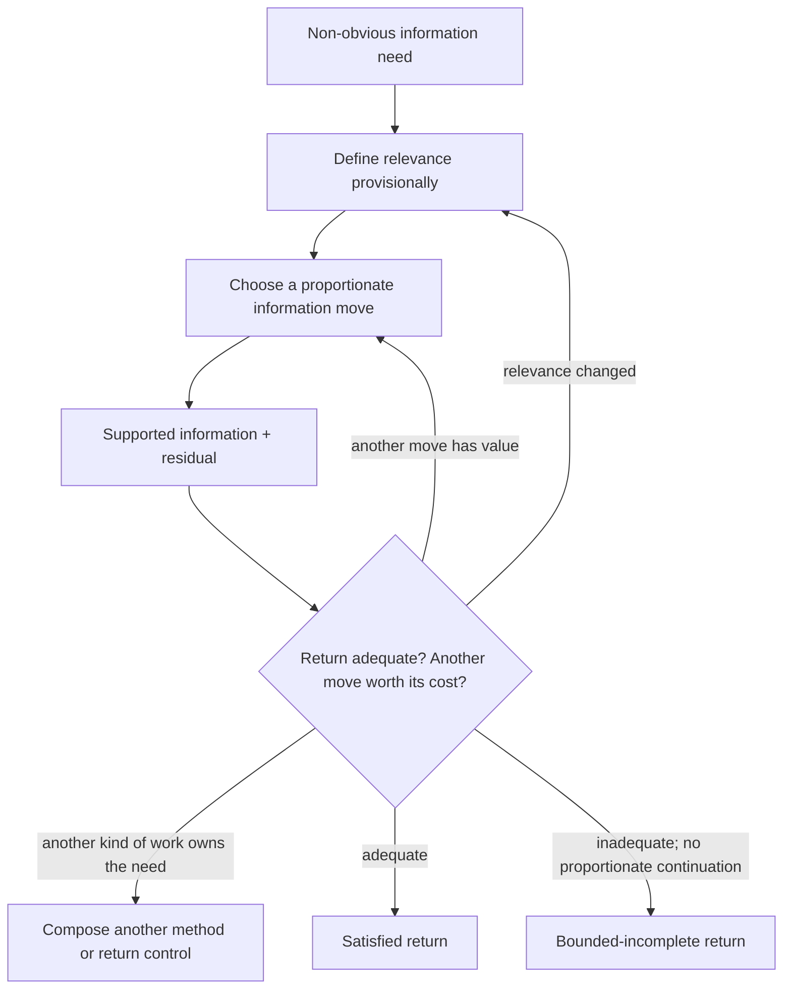

# Explore

Explore finds the key information needed by consuming work. Use it when
reliable progress depends on a material information need and the answer or a
fitting way to obtain it is not already obvious. Directly query an obvious
authoritative target; do not wrap lookup in ceremony.

Explore owns a stateless information method. It does not own persistent
Inquiry state, Task sequencing, effect authority, claim qualification, Human
decisions, or the [Explorer sub-agent](../../sub-agents/explorer.md).

The graph is a reasoning topology, not required steps or lifecycle states.

## Frame What Counts as Key

Define the smallest useful provisional Frame:

1. **Purpose** — what should become possible after this inquiry?
2. **Sought answer** — locate, understand, explain, predict, compare, or what
   other answer about which target is missing?
3. **Material scope and resolution** — which boundary, scale, environment, or
   freshness distinction can change relevance?
4. **Keyness test** — what decision, route, alternative, constraint, owner,
   mechanism, or model distinction must the information change or secure?

Frame is revisable. Preserve supported findings when evidence changes the
question; discard only support invalidated by the new relevance definition.
For explanation, prediction, or intervention, deepen only when useful with
the outcome, possible interventions, relevant environments, mechanisms,
counterfactuals, and the smallest representation that preserves the needed
distinctions. Not every key fact is causal or invariant.

## Route by Consequence

When the next move is non-obvious, choose the reasoning job and evidence path
whose plausible result could most economically change or secure the key
distinction. Useful embedded logic includes:

- query a known applicable authority directly
- model the smallest structure, behavior, mechanism, or relation needed
- generate materially different candidate families when shared assumptions
  may have narrowed the space
- discriminate material candidates with an observation they predict
  differently

Inspect or query existing sources, observe current behavior, elicit Human
knowledge or preference, or produce a bounded observation as appropriate.
Tool choice, Human authority, observation effects, and independent proof stay
with their respective owners.

## Judge Sufficiency Economically

Ask both:

1. Does the supported result enable the Frame's purpose at the needed scope
   and freshness, with material residual within the applicable tolerance?
2. Is there a feasible authorized next discriminator whose plausible outcomes
   could improve the return enough to repay acquisition, delay, attention,
   side-effect, and opportunity cost?

A satisfied return is the smallest supported answer or model that enables the
consumer, plus material residual. Evidence volume, search logs, and subjective
confidence are not substitutes. When evidence is unavailable or continued
search is uneconomic, return the supported partial result, unmet condition,
consequence, and viable continuation as bounded-incomplete.
