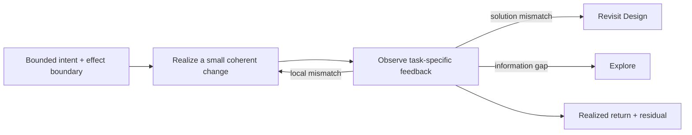

# Implementation

Implementation makes one bounded intended change real through feedback. Use
it when the intended horizon, effect boundary, and a useful local observation
are clear enough to act. It may change code, configuration, data, deployment,
or another real system surface; it does not imply that the change is correct,
qualified, accepted, or complete for the whole Task.

Plan a linear partial route only as far as can be predicted. Each Slice owns a
bounded return and its local verification; use `NN-IM` only as a Human-readable
return tag, never as a posture state. Stop with an explicit to-be-continued
condition rather than inventing future certainty.

Realize the smallest coherent change that can produce useful feedback. Keep
the canonical owner and derived surfaces synchronized inside that return.
Use low-latency compiler, type, test, replay, runtime, visual, or Human feedback
to steer the local loop, but distinguish steering from independent
qualification. When feedback invalidates the solution, authority, or Product
expectation, revisit its owner instead of burying the mismatch in exceptions.

Return the actual changed state or artifact, the achieved horizon, local
feedback, and material residual. Use an [Executor](../../sub-agents/executor.md)
only when delegating this loop is economically better than direct work or a
deterministic transformation. Use [Verification](../../verification/index.md)
when consequential claims require qualification beyond method-local feedback.
