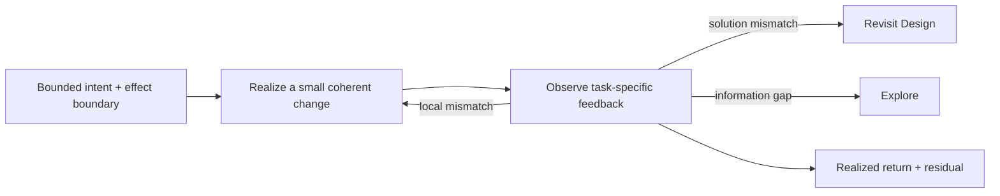

# Implementation

Implementation makes one bounded intended change real through feedback. Use it when the intended horizon, effect boundary, and a useful local observation are clear enough to act. It may change code, configuration, data, deployment, or another real system surface; it does not imply that the change is correct, qualified, accepted, or complete for the whole Task.

Before committing to a route, identify unknowns that could change it: external protocol, permission, runtime, migration, or another hard boundary. Test a consequential unknown with the smallest real probe and record what would stop or redirect the change. Plan only the path supported by that evidence, then implement in bounded Slices with local feedback. For a simple local change with no route-changing unknown, act directly. Each Slice owns a bounded return and its local verification; use `NN-IM` only as a Human-readable return tag, never as a posture state. Stop with an explicit to-be-continued condition rather than inventing future certainty.

Realize the smallest coherent change that can produce useful feedback. Keep the canonical owner and derived surfaces synchronized inside that return. Use low-latency compiler, type, test, replay, runtime, visual, or Human feedback to steer the local loop, but distinguish steering from independent qualification. When feedback reveals a material information gap, use [Explore](explore.md); when it invalidates the solution, authority, or Product expectation, use [Design](design.md) and revisit the affected owner instead of burying the mismatch in exceptions. When realization introduces a consequential authority, data, state, boundary, naming, or complexity choice, consult [Implementation Taste](../../svc-taste/references/implementation.md) only for that pressure.

Return the actual changed state or artifact, the achieved horizon, local feedback, and material residual. Use an [Executor](../../svc-sub-agents/references/executor.md) only when delegating this loop is economically better than direct work or a deterministic transformation. Use [Verification](../../svc-verification/SKILL.md) when consequential claims require qualification beyond method-local feedback.
