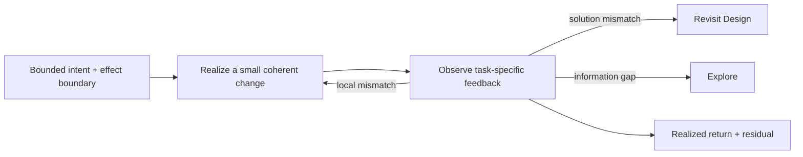

# Implementation

Implementation makes one bounded intended change real through feedback. Use it when the intended horizon, effect boundary, and a useful local observation are clear enough to act. It may change code, configuration, data, deployment, or another real system surface; it does not imply that the change is correct, qualified, accepted, or complete for the whole Task.

Before committing to a route, identify unknowns that could change it: external protocol, permission, runtime, migration, or another hard boundary. Test a consequential unknown with the smallest real probe and record what would stop or redirect the change. Use [Planning](planning.md) when the next route or dependency order is unclear, then implement the bounded path supported by the evidence with local feedback. For a simple local change with no route-changing unknown, act directly. If no feasible authorized continuation can complete the intended return, preserve the changed state and name the unmet condition and next action rather than inventing future certainty.

Realize the smallest coherent change that can produce useful feedback. Keep the canonical owner and derived surfaces synchronized inside that return. Use low-latency compiler, type, test, replay, runtime, visual, or Human feedback to steer the local loop, but distinguish steering from independent qualification. When feedback reveals a material information gap, use [Explore](explore.md); when it invalidates the solution, authority, or Product expectation, use [Design](design.md) and revisit the affected owner instead of burying the mismatch in exceptions. Repair failures of already agreed behavior within existing authority; pause only work depending on an unsettled product premise or missing permission, while continuing independent authorized work. When realization introduces a consequential authority, data, state, boundary, naming, or complexity choice, discover Implementation Taste in `svc-taste` through the host when available, only for that pressure; its guidance is optional and does not replace the responsibilities here.

Return the actual changed state or artifact, the achieved horizon, local feedback, and material residual. Discover `svc-agent-collaboration` by name when another Agent could own a useful result, or responsibility, dependencies, or result adoption need coordination; compare the full cost with direct work or a deterministic transformation and keep coupled investigation, realization, and repair with one owner. Discover `svc-verification` by name through the host when criteria, observations, or the feedback loop need specialist improvement, or consequential claims need evidence beyond the local loop. These Skills provide optional guidance; use applicable project mechanisms and surface actual evidence or capability gaps when unavailable. Implementation remains responsible for useful feedback and an honest bounded return with the mechanisms available.
