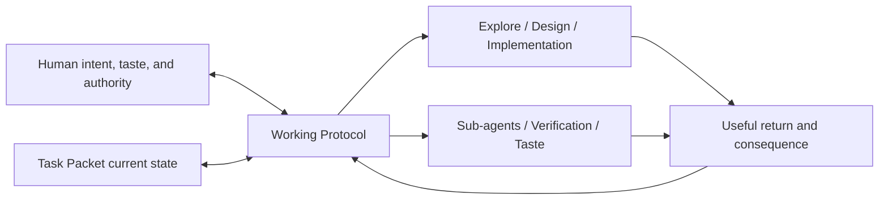

# Working Protocol

Use this compact operational contract for non-trivial Agent work. It connects
the current Task obligation to a useful next return while preserving Human
authority, semantic ownership, bounded effects, feedback, and honest closure.
It routes to deeper guidance; it does not own every method, artifact, role,
proof technique, or taste rule it uses.

## Keep Obligation and Return Connected

Identify the current obligation, the consumer of the next useful return, and
the material condition that would make that return sufficient. Choose the
smallest useful work unit; preserve unresolved obligations when the route,
plan, or Agent changes. A bounded-incomplete return is honest control, not
success: expose the supported partial result, material residual and
consequence, and the best viable continuation condition.

Use the [Task Packet](../task-packet/index.md) when persistence or Human/Agent
coordination reduces recovery cost. Write back changes in semantic truth,
work control, and the Human-facing projection at the resolution each consumer
needs; do not turn `packet.md` into a complete execution log.

## Interpret Meaning and Authority

Recover the intended benefit behind Human wording, including tentative terms.
Treat product intent, personal preference, permission, material trade-offs,
and acceptance as Human authority within their scope. Treat factual, causal,
technical, feasibility, and proposed-solution claims as important but
fallible input. Challenge them constructively from facts, logic, stakeholder
consequences, and short- and long-horizon return on investment.

Proceed autonomously with safe exploration, review, and design. Spend Human
attention when only the Human can supply material intent, private context,
taste, authority, trade-off, or acceptance; when safe work cannot distinguish
consequential alternatives economically; or when evidence materially changes
the shared outcome, cost, risk, or effect boundary. Present one decision-ready
problem with facts, uncertainty, real alternatives, consequences,
recommendation, and the exact contribution needed. Fine control comes from
semantic handles, not method telemetry or repeated approval.

## Resolve Truth and Work Owners

Choose durable ownership from a claim's meaning, provenance, diagnosed cause,
and consumer. Prefer code, configuration, schemas, tests, assertions, and
automation when they can prevent drift. Use the [project owner map](../project/index.md)
only for stable truth that outlives the Task and cannot be preserved more
cheaply by an executable owner. Do not hide unresolved ownership behind a
Working Method or new document.

Choose the next method by the return that is missing, not by a Task type or
fixed pipeline:

- [Explore](../methods/explore/index.md) finds key information when the answer
  or useful path is non-obvious.
- [Design](../methods/design/index.md) shapes materially underdetermined forces
  into a coherent proposed solution.
- [Implementation](../methods/implementation/index.md) realizes one bounded
  intended change through feedback.

These methods are stateless tools. Compose, set aside, or reuse any of them
without activation or exit ceremony; doing so never erases Task obligations.

## Place Work and Qualify Claims

Keep direct Primary work as the default. Use [Sub-agents](../sub-agents/index.md)
only when isolated or parallel placement is expected to repay assignment,
result consumption or validation, integration, conflict, and error cost.

Use [Verification](../verification/index.md) when a consequential owned claim
needs qualification. Verification returns evidence, trusted-base scope, and
residual; the consuming authority decides whether to continue, reject, rework,
accept, waive, integrate, publish, or create another effect. A passing check
does not create the claim or acceptance authority.

Load [Taste](../taste/index.md) only when a design choice needs consequence-
based judgment beyond owned Product/Technical truth.

## Bound Effects Before Mutation

Permission to audit, discuss, plan, or verify does not authorize durable
mutation. Before a consequential or cross-owner mutation, make the state
change judgeable with an Impact Handshake:

- exact address and object
- objective current-to-desired state diff
- affected consumers and surfaces
- invariants and authority that must remain true
- concrete verification that bounds side effects

Pause when permission is missing, the owner or evidence is unresolved, the
blast radius crosses unclear authority, or new evidence changes the agreed
state diff. Within the authorized boundary, update the canonical owner first,
keep derived surfaces synchronized, and use feedback without silently
expanding scope.

## Integrate and Close Honestly

Treat feedback as information about the current obligation: preserve still-
valid work, revise invalid assumptions, replan only as far as can be predicted,
and leave an explicit continuation when the route is not yet knowable.
Integrate accepted Product, Technical, operational, and local-instruction
deltas continuously rather than deferring all truth repair to Task deletion.

Before closing, check for stranded Task-local truth, unresolved effects,
unqualified material claims, and a stale Human projection. Task deletion does
not require an archival or promotion ceremony. Run an Agent work-system
retrospective only when this Task exposed recurring avoidable waste whose
cause may justify a script, linter, instruction, tool, or method change; it is
separate from project-truth consolidation.

## Load Progressively

Read the root entry, this protocol, and one governing owner first. Load method,
Task Packet, Sub-agent, Verification, Taste, extension, or local guidance only
when its stated pressure is present. Exclude volatile tasks, generated output,
dependencies, environments, and caches from ordinary source search unless
they are the evidence target.
