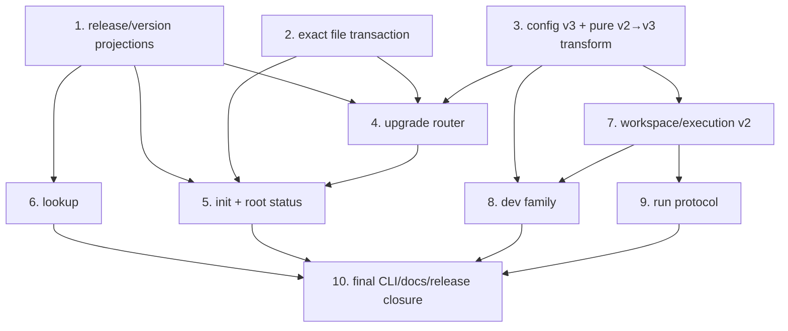

# Agent-friendly Core CLI Integrated Implementation Plan

## Purpose and gate

This plan turns the accepted core command tree and per-command protocols into
one ordered implementation. It is deliberately an implementation plan rather
than another product review: no new public command, output mode, generic
schema, or project-discovery responsibility is introduced here.

The implementation is a single release unit. The slices below are internal
review/verification boundaries; none is independently releasable. Product code
mutation still requires Sir's explicit start after this plan is reviewed.

Sir supplied that start on 2026-08-08 after committing the task design. The
implementation has since completed all ten slices in the working tree. Exact
mechanical and real-project results, including defects found during native
Windows qualification, are maintained in [`acceptance.md`](acceptance.md).

## 1. Verified starting point

### Repository baseline

- Current source gate on 2026-08-08: `159 passed`, mypy clean, all three
  import-linter contracts kept, 21 canonical Markdown documents validated,
  and wheel/sdist build succeeded.
- Current core implementation is concentrated in several already-large owners:
  `cli.py` 697 lines, `project.py` 528, `config.py` 392, `plans.py` 372,
  `_execution.py` 891, `dev/runtime.py` 626, and `run/runtime.py` 451.
- `dev setup` and `self-update` account for two now-rejected implementation
  islands (`dev/setup.py` 700 lines and `update.py` 179 lines) plus dedicated
  tests. Retaining adapters for them would distort the new transaction and
  execution designs.
- Current private execution storage contains schema-v1 records using the
  run-shaped fields `entry`, `workspace_id`, `effective_entry_digest`, and
  `slot_key`. These records are local ephemeral evidence, but explicit inspect
  of an old execution ID must fail precisely rather than be misread.
- The current process carrier uses a POSIX new session, but Windows only uses
  `CREATE_NEW_PROCESS_GROUP`. Microsoft documents that this creates a control
  group and disables Ctrl+C in the child group; it does not detach the child
  from the inherited console. Windows terminal-loss survival is therefore a
  required real check, not an existing guarantee.

### Real Consumer baseline

| Project | Natural state | Material pressure |
| --- | --- | --- |
| InKCre client-web | Git, dirty; config v2 at Corpus 10.0.1; one base/local profile; clean generated legacy Skill | Base+overlay flattening; direct JS config reader; real database ensure/stop; worktree identity |
| InKCre core-py | Git, dirty; config v2 at Corpus 10.0.1; one base/local profile; clean generated legacy Skill | Base+overlay flattening; direct Python config reader; owner database stop and external-owner protection |
| InKCre docs | Git, clean; config v2 at Corpus 10.0.1; no dev; clean generated legacy Skill | Version-field-only config migration; integration repair without dev assumptions |
| SFP7 Camera | non-Git; config v2 at Corpus 11.0.1; one profile; no local overlay; clean generated legacy Skill | Meaningful `0600` modes; host/manual capability; probe diagnostics; no Git safety net |
| Anana `mvp-HA` | Git, clean and unadopted; no config/Skill | Real first-time init establishment |

The three real operational identity consumers read only
`workspace.instance`; the accepted `repository_id` correction therefore does
not break an observed field reader. No real Consumer has adopted `svc run`;
run acceptance must state that evidence limit instead of promoting a
disposable declaration into adoption evidence.

Both `wsl.win-ws.localhost` and `win-ws.localhost` are currently reachable.
WSL has Python 3.13 and Git; Windows has Python 3.14 and PDM. Neither host
currently has a known real Consumer checkout, so a remote checkout used later
must be a disposable copy of real project content, not a fabricated fixture.

Primary external references used for implementation-level claims:

- [python-json-patch documentation](https://python-json-patch.readthedocs.io/)
  for RFC 6902 application;
- [python-semanticversion documentation](https://python-semanticversion.readthedocs.io/en/latest/)
  for strict SemVer parsing and ordering;
- [Changie configuration](https://changie.dev/config/) and
  [`changie batch`](https://changie.dev/cli/changie_batch/) for components,
  custom fragment facts, retention, and move behavior;
- [Python subprocess Windows constants](https://docs.python.org/3/library/subprocess.html#windows-constants)
  and [Microsoft process creation flags](https://learn.microsoft.com/en-us/windows/win32/procthread/process-creation-flags)
  for the distinction between process grouping and console detachment.

### Dependency evidence

- Existing runtime dependencies already provide Pydantic, filelock,
  python-dotenv, platformdirs, and urllib3.
- `jsonpatch` and `semantic_version` are not installed. Add the maintained
  distributions `jsonpatch` (python-json-patch) and `semantic-version`
  (python-semanticversion) as runtime dependencies. Use their exact RFC 6902
  apply API and strict `Version` parsing/comparison; never use coercion.
- Use bounded constraints consistent with this repository:
  `jsonpatch<2,>=1.33` and `semantic-version<3,>=2.10`. Add
  `PyYAML<7,>=6.0` only to the quality/tooling group. Resolve and commit the
  PDM lock once in slice 1; later slices must not choose different SemVer or
  patch libraries.
- Release-projection tooling must parse Changie's YAML with a mature YAML
  parser. Add PyYAML to the quality/tooling dependency group, not the runtime
  wheel: runtime reads generated JSON/Markdown projections only.
- Changie natively supports components/custom fragment fields and
  `batch --keep|--move-dir`. SVC adds validation/projection of its domain facts,
  not another fragment lifecycle or changelog parser.

## 2. Impact handshake

### Address and object

The implementation may change these owners:

- package/release/configuration: `pyproject.toml`, `pdm.lock`, `.changie.yaml`,
  structured fragments under `changes/`, `src/version.json`, generated
  migration notes under `src/migrations/`, `tools/`, `pdm_build.py`, catalog
  and resource modules;
- project mutation/state: `svc_cli/plans.py`, `integration.py`, `config.py`,
  `project.py`, and new target-specific upgrade modules/resources;
- execution: `workspace.py`, `_execution.py`, `run/`, `dev/`;
- public protocol: `cli.py`, a small common output transport, command-local
  result projections, README/Corpus/templates/contributor instructions, CI
  smoke calls, and affected tests;
- deletion: `svc_cli/update.py`, `svc_cli/dev/setup.py`, their dedicated tests,
  and their public references.

The unrelated dirty `tasks/v10/packet.md` and other task directories are not
in scope.

### State diff

```text
current mixed CLI/Corpus version + config v2/profile + generic output
  -> independent version authorities + automatic v2->v3 config upgrade
  -> final accepted command tree and command-local Agent/Human output

write-only LocalPlan + aggregate rollback
  -> exact before/after file-state transaction + delete/mode/interrupt evidence

run-shaped shared execution record + one overloaded slot key
  -> neutral schema-v2 execution attempt + explicit operation/intent/coordination

dev ensure-only lifecycle
  -> one serialized ensure/stop capability boundary with Consumer-declared stop
```

### Blast radius

- Every v2 Consumer must run the config target before the new runtime can use
  its dev/run declarations. The automatic file transform is bounded, but real
  direct readers of the v2 JSON shape require Agent/Human edits described by
  the plan guidance.
- Generated AGENTS/docs blocks refresh; clean generated legacy Skills are
  deleted. Modified or unproven files are not overwritten/deleted.
- CI and scripts using init's JSON retain `plan_digest` but receive the new
  command-local schemas. No compatibility aliases are added for otherwise
  unconsumed fields.
- Existing private execution schema-v1 IDs no longer have a current receipt
  projection. They remain on disk and are never used as PID authority.
- Telemetry and analysis public interfaces remain outside the output refactor.
  Only references that invoke removed lookup grammar may be updated so those
  specialist surfaces still function.

### Invariants

- `src/` remains Corpus content; config grammar/migration code remains under
  `svc_cli/`.
- Default text is the Agent/Human interface; compact JSON is deliberate
  CI/script projection. There is no universal success schema.
- Same semantic fact uses one canonical name; run entry and dev target remain
  distinct public concepts.
- `init` never migrates configuration or advances an existing Corpus baseline.
- Config upgrade never edits external readers; Corpus upgrade never edits
  project documents. The apply receipt states its bounded proof.
- `dev stop` executes only a Consumer-declared action and never kills a saved
  PID. `dev status` remains an unlocked volatile observation.
- No current dirty Consumer root or remote project is mutated for acceptance.

### Verification

Every slice has focused mechanical tests. The completed unit must pass all
repository gates, installed-wheel checks, and the real-project matrix in
section 7. Fixture tests prove mechanisms only; they cannot satisfy product
acceptance.

## 3. Final owner topology

### Release and version authority

- `src/version.json`: canonical released Corpus chain/projection. Its last
  release is the available Corpus version.
- distribution metadata: sole CLI distribution version authority.
- `svc_cli/config.py`: sole current config schema/model/effective-overlay
  authority.
- `svc.json:corpus_version`: sole project Corpus baseline.
- `tools/` release projection: validates structured Changie facts and derives
  `src/version.json`, Corpus migration notes, and compact packaged config
  migration descriptors. It does not parse generated changelog Markdown.
- `svc_cli/catalog.py` and `release.py`: validated runtime projections of those
  independent facts; no generic `svc_version` remains.

Bootstrap the retained Corpus chain at real supported baseline `10.0.1`:

```text
10.0.1 --not-required--> 10.0.2
10.0.2 --guide----------> 11.0.0
11.0.0 --not-required--> 11.0.1
11.0.1 --current guides-> planned next Corpus release
```

`10.0.1` is the smallest evidence-backed anchor: all known older v10 adoption
was asserted absent, while three current real Consumers still record 10.0.1.
This avoids declaring those projects unsupported merely because 10.0.2 was the
last release before v11.

Use these concrete projection locations:

```text
changes/fragments/v<package-version>/*.yaml    retained authored fragments
tools/build_release_projections.py             validator/generator
src/version.json                               Corpus release-chain projection
src/migrations/<change-id>.md                  Corpus guide projection
svc_cli/data/migrations/config-2-3.json         CLI config descriptor projection
```

The projection tool reads retained and unreleased fragments. For a pending
Corpus change it derives the next Corpus SemVer from the last Corpus release
and the highest Corpus-owned Changie kind; CLI/config-only fragments leave the
chain unchanged. Release preparation supplies the already-computed package
version to Changie's `--move-dir` and moves the same fragments under
`changes/fragments/v<package-version>/`. Stable release/change association then
comes from that path plus filename, while living guidance remains editable at
that authored fragment.

Internal validation needs no Git history: chain continuity, migration status,
guide references, generated bytes, and descriptor hashes are source facts.
The additional “Corpus content changed without a Corpus release” check belongs
to CI/release qualification, where the current projection is compared with the
last tagged Corpus projection (and, for pull requests, the merge base). The
wheel builder must not make network or Git-history access part of runtime
catalog construction.

### Project/configuration authority

- Eliminate the parallel schema-v1 `ProjectState` parser. A fresh project gets
  minimal current schema-v3 `svc.json` with `schema_version` and
  `corpus_version`; `config.py` validates it using defaults for absent dev/run.
- A read-only `ConfigurationInspection` distinguishes missing, current v3,
  supported legacy v2, invalid, schema-blocked, and orphan-local without
  pretending a legacy document is runnable current config.
- A config-migration module owns only explicit v2->v3 RFC 6902 generation,
  application through jsonpatch, deterministic JSON serialization, and target
  revalidation. It does not become a generic graph/framework.
- Target-specific upgrade controllers own config and Corpus plan semantics.
  A thin router selects one target and reports `remaining_targets`.

### Filesystem mutation authority

`svc_cli/plans.py` remains the one deep local transaction owner:

```text
FileState(state, sha256?, posix_mode?)
PlannedFileMutation(path, before, after, parent_preconditions)
TransactionResult(realized operations, verification, rollback evidence)
```

It knows exact write/delete, mode, stale checks, atomic replacement, rollback,
and SIGINT settlement. Init/upgrade wrap that neutral signature with their own
`action`, `surface`, and `extent`; rendered prose never enters plan identity.

### Workspace and execution authority

- `workspace.py` solely owns `root`, `namespace_id`, `repository_kind`,
  `repository_id`, `worktree_id`, and `instance`.
- `_execution.py` owns neutral schema-v2 attempts:
  `domain`, `operation`, `subject`, `workspace_instance`, `intent_digest`,
  `coordination_key`, state/timing/process facts, and log references.
- Run restores `entry/effective_entry_digest`; dev restores
  `target/effective_target_digest` and capability facts.
- The dev capability coordination key excludes ensure/stop and effective
  endpoint/declaration digest. Operation+intent decides same-intent join;
  opposite intent waits on the same resource boundary.
- One `ExecutionLogReference(stream,path,bytes)` projection owns log facts.

### Presentation authority

- `cli.py` owns parser/dispatch, mode selection, terminal channel, and exit.
- `svc_cli/output.py` owns compact JSON serialization and the
  recognized error envelope only.
- Text/JSON success projections remain command-local: lookup in `lookup.py`,
  init/root status in `project_output.py`, upgrade in `upgrade/output.py`, dev
  in `dev/output.py`, and run in `run/output.py`. These renderer modules accept
  typed results and never inspect files, resolve config, or choose exits.
  Delete the generic `_emit(command: status)` path rather than making it
  understand every command.
- Help is authored with the command parser and contract-tested for purpose,
  effects, channels/exits, and continuation. Lookup is never a CLI-manual
  fallback.

## 4. Dependency graph and strict implementation order



The numbered order below is strict even when graph branches are logically
independent. Each slice returns the source tree to green before the next. No
wheel from an intermediate slice is published.

### Slice 1 — independent version and release projections

1. Add exact runtime/tooling dependencies and lock them.
2. Extend Changie configuration with `cli|config|corpus` components and closed
   migration custom fields. Classify/split current unreleased changes by one
   owner; never give one fragment multiple components.
3. Add strict release-projection models/tooling. Import the supported
   10.0.1->11.0.1 chain, import the existing 11.0.0 guide source once, and
   project the current unreleased Corpus guides under the accepted authoring
   contract.
4. Add/check `src/version.json`; change the catalog to carry
   `corpus_version` and release records. Build source and wheel catalogs from
   that index, never from PDM's package version.
5. Make `svc --version` report distribution version only. Source-tree status
   may report `source-tree`; it must not relabel Corpus version as CLI version.
6. Add a projection check to CI/release preparation. Batch preserves/moves
   structured fragments into `changes/fragments/v<package-version>/` before
   merge. The check compares generated files byte-for-byte and separately
   checks Corpus-source changes against the last tag/merge base and the
   projected last Corpus release.

Gate: a deliberately simulated CLI-only package version bump leaves catalog
`corpus_version` unchanged; a broken chain, missing migration disposition,
wrong guide path, or changed Corpus without a release projection fails the
builder.

### Slice 2 — exact file-state transaction and obsolete mutation surfaces

1. Replace `PlannedWrite` internals with exact `FileState` and
   `PlannedFileMutation`, including explicit absent state, intended after mode,
   and parent topology preconditions.
2. Implement atomic write and delete, postcondition verification, and
   per-path rollback reports (`restored`, `preserved_external`, `unrestored`).
3. Mark an operation attempted before its commit boundary; catch SIGINT at the
   transaction boundary and settle before/after/unknown state before rollback.
4. Preserve existing meaningful POSIX mode; create non-secret integration text
   as `0644`; omit mode claims on Windows.
5. Remove public `self-update` and `dev setup`, delete their now-unowned
   implementation/tests, and remove their parser imports before changing the
   plan type. Keep the current init/adopt callers on a bounded adapter only
   until slices 4-5 replace them; do not retain a legacy generic API afterward.

Gate: injected mechanical failures prove exact mode restoration (including the
reproduced `0640 -> 0600` bug), delete rollback, concurrent-writer preservation,
symlink/parent rejection, and `3|4|130` recovery distinctions.

### Slice 3 — config schema v3 and pure supported transform

1. Define strict source-v2, current-v3, and v3-local-overlay models. Current
   v3 uses `corpus_version`, `dev.targets`, optional target-local
   `stop: exec|manual`, and no profile field/token/environment dimension.
2. Define stop exec independently from provision mode. It shares argv/cwd/env
   value semantics but has its own `timeout` (default 300 seconds, greater than
   zero and at most 3,600 seconds); it cannot express `run|activate`. The
   default covers the observed 120-second client and 180-second core cleanup
   paths without reusing readiness timeout as stop policy.
3. Generate explicit RFC 6902 operations for base and present local overlay;
   apply using jsonpatch, canonicalize JSON, and revalidate both target files
   plus the effective merge.
4. Replace `${dev.profile}` with the selected literal while migrating. Never
   invent stop. Block multiple profiles, local-only targets, disagreeing
   selectors, unknown fields, duplicate keys, non-finite JSON, or lossy merge.
5. Generate/package `config-v2-to-v3` guidance descriptor from the exact
   config Changie fragment and bind its identity/hash to later plans.
6. Make runtime `load_config` current-v3-only. Legacy inspection is available
   to status/upgrade but never silently accepted as current runtime config.

Gate: pure-transform tests assert exact ordered patch operations and the four
natural filesystem combinations: v2 base with absent/present local, v3 base
with legacy local, and both current.

### Slice 4 — unified `svc upgrade`, then remove `adopt`

1. Implement separate config and Corpus plan controllers over the shared
   transaction engine in `svc_cli/upgrade/config.py` and `corpus.py`; add the
   thin selector/router in `upgrade/runtime.py` and public exports in
   `upgrade/__init__.py`.
2. Targetless routing selects config first only when both targets are pending;
   explicit targets remain independent where their prerequisites hold.
3. Config plan renders complete bounded guidance in default text, exact effects
   in JSON, and applies base+local atomically. Its verification stops at config
   file/effective-model postconditions.
4. Corpus plan selects the exact release chain `(project, available]`, returns
   exact lookup references/current hashes, and binds only the baseline file
   plus current guidance facts—not Consumer document bytes. Apply records the
   caller assertion and updates only `corpus_version`.
5. Every successful apply recomputes and reports `remaining_targets`.
6. Add accepted plan/apply outputs, channels, exit mapping, interrupt recovery,
   and self-sufficient help. Remove public `adopt`, its parser/controller, and
   compatibility wording only after Corpus upgrade is complete.

Gate: `config + corpus pending -> config plan/apply -> corpus still pending`
and `corpus plan -> external document edits -> same digest apply` both pass.
Ahead/off-chain/missing guidance and stale digest paths remain non-mutating.

### Slice 5 — init, root status, and legacy-Skill retirement

1. Rebuild init planning on current config inspection and exact file
   operations. Fresh init creates minimal v3 config; existing current config is
   validated but never rewritten or advanced.
2. Change generated AGENTS/docs content to the short CLI/Corpus trigger. Stop
   generating a Skill. Plan a whole-file delete only when the legacy marker
   proves exact clean provenance; modified marker is a blocker; no marker is
   ignored as Consumer-owned.
3. Make blocked init expose zero operations/no digest; preserve valid noop
   digest behavior required by the CI plan-then-apply flow.
4. Rebuild status around independent `cli`, `configuration`, `corpus`, and
   `integration` dimensions plus canonical workspace. Remove Human
   authorization and Skill-health facts.
5. Implement repair-before-Corpus routing, config-before-init when schema is
   unsupported, ahead-baseline guards, and explicit valid continuations.
6. Add init/status command-local renderers, compact schemas, channels/exits,
   interrupt receipts, and complete help; remove `init --agent`.

Gate: fresh status->init->status, legacy config->upgrade->init->status, clean
Skill deletion, modified/unproven Skill protection, orphan local block, and
repeat init noop all pass.

### Slice 6 — lookup grammar and semantic presentation

1. Replace `name|all` with exact `path`, shallow `list [PREFIX]`, ranked
   `keyword`, and bounded full-text/path `regex`; add applicable
   `scope path|both`.
2. Build shallow directory entries from the validated catalog without copying
   a second tree authority. Directory document count is derived; document
   identity remains catalog-owned.
3. Preserve deterministic lexical ranking privately but remove numeric score
   from public output. Implement stable match locations and flat occurrence
   limit/truncation.
4. Emit raw Markdown for default exact path, compact mode-specific schema-v2
   JSON otherwise, and stdout/0 empty searches.
5. Replace SVC-owned uses of removed lookup grammar, including CI smoke,
   contributor commands, packaged-method references, and the specialist
   analysis acceptance helper. This is compatibility maintenance, not a
   telemetry/analysis output redesign.

Gate: all four modes, nested prefix, zero match, malformed regex, absent exact
path/prefix, corrupted digest, raw-byte fidelity, and built-wheel resource
access pass.

### Slice 7 — canonical workspace and neutral execution schema v2

1. Rename `repo_common_id` to `repository_id` at the sole workspace owner and
   every internal/public projection. Preserve `workspace.instance` exactly.
2. Replace schema-v1 run-shaped execution records with neutral schema v2 and
   one log-reference type. Separate coordination key, operation intent, and
   execution ID in types and persistence.
3. Treat the current schema-v1 store as an unreleased bounded transition, not
   a durable compatibility protocol. Before publishing any v2 attempt, scan
   only v1 record headers for an active state and its recorded lifetime lock.
   If a v1 owner still holds any such lock, reject the new operation with a
   precise `legacy-execution-active` conflict rather than trying to translate
   or join it. Once no v1 attempt is active, v2 operations use only the new
   semantic coordination keys. The 23 records observed locally are settled.
4. Explicit inspect of a schema-v1 execution returns
   `execution-record-schema-unsupported` with no aliases and no PID action.
   Do not delete old records automatically.
5. Put platform-specific isolated-launch flags behind one small carrier
   function. POSIX retains new session/null stdin/log redirection. Windows
   candidate flags must be proven on the real host before claiming terminal
   survival; do not infer it from `CREATE_NEW_PROCESS_GROUP`.

Gate: schema-v2 round trip, v1 precise rejection/global active-transition
barrier, owner loss, log-byte references, POSIX signal ownership, and real
Windows carrier evidence pass before dev is called complete. Published v11
dev coordination predates these records; config guidance tells callers to let
an in-flight old `svc dev ensure` invocation settle before upgrading. Existing
released servers are rediscovered by readiness, never by a legacy PID.

### Slice 8 — complete dev family and Consumer-declared stop

1. Remove profile from identity/interpolation/env/output and derive
   `CapabilityIdentity(scope,target,endpoint_id,scope_id,capability_id)`.
   Compute effective target digest from that target only.
2. Move ensure's initial readiness probe behind the shared capability
   coordination boundary. Same operation+intent joins; opposite operation
   waits, re-evaluates, then proceeds. Status stays unlocked.
3. Implement stop exec/manual resolution, environment interpolation, bounded
   action timeout, merged log capture, same-intent following, owner/follower
   Ctrl+C, owner-loss uncertainty, and final readiness probe.
4. Never use released execution PID as stop authority. Execute declared stop
   even when initial readiness is false; cleanup idempotence is the Consumer
   declaration's contract.
5. Implement accepted identity/status/ensure/stop default text, compact JSON,
   native probe previews, live stderr, terminal stdout, exits, and help.
6. Make SVC launch/capture/store failure an error/4; actual Consumer stop
   nonzero/timeout/interruption remains the resolved `stop-failed` domain
   result/3 (owner caller Ctrl+C still exits 130).

Gate: real ready reuse, concurrent ensure convergence, ensure-vs-stop
serialization, executable stop/final probe, manual host target, external-owner
refusal, follower detach, and terminal-owner exit persistence are observed.

### Slice 9 — run projection on the neutral execution owner

1. Project neutral subject/intent back to `entry` and
   `effective_entry_digest`; expose `workspace_instance` and exact stdout/stderr
   log references/byte counts.
2. Preserve native stdout/stderr and child exit passthrough in default mode;
   keep SVC lifecycle/receipt on stderr. Inspect remains observation-only on
   stdout/0.
3. Keep JSON one compact terminal receipt with native display suppressed.
4. Add bounded committed-entry names to unknown-entry errors. Do not add list,
   arbitrary argv, background/cancel, artifact inference, or generic logs.
5. Complete owner/follower/explicit-follow detach and owner-loss rendering/help
   over schema v2.

Gate: two callers converge, follow replays both attributed streams, inspect
returns current/terminal log bytes, child nonzero passes through, owner Ctrl+C
interrupts, follower Ctrl+C detaches, and old IDs fail precisely.

### Slice 10 — public closure, durable owners, and release qualification

1. Replace remaining generic emitters with the common error transport and
   command-local results. Grammar JSON uses the recognized error envelope;
   default errors use purpose-written lines and never dump prettified details.
2. Recheck the exact root command tree and all layered help. Remove stale code,
   imports, tests, generated references, and dependency edges for rejected
   surfaces.
3. Update canonical Corpus/product/TDD/deployment owners where the product
   contract changed, then templates, README, CONTRIBUTING, CI/publish smoke,
   and release fragments/projections. Historical changelog entries remain
   historical; living migration guidance is updated at its structured source.
4. Add/adjust import-linter contracts so workspace, transaction, execution,
   and release owners cannot import public domain controllers.
5. Run the complete mechanical and real acceptance portfolio. Build and
   install the wheel in a clean environment; inspect its packaged catalog,
   config migration descriptor, and help without source-tree fallback.

Gate: no target-contract term remains only in task docs; no removed command is
advertised by a current durable surface; telemetry/analysis public snapshots
are unchanged except valid lookup references.

## 5. Mental rehearsal and fault isolation

| Scenario | Expected behavior | Bug prevented / diagnostic proof |
| --- | --- | --- |
| CLI-only release, unchanged Corpus | CLI version advances; catalog/project Corpus relation remains current | Prevent false empty Corpus migration guidance |
| Corrupt/missing `src/version.json` hop | Build and runtime catalog validation fail with integrity error | Never infer `not-required` from absence |
| Known 10.0.1 Consumer | Chain starts from supported 10.0.1 and selects later releases | Prevent real projects becoming off-chain by bootstrap choice |
| Project baseline ahead | status says ahead; init/Corpus upgrade do not project older integration or downgrade | Preserve project baseline authority |
| v2 base + v2 local | one config transaction rewrites both or neither | Prevent half-migrated effective config |
| v3 base + legacy local | config target selects local-only migration when lossless | Recover after pulling base migration onto another machine |
| Multiple legacy profiles | plan blocked, zero operations/digest | Prevent silent discard masked by selected profile |
| External script still reads v2 path | default config plan delivers exact guidance; apply never claims script compatibility | Preserve Agent/Human semantic migration duty |
| Config apply while Corpus also pending | receipt warns/reminds Corpus still pending | Prevent targetless router from hiding remaining work |
| Corpus docs edited after plan | Corpus apply digest stays valid if SVC-owned baseline/guidance facts did not change | Enable plan/read/edit/check/apply handshake |
| Corpus guidance changed after plan | digest mismatch requires fresh plan | Bind the exact living guidance actually presented |
| Fresh init | creates minimal v3 config and four integration effects; no Skill | Prevent init from becoming dev-only or recreating rejected surface |
| Clean legacy Skill | explicit delete with exact rollback bytes/mode | Prevent silent leftover CLI manual |
| Modified/unproven Skill | blocker or ignored Consumer file, never deletion | Preserve provenance boundary |
| Existing `0640`/`0600` file | success and rollback retain exact meaningful mode | Fix reproduced false-success mode loss |
| SIGINT immediately around `os.replace` | attempted operation is reconciled before rollback receipt | Close commit-before-bookkeeping gap |
| Concurrent writer after SVC commit | rollback preserves newer bytes and names path | Never overwrite external work during recovery |
| Second SIGINT/SIGKILL/power loss | no impossible receipt promise; next status/plan observes atomic per-path state | Keep recovery horizon honest |
| Unreleased schema-v1 attempt still active | global transition barrier reads only v1 header/lock and returns precise legacy-active conflict | Prevent duplicate run/dev operation without retaining field aliases |
| Published old `dev ensure` still in flight during package/config upgrade | guidance requires that bounded invocation to settle first; new CLI later trusts readiness, never its PID | State the cross-version horizon instead of claiming impossible lock-key continuity |
| Inspect old settled execution | precise unsupported-schema error; files and PID untouched | Avoid indefinite aliases and unsafe takeover |
| Ensure observes ready while stop starts | ensure first enters capability boundary, waits, then re-probes | Remove current pre-lock reuse race |
| Two stop callers | one action, shared execution/log, owner/follower results | Preserve one explicit intent -> one observable execution |
| Stop exits 0 but probe ready | `still-ready`, stdout/3 | Do not equate action exit with capability postcondition |
| Stop exits 0 but probe unavailable | `stop-unverified`, ready null, stdout/3 | Do not fabricate absence/readiness |
| Manual/absent stop | no mutation/PID fallback; one current probe; manual result | Preserve Consumer-owned cleanup authority |
| External client tries to stop core-owned DB | real Consumer action refuses; SVC reports stop-failed + final probe/log | Preserve ownership refusal rather than bypass it |
| Owner terminal closes after ensure ready | released capability continues and writes stable log | Required long-lived capability semantics |
| Windows terminal close | must be observed on `win-ws.localhost`; candidate launch flags are revised if child dies | Do not mistake process group for detachment |
| Run child emits stdout/stderr and exits 7 | native channels preserved, receipt/logs exact, caller exits 7 | Keep run distinct from dev result status |
| Lookup search has no matches | empty semantic collection on stdout/0 | Keep Corpus miss distinct from CLI/manual failure |
| JSON mode succeeds | exactly one compact value; no progress/native/text on other channel where contract suppresses it | Keep scripts/CI consumption stable |
| Resolved non-success plan/status | self-contained result on stdout with exit 3 | Avoid forcing recovery call just to retrieve evidence |

Fault isolation follows owners: release/index errors never become config
errors; patch/model failures never become filesystem rollback claims; Consumer
action failures never become execution-store failures; readiness remains a dev
postcondition and never a generic run state.

## 6. Mechanical verification portfolio

Focused tests may use temporary directories/processes because they verify
mechanics, not product acceptance:

- release models/projection determinism, independent version bumps, archived
  fragment identity, required guidance sections, and wheel resource fidelity;
- exact JSON parsing, v2/v3 models, RFC patch sequence, local-overlay
  admissibility, deterministic serialization, SemVer ordering;
- file states, modes, delete, stale parents/symlinks, rollback categories,
  interrupt timing, and channel/exit mapping;
- workspace linked-worktree/non-Git identity and canonical names;
- execution schema-v2 persistence, legacy boundary, owner loss, log references,
  signal behavior, and concurrent selection;
- lookup modes/limits/integrity; command-specific JSON/text snapshots and help;
- root status/init/upgrade state transitions;
- dev readiness evidence, ensure/stop serialization and interruption;
- run native streams/follow/inspect/exit passthrough.

Final local gates:

```text
pdm install --frozen-lockfile -d -G quality -G test
pdm run test
pdm run lint-tests
pdm run typecheck
pdm run lint-imports
pdm run lint-workflows
pdm run check-documents
changie batch auto --dry-run --allow-no-changes=false
<release projection check>
pdm build
<clean venv installed-wheel smoke>
```

CI's `mktemp` init smoke remains a packaging/mechanical smoke and must not be
reported as the real acceptance required below.

## 7. Real-project acceptance matrix

Every row records exact command, exit, stdout, stderr, before/after status,
execution/log references where applicable, and VCS/filesystem diff. Existing
dirty roots are read-only. Any mutation uses a user-authorized disposable
checkout/worktree of the named real project.

| ID | Real project/platform | Natural or prepared state | Exercise | Required proof |
| --- | --- | --- | --- | --- |
| R1 | Current SVC repo, macOS | source + built wheel | root/all subcommand help; all lookup modes; `--version` | final tree only; CLI vs Corpus versions separate; raw path/read and compact JSON correct |
| R2 | client-web, macOS, existing dirty root | natural v2 base+local/10.0.1/clean Skill | read-only `status`, `upgrade`, `init`, `dev identity` plans/results | config is selected first; exact direct-reader guidance; no mutation; instance unchanged |
| R3 | core-py, macOS, existing dirty root | natural v2 base+local/10.0.1/clean Skill | same read-only sequence | same routing with Python direct-reader guidance and external-owner boundary visible |
| R4 | InKCre docs, macOS, existing clean root then authorized disposable checkout | v2, no dev, 10.0.1, clean Skill | read-only config/Corpus plans; config apply only in disposable copy; then init plan/apply | version-only transform; no invented dev; v2 init initially routes to config; post-config init explicitly deletes Skill; complete Corpus chain |
| R5 | SFP7 Camera, macOS, non-Git | v2, one host/manual target, mode `0600` surfaces | read-only plans; after authorized disposable copy, config/init apply and manual dev ensure/stop | non-Git identity; exact mode preservation; probe evidence; no stop mutation/PID fallback |
| R6 | Anana `mvp-HA`, macOS | real clean unadopted project | init plan; authorized disposable checkout apply; status; repeated init | exactly minimal v3 config + `.gitignore`/AGENTS/docs effects; no Skill; repeat noop |
| R7 | client-web disposable checkout, macOS | start from real v2 files; first make direct reader dual-v2/v3 compatible; apply config migration; then declare database stop with existing runtime command | config plan/apply, project-owned runtime checks, `dev ensure database`, starter terminal exit, second ensure, `dev stop database`, final status | automatic files exact; external reader migrated by Agent/Human; server survives starter; callers converge; one stop/log; final not ready |
| R8 | core-py disposable checkout, macOS | start from real v2 files; make Python reader dual-compatible; apply config migration; declare stop using existing `dev:database stop` | ensure/stop and client external-ownership refusal path | owner cleanup succeeds; client cannot tear down core-owned runtime; final probe/log truthful |
| R9 | SVC disposable real checkout, macOS | temporary committed v3 run entry invokes actual repository test command | two `svc run` callers, follow, inspect, failure entry, owner/follower Ctrl+C | convergence/native channels/child exit/log handoff; explicitly labelled mechanics because no Consumer adoption exists |
| R10 | disposable real checkout on WSL | built wheel copied/installed; Anana or SVC real content | lookup/status/init transaction/run carrier; POSIX terminal separation | Linux path/permissions/channels and process behavior match contract |
| R11 | disposable real checkout on native Windows | built wheel copied/installed; real content | lookup/status/init transaction/run; dev carrier terminal-close experiment | compact CRLF-safe channels; no false POSIX mode; child survival or a blocking platform defect with evidence |
| R12 | linked worktree of a real Git Consumer | two worktrees, same repository | identity/status plus independent dev capability selection | same `repository_id`, different root/worktree/instance; correct scope sharing |

R7/R8 are the principal lifecycle acceptance. They must use Consumer-native
Docker/Portless/database scripts and their real readiness probes; a Python
sleep/http-server fixture is not a substitute. If required local services are
unavailable, report that row unavailable and do not replace it with a fixture.

R9 is deliberately not evidence that `svc run` has real Consumer adoption. It
is real-project mechanism acceptance for a command admitted by earlier product
evidence. The final report retains that limitation.

Remote mutation and disposable checkout creation require an explicit scope at
execution time. No current client-web/core-py worktree, non-Git SFP7 root, or
remote home project is altered in place.

## 8. Completion and stop conditions

Implementation is ready for release review only when:

1. every accepted core command has its final grammar/help/text/JSON/channel/
   exit contract and every rejected surface is absent from current docs/code;
2. one authority owns each version, workspace, config, file-state, execution,
   log, and domain identity fact;
3. all mechanical gates pass from a clean installed wheel;
4. the available real acceptance rows are recorded with exact evidence and no
   fixture is presented as product acceptance;
5. Windows long-lived survival is either proven or reported as a release
   blocker—never silently downgraded;
6. telemetry/analysis public interfaces remain unchanged outside necessary
   lookup-reference repair;
7. no unrelated user work is staged or committed.

The next action after Sir reviews this plan is an explicit product-code start,
not another command/interface discussion. New implementation evidence may
still return a specific invariant or blast-radius change for review; ordinary
code-level choices proceed inside this plan.
