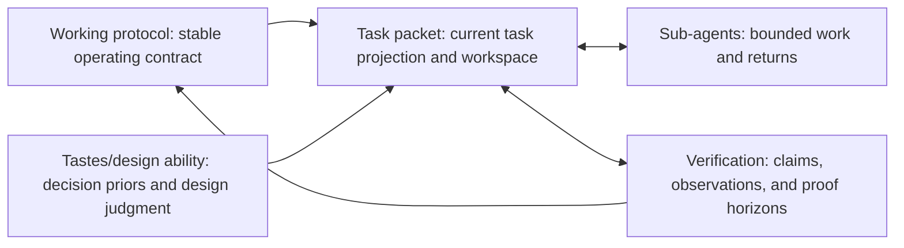

# Working Note — Task Packet and Human Coordination Surface

- **State**: supporting task-packet foundation; superseded as the active front
  by [`13`](13-task-packet-organization-patterns.md)
- **Sources**: `D-012`, `V-013`, `V-026`, Sir's Human-Agent collaboration
  gleanings, the linked ChatGPT conversation, current SVC task protocol, and
  bounded Lead synthesis
- **Use**: Preserve the accepted task-packet/`packet.md` boundary, Human current
  view, compression, and update semantics beneath the organization-pattern
  discussion

## Evidence Boundary

Sir's gleanings are accepted product and design input for this task. They do not
yet prove that one packet shape works for every task.

The linked conversation contains useful synthesis and citations, but it moves
quickly from observations to a named theory, a universal pre-execution gate, a
controlled task intermediate representation, and a six-type collaboration
language. Those mechanisms are proposals from a ChatGPT conversation, not
primary evidence or accepted SVC design.

The current SVC five-field file and this design task are useful local evidence.
The protocol calls for a Human-readable control surface under `tasks/` and
allows supporting material when that file becomes hard to scan. Sir has now
clarified the intended terms: a task packet is the filesystem set serving the
task, while one fairly short file inside it must give the Human the key current
picture. Not every file or piece of task-local state exists to be shared.

## Position Among the Five Functional Clusters

Task packet is a task-local integration surface, not the semantic owner of the
other clusters:

- Working protocol defines stable packet semantics, update triggers,
  authority, and escalation; the packet instantiates them for one task.
- Sub-agents may consume bounded task context and return artifacts or evidence;
  the packet exposes consequential integration state, not heartbeats or a
  scheduler.
- Verification supplies current proof and residual unknowns; the packet
  summarizes the horizon needed for the next move rather than owning every
  oracle or raw result.
- Taste and design guidance shape current choices; the packet records an active
  application, conflict, departure, or Human ruling without copying the durable
  preference.

Across the four loops, `packet.md` supports Human situation awareness, the task
packet supports Agent continuity, both bound the current system change, and
selected task evidence may later support work-system adaptation. The packet is
not itself any of those loops.

## What Survives the Reference Review

Retain these observations:

- Human and Agent can hold different interpretations while both believe that
  they agree. Fluent restatement is not evidence of shared meaning.
- Conversation is useful for discovering intent but is a poor authority for
  current task state after interruption, compaction, or task switching.
- Agent production can outrun Human attention and judgment. Collaboration must
  reduce uncertainty before it accumulates into a large review burden.
- Important ambiguity, authority, and verification boundaries should be
  visible before they can cause expensive effects.

Modify these proposals:

- Replace a universal `Grounding Gate` with proportional grounding. Cheap
  inspection, prototypes, tests, and reversible probes may be the fastest way
  to discover what the task means.
- Treat `S0 -> S1` as one possible implementation shape, not the definition of
  every task. Exploration often changes the target as evidence arrives.
- Retain only expensive-to-recover knowledge in its proper owner. Do not make
  every task manufacture a generic `Knowledge Delta` document.

Do not currently adopt:

- `Grounded Cognitive Control` as SVC's general theory
- a mandatory controlled collaboration language or Task IR
- `TERM / FACT / GOAL / INVARIANT / UNKNOWN / VERIFY` as packet syntax
- compilation and grounding as two required gates
- the reference's proposed experiment and metric program

The problem is not that these ideas can never help. Their representation,
translation, review, and maintenance costs have not earned a place in the
minimum mechanism.

## Task Packet Versus `packet.md`

The task packet is a volatile task-local filesystem workspace. It can contain
the compact entry file plus pressure-created evidence, design work, decisions,
verification records, delegation returns, and other bounded artifacts. These
materials may have different primary consumers. Human access does not imply
that every item must be optimized for Human scanning; Agent usefulness does not
justify hiding the current Human picture behind an index.

`packet.md` is the compact Human-readable coordination surface and default
resume entry within that workspace. It also helps an Agent orient, but it is
not the Agent's complete memory or the definition of all task state.

The two consumers place different pressure on this arrangement:

| Human needs | Agent needs | `packet.md` contribution |
| --- | --- | --- |
| Regain situation awareness after switching tasks | Locate the task state needed after context loss or handoff | Outcome, boundary, active issue, and evidence-backed current truth |
| Spend attention on one consequential question | Preserve other dependencies without confusing the current frontier | One foreground issue plus compact material unknowns and dependencies |
| Know how to help and whether work is on track | Know current authority and when to stop or escalate | Working posture, autonomy boundary, escalation condition, and expected return |
| Judge the next action or decision rather than replay the history | Continue without rediscovering settled decisions | Next concrete action or blocking decision and its relevant evidence horizon |

Do not force a stronger essence on either artifact. The task packet is a set of
files serving Human and Agent work. `packet.md` is one deliberately
denormalized view: a Human should learn the consequential current truth from
its body, not infer it by following an index. Links provide provenance and
depth; they do not substitute for the current picture.

## `packet.md` Compression Rule

“One short file” creates a real information-loss problem. The answer is not an
arbitrary line limit or removal of evidence boundaries.

Preserve information when omitting it could change:

- the understood outcome or active issue
- the next action or Human decision
- the authority, scope, or escalation boundary
- the interpretation of a material term
- the expected proof or residual risk

Move out derivation, chronology, exhaustive alternatives, raw evidence, and
recoverable implementation detail. Summarize their consequential result in the
packet and retain the source only when someone may need to inspect or challenge
it.

This makes the packet a lossy compression of the trajectory with a task-shaped
loss function. It need not reproduce the past; it must preserve enough to avoid
the wrong next move and make necessary drill-down obvious.

## Four Questions, Existing Five Fields

A Human returning to a task should provisionally be able to answer from
`packet.md` alone:

1. What outcome and boundary are we pursuing, and what one issue is foregrounded?
2. What is true, decided, assumed, or materially unknown now?
3. How is the Agent operating, what may it do, and when will it stop or escalate?
4. What concrete action or decision comes next, and what evidence is relevant?

These are adequacy questions, not four proposed sections. The existing five
fields can answer them:

- `Objective` and `Guardrails` carry outcome, boundary, and standing authority.
- `Verification` states the relevant proof horizons.
- `Current Truth` carries the foreground issue, supported state, material
  uncertainty, and current operating posture.
- `Next Step` carries one next concrete action or blocking Human decision.

Do not add a field merely because a detail is important. First make the current
five-field writing more selective and precise.

## One Human Issue at a Time

One-issue focus is an attention-scheduling rule, not a claim that the task has
one dependency or that the Agent must serialize all work.

- Present one active Human question, review object, or decision frontier.
- Keep other material issues visible as compact unknowns, dependencies, or
  parked fronts so they are not silently lost.
- Do not ask the Human to judge architecture, product taste, task status, and
  implementation detail in one interaction.
- When the active issue changes, update the packet's shared picture rather than
  leaving the transition only in chat.

The Agent can still explore several coupled concerns internally or through
sub-agents. The Lead is responsible for presenting a coherent foreground.

## Vocabulary Alignment

Vocabulary alignment is local semantic control, not a universal glossary or a
restricted natural language.

- Reuse the Human's accepted outcome terms in the packet and subsequent
  discussion; do not replace them with attractive mechanism names.
- Bind an unfamiliar or overloaded term to the relevant product concept,
  system object, or explicit local meaning when the distinction affects action.
- Separate supported fact, current interpretation, and open ambiguity in prose.
- When two interpretations would change the design space, show the alternatives
  instead of silently normalizing one.

The goal is not to minimize every possible interpretation. Product discovery
needs some ambiguity. The goal is to expose consequential divergence before an
expensive or irreversible move.

## Behavioral Legibility

Human coordination improves when Agent behavior is predictable at the level
that matters for control. The packet should expose the current operating
contract, not copy the full SOP:

- current SVC working posture or combination of postures
- the kind of result the Agent is currently trying to produce
- current mutation and effect authority
- stop, escalation, and Human-decision conditions
- the return or evidence the Human should expect next

Stable posture definitions and role SOPs belong to their canonical SVC, skill,
or project owner. The packet declares which applies now and records only a
material task-specific deviation. This lets a Human learn the behavior model
once and recognize it across many tasks without reading repeated instructions.

A mode label alone is insufficient. “Explore” becomes useful to the Human only
when its stable meaning is known and the packet makes the current frontier and
expected return visible.

## Update Semantics

Update the shared projection on meaningful transitions, not on every action:

- accepted or reopened decision
- changed outcome, scope, authority, or active issue
- evidence that changes current truth or proof horizon
- handoff, interruption, escalation, or posture transition
- next step completed, invalidated, or replaced

Avoid heartbeat prose and chronological work logs. Frequent status writing can
consume attention without increasing control and can make an authoritative
packet stale through partial updates.

## Explicitly Outside the Packet

- full conversation, reasoning trace, event log, or Agent telemetry
- canonical product, technical, operational, code, schema, test, or SOP truth
- exhaustive research, competing-design derivation, and raw evidence
- scheduler state, multi-Agent heartbeats, locks, or a general work graph
- a project-wide glossary or architecture encyclopedia
- secrets or sensitive runtime material

Supporting material remains useful. The constraint is that it may deepen or
prove the packet's current picture; it must not be required merely to discover
what the task is doing now.

## Current Boundary

This model does not yet authorize a new packet schema, mode catalog, linter,
generated summary, controlled language, status machine, or CLI behavior.

The accepted pressure is stronger than the candidate mechanism: the task-local
file set must serve both Agent execution and Human-Agent coordination, while
one compact file gives the Human the consequential current picture. Whether the
existing five fields and pressure-created supporting files satisfy both goals
in varied real work remains open.

## Rough SVC Owner and File Consequences

- `src/sections/working-protocol.md` remains the current owner of the task
  minimum, packet semantics, progressive loading, mutation authority, and
  update behavior. The Consumer owns each actual task packet.
- `src/assets/templates/task-packet.template.md` changes only if the
  consumer-facing five-field shape or required semantics change. The current
  discussion does not establish that need.
- A deeper `src/sections/task-packet.md` would be justified only if stable,
  substantial packet guidance gains a distinct trigger or consumer and would
  otherwise obscure the single Working Protocol. `D-013` and the concrete
  pattern catalog in `13` reopen this candidate; this foundational note does
  not decide it.
- Supporting files and directories under `tasks/` remain pressure-created and
  task-shaped. SVC should not prescribe `design/`, `evidence/`, `delegation/`,
  or another universal directory family before repeated use establishes a
  common contract.
- No semantic CLI behavior is indicated. File lookup or packaged projection is
  downstream of an accepted source change, not part of task-state ownership.

## Earlier Propositions — No Longer the Active Problem

Sir confirmed that the underlying judgments below are not the current valuable
discussion. The material failure is that `packet.md` does not reliably act as
the Human-Agent collaboration core and SVC supplies no standard organization
patterns, so Agents keep treating the packet as one file. The active discussion
is now [`13`](13-task-packet-organization-patterns.md).

### `P1` — Workspace and current-view boundary (`V-013`)

The task packet is the volatile filesystem set for one task. Its short
`packet.md` is a deliberately denormalized Human current view and default
resume entry—not an index, complete Agent memory, runtime status projection,
scheduler, durable project owner, or work graph.

### `P2` — Five-field adequacy (`V-027`)

The current `Objective`, `Guardrails`, `Verification`, `Current Truth`, and
`Next Step` fields may be sufficient when written selectively. They must let a
returning Human recover the outcome and foreground issue, current
truth/decision/unknowns, Agent authority and escalation, and next action plus
evidence horizon. Complex interleaving may refute this; no new field is implied
yet.

### `P3` — Compression and transition update (`V-028`)

Keep in `packet.md` only information whose omission could cause the wrong next
move or hide a material Human decision. Put derivation, chronology, raw
evidence, and recoverable detail in pressure-created supporting material.
Update the current view on meaningful semantic transitions, not every action or
heartbeat.

### `P4` — Behavior legibility (`V-029`)

Human control may require the current view to expose more than state: the
active working posture, intended return, mutation/effect authority, and
stop/escalation conditions. Stable SOP details remain in Working Protocol or a
specialized method; `packet.md` only says what is active or materially
different now.

These claims may still constrain a later pattern, but they are not the current
review sequence or a substitute for package topology.
