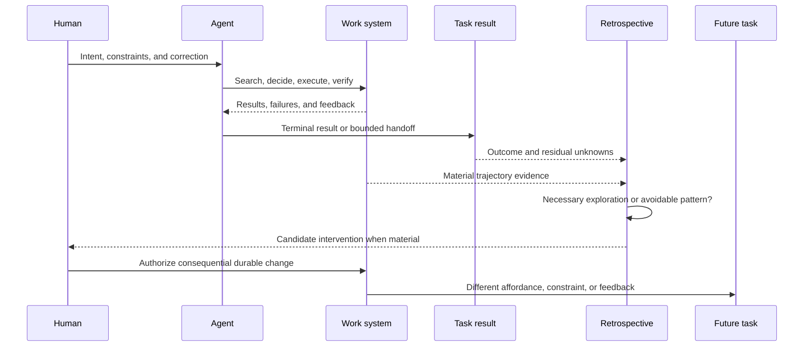

# Working Note — Agent Work-System Retrospective

- **State**: provisional-note corrected by Sir
- **Source**: Sir's clarification of the intended automatic retrospective; the
  linked
  [Coding Agent retrospective conversation](https://chatgpt.com/g/g-p-6a546788cf808191b1ba7c4763b41fe8-svc/c/6a64413e-8600-83ea-b986-0f7ba4a6d8e7);
  current SVC task-analysis and owner-routing mechanisms; bounded Lead and
  independent critical review
- **Use**: Explain how a completed task may reveal avoidable problems in the
  way an Agent worked and motivate an intervention that changes future Agent
  behavior

## Correction to the Previous Interpretation

The previous note treated the gleaning primarily as project learning: an
episode would reveal a weakness in project changeability and route durable
meaning to a semantic owner. That collapsed two distinct concerns.

| Concern | Governing question | Typical result |
| --- | --- | --- |
| Project knowledge and experience | What durable product, technical, operational, or implementation truth did the task establish, and where does it belong? | Existing code/configuration owner, canonical document, test, or other normal promotion destination |
| Agent work-system improvement | Where did the Agent's way of searching, deciding, executing, coordinating, or verifying become stuck or waste resources, and what could make that behavior less likely next time? | A changed affordance, constraint, feedback surface, transformation, working method, or delegation pattern |

SVC's existing owner resolution and promotion path can handle the first
concern. It may be invoked when a retrospective diagnoses missing project
knowledge, but it is not the distinctive purpose of this gleaning.

The intended mechanism addresses the second concern. A script or linter still
lives in the project, yet its function here is to reshape future Agent work:

- a script makes a correct deterministic sequence cheaper to choose and run
- a linter or schema makes a recurrent wrong move fail earlier and clearly
- a diagnostic command replaces blind search with discriminating feedback
- a Skill, working mode, or role changes the policy used when judgment remains
- a better tool or interface reduces context load or removes an unnecessary
  translation step

An asset shapes behavior only when it intersects the future Agent's actual
decision path: it must be discoverable, become the cheap/default action, or be
mechanically enforced, and its feedback must be actionable. An unused script
does not change behavior. A linter that reports too late or cannot explain a
repair may merely add another failure loop.

Behavioral effect also does not create a new semantic owner. A linter remains
owned by the engineering invariant it can decide; a script remains owned by
its execution contract. “Improve Agent behavior” is the reason for considering
and evaluating the intervention, not an authority for placing it anywhere.

## The Optimization Target

The target is not the base model's weights and is narrower than general
project capability. It is the **Agent-in-project work system**:

```text
Agent policy and current context
  + instructions and working methods
  + available tools and interfaces
  + mechanical constraints
  + feedback and verification surfaces
  + delegation and integration boundaries
  -> observable task trajectory
```

Changing any of these conditions can change Agent behavior without teaching a
new project fact or modifying the model itself.

A useful candidate definition is:

> A post-task Agent retrospective inspects the completed work trajectory for
> avoidable stalls, retries, rework, unnecessary context or Human correction,
> diagnoses the work-system cause, and proposes the smallest credible
> intervention that would reduce recurrence while preserving or improving
> terminal result quality.

This makes result quality an invariant. Faster work that misses the product
claim, skips necessary exploration, or weakens verification is not an
improvement.

Raw tokens, elapsed time, command count, or failures are therefore signals,
not waste by themselves. In ambiguous work, exploration and rejected
hypotheses may be necessary. Resource use becomes a candidate waste only when
it can be connected to a preventable behavior pattern and a credible
counterfactual path.

“The Agent discovers its own problem” also must not imply privileged
introspection. An LLM can produce a plausible retrospective narrative while
misremembering the sequence or rationalizing its final answer. Commands,
queries, errors, diffs, state changes, verification results, Human corrections,
and the terminal outcome are observations; the Agent's causal explanation is
a hypothesis that should compete with alternatives. The more consequential the
intervention, the less same-context self-description and self-verification are
enough.

## Why the Retrospective Happens After the Task

The after-task position is intentional, not a defect. Only then can the Agent
compare its whole trajectory with the terminal result and distinguish a local
frustration from a material recurring bottleneck.



The task itself should still adapt when evidence changes; that is ordinary
problem solving. The retrospective has a different purpose: use the now-visible
whole episode to improve future behavior. A host turn, `Stop` event, or idle
session is not necessarily the semantic task end, so it cannot define the
mechanism merely because it is easy to hook.

A failed, cancelled, or handed-off task may also contain useful evidence. The
required boundary is enough trajectory and outcome context to judge the
counterfactual, not a green completion marker.

## Minimum Reasoning Chain

No state machine or universal candidate record is needed to express the core
method:

```text
1. Locate a material stall, retry loop, rework cycle, context sink,
   Human correction, or verification detour in the task trajectory.
2. Ask whether it was necessary uncertainty or plausibly avoidable behavior.
3. Diagnose the work-system cause rather than naming the visible symptom.
4. State the counterfactual: if an intervention had existed beforehand,
   which Agent move or feedback loop would have changed?
5. Select the smallest intervention with sufficient semantic coverage.
6. Verify that it changes the intended path without weakening result quality
   or creating greater simple-task and lifecycle cost.
7. Use the existing owner, mutation authority, and verification route for the
   selected intervention—or return no intervention.
8. Let a later matching work path supply effect or counterevidence; revise or
   remove the intervention through its normal owner when it does not pay back.
```

The later comparison may sometimes include a safe ablation: observe whether
the relevant outcome or total cost changes when the intervention is absent or
inactive. This is evidence about its current marginal contribution, not proof
of intrinsic value. Mechanism interactions, task mix, model changes, and rare
critical constraints can all make removal evidence misleading.

`No intervention` should be common. A single episode may expose a severe cheap
fix, but it may also be an environment accident, necessary first-time
discovery, an external or model limitation that the project cannot affect, or
a symptom of a product decision that is already changing.

The counterfactual is the most compact protection against superficial
automation. “This command failed three times” is not enough. “A preflight that
exposed the missing migration before startup would have eliminated these three
blind retries without hiding another failure” is a testable behavioral claim.

## Route by Work-System Cause

The retrospective should not start by choosing an asset type. The same visible
friction can have different causes:

| Diagnosed cause | Candidate intervention direction |
| --- | --- |
| A stable project fact was unavailable or repeatedly rediscovered | Route it through the existing knowledge/owner mechanism; do not create a parallel memory system |
| A deterministic operation was repeatedly reconstructed | Script, task-runner command, codemod, or other tested transformation |
| A recurrent invalid move was expressible and discovered late | Existing type/schema constraint, linter, preflight, or focused static check |
| Failure feedback did not distinguish likely causes | Diagnostic command, clearer error, observability, or narrower query interface |
| The Agent used a poor strategy where judgment remains necessary | Working-mode, SOP, Skill, or concise instruction change |
| Context coupling or review cost dominated | Different task boundary, sub-agent role, evidence-return contract, or no delegation |
| The work was necessary exploration or a one-off accident | No durable intervention |

These are routing lenses, not a mandatory ladder. A linter can be worse than a
clearer API; a script can fossilize an unnecessary process; an instruction can
consume more future context than the mistake it prevents. The chosen
intervention must address the cause and repay its own maintenance and
behavioral side effects.

## Relationship to Existing SVC Mechanisms

- **Agent Task Analysis** already supplies a useful observation chain from
  objective and Agent move through external state, evidence, Agent update, and
  terminal quality. The retrospective asks a new counterfactual question over
  that chain; raw telemetry still cannot supply the semantic verdict.
- **Owner resolution and promotion** receive a durable change after the
  retrospective has diagnosed its type. They are destinations and authority
  mechanisms, not the retrospective itself.
- **Working modes, deterministic transformations, verification routing, and
  sub-agent roles** are possible intervention surfaces already under
  discussion. The retrospective does not justify a duplicate catalog.
- **Task packets** may hold the evidence while the retrospective is active,
  but are not permanent experience stores. `packet.md` should mention only a
  material candidate that affects the current Human review or next action.
- **Verification** must test the behavioral counterfactual as well as the
  artifact. A script that runs correctly has not yet shown that it removes the
  observed waste; a linter that flags a fixture has not shown acceptable false
  positives or semantic coverage.

A sub-agent may be useful for isolating a long noisy trajectory or challenging
the causal diagnosis. It remains an optional cost decision. Multiple Agents
sharing the same transcript and assumptions do not create independent proof.

## Binding to the Three Outcomes

- **`O-TASK` is the direct target**: future long tasks should encounter fewer
  repeated stalls, blind searches, invalid moves, context reloads, and
  verification detours while preserving better terminal results. Efficiency
  without result quality is not success.
- **`O-INTERACTION` is a coupled effect**: fewer preventable work failures can
  reduce Human interruption and repeated correction; explicit working methods
  and diagnostics can also make Agent behavior more predictable. A mandatory
  Human review of every retrospective candidate would spend the saved
  attention elsewhere.
- **`O-SYSTEM` is an indirect lifecycle effect**: reusable Agent-facing
  affordances, constraints, and feedback can lower the tiny team's cost of
  changing a large system. This does not replace architectural quality or
  project-knowledge ownership, and accumulated workarounds can increase change
  cost instead.

For `S-SIMPLE`, a successful bounded task with no material avoidable work-system
pattern should incur essentially no retrospective artifact or new mechanism.

## Current Boundary

Do not adopt a universal retrospective, waste score, candidate schema or state
machine, event store, Hook gate, explicit close command, specialized Agent,
automatic repository mutation, or fixed intervention taxonomy yet.

“Automatic” may later justify a cheap trigger, evidence collection, or bounded
candidate diagnosis. It does not imply automatic durable mutation, authority,
or self-verification.

Retain the smaller provisional claims:

- the intended optimization target is future Agent work behavior, not durable
  project knowledge in general
- the modifiable object is the Agent-in-project work system, so scripts,
  constraints, diagnostics, methods, and delegation can all shape behavior
- the semantic end of a task exposes outcome context needed to distinguish
  necessary exploration from avoidable recurring work
- resource measures are navigation signals; a behavioral counterfactual and
  preserved terminal quality are required before calling them waste
- the retrospective selects a likely intervention direction, then reuses the
  existing owner, authority, and verification mechanism
- no intervention is a normal result, and added behavior-shaping mechanisms
  must repay their context, maintenance, false-positive, and lifecycle cost
- work-system learning is not append-only: later evidence may justify revising
  or retiring an intervention through its normal semantic owner
