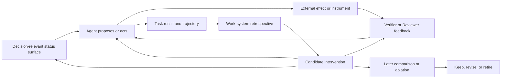

# Working Note — Adaptive Control Reference Triage

- **State**: provisional reference triage
- **Source snapshot**:
  [`bojieli/ai-agent-book` at `64abf167`](https://github.com/bojieli/ai-agent-book/tree/64abf167a0b476ea72278ba45bb562a88ef62a1e),
  especially its discussions of
  [Agent status bars](https://github.com/bojieli/ai-agent-book/blob/64abf167a0b476ea72278ba45bb562a88ef62a1e/book/chapter2.md#L786-L925),
  [ablation infrastructure](https://github.com/bojieli/ai-agent-book/blob/64abf167a0b476ea72278ba45bb562a88ef62a1e/book/chapter6.md#L667-L709),
  [integration and forgetting](https://github.com/bojieli/ai-agent-book/blob/64abf167a0b476ea72278ba45bb562a88ef62a1e/book/chapter8.md#L307-L340),
  and the
  [proposer-reviewer loop](https://github.com/bojieli/ai-agent-book/blob/64abf167a0b476ea72278ba45bb562a88ef62a1e/book/chapter10.md#L318-L336);
  the primary
  [*Interaction Scaling* paper](https://arxiv.org/abs/2607.11598);
  bounded Lead and independent source review
- **Use**: Separate four potentially useful ideas by the problem layer they
  address, then retain only the constraints that clarify the current SVC
  theory

## First Separation: These Are Not Four Peer Features

The four references should not become one mechanism list. They operate at
different points and timescales:

| Reference | Governing question | Layer |
| --- | --- | --- |
| Ablation studies | Did this mechanism cause enough improvement to justify its cost? | Causal evaluation of the work system |
| System status bar | What reliable, action-relevant state must be visible at this decision point? | Within-task context and control |
| Memory-system forgetting | What should no longer remain active, retrievable by default, or authoritative? | Cross-task capability and knowledge lifecycle |
| Interaction scaling through proposer-reviewer | What new observation can revise a candidate, and can the observer actually detect the relevant defect? | Execution and verification loop |

Their strongest shared contribution is not a new architecture. Together they
suggest that an Agent work system must be able to expose current state, import
new observations, learn which interventions help, and remove interventions
that no longer repay their cost.

## Ablation Is an Epistemic Method, Not a Required Product Surface

The book proposes controlled removal of one context or Harness component and,
for production Agent products, independently switchable features. The useful
idea for SVC is smaller:

> When an added mechanism is claimed to improve Agent work, compare outcomes
> with the mechanism absent or inactive where a credible comparison is
> available.

This matters because SVC is especially exposed to plausible process features:
task-packet guidance, working modes, sub-agent roles, review steps, status
summaries, and retrospective interventions can all feel useful while merely
moving cost elsewhere. An ablation lens asks whether terminal quality or total
cost changes, not whether the mechanism was used or produced a neat artifact.

It also provides a possible retirement signal. A rule or scaffold may have
helped an earlier model and become redundant after models, tools, or the
project improve. If removing it causes no relevant regression, continuing to
pay its context and maintenance cost is suspect.

However, remove-one comparisons have strict limits:

- mechanisms interact, so marginal contribution in one bundle is not intrinsic
  value
- model, task, environment, and Human learning effects can confound comparison
- small heterogeneous task samples can make a causal-looking difference noise
- an easily measured mechanism metric can improve while the requested outcome
  worsens
- safety and authority boundaries cannot be casually removed merely to obtain
  a clean experiment

Therefore this reference does not justify a feature-flag subsystem, universal
benchmark matrix, or one-switch-per-SVC-rule contract. It adds a question to
later evidence work and a counterweight against mechanism accumulation.

## A Status Surface Must Combine Reliable State With Action Consequence

The book's status bar distils dynamic state near the model's next generation:
task progress, tool counts, environment facts, time, errors, and available
capabilities. The deeper principle is useful:

```text
reliable observation
  -> compact decision-relevant state
  -> visible at the decision point
  -> an intelligible action or routing consequence
```

Raw state is often insufficient. Knowing that a command failed three times or
that little time remains does not by itself specify whether to diagnose,
change route, escalate, narrow scope, or deliver. This reinforces the earlier
retrospective requirement that a behavior-shaping intervention must intersect
the future Agent's decision path. State and method meet at that point.

The status projection is also dangerous because it is both lossy and likely to
be trusted. It can omit a dimension later needed for judgment, become stale,
or turn contaminated input into false authority. Code-computed counters and
environment facts can be strong; LLM-generated summaries and progress claims
remain hypotheses unless their source supports the semantic claim.

### Relationship to the Task Packet

`packet.md` and a runtime status bar share a visual intuition—make the current
picture easy to see—but are not the same object:

| `packet.md` | Runtime status bar |
| --- | --- |
| Human-Agent task coordination and default resume surface | Agent decision-time context projection |
| Semantic current truth, guardrails, verification, and next action | Frequently changing counters, environment readings, progress, or capability state |
| Updated after meaningful change | Potentially recomputed or appended each model turn |
| Must remain useful to a Human switching among tasks | Primarily optimized for the running model |

Turning `packet.md` into a heartbeat, telemetry projection, or automatically
maintained TODO ledger would weaken its Human role and create staleness risk.
Conversely, merely storing a fact in the packet does not ensure that a running
Agent will see it when a decision is made. The current insight is a distinction
and a placement test, not authorization for a new status-bar facility.

## Forgetting Is the Subtraction Half of Learning

The memory discussion covers several different operations: superseding an old
fact, removing it from active retrieval, compressing repeated experience,
archiving evidence, and deleting an obsolete capability. These should not be
collapsed into physical deletion.

The useful SVC-level pressure is:

> Promotion and retrospective intervention need a lifecycle counterpart:
> stale, contradicted, redundant, or non-paying material must stop shaping
> future Agent behavior.

This is especially relevant to the Agent work-system retrospective. If every
friction produces a script, linter, Skill, rule, or review step and none can
later disappear, the mechanism is a complexity escalator. A behavior-shaping
intervention should remain removable through its normal semantic owner, and
later matching work can supply evidence to keep, revise, or retire it.

Forgetting must be claim-relative. Low access frequency does not make a rare
safety constraint obsolete; recency does not make a new fact authoritative;
an LLM summary does not safely replace primary evidence. Useful distinctions
include:

- **active versus historical**: stop default retrieval or execution while
  preserving provenance and version history when needed
- **superseded versus disproven**: a newer policy may replace an older valid
  one without making the historical record false
- **compressed versus destroyed**: a summary supports navigation but may not
  retain the detail required for later adjudication
- **task-local versus durable**: deleting a closed task packet is retention
  discipline, not a project-memory learning system

No curator, decay score, background learning service, archive, or new memory
owner follows from this reference. Existing source ownership, version control,
and task retention remain the applicable boundaries.

## Interaction Scaling Refines the Reviewer Model

The associated interaction-scaling claim distinguishes three ways to spend
inference effort:

```text
reason longer       -> transform information already available
sample more         -> produce more candidates from the same information
interact             -> act or render, observe the external effect, revise
```

For SVC, the important claim is not that every task needs two Agents. It is
that a revision loop earns its cost when it imports discriminating information
that was unavailable during generation. A compiler error, test outcome,
rendered product behavior, measured layout, external provider response, or
Human taste judgment may do this. A second Agent reading the same text may not.

This separates two forms of independence:

- **organizational or contextual independence**: a fresh Reviewer has different
  context and may avoid the Proposer's local framing
- **epistemic independence**: the review path observes new evidence or uses a
  genuinely different oracle

The second is more fundamental. A fresh Reviewer with no new observation can
remain correlated speculation. The same model receiving a compiler result has
at least gained new information, although high-impact acceptance may still
need a separate evidence path or Human authority.

The instrument itself must be grounded. A visual reviewer that cannot see the
defect, a test that encodes the implementation's mistake, or a rubric that
misses product taste can make an iterative loop converge confidently in the
wrong direction. “Has Reviewer” is therefore not a quality guarantee; the
claim, observation surface, and feedback must match.

For Human-Agent collaboration, this loop can reduce Human review only by
removing mechanically decidable uncertainty and returning compact evidence,
disagreement, and residual judgment. It cannot scale away Human ownership of
intent, product and technical taste, material trade-offs, authority, or final
acceptance. A weak automated reviewer may instead create more output for the
Human to unwind.

## Cross-Reference Topology

The four references fit around the existing retrospective without requiring a
new integrated subsystem:



Human authority cuts across the topology: the Human supplies intent and taste,
reviews material trade-offs, authorizes consequential durable mutations, and
accepts the relevant result. No loop may infer those decisions from a metric.

## Provisional Contribution to the Three Outcomes

- **`O-TASK`**: reliable state at the decision point can reduce drift and
  repetition; grounded interaction can repair candidates with new evidence;
  retrospective plus later comparison can remove recurring non-paying work.
- **`O-INTERACTION`**: compact current truth and evidence-backed review can
  reduce repeated explanation and low-value inspection, but false status or a
  weak Reviewer can increase correction cost. Human taste remains a distinct
  observation surface.
- **`O-SYSTEM`**: ablation and forgetting add the missing subtraction path to
  the lifecycle of rules, tools, and Agent-facing affordances. This can lower
  accumulated change cost only if critical rare constraints and provenance are
  preserved.
- **`S-SIMPLE`**: none of the four ideas should require a status artifact,
  Reviewer Agent, retrospective record, feature switch, or forgetting pass on
  an ordinary bounded task.

## Current Boundary

Retain these candidate constraints, not the reference's whole architecture:

- expose only reliable, action-relevant state at the point where it can alter
  an Agent decision
- distinguish a status projection from the Human-readable task-packet current
  view
- treat new external information and a grounded observation surface as the
  core value of proposer-reviewer iteration
- evaluate behavior-shaping mechanisms by terminal quality and total cost,
  with removal or inactivity as a meaningful comparison when safe
- give durable interventions a normal path to revision or retirement; do not
  let learning mean append-only mechanism growth

Do not infer a universal status bar, automatic memory, background curator,
feature-flag platform, mandatory proposer-reviewer pair, fixed loop, or new
packet fields. The book and paper supply theory and reported experiments, not
evidence that these mechanisms improve SVC Consumer tasks in their proposed
form.
