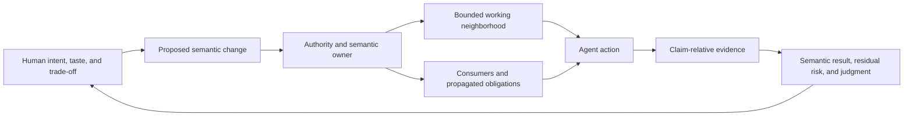

# Working Note — Implementation Taste as Collaboration Substrate

- **State**: provisional reference synthesis
- **Sources**: Sir's
  [implementation-taste conversation](https://chatgpt.com/share/6a6f4cd9-55a0-83ea-9dee-9d253d07ec99),
  current SVC
  [`implementation-taste.md`](../../../src/sections/implementation-taste.md),
  the earlier
  [`Constructive Collaboration Surfaces`](04-constructive-collaboration-surfaces.md),
  and bounded independent review
- **Use**: Extract the causal connection between implementation design and
  Human-Agent collaboration, then judge how the proposed architecture can
  participate in SVC's personal implementation taste without confusing a
  default with an unconditional rule

## Evidence Boundary

The conversation proposes **Executable Context Capsule Architecture (ECCA)**,
a new label for a combination of DDD bounded contexts, ports and adapters,
vertical use-case slices, executable contracts, ADRs, and local Agent
instructions. Its motivating target is strong:

> A business change should have a clear semantic owner, a limited change
> radius, an executable verification path, and a representation that both a
> Human and a Coding Agent can understand.

ECCA itself is a synthesized proposal, not an established pattern or evidence
from completed Human-Agent software work. Its named components have useful
histories, but their combination does not prove that every system should have
context capsules, per-context manuals, ports, adapters, contracts, ADRs, and
validation scripts. This bounds universal claims; it does not prevent Sir from
choosing the proposal, or a refined form of it, as an opinionated default.

## Correction: SVC Is Intentionally Personal and Opinionated

The first synthesis applied too much general-framework pressure. Sir has now
made the product target explicit:

- SVC primarily serves his personal development experience
- implementation taste, including UI/UX and architecture design, belongs in
  SVC rather than remaining only an external Human acceptance surface
- the Agent should normally align with that taste but retain the ability to
  propose a materially better approach

This changes the admission argument. A stable personal preference does not
need to be a universal engineering theorem before it can become SVC truth. Sir
is authoritative for the preference. Evidence remains useful for learning its
consequences, applicability, and cost, not for granting the preference
permission to exist.

The desired behavior is neither neutral generation nor rigid imitation:

```text
known personal taste + current task pressure + project truth
  -> opinionated default
  -> Agent applies it when the fit is clear
  -> Agent exposes a material departure when another design appears better
  -> rationale, benefit, cost, evidence, and residual judgment
  -> Human accepts, redirects, or permits a reversible comparison
```

Minor implementation choices should not require constant approval. A departure
needs foreground Human review when it changes a consequential principle,
product experience, architecture boundary, long-lived cost, or an explicit
preference. This is finer interaction control: the Human controls meaningful
divergence, not every action.

A small provisional distinction helps avoid both rigid imitation and neutral
under-specification:

- an **invariant** is not silently violated; a conflict is surfaced for
  resolution
- a **rebuttable default** is applied when the context fits, but the Agent may
  propose a reasoned alternative
- an **exploratory preference** explicitly invites comparison, prototype, or
  evidence before it settles

These are strengths of guidance, not a required metadata schema. ECCA is a
candidate rebuttable architecture default; Sir has not yet accepted its exact
content or scope.

## The Stronger Abstraction Is Semantic Locality

The fixed capsule is not the essential unit. The valuable property is
**semantic locality**:

- a common change has a discoverable semantic owner
- the Agent can form a bounded but sufficient working neighborhood around it
- affected cross-boundary consumers and obligations become visible
- invalid or unauthorized moves are rejected or made conspicuous where
  mechanical enforcement is credible
- the result can be verified at surfaces appropriate to the changed claims

Locality is relative to a change, not equivalent to one directory, class,
service, bounded context, or repository. A one-line authority change can be
system-wide; a hundred-file generated migration can be one local semantic
operation. Cross-context workflow, security, compatibility, performance, data
migration, and product experience often require composition across several
owners.

Therefore a stronger design aim is not “every change stays in one capsule.” It
is:

> Ordinary changes should remain near their semantic owner, while inherently
> cross-boundary changes should expose their propagation and composition
> obligations rather than hide them.

This extends the constructive-obligation model without pretending that every
obligation can be represented by a compiler or local contract.

## The System Can Be a Collaboration Substrate

Implementation structure is not only an internal maintainability concern. When
the chosen semantics are projected faithfully into names, data shapes, APIs,
dependency directions, assertions, contracts, tests, and tools, the system
itself carries part of the Human-Agent coordination burden:



The Human need not hold the entire repository in attention to judge a material
design choice. The Agent need not infer all architecture from a global prose
manual. Both can meet at a smaller semantic surface whose consequences are
supported by the implementation and its evidence paths.

This supplies the missing causal link from implementation taste to
`O-INTERACTION`: good structure can raise the resolution of Human control.
Instead of reviewing only files and lines, the Human can review whether the
Agent is changing the right responsibility, authority, invariant, boundary,
dependency direction, or complexity trade-off.

## Semantic Change Is the Useful Human Review Unit

For a consequential design decision, useful decision material normally makes
these matters intelligible:

- the current semantic owner and model
- the proposed semantic `From -> To`
- the alternative that preserves the status quo or spends complexity
  differently
- affected consumers and the expected change radius
- which consequences are mechanically checked and at what evidence horizon
- which product or technical taste judgment remains Human-owned

This is a review lens, not a new mandatory artifact. The current task dossier,
an Impact Handshake, a compact design note, a schema diff, a prototype, or the
code itself may carry it. The amount of material should rise with consequence,
uncertainty, and reversibility rather than with file count.

The file diff remains necessary implementation evidence, but it is a poor sole
coordination surface for a Human who cannot and should not understand the
whole system. Conversely, a polished semantic summary is not trustworthy when
the code, contracts, and observations do not project the same model.

## Taste Needs More Than a Rule List

“Make taste explicit” should not mean translating every preference into prose
or enforcement. Different judgments have different credible carriers:

| Judgment shape | Strong candidate carrier | Boundary |
| --- | --- | --- |
| Mechanically decidable invariant | Type, schema, compiler, linter, assertion, or deterministic check | The check proves only the encoded property |
| Stable personal semantic or design preference | Canonical taste guidance with rationale and applicability, then projection into code, names, contracts, or examples where faithful | Mark it as Sir's preferred default rather than an objective universal law |
| Expensive historical rationale | Bounded decision record when current artifacts cannot recover why | History is not the current truth owner |
| Situational product or technical taste | Example, alternative, replay, rendered behavior, and live Human judgment | Do not freeze one correction into a universal rule |

The aim is to move repeatable, well-understood judgment into the cheapest
faithful structure while keeping contextual taste visible as judgment. A useful
taste item normally needs enough of its purpose, pressure, trade-off,
counterexample, and representative example for an Agent to apply it rather
than merely repeat its wording. These are content qualities, not a required
five-field schema.

UI/UX and architecture require different evidence carriers. UI/UX taste often
needs visual references, rendered alternatives, interaction replay, and Human
perception. Architecture taste often needs topology, change scenarios,
authority and dependency analysis, and lifecycle consequences. A prose-only
catalog would underspecify both.

## Binding to the Three Outcomes

| Outcome | Plausible causal contribution | Failure boundary |
| --- | --- | --- |
| `O-INTERACTION` | Shared semantic names and a compact semantic change let the Human review high-leverage intent, boundary, and taste decisions while mechanical detail is delegated | A false model, stale manual, or abstract summary can make misalignment more confident; subjective taste still needs an appropriate Human observation surface |
| `O-TASK` | Discoverable ownership, a bounded working neighborhood, explicit forbidden moves, and fast credible feedback can reduce Agent drift, irrelevant context, and late integration surprises | Many long tasks are inherently cross-cutting; premature locality can hide dependencies and fragment the end-to-end result |
| `O-SYSTEM` | Semantic locality and visible propagation obligations can reduce repeated discovery, change amplification, and regression cost across the lifecycle | Ports, contracts, layers, documents, and tests can themselves become accumulated complexity whose maintenance exceeds their return |

This is now a concrete three-outcome causal path for the earlier semantic-owner
claim. It is still a hypothesis. Clear ownership can coexist with a poor
product, weak task integration, or excessive Human review.

## Relationship to Current SVC Taste

Most of the reference's durable value is already represented more generally in
current `implementation-taste.md`:

- one authority and explicit provenance cover semantic ownership and trust
- direct durable naming supports shared Human-Agent language and discovery
- shaping data and boundaries before flow makes valid behavior easier and
  invalid behavior harder
- marginal complexity return rejects mandatory layers and pattern adoption
- projecting design into code connects a model to APIs, state, tests,
  assertions, and observability

The candidate addition to the working theory is not ECCA. It is the explicit
connection between those principles, semantic locality, and Human review of a
semantic change. Whether durable SVC implementation taste needs different
wording remains undecided and would require a separately authorized slice.

Agent-specific instructions have a narrower role than the conversation gives
them. A local instruction file can route work, expose a non-inferable hazard,
or state an operational method when a stable repeated consumer justifies it.
It should not duplicate the module's purpose, invariants, public contract, or
architecture when code and canonical owners can express them more faithfully.
The task packet remains volatile task state; neither is a substitute for the
other.

## What Is Not Yet an Unconditional Rule

The current evidence and preference record do not yet establish that every
applicable project or task must use:

- an ECCA name, capsule abstraction, or prescribed directory tree
- one bounded context or use-case slice as the unit for every task
- ports, events, or formal contracts for every cross-module dependency
- framework-free domain code regardless of actual substitution and testing
  value
- a handler and test directory per use case
- per-context `MODULE.md`, `AGENT.md`, or `validation.sh`
- an ADR for every boundary change
- independent local verification as proof of system or product completion
- a modular monolith as a universal architecture rather than a frequent
  complexity-favorable option

Each of these can be part of Sir's architecture taste, an opinionated default,
or the right answer under specific pressure. They should be reviewed on those
terms. The unresolved question is not whether SVC is allowed to be
opinionated; it is which ECCA ideas match Sir's actual taste, what problem each
solves, and where a default needs an escape condition to avoid damaging
`S-SIMPLE` or the system being built.

## Provisional Contribution

Retain this compact candidate theory:

> Implementation taste supports Human-Agent collaboration when it makes the
> semantic topology of a change discoverable and partially executable. The
> Agent should be able to find the owner, work within a sufficient semantic
> neighborhood, see cross-boundary obligations, and return a compact semantic
> result with evidence and residual judgment. Human control remains focused on
> intent, consequential design choices, contextual taste, and acceptance.

For SVC, good Agent-friendly architecture should deliberately carry Sir's
preferred semantics and trade-offs in a form legible to both parties. The
Agent-specific method should support two moves: apply that taste by default,
and make a reasoned disagreement easy to inspect. ECCA is now a candidate
rebuttable architecture default rather than a rejected architecture. This note
still authorizes no durable SVC source change; its result now feeds the active
cross-reference landing synthesis rather than defining the next step alone.
