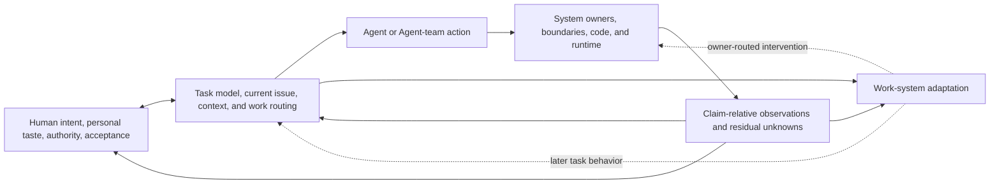
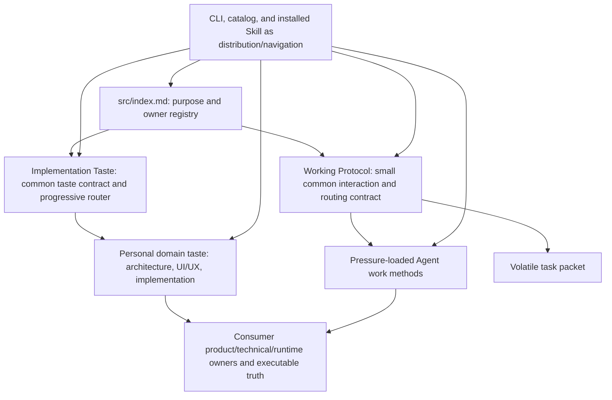

# Working Note — Capability Synthesis and Landing Constraints

- **State**: supporting cross-capability synthesis; not the active review front
- **Sources**: accepted decisions `D-001`, `D-002`, `D-008`, `D-009`, `D-010`,
  `D-012..D-040`; claim ledger `V-001..V-077`;
  reference-intake notes
  [`02`](02-verifiable-context-isolated-delegation.md) through
  [`10`](10-implementation-taste-as-collaboration-substrate.md); current SVC
  canonical sources
- **Use**: Compress the reference intake into coupled loops and capability
  clusters; preserve constraints that each cluster discussion must respect

## Intake Is Complete, but Most Mechanisms Are Not Decisions

The gleanings now form a useful design corpus. They do not form a ready-made
framework. Preserve these maturity boundaries:

| Material | Current status |
| --- | --- |
| One Human ordinarily, up to roughly three to five, plus Agents; large means system and lifecycle complexity | Accepted product input |
| Three outcome scales and gleaning-led, execution-evolved design | Accepted working method |
| SVC primarily serves Sir and should carry opinionated personal implementation taste | Accepted product input |
| Task packet serves Agent execution and Human-Agent coordination; short `packet.md` is the Human current view | Accepted input; sufficiency remains unproven |
| Retrospective targets future Agent work behavior rather than project knowledge promotion | Accepted interpretation; intervention benefit remains unproven |
| Semantic locality, specialized delegation, action routing, claim-relative verification, grounded review, status projection, ablation, and retirement | Provisional causal hypotheses |
| ECCA, fixed roles, status bars, Reviewer Agents, memory systems, schemas, hooks, and CLI automation | Candidate implementations, not accepted defaults |

The landing design must not convert the size of the intake corpus into product
surface area.

## One System, Four Coupled Loops

The references can be compressed into four loops connected by evidence:

- The **Human collaboration loop** aligns intent and personal taste, exposes a
  consequential decision, and returns accepted evidence with low attention
  cost. This is where `O-INTERACTION` is observed.
- The **Agent task loop** models, explores, routes, delegates, executes,
  integrates, and replans until a good terminal result or honest handoff. This
  is where `O-TASK` is observed.
- The **system change loop** resolves semantic owners, changes the system,
  propagates obligations, and observes composition across its lifecycle. This
  is where `O-SYSTEM` is observed.
- The **adaptation loop** uses completed trajectory and outcome evidence to
  alter future Agent behavior through existing owners, then later keeps,
  revises, or retires the intervention.

These are analytical loops, not four product modules or lifecycle states.
Verification crosses all four. `S-SIMPLE` is the counter-pressure: a bounded
ordinary task should not activate extra artifacts, roles, or ceremonies merely
because the full model exists. `D-012` retains the four-loop analytical view;
the former six-cluster classification in `V-023` is superseded.

## Five Functional Clusters Across the Loops

The loops and three outcomes organize causal analysis and evaluation. Five
functional clusters identify SVC surfaces whose content and interaction need
design:

| Functional cluster | Existing SVC foothold | Material question |
| --- | --- | --- |
| Task packet | Short five-field Human entry plus pressure-created Agent working files | Which stable planning primitives and module growth/return rules let Agents recover and reason across mixed recurrent work while Sir steers from `packet.md` alone? |
| Working protocol | Request lenses, owner resolution, postures, mutation gate, and progressive loading | What common operating and reasoning method helps an Agent navigate long work and system change while keeping Human control proportional? |
| Sub-agents | Host Agent primitives plus delegation, role, Explorer, Executor, and deterministic-transformation gleanings | When do context isolation and specialization repay delegation, briefing, verification, and Lead integration cost? |
| Verification | Proportional checks, claim ladder, proof horizons, and product/technical/runtime owners | How should changed claims select observation surfaces, independent evidence, Human acceptance, and bounded residual risk? |
| Tastes and ability to design | Generic Implementation Taste, Human authority, project owners, ECCA, and UI/UX references | How can SVC carry Sir's substantive taste while improving Agent product, UI/UX, architecture, and implementation design judgment rather than merely enforcing preferences? |

These are not lifecycle stages, isolated modules, or a fixed discussion order.
Task packet is the first foreground; causal and interface dependencies may move
the discussion among clusters.

The former six analytical concerns are retained as cross-cluster questions:

- personal taste and Human decision cross taste/design, working protocol, task
  packet, and verification
- task current view and context control cross task packet, working protocol,
  and sub-agent context interfaces
- semantic topology and obligation propagation cross design ability, protocol
  owner resolution, and verification
- action and delegation routing cross sub-agents and working protocol
- claim-relative feedback and acceptance cross verification and task packet
- work-system adaptation and retirement remain a loop across all five rather
  than a sixth functional cluster

No new durable truth category follows automatically. Personal taste is a
stable user-authored preference with Sir as authority. A retrospective chooses
an intervention direction; the script, rule, skill, diagnostic, or method still
belongs to its normal semantic owner. The Alignment extension remains a remedy
for repeated coordination drift after normal owners are in use, not the owner
of personal taste.

## Deferred Whole-System Landing Comparison

The following alternatives remain useful as counter-pressure, but `D-012`
supersedes asking Sir to select one before the functional-cluster discussions.
Progressive disclosure is already a root principle; its exact carrier must be
resolved claim by claim rather than as a single framework-topology choice.

### A. Expand the existing core documents only

Put all new collaboration, long-task, delegation, verification, taste, and
adaptation guidance into `working-protocol.md` and `implementation-taste.md`.

- **Benefit**: few owners and no new navigation surface.
- **Cost**: every task pays for growth in Working Protocol, while non-trivial
  design work loads unrelated taste content; concrete UI/UX and architecture
  taste will crowd one cross-domain file.
- **Failure mode**: a small file count disguises a broad, conflicting, and
  hard-to-retire instruction surface.

### B. Keep a small core that routes to pressure-loaded content

Keep the always-relevant interaction and owner contract compact. Put deep Agent
work methods and domain taste behind explicit triggers and progressive lookup.
Reuse project code, docs, checks, and task packets as their current owners.

- **Benefit**: supports concrete personal taste and specialized Agent methods
  without loading or enforcing them everywhere.
- **Cost**: requires a clear content owner, trigger, conflict rule, and
  navigation path; too many small documents would recreate fragmentation.
- **Failure mode**: the core becomes a vague index, or pressure-loaded content
  is undiscoverable at the actual decision point.

### C. Build a runtime control system first

Represent task state, modes, roles, status, review, memory, and retrospective in
CLI schemas or an orchestration runtime.

- **Benefit**: potentially stronger automation and observability after stable
  semantics exist.
- **Cost**: freezes provisional concepts, expands compatibility and migration
  surface, and risks a second project-management system.
- **Failure mode**: mechanically precise control of the wrong work model.

The former recommendation to select B globally is superseded by `V-025`.
Inside a specific capability, A and B may still be compared after useful
content identifies its owner and loading pressure. C remains inappropriate
unless later work establishes a stable mechanical obligation that a runtime
can enforce more cheaply than source guidance or an existing tool.

## Candidate Owner Inventory, Not a Topology

The following names are illustrative owners, not approved files or a proposed
whole-system architecture:

| Candidate owner | What would land there | What must not land there |
| --- | --- | --- |
| `src/index.md` | Personal/opinionated framework target and any new owner registry entry | Detailed methods, task state, or copied project truth |
| Working Protocol | Common Human-Agent loop, task current-view semantics, routing and escalation rules | Full role catalog, UI/UX guidance, telemetry state, or task-specific plans |
| Implementation Taste | Cross-domain taste contract: authority, application, reasoned departure, complexity, and projection | Project product facts or one giant always-loaded pattern catalog |
| Pressure-loaded taste content | Sir's concrete architecture/UI/UX/implementation defaults, rationale, applicability, examples, counter-pressure, observation surfaces | Universal claims merely because they are personal defaults; copied current project state |
| Pressure-loaded Agent work methods | Deep Explorer, delegation, Executor, verification, and adaptation methods whose task trigger and consumer are distinct | A fixed pipeline, runtime agent roster, or instructions that an existing tool already enforces |
| Task packet and supporting dossiers | Current task control, evidence, provisional analysis, and active Human decision | Durable taste, project truth, runtime heartbeat, or complete Agent memory |
| CLI/catalog/installed Skill | Deterministic packaging, integrity, lookup, and narrow routing | Semantic task interpretation, automatic acceptance, or premature orchestration state |

Whether pressure-loaded content starts as sections inside existing files or as
new files should follow useful content and context pressure. A directory tree
must not be chosen before the owner, trigger, consumer, conflict behavior, and
verification are concrete.

## Former Landing Slices, Not Active Work

`D-012` replaces `L0..L3` with five non-linear functional-cluster discussions.
The former slices below are retained only to show how the accumulated ideas had
been compressed; they are not candidate actions, committed scope, or sequence.

### `L0` — Product target and owner topology

Land the personal/opinionated SVC target and establish where personal taste and
pressure-loaded Agent methods can live. Clarify that personal taste owns a
preference and its applicability, while project owners retain current product
and technical truth.

This is the prerequisite for adding content without duplication.

### `L1` — Taste-guided Human-Agent design

If this slice is later admitted, architecture is one strong concrete taste
domain. Shape one useful taste unit so an Agent can:

- discover when it applies and what experience or quality it optimizes
- use Sir's default without asking on every minor choice
- expose a material departure with rationale, comparison, cost, and evidence
- return topology/change consequences and residual Human judgment

ECCA is one candidate rebuttable architecture default, not a preaccepted
answer or selected first landing. A simpler alternative is to shape one actual
taste item directly inside current `implementation-taste.md` and add no new
pressure-loaded owner unless the content proves the need. UI/UX could later use
the same collaboration contract with different carriers such as visual
references, prototypes, and interaction replay.

### `L2` — Long-task Agent work method

Integrate context/query routing, working policy, deterministic transformation,
Executor feedback loops, specialized delegation, evidence-carrying returns,
and Lead integration as pressure-loaded methods. Start with the smallest common
method; promote recurring task shapes into roles only when their context
interface and verification return remain distinct.

### `L3` — Work-system adaptation

At semantic task end, use available trajectory and outcome evidence to diagnose
one avoidable recurring work-system cause. Route any intervention to an
existing owner, require a future behavioral counterfactual, allow no-op, and
preserve a keep/revise/retire path. Do not begin with automatic hooks or durable
mutation.

### Mechanical projection within each slice

Update templates, catalog metadata, installed navigation, validators, or CLI
only when the slice produces a stable consumer obligation that those surfaces
can enforce or expose more cheaply. “Developer Experience” is a projection of
accepted semantics, not an independent final workstream.

## Former Landing-Design Question

This question is no longer active because it asks for whole-system topology
before capability content and owner fit are understood:

> Should SVC use a small common core that routes to pressure-loaded personal
> taste and Agent work methods, rather than either expanding all guidance in
> the always-loaded core or building runtime control before semantics settle?

- **Status quo**: extend existing files only when a concrete gap appears.
- **Former recommendation (superseded)**: accept the topology of B and begin
  only `L0`. `D-012` now requires cross-loop functional-cluster discussion
  before any such choice.
- **Reversibility**: the first work can remain source guidance; no CLI state,
  consumer layout, or automatic mutation is required.
- **Main risk**: inventing a meta-framework before writing useful content.
  Counter it by starting from one concrete taste or work-method unit and
  deleting any abstraction that does not help apply, challenge, or verify it.
- **Falsifier**: if a concrete architecture taste unit is clearer and cheaper
  inside the current `implementation-taste.md` with no pressure-loaded owner,
  prefer alternative A for that content.

The active route is now `design/12-personal-taste-human-decision.md`. ECCA
remains one candidate architecture taste item and is not selected by this
supporting synthesis.

## Explicit Non-Landings

The synthesis currently provides no basis for a universal Task IR, Grounding
Gate, controlled language, status bar, memory system, feature-flag platform,
fixed role/mode catalog, mandatory Reviewer, assurance schema, ECCA directory,
retrospective state machine, automatic repository mutation, or CLI semantic
orchestrator.

The reference-intake notes remain available for provenance and counterexamples
but are no longer the active design route. New design work starts here.
