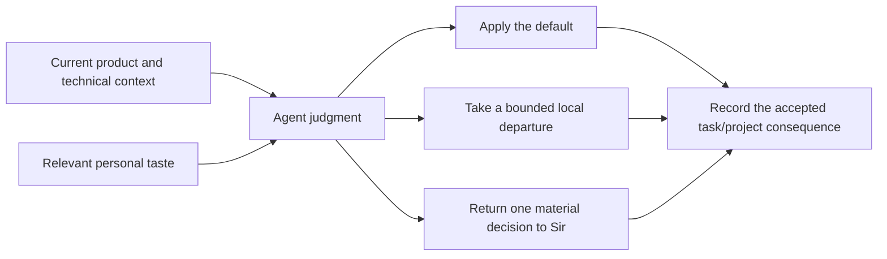
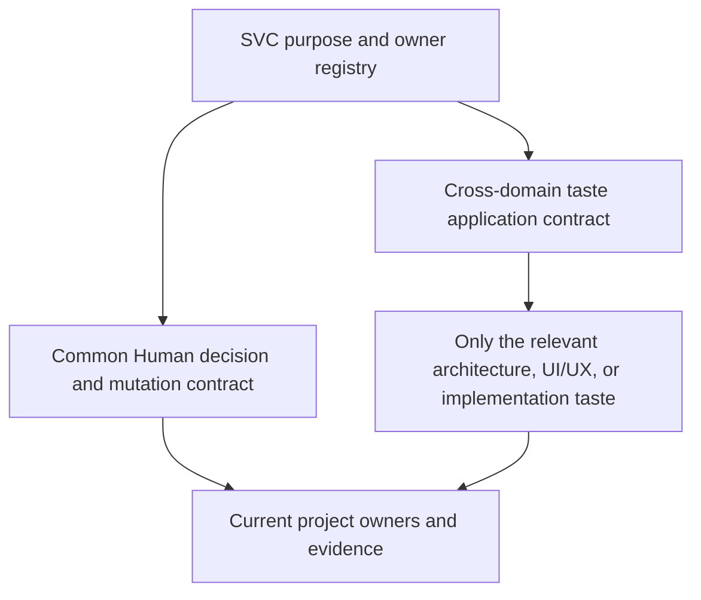

# Working Note — Personal Taste and Human Decision

- **State**: supporting exploration for the later tastes/design-ability cluster;
  not the active review front
- **Sources**: `D-008..D-011`, `V-021`, `V-022`, `V-025`, current
  `src/index.md`, Working Protocol, Implementation Taste, and reference note
  [`10`](10-implementation-taste-as-collaboration-substrate.md)
- **Use**: Establish the capability meaning and rough owner-correct landing
  shape before selecting exact content or mutating durable SVC source

## Current Pressure and Evidence Boundary

Sir has established that SVC primarily serves his personal development
experience and should carry substantive UI/UX, architecture, and implementation
taste. The intended effect is not only nicer output: an Agent should usually
work in alignment without repeatedly asking Sir to restate preferences, while
remaining able to propose a materially better idea.

This is accepted product input. We do not yet have a Consumer episode proving
which representation reduces Human decision load, improves long-task terminal
quality, or lowers system change cost. File shape and departure thresholds are
therefore design hypotheses.

## Why These Two Concerns Form One Capability Cluster

Personal taste and Human decision are coupled because useful taste removes
routine decisions from Sir, while the decision interaction handles the
remaining ambiguity, conflict, or materially better departure. They are not
the same kind of truth and should not be forced into one artifact.

The capability is successful when the Agent usually makes coherent choices in
Sir's taste without repeated prompting, yet makes a consequential disagreement
legible before it becomes an expensive system decision. It is not successful
merely because a preference manual or approval form exists.

## Contribution to the Three Outcomes

- **`O-INTERACTION`**: reduce repeated explanation, low-value approval, and
  correction; use shared language; reserve Sir's attention for choices that
  actually need authority or taste judgment.
- **`O-TASK`**: give the Agent stable decision priors across ambiguous branches
  so a long task does not repeatedly re-derive design direction or oscillate
  between locally plausible styles.
- **`O-SYSTEM`**: make recurring structural and product choices more coherent,
  and require a material departure to expose lifecycle and change-cost
  consequences before local convenience fragments the system.

These are causal hypotheses, not proven outcome improvements. A taste surface
that adds reading or suppresses better designs can worsen all three.

## Provisional Internal Model

### 1. Taste substrate

Own stable preferences that Sir wants an Agent to use as rebuttable defaults.
A useful taste item needs enough meaning for action, but not necessarily a
schema. Its logical content may include:

- the quality, experience, or system property being optimized
- the context or pressure in which the preference applies
- the preferred default and its causal rationale
- costs, counter-pressure, and situations where it should weaken
- how the preference should project into product behavior, topology, code, or
  another observable design surface
- examples, references, or rejected contrasts when prose alone is too lossy

Personal authority makes the preference legitimate for SVC; it does not turn
the preference into a universal engineering law. Preferences may differ in
firmness, but a fixed strength taxonomy or state machine is not justified yet.

### 2. Application and departure policy

The Agent needs a small policy for using taste rather than asking Sir to
interpret every item:

- **apply** when the preference clearly fits the current degrees of freedom
  and no stronger project fact or constraint conflicts
- **take a bounded local departure** when the default is a poor fit but the
  choice is reversible, inside approved scope, and does not create a material
  product or system consequence; keep the rationale visible in current task
  reasoning
- **request a Human decision** when the departure changes product experience,
  authority, a durable boundary, substantial lifecycle cost, or another choice
  that Sir would reasonably want to control

The exact materiality boundary is unresolved. A rigid universal threshold is
unlikely to work; concrete examples plus the existing mutation scope and owner
model may be a better carrier.

### 3. Human decision surface

When Sir is needed, the Agent should return one decision rather than transfer
the analysis burden. A sufficient brief normally contains:

- the current situation and why the normal default is insufficient
- the real alternatives, including the current/default path
- product, technical, lifecycle, and reversibility consequences that matter
- relevant evidence and residual unknowns
- the Agent's conditional recommendation
- the smallest ruling Sir needs to make

This is an interaction contract, not a mandatory document template. Mechanical
verification and low-level option generation should remain with the Agent.

### 4. Refinement

Accepted examples, rejected outputs, repeated corrections, and later system
effects may refine or retire a taste item. One correction should not silently
become a broad rule. The durable update belongs with the taste owner; the
current task packet records only the active decision and evidence.

## Authority and Conflict Boundaries

- Personal taste owns Sir's stable preferred choice and its intended
  applicability.
- Product Truth owns what the current product promises; Product TDD, Unit TDD,
  code, schemas, tests, and Deployment own their normal technical or runtime
  facts.
- Taste guides degrees of freedom inside those facts. It does not silently
  overwrite an accepted project-specific decision or claim.
- Sir can deliberately change project truth or accept a taste departure. The
  Agent can propose either, but must route the resulting claim to its normal
  owner.
- The task packet owns the current issue, decision, rationale, and evidence
  only while the task is active; it is not a taste library.

## Progressive-Disclosure Shape

The likely read path is semantic rather than a mandatory directory tree:

The common layer should explain authority, activation, application, and
departure. Concrete domain content should be loaded only when its design
pressure is present. Current project owners are loaded for the actual choice;
their truth is referenced rather than copied into personal taste.

## Rough SVC Owner and File Mapping

| Claim or behavior | Closest current owner | Rough source consequence |
| --- | --- | --- |
| SVC is personal and opinionated | `src/index.md` | Clarify product target and register any admitted taste owner |
| When the Agent acts, escalates, or asks Sir | `src/sections/working-protocol.md` | Add the minimal default/departure/decision interaction contract if the cross-cluster model supports it |
| What taste means and how it applies across design work | `src/sections/implementation-taste.md` | Extend the current generic judgment contract; preserve its non-trivial-change trigger |
| Concrete architecture, UI/UX, or implementation preferences | Existing taste file first; conditional deeper owner | Keep content in the existing file while it remains coherent; consider an intuitive domain file or `src/sections/taste/` only when real content has a distinct trigger, consumer, or cadence |
| Project-specific accepted product or technical choice | PRD, Product TDD, Unit TDD, ADR, code, test, or Deployment according to semantics | Reference personal taste as rationale where useful; keep the accepted project claim with its normal owner |
| Current departure and Human ruling | Active task packet | Use existing `Current Truth` and `Next Step`; do not add a packet field merely for taste |
| Visual, interaction, or runtime proof | Prototype, replay, test, observation, or other executable/project surface | Use the observation surface suited to the claim; prose does not prove taste alignment |

No semantic SVC CLI change is indicated. Packaged lookup or catalog inclusion
is only a mechanical projection if a new canonical source file is eventually
admitted.

## File-Shape Alternatives Inside This Cluster

1. **Existing files only**: simplest while concrete taste remains compact, but
   architecture and UI/UX content may eventually overload one broadly
   triggered cross-domain document.
2. **Common taste contract plus domain files**: better progressive disclosure
   after substantive domain content exists, but adds navigation and owner
   surface that must be earned.
3. **One personal-taste manual**: centralizes material but mixes unrelated
   triggers and evidence forms; likely to become a large instruction dump.

The current recommendation is not to choose a directory yet. Preserve the
three existing owner consequences above and let the first substantive taste
content reveal whether a deeper domain file is necessary.

## Failure Modes and Counter-Pressure

- A short mechanical task should not load taste or trigger extra review.
- A slogan list can appear aligned while leaving the Agent unable to act.
- Excessively strong defaults can suppress a better design or create false
  authority over project truth.
- Too many domain files can make the relevant preference undiscoverable.
- Requiring Sir to approve every departure defeats the interaction objective;
  allowing silent consequential departure defeats Human control.
- CLI lookup success or a document being read proves availability, not taste
  alignment or better terminal results.

## First Review Proposition

The first proposition for Sir is narrower than a file decision:

> Personal taste should eliminate routine Human decisions by giving the Agent
> rebuttable defaults; the Human-decision contract should handle only material
> ambiguity or a reasoned departure. These two parts belong to one capability
> loop but retain different owners and progressively loaded content.

If this boundary is faithful, the next discussion can refine what makes a
taste item actionable and what counts as a material departure. If it is not,
file topology should remain untouched because it would encode the wrong
interaction model.
