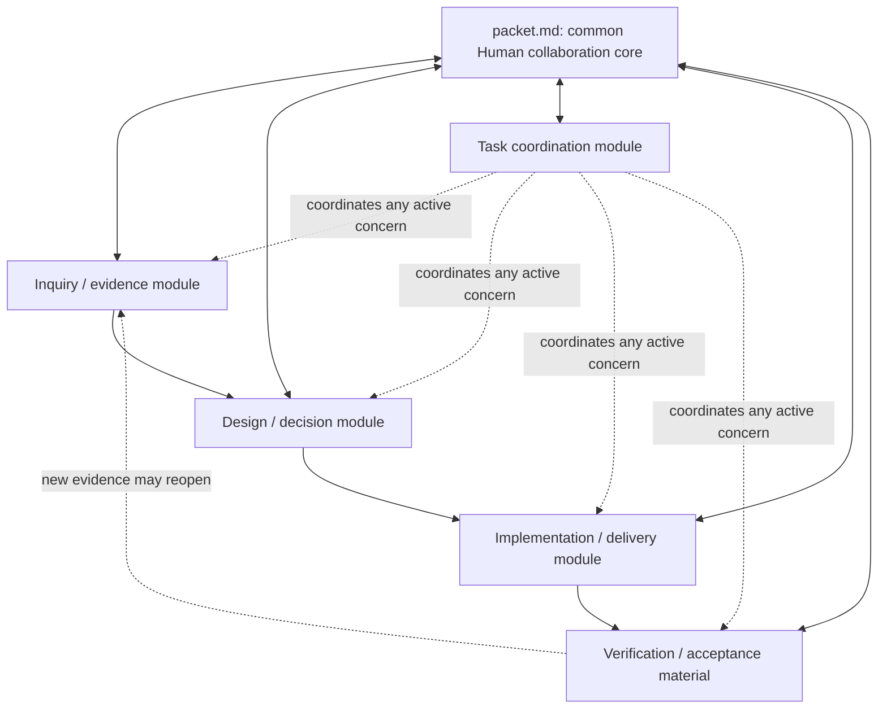

# Working Note — Composable Task-Packet Modules

- **State**: supporting composition and slice-semantics foundation; the active
  universal module/file grammar is developed in
  [`24`](24-task-packet-module-grammar.md)
- **Sources**: `D-013`, `D-014`, `D-016`, `V-030..V-035`, `V-039`, `V-040`,
  accepted packet foundation in [`05`](05-shared-task-control-surface.md), local
  evidence and superseded archetypes in
  [`13`](13-task-packet-organization-patterns.md), Working Protocol, and the
  current task-packet template
- **Use**: Define progressive module composition, preserve scope-specific
  implementation authority inside a shared planning vocabulary, and establish
  how module structures will be discussed before exact SVC landing

## Accepted Correction

A real task is rarely “an inquiry task,” “a design task,” or “an implementation
task.” Long work commonly explores unknowns, discusses design with a Human,
implements several changes, verifies them, and revisits earlier conclusions.
Those concerns therefore cannot be mutually exclusive whole-packet types or
projections of Working Posture.

The better model is:



This is a dependency sketch, not a mandatory sequence. Only `packet.md` is
universal. A module is activated when a task-local concern has enough distinct
content, consumer, cadence, or integration pressure to deserve an address
outside the Human current view.

## Core and Module Responsibilities

### Common core

`packet.md` keeps the responsibility accepted in `05` and `D-014`:

- complete consequential Human current picture from its body
- one foreground Human issue, decision, review object, or expected return
- current integrated result of active modules rather than their derivation
- current authority, material unknowns, proof horizon, and next step
- default resume route for Human and Lead

Compact work means no module has earned activation. Compact is not a peer
module or task mode.

### Candidate modules

| Module concern | What it may own inside the task | What it must not become |
| --- | --- | --- |
| Inquiry/evidence | Questions, method when non-trivial, observations, cases, competing explanations, synthesis, and evidence boundaries | A complete transcript, raw sensitive corpus, or proof that an implementation is accepted |
| Design/decision | Design fronts, alternatives, rationale, Human rulings, consequences, and supersession | Project product/technical truth, implementation progress, or one dossier per conversation turn |
| Task coordination | Task slices/fronts, dependencies, assignments, expected returns, and integration state | Runtime Agent tree, heartbeat scheduler, authority graph, or complete task history |
| Implementation/delivery | Approved realization plan, implementation slices, ordering, Impact Handshakes, migration/recovery, and delivery evidence | The whole task decomposition or authority to mutate merely because a plan exists |
| Verification/acceptance | Changed claims, observation surfaces, proof horizons, residual unknowns, and Human/external acceptance when independently substantial | A duplicate of every test result or a single global completion state |

This is a candidate module set, not five mandatory directories. Verification
may remain only in `packet.md` for simple work; decisions may remain inside a
single design dossier; coordination may stay implicit while one Lead has one
bounded work unit. A concern becomes a module only when progressive disclosure
has something useful to disclose.

## Module-Internal Growth

Modules also need progressive shapes. The discussion should not stop at naming
a directory. For each module, establish:

1. activation and retirement pressure
2. its smallest useful form
3. its expanded multi-file form
4. its module entry/resume surface, if one is needed
5. file-internal semantics and writing guidance
6. canonical versus derived or raw task-local material
7. how its consequential result returns to `packet.md`
8. interaction with other modules and the durable project owners
9. simple-task counter-pressure and verification
10. whether a reusable template actually reduces ambiguity

Two generic internal shapes remain candidates:

```text
# Small module
<module>.md

# Expanded module with stable controller plus depth
<module>-map.md or <module>.md
<module>/
  <pressure-created artifacts>
```

The second form avoids moving the current module view merely because depth
grows, but no universal filename should be selected before the module's real
content is discussed. The current `design.md + design/` is one useful example,
not an automatic pattern for every module.

## Plan Scope and Slice Specialization

The former task-slice-versus-implementation-slice frame correctly protected
mutation authority, but incorrectly made semantic scope look like plan
granularity. `D-016` replaces it with two dimensions:

- **plan scope**: task/mixed, exploration, diagnosis, design, implementation,
  verification, or another semantic concern
- **plan organization**: optional phase, slice, and step constructs whose exact
  local arrangement depends on the work

A slice has a common minimum meaning: a bounded result or feedback unit with an
objective, relevant context, boundary, relations, expected return, and
integration condition. Scope then adds obligations:

- an exploration slice preserves the question, evidence boundary, observations,
  and synthesis
- a design slice preserves alternatives, rationale, decision authority, and
  consequences
- an implementation slice preserves mutation authority, `From -> To`, blast
  radius, invariants, ordering, proof, and recovery
- a verification slice preserves changed claims, observation surfaces, proof
  horizon, residual unknowns, and acceptance authority
- a task-wide slice may deliberately mix several scopes around one terminal
  result

An implementation slice is therefore not a lower planning resolution than a
task slice. It is a slice with a stricter scope-specific contract. Relations
such as `depends-on`, `refines`, `integrates-into`, and `verified-by` express
how scoped slices interact; they need not form one tree.

No generic or scope-specific slice directory is admitted yet. A module may keep
one scoped slice inline, several in one plan file, or pressure-created files.
The file shape follows the module's consumers and change cadence rather than a
universal `slices/` taxonomy.

## Replacing “Multi-Front / Delegated Coordination”

The former phrase mixed four independent properties:

- **multiple fronts**: several material work units are simultaneously relevant
- **delegation**: a Lead assigns bounded work, context, authority, and an
  expected return to another Human, Agent, or deterministic executor
- **parallelism**: dependency and write authority permit concurrent scheduling
- **handoff/integration**: the Lead evaluates a return and changes shared task
  state

Multiple fronts do not imply delegation or parallelism. Delegation can occur
inside one front. A completed sub-agent turn is not an integrated result.

A conditional task-packet carrier may therefore persist the smallest material
projection of work-unit dependencies, assignments, expected returns, authority,
and integration consequences. This is a relation overlay on the work topology,
not a separate coordination graph. The later sub-agent cluster should own the
delegation method, context projection, verification return, stop/escalation
rules, and cost model. Neither needs an Agent heartbeat or runtime-tree mirror
in the packet.

## Template Namespace Direction

Sir's proposed move clarifies that the current template is the common entry
file, not a template for the whole packet:

```text
src/assets/templates/task-packet/
  packet.template.md
  # later, only after module contracts stabilize:
  <module-specific templates>
```

This direction also gives task-packet assets an intuitive namespace and room to
grow progressively. It has two important constraints:

- moving the current path changes a packaged Consumer/catalog address and may
  require Behavioral SemVer MAJOR treatment or an explicit compatibility plan
- the directory must not create one template per hypothetical module before a
  repeated ambiguity demonstrates that prose and examples are insufficient

The smallest later landing could move only the common entry template and its
canonical links. Module templates should follow their module discussions, not
be pre-created as placeholders. The flat diagnostics-matrix template should
not move merely because it can appear inside inquiry work; its own consumer and
compatibility must be reviewed separately.

## Rough SVC Content Topology

- Working Protocol keeps the universal task minimum, mutation boundary, and
  progressive route into deeper task-packet guidance.
- A pressure-loaded task-packet section or directory is now likely justified
  because module composition, module-internal growth, slice semantics, and
  examples have a distinct non-trivial-task trigger and substantial content.
- The exact `src/sections/` shape waits until module owners and navigation are
  coherent; choosing it before module discussion would repeat the original
  mistake at another level.
- Task-packet templates belong under the proposed asset namespace only after
  their consumer shape is accepted.
- CLI remains distribution and lookup projection, not a module selector or task
  orchestrator.

## Next Discussion

Before specifying every module file, confirm the semantic seam that controls
the coordination and implementation structures:

> A task slice is a semantic work/integration unit; an implementation slice is
> a state-mutation/Impact-Handshake unit. They may map many-to-many, and no
> generic `slices/` should represent both.

If this seam is faithful, discuss the **task coordination module** first: its
smallest form, expanded file topology, task-slice content contract, integration
rules, and relationship to delegation. Then inquiry, design, implementation,
and verification modules can be discussed without using incompatible meanings
for “work unit.”
