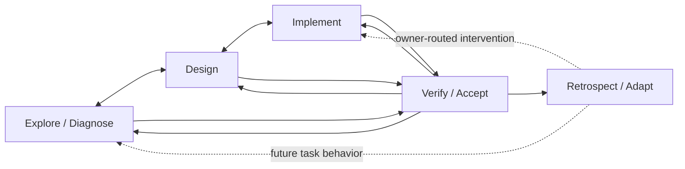
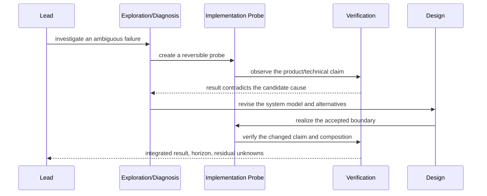

# Working Note — Work Actions, Postures, and Module Complexity

- **State**: supporting resolved model; active field evidence moved to
  [`16`](16-telemetry-task-packet-field-cases.md)
- **Sources**: `D-014..D-019`, `V-033..V-044`, Working Protocol, Implementation
  Taste, composable-module and slice foundation in
  [`14`](14-composable-task-packet-modules.md), verification synthesis in
  [`07`](07-verification-acceptance-and-test-routing.md), and work-system
  adaptation synthesis in [`08`](08-agent-work-system-retrospective.md)
- **Use**: Connect work actions and persistent task-packet modules without a
  linear lifecycle, recursive state machine, or unjustified structural cost

## Resolution

- **Status**: Sir accepted the two-axis plan model and coordination-as-relations
  model; no SVC source or fixed plan schema is approved.
- **Accepted input**: task packets serve task completion; work postures are
  non-linear and locally planned; plan scope is distinct from plan
  organization; work topology and information topology are useful distinctions.
- **Accepted synthesis**: plan scope is independent from organization;
  coordination is a pressure-loaded relation view over work units, actors,
  authority, returns, and integration targets rather than a third topology.
- **Further correction**: `phase`/`slice`/`step` were examples, not an accepted
  vocabulary. SVC must provide stable planning primitives without imposing a
  fixed hierarchy. Human packet interaction ordinarily stops at a short
  `packet.md`; supporting files primarily serve Agent work.
- **Next evidence**: telemetry-selected real packets are reviewed in
  [`16`](16-telemetry-task-packet-field-cases.md) before selecting primitives.

## Task Completion Is the Organizing Purpose

Task packets exist to help a Human and Agents complete the task well. A
non-trivial task normally combines several recurring work actions:

- explore unknowns and diagnose mismatches
- design product, interaction, system, or implementation choices
- realize approved choices through implementation
- verify changed claims and obtain the required acceptance
- consolidate task evidence into a retrospective intervention when future
  Agent behavior can be improved

These actions explain why persistent task-local material may need different
owners. They do not define a linear lifecycle or one task type.

## Keep the Layers Distinct

| Layer | Meaning | Example |
| --- | --- | --- |
| Task outcome and Human control | What must be achieved, what is true now, and what Human issue is foregrounded | `packet.md` |
| Working posture | How the Agent is currently reducing uncertainty or changing state | Explore, Solidify, Execute, Diagnose; exact later evolution remains open |
| Plan scope | Which semantic concern or outcome the plan covers | Task/mixed, exploration, design, implementation, verification |
| Plan organization | How work inside that scope is grouped, bounded, related, and made actionable | Optional phases, slices, and steps |
| Task-packet module | Persistent task-local address for a concern with distinct content and consumers | Exploration evidence, design dossiers, implementation plan, verification ledger |
| Assignment/delegation | Who or what executes bounded work under which authority and return contract | Lead assigns one scoped slice to an Explorer or Executor |

A posture does not own files or durable truth. A module does not say which
posture is currently active. A scope name does not establish plan granularity.
A slice does not grant mutation authority merely by existing; an
implementation-scoped slice still needs the applicable Impact Handshake and
proof. An Agent runtime tree does not establish the work or evidence topology.

## Non-Linear and Recursive Work

The common actions form feedback edges rather than stages:



One concrete trajectory may be:



“One posture uses another” therefore means it opens bounded work with an
objective, authority, expected return, proof horizon, and reopen/escalation
condition. It does not require a global call stack or nested packet for every
move.

Recursive work must not automatically create a recursive file tree. Keep a
result inside the calling dossier when only that dossier consumes it. Give the
result a separate module address only when it has an independent consumer,
change cadence, provenance boundary, or integration role; then link to its
consequential result rather than copy its state. File placement follows the
semantic owner of persistent information, not the posture that happened to
produce it.

## Planning Has Scope and Organization

The former model incorrectly used `task slice` and `implementation slice` as
planning resolutions. Use two independent dimensions instead.

**Scope** answers what concern the plan covers. A task-wide plan may be mixed;
local plans may cover exploration, diagnosis, design, implementation,
verification, or retrospective adaptation. Scope can narrow or widen as work
reopens another concern.

**Organization** answers how work inside that scope is made tractable:

- a **phase** is an optional sequencing or review horizon with an exit
  condition
- a **slice** is a bounded result, feedback, or integration unit with explicit
  relations to other work
- a **step** is a concrete next action inside the local plan

These are not automatically a strict `phase -> slice -> step` hierarchy. One
plan may use slices with steps and no phases; another may use a phase with
direct steps. A phase must not turn recurring postures into a global lifecycle,
and a step need not become persistent task state.

Scope qualifies the organization construct: an exploration slice, design
slice, implementation slice, verification slice, or mixed task-wide slice. An
implementation-scoped slice adds mutation authority, invariants, ordering,
proof, and recovery obligations. That is a scope-specific contract, not a
different planning level.

Placement and detail remain progressive. `packet.md` exposes only the current
task-level issue and next meaningful action. A deep module may keep its local
plan. A conditional coordination carrier may persist only those work-unit
relations that can no longer remain implicit. Broader surfaces retain the
consequential result and a link, not a copy of the local plan.

## Posture and Module Correspondence

Correspondence is useful for routing, but it is many-to-many:

| Work action/posture pressure | Likely task-packet material | Important cross-use |
| --- | --- | --- |
| Exploration/diagnosis | Questions, evidence boundary, observations, competing causes, synthesis | May implement probes, invoke verification, or reopen design |
| Design/solidification | Alternatives, models, rationale, decisions, consequences | Uses exploration and verification; implementation friction may reopen it |
| Implementation/execution | Realization plan, implementation slices, migrations, handoffs | Uses design authority and verification feedback; may trigger diagnosis |
| Verification/acceptance | Changed claims, observation surfaces, proof horizons, residual risk, Human/external acceptance | Can reopen exploration, design, or implementation |
| Retrospective/adaptation | Avoidable trajectory loss, counterfactual, smallest intervention, future observation, keep/revise/retire | Reads all prior evidence and routes the intervention to its normal owner |

The exact durable Working Protocol posture set is not decided here. In the
current protocol, verification is a responsibility across work and
retrospective is not a posture. Whether they should become named postures, deep
methods, or remain cross-cutting belongs to the Working Protocol cluster.

## Coordination Is a Work-Topology Relation Set

“Coordination topology” was an unnecessarily separate name. The coordinated
entities are:

- bounded work units such as an active front, local phase, scoped slice, or
  step when the step is material
- actors such as Sir, the Lead, a sub-agent, or a deterministic executor
- expected returns and the shared task or system target into which they must be
  integrated
- authority and resource boundaries that constrain execution

Coordination is the material relation set among those entities: `depends-on`,
`assigned-to`, `authorized-by`, `expects-return`, `returns-to`, `blocks`,
`integrates-into`, `reopens`, or `verified-by`. It is an overlay on the work
topology, not a second copy of work units or posture transitions. Parallelism
is normally derived from dependencies and compatible write authority rather
than stored as another entity.

Working Protocol remains the substrate for authority resolution, mutation
gate, progressive loading, task minimum, and meaningful updates. If relation
pressure becomes material, a conditional coordination module may persist the
smallest relevant projection. The sub-agent cluster still owns delegation
method, context projection, stop/escalation, verification return, and cost.

For one Lead and one bounded work unit, these relations remain implicit in
`packet.md`. A universal graph would add a scheduler, heartbeat, and state
surface without improving task completion.

## Dogfooding This Discussion Packet

The current packet carries the discussion adequately for Agent recovery and
reasoning. The Human-surface criterion is narrower than the earlier audit
assumed: Sir should ordinarily need only the short `packet.md`, not this dossier
or the other Agent supporting files.

**What works**:

- `packet.md` preserves the objective, accepted corrections, active boundary,
  and source-mutation guardrail without replaying the conversation.
- supporting dossiers preserve deep Lead synthesis, provenance, and
  counterexamples for Agent use
- decision and claim ledgers distinguish Human authority from evidence
  maturity, and the resume route supports task switching

**What required correction**:

- `packet.md`, `design-map.md`, and this dossier repeated the active proposition;
  only the consequential projection belongs in the Human entry
- the pre-correction 145-line entry imposed scanning cost; `D/V/O/S` identifiers
  were not themselves the problem, but their meanings were insufficiently
  established as local Human-Agent common ground
- sixteen numbered design notes preserve chronology better than semantic
  navigation; their active/supporting/superseded status is not obvious from the
  directory
- accepted task direction, accepted input, supported observation, and
  unverified mechanism still need plain local meanings when compressed into
  `Current Truth`

The result is a useful research notebook and Agent recovery packet. The first
correction compressed `packet.md` to 91 lines, projected the current ruling and
maturity there, and reduced the active-front map to routing. The dossier need
not be a Human brief. Further evaluation should ask whether a fresh Agent can
recover and reason correctly while Sir can steer from `packet.md` alone.

## Alternatives, Cost, and Falsifiers

For planning, three alternatives remain visible:

- treating task/design/implementation as plan levels is familiar but makes
  mixed and recursive work look linear
- requiring a fixed `phase -> slice -> step` hierarchy is predictable but
  creates empty structure and gives phase semantics the authority of a
  lifecycle
- keeping scope and organization independent is the accepted task direction;
  its cost is that each used phase, slice, or step needs a locally intelligible
  meaning rather than inheriting one universal schema

For coordination:

- a separate coordination graph gives one explicit surface but duplicates work
  items and update state
- leaving everything implicit preserves simplicity but fails when several
  actors, returns, write boundaries, or integration obligations coexist
- a pressure-loaded relation projection on work topology is the accepted task
  direction; its cost is deciding which relations are material enough to
  persist

The direction is reversible because it currently changes task-local
language only. Reopen it if actor/authority/handoff state cannot be expressed
without hidden coordination state, if the relation projection repeatedly
diverges from the work plan, or if local phase/slice/step meanings create more
ambiguity than a fixed hierarchy removes.

## Verification and Retrospective Boundaries

- Verification concerns the current task's changed claim, relevant observation,
  proof horizon, unknown, and acceptance. It becomes a module only when these
  have independent depth or consumers; otherwise the `Verification` and
  `Current Truth` fields suffice.
- Retrospective concerns future Agent behavior. It asks which avoidable Agent
  move or feedback delay would differ if a candidate intervention already
  existed, and whether terminal quality would remain good. It is not a required
  completion gate, experience archive, or automatically durable module.
- A substantial retrospective may use task-local supporting material, but its
  script, linter, diagnostic, method, role, or taste change still lands with the
  normal semantic owner and later needs keep/revise/retire evidence.

## Simple-First Admission and Retirement

Default to `packet.md`. Add a module only when all four statements are true:

1. useful task-local content exists now
2. it has a distinct consumer or change cadence
3. keeping it in `packet.md` materially harms Human scanning, Agent recovery,
   provenance, handoff, or integration
4. its consequential return to `packet.md` and conflict boundary are clear

Then use the smallest shape:

```text
no module
-> one module file
-> stable module entry/map plus pressure-created artifacts
```

Do not activate from a line count, posture label, Agent count, or possibility
of future growth. Do not pre-create an empty directory or template.

Retire, merge, or stop maintaining a module when its distinct consumer/cadence
disappears, its state duplicates another owner, or navigation and synchronization
cost exceed recovery/coordination return. First integrate the consequential
result into `packet.md` or the durable owner; then remove task-local scaffolding
that no longer serves completion. A no-module or no-retrospective result is
normal.

## Accepted Direction and Next Inquiry

The accepted direction is:

> Working postures and task-packet modules correspond but remain different
> layers. A plan combines a semantic scope with optional organization such as
> phases, scoped slices, and steps; those constructs are not a mandatory
> hierarchy. Coordination is the pressure-loaded execution, authority, return,
> and integration relation set over work units and actors, not a third topology
> or second work graph.

The next discussion must not canonize the example words. It should use the
telemetry field cases to derive a small stable set of planning primitives from
their distinct jobs, define how each relates to semantic scope and other work,
and preserve a simple plan that activates only what it needs.
