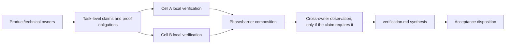

# Working Note — Inquiry Boundary and Distributed Verification

- **State**: accepted task-packet refinement (`D-043`)
- **Sources**: `D-037..D-042`; `V-015`, `V-069..V-071`, `V-078`,
  `V-079`; Sir's challenge to the integrated shape; field shapes in
  [`design/26`](26-inquiry-and-diagnosis-module.md) and
  [`design/30`](30-verification-module-and-acceptance-disposition.md)
- **Use**: Correct two possible activity-to-module errors before accepting the
  integrated task-packet catalog

## Information Module Is Not a Named Activity

An information module earns a stable entry when information has a distinct
current owner and lifecycle across several local work returns. A useful test is:

```text
if activity A occurs inside several Tasks/Slices,
does its information state still have one independently maintained
synthesis, consumer, cadence, invalidation, and return?
```

If changing from activity A to activity B does not change those properties, it
does not justify another module or entry name.

## Diagnosis Does Not Pass the Independent-Module Test

Inquiry and diagnosis share all material information responsibilities:

- owned uncertainty or mismatch question
- evidence/baseline/provenance/freshness boundary
- direct observations separated from interpretation
- competing explanation and discriminating probe when material
- current synthesis and residual unknown
- return to the Plan/design/implementation/verification consumer

Diagnosis adds one condition: an observed mismatch makes causal discrimination
the current inquiry. That changes the question and likely method; it does not
create a different information lifecycle.

The same diagnosis can appear in several work contexts:

```text
bug-fix Task
  -> initial Inquiry asks which supported cause explains the observed mismatch

feature Task
  -> IM candidate
  -> distributed verification finds mismatch
  -> Inquiry reopens around the mismatch
  -> return to DS or IM

work-system RT
  -> Inquiry may diagnose which Agent-work condition caused avoidable loss
```

In none of these does `diagnosis.md` need to become a peer owner merely because
the Agent uses the Diagnose posture.

## Three Diagnosis File Alternatives

| Alternative | Benefit | Failure/cost |
| --- | --- | --- |
| independent `inquiry.md` and `diagnosis.md` modules | direct labels | duplicates evidence/freshness/return contracts and encourages both to activate in mixed Tasks |
| mutually exclusive entry variants, current `D-037` | bug Tasks can use the intuitive diagnosis name | one information owner has two stable paths; a mismatch discovered later creates rename/alias pressure |
| **one `inquiry.md` module; diagnosis is an owned question/method inside it** | one predictable owner/path and no activity-derived module | “Inquiry” is broader/less immediate in a bug Task; title and semantic artifacts must keep diagnosis legible |

The third alternative now has the lowest cost. A bug-fix packet can remain
plain and intuitive:

```text
inquiry.md
  # Diagnose intermittent subscription failure

inquiry/
  reproduction.md
  cause-matrix.md
  provider-boundary-probe.md
```

The title tells the Human/Agent what kind of inquiry is active. Supporting
artifacts use semantic names; there is no standard `diagnosis/` sibling or
`diagnosis.template.md`.

This would refine, rather than discard, `D-037`: retain the shared epistemic
contract and freshness rules, but withdraw the two stable entry variants.
`task-diagnostics-matrix.template.md` remains separately reviewable as a
diagnosis-dominant Task/example or supporting artifact; it does not establish
a module.

## Verification Activity Is Distributed

Verification is not one late posture or a command batch after implementation.
It operates at several scopes:

| Scope | Verification job | Control owner |
| --- | --- | --- |
| Step/Slice feedback | quickly discriminate whether current work is moving toward its return | current Plan/Slice; often inside `IQ`, `DS`, or `IM` |
| Slice return | establish the bounded changed claim/evidence required for Lead integration | current Slice and verifier/integration gate |
| Cell contribution | show that the Cell satisfies its Phase contribution | Cell Plan |
| Phase barrier | compose required Cell returns against the semantic exit predicate | `task-map.md` / Phase owner |
| task-level/system claim | establish behavior or quality that exists only across integrated owners/horizons | task-level verification synthesis and applicable `VR` work |
| acceptance/effect | decide what may progress or mutate given evidence and residual risk | consuming Lead/Human/barrier/domain owner |

A routine `IM` Slice should normally run its focused checks inside the same
feedback loop. It needs a separate `VR` Slice only when verification produces
an independently useful return, uses a different authority/effect boundary,
requires expensive/external execution, or can proceed separately from the
implementation candidate.

## What `verification.md` Actually Owns

`verification.md` is not the executor of distributed checks and not a final
Task stage. It is the pressure-created expansion of `packet.md`'s universal
Verification field for **shared task-level claim/evidence state**:

- terminal or cross-owner claims that several Plans/Cells contribute to
- mapping from local evidence/qualified guarantees to those claims
- proof horizons, assumptions, residual unknowns, contradictions, and
  requalification conditions
- cross-Cell/integration observations that no one Cell can own
- current synthesis requested by a barrier, Human, or other acceptance
  disposition

It deliberately excludes every local test and command. A Cell-local claim that
no other consumer needs stays in the Cell Plan/Slice artifact.

The module may activate before implementation, because expected claims and
proof composition often shape Design and IM Slice boundaries. It is updated as
Cells return evidence. Only claims that truly require the integrated candidate
wait for all relevant Cells:



The diagram is not a fixed sequence. Local evidence can update the synthesis
early; a Phase can consume proof without a final cross-owner check; later
evidence can reopen Inquiry or IM. Do not create a final Verification Phase for
matrix symmetry.

## Verification File Boundary by Pressure

```text
# Familiar local verification
Cell/Task Plan or Slice entry only

# One local expanded protocol/receipt
cells/<track>-<phase>/<nn>-VR.md

# Shared task-level claim/evidence state
verification.md
verification/
  <cross-owner concern, environment contract, or run certificate>
```

The root module is justified only when shared synthesis has management value.
Its existence does not move proof ownership away from Cell/Slice verifiers or
make local evidence wait for Task completion.

## Consequences for the Integrated Shape

If accepted:

1. Replace the Inquiry/Diagnosis pair in the module catalog with one Inquiry
   module, whose question may be diagnostic.
2. Remove `diagnosis.template.md` from the candidate template family and rename
   durable guidance from `inquiry-diagnosis.md` to `inquiry.md`.
3. Describe Verification as two layers:
   - distributed activity/effect gates owned by Plans, Slices, Cells, barriers,
     and Humans
   - optional task-level `verification.md` synthesis when claims/evidence cross
     those local owners
4. State explicitly that task-level integrated verification may occur after all
   relevant Cells only when the claim semantically requires their joined
   candidate; never because `verification.md` exists.

## Review Proposition

- **Refine `D-037`**: Diagnosis is an Inquiry kind/method, not an independent
  module or alternative stable entry; standardize only `inquiry.md`.
- **Clarify `D-042` without reversing it**: retain pressure-created
  `verification.md`, but define it as shared task-level claim/evidence
  synthesis over distributed verification activity—not a late whole-Task
  verification stage.
