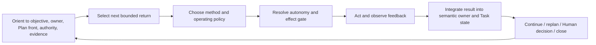

# Working Note — Working Protocol Foundation

- **State**: accepted foundation only; broader Working Protocol design remains open
- **Sources**: current canonical Working Protocol; accepted Task Packet model;
  `V-014`, `V-017`, `V-036`, `V-087`; Five Coding Hats and deterministic-
  transformation synthesis in [`design/06`](06-working-mode-and-transformation-routing.md)
- **Use**: Define what the Working Protocol governs before selecting posture
  names, detailed SOPs, status vocabulary, or durable file layout

**Current integration note**: later decisions accept Explore, Design, and
Implementation as stateless foundational Working Methods rather than postures
or lifecycle states. `D-079` accepts
[`design/68`](68-universal-working-control-guidance.md)'s compression of this
seven-node foundation sketch into four control connections rather than a
universal SOP.

## The Capability Boundary

The Task Packet externalizes current task state and supporting information. It
does not tell the Agent how to choose and control the next move. The Working
Protocol should own that stable behavioral contract:

```text
task state + Human authority + uncertainty/risk + available feedback
  -> choose a bounded return and suitable method
  -> determine autonomy/effect boundary
  -> act, observe, integrate, and update
  -> continue, replan, ask, return, or close
```

This is a decision policy over work, not a Task lifecycle, Plan, information
module, role roster, or runtime orchestrator.

## What the Current Protocol Already Has

The canonical source usefully provides:

- request lenses: Intent, Constraint, Reality, Artifact
- semantic owner resolution and source-first truth
- Agent Task Analysis evidence chain
- four working postures: Explore, Solidify, Execute, Diagnose
- the five-field Task control surface
- progressive loading
- mutation Impact Handshake
- canonical-owner-first execution and proportional verification

The pieces are individually useful, but the transition policy among them is
mostly implicit. The document does not yet make clear:

- when the Agent proceeds autonomously versus pauses for Human authority
- how Human intent authority differs from Human factual/technical fallibility
- how Plan/Slice returns select a posture, operating policy, tool, or SOP
- how feedback reopens Inquiry, Design, or Implementation without mode theater
- what must be integrated into Task Packet before another move begins
- how task-level consolidation and work-system adaptation close differently
- how a Human predicts Agent behavior without reviewing each action

## Distinguish Five Layers

| Layer | Job | Example |
| --- | --- | --- |
| Task Packet | current state and information surfaces | `packet.md`, Cell Plan, Inquiry/Design/Verification modules |
| Plan | partial linear route under one work owner | `03-IM -> 04-VR -> TBC` |
| Working Protocol | rules for selecting, controlling, integrating, and revising work | proceed, gate effect, observe, return, reopen, close |
| Working posture/method | cognitive policy used inside the current work | explore uncertainty, diagnose mismatch, design, execute |
| SOP/role/tool | pressure-loaded specialized realization | Explorer method, Executor loop, deterministic transform, release acceptance |

A Plan says **which bounded returns currently form the route**. The Protocol
says **how the Agent handles the next return under current authority and
evidence**. A posture can recur inside one Slice; a Slice can use several
postures. A role or tool is selected only when its specialized method/interface
repays routing and integration cost.

## Correct the Comparison: Method, Topology, and Runtime Semantics

The former three-way comparison mixed different dimensions. Posture-centric
switching is not a peer alternative to a pipeline or graph: a posture is a
method selected inside one work unit. Pipeline and graph describe work-control
topology. Recursion describes what happens over time when feedback changes the
route.

| Dimension | Candidate shape | Owner |
| --- | --- | --- |
| work-control topology | one linear Plan/pipeline; or a graph of scoped linear Plans and material relations | Task Packet |
| runtime control semantics | select return, resolve effect, observe evidence, integrate, continue/replan/ask/close | Working Protocol |
| local method | posture, SOP, role, tool, operating policy | Working Protocol and pressure-loaded specialist guidance |

### Two progressively disclosed work-control topologies

**Linear topology** uses one partial Plan when one owner/front can preserve a
truthful route:

```text
01-IQ -> 02-DS -> 03-IM -> 04-VR -> TBC
```

It is cheap, legible, and appropriate for small Tasks or deep Tasks with one
current control lane. Feedback can still revise or replace the remaining
route; “pipeline” must not mean that every named stage is mandatory or that a
failed verification cannot return to Inquiry/Design/Implementation.

**Graph topology** appears when several continuing obligations or independently
integratable returns need separate Plan owners, relations, and joins. The
accepted Task Packet model represents this through Track/Phase/Cell owners and
`task-map.md`, while each local Plan remains partial and linear. The map carries
only material dependencies, barriers, active fronts, and integration returns;
it is not a universal graph schema or a copy of every Plan step.

A pipeline is structurally a degenerate DAG. However, “recursive DAG” should be
used cautiously: a current dependency graph is preferably acyclic, while
iteration, failure, invalidation, and reopening happen through new evidence
and revised/versioned Plan state over time. Encoding those temporal loops as
permanent graph cycles would make readiness and completion ambiguous.

### One recursive protocol operates both topologies

The same compact control loop runs at the current Task/Cell/Plan front:



This does not mean seven mandatory steps or packet fields. They are the minimum
questions whose omission can cause wrong work, unauthorized effects, lost
evidence, or misleading Human updates. Familiar low-risk work compresses the
whole loop into one move.

The revised Lead recommendation is therefore not “choose recursion instead of
pipeline.” Keep recursive feedback/integration as the universal Working
Protocol semantics, and let Task Packet progressively choose the cheapest
truthful control topology: one linear Plan first, then a graph of scoped Plans
only under real multi-owner/barrier pressure.

Sir accepted this Protocol/Packet separation in `D-044` and the bounded
per-Task carrier in `D-045`. His parenthesized use of “DAG” was an intuition for
the non-linear model, not a proposal for a formal “recursive DAG” construct.
The three-state relation/write-back foundation is accepted in
[`design/35`](35-task-packet-state-relations.md). The remaining capability
surface is recovered in [`design/37`](37-working-protocol-capability-surface.md);
exact topology promotion/demotion, posture semantics and methods, specialized
SOP routing, Human collaboration behavior, and both closing SOPs remain open.

## Orient to the Current Control State

Before consequential work, recover only what can change the next move:

- objective, Human intent/preferences, guardrails, and accepted decisions
- applicable Task/Track/Phase/Cell Plan owner and current Slice/return
- semantic owner of the claim/state being read or changed
- current evidence, baseline/freshness, mismatch, and residual unknown
- mutation/external-effect authority and stop/escalation conditions
- relevant project rules, taste guidance, Skill/SOP, and verification surface

This is progressive context construction, not a universal Grounding Gate. A
cheap reversible probe may be the best way to orient. The later rules-matching
Agent can help under high-risk/high-unknown pressure, but another Agent is not
the definition of orientation.

## Select a Return Before Selecting Activity

The next management unit comes from the applicable Plan or task-level control
need. State the expected independently useful return and its consumer before
choosing “Explore,” “Executor,” “Reviewer,” a sub-agent, or a tool.

Questions include:

- What must become knowable, decided, changed, or evidenced?
- Who/currently what consumes that result?
- What uncertainty and effect boundary make it independently useful?
- What feedback would change the next move?
- What is the honest stop/TBC/escalation condition?

RT is intentionally not forced into a return contract here. Its SOP must first
resolve how an intervention candidate is consumed now and by a future Agent.

## Method and Operating Policy Are Separate

A working posture describes the kind of reasoning/action. An operating policy
describes the quality-risk trade-off while doing it:

- disposable learning versus durable production result
- speed versus refinement
- reversibility and blast radius
- evidence/proof expected now
- acceptable temporary debt and cleanup obligation

Five Coding Hats is useful evidence that the same coding activity can optimize
different things; its labels are not proposed SVC vocabulary. Expose operating
policy only when it materially changes how Human and Agent should collaborate
or judge the result. A familiar production fix should not require a policy
form.

Prefer the most deterministic action surface that faithfully expresses the
known part. Use LLM judgment for bounded semantic uncertainty and feedback,
not merely file volume.

## Critical Collaboration: Authority Is Typed

Human authority and epistemic correctness are independent:

| Human input | Agent obligation |
| --- | --- |
| intent, preference, desired expression | understand faithfully; expose consequences or ambiguity, do not silently replace |
| permission, scope, external-effect authority | obey the boundary; request expansion when needed |
| material trade-off or acceptance disposition | provide decision-ready evidence/options; Human decides |
| factual, causal, technical, or solution claim | treat as important fallible input; verify, challenge, and propose correction |
| requested method | follow when it is a real constraint; otherwise surface a materially better/safer alternative |

Likewise, uncertainty and effect are independent. Review, exploration,
reasoning, read-only inspection, and task-packet maintenance normally proceed
without micro-approval. Durable mutation and external effects use their
applicable authority even when the Agent is confident. High uncertainty alone
does not require Human approval if safe investigation can reduce it; low
uncertainty does not authorize a consequential effect.

Pause only when progress needs Human-only information, intent/taste/authority,
a mature consequential decision, or a materially expanded/irreversible effect
boundary. Report disagreement with evidence and consequences, not deferential
agreement or performative opposition.

## Truth, Stakeholder Value, and ROI Are Different Tests

Sir's ideas and proposed solutions are important inputs, not privileged facts.
The Agent should recover the intended benefit, test assumptions and causal
claims, compare the status quo and real alternatives, and recommend corrections
when evidence or logic disagrees. This is stronger than generic skepticism: it
requires constructive movement toward a better-supported answer.

But “objective correctness” cannot select every product or design decision.
The protocol should keep three questions distinct:

| Test | Question | Authority/evidence |
| --- | --- | --- |
| Epistemic validity | What is true, feasible, or causally supported? | observation, logic, reproducible evidence, calibrated uncertainty |
| Stakeholder value | Which consequences matter, to whom, and under whose legitimate authority? | product intent, affected stakeholders, rights/constraints, Human preference and acceptance |
| Decision economics | Is this choice worth its total cost and forgone alternatives? | expected benefit, lifecycle cost, risk/tail loss, reversibility, option value, time horizon, distribution |

These tests interact but do not substitute for one another. Facts constrain the
means but do not manufacture the ends. Stakeholder demand does not make a
technical claim true. A positive short-term numerical ROI does not erase
rights, unacceptable risk, long-term system degradation, or unevenly allocated
cost. Conversely, invoking taste or architectural purity without stakeholder
benefit and cost comparison is insufficient.

The practical Agent behavior is therefore: challenge a proposed route without
discarding its intended value; make stakeholder and authority assumptions
explicit when material; compare against the status quo and credible
alternatives; and present the smallest consequential trade-off for Human
decision. Do not force a numeric business case when the evidence is qualitative
or the important values are not commensurable.

## Act Through a Feedback Surface

The selected method should import discriminating information as cheaply as the
risk permits:

- inspect/search/query for an epistemic return
- prototype or reversible probe for feasibility
- deterministic transformation for known repetitive change
- bounded Executor loop for behavior requiring repeated observation
- compiler/type/schema/test/runtime/provider/Human surface for verification
- delegated specialist only when context isolation/method/interface earns its
  briefing, verification, and integration cost

An action without a relevant observation surface can produce activity but
cannot reliably update task truth.

## Integrate Before Continuing

Tool output, sub-agent return, test pass, and Human comment are candidate inputs
until the applicable owner integrates them. After a meaningful move:

1. update the deepest semantic owner—Inquiry, Design/Decision, source, Cell
   Plan, or Verification synthesis
2. update Task-map barrier/front only when that return changes work topology
3. update `packet.md` only when the Human consequential current picture changes
4. continue/replan/reopen/pause/close from the integrated state

This is the protocol seam that prevents conversation, sub-agent messages, or
green commands from becoming competing task-state authorities.

### Semantic state and work-control state are different owners

Sir's dogfood review suggests a useful cross-module test. A semantic module
owns the current meaningful result of its concern; Task map and the applicable
Plan owner own the work used to obtain, revise, or consume that result:

| Semantic owner | Owns | Must not silently own |
| --- | --- | --- |
| Inquiry | integrated evidence, provenance/freshness, current unknown or causal account | search route, probe scheduling, implementation plan |
| Design | current problem model, alternatives, trade-offs, unresolved design tension | discussion sequence, active Cell, execution route |
| Decision | authority-bearing disposition, rationale, consequence, reopen boundary | deliberation Plan or downstream implementation progress |
| Verification | current claim/evidence horizon, residual, requalification need | test execution schedule, Cell/Phase progress, acceptance authority |
| Task map / Cell Plan | current work owners, returns, relations, barrier and partial route | duplicated evidence/design/decision/proof detail or completed-process history |

“Result versus process” is a useful shorthand, provided `result` means current
semantic state rather than only a terminal artifact, and `process` means
current work control rather than an activity log. A Slice may produce or revise
a semantic result; integration updates the semantic owner first and the work
control owner only with the consequential return/disposition.

## Closure Has Two Distinct SOPs

After the primary task return reaches its declared horizon:

- **Project-truth consolidation** asks which accepted task-local semantic delta
  must be realized in an existing product/technical/operational/code owner.
  Actual changes remain normal `DS`/`IM`/`VR` work; deletion is not a promotion
  review.
- **Agent work-system adaptation** asks whether the trajectory exposed a
  plausibly avoidable behavior pattern and a cost-effective future
  intervention. No intervention is normal; later evidence must support
  keep/revise/retire.

These SOPs may recurse into Inquiry, Design, Implementation, or Verification,
and RT remains an activity of the original Task even when cross-Cell. Their
exact sequence, output, consumer, and packet carrier are the next detailed
discussion—not implied by a `close` event or `retrospective.md`.

## Binding to the Three Outcomes

- **O-INTERACTION**: fewer approval interruptions; Human attention moves to
  intent, taste, consequential decisions, authority, and residual risk; Agent
  disagreement is legible and evidence-backed.
- **O-TASK**: every move retains a bounded return, feedback, integration, and
  honest replan path, reducing drift through long non-linear work.
- **O-SYSTEM**: owner/effect/verification discipline keeps changes coherent and
  bounded while deterministic and specialized methods lower repeated cost.
- **S-SIMPLE**: a familiar bounded task should experience this as “understand,
  act safely, check, report,” with no visible mode/state bureaucracy.

## Rough SVC Landing Boundary

If the foundation survives later SOP discussion:

- `src/sections/working-protocol.md` keeps the universal recursive control
  contract, critical-collaboration boundary, progressive routing, mutation
  gate, integration, and closure entry.
- Pressure-loaded methods may grow behind a stable extension entry, for example
  `src/sections/extensions/working-protocol.md + working-protocol/`, only after
  their distinct trigger/consumer/verification is established.
- Task Packet guidance owns state/file shapes; Sub-agent guidance owns
  delegation interfaces; Verification guidance owns proof construction; Taste
  guidance owns design judgment. Working Protocol routes to them without
  copying their full SOPs.
- CLI remains lookup/template/tool projection, never the semantic transition
  engine.

## Failure Modes and Falsifiers

- the loop becomes seven mandatory status fields or a hidden state machine
- every action requires a declared posture/policy even when behavior is obvious
- “autonomy” leaks into durable/external authority
- “critical thinking” becomes disregard for Human intent or requested scope
- feedback is collected but not integrated into the applicable owner
- the Protocol duplicates Plan, Task Packet, sub-agent role, or verification
  content
- closure becomes a mandatory retrospective/promotion bureaucracy

Reopen the recursive-loop foundation if real Tasks cannot use it without
repeatedly translating ordinary work into meta-language, or if a simpler
control contract preserves authority, recovery, feedback, and Human
predictability at lower total cost.

## Foundation Disposition

`D-044` accepts one recursive return/effect/evidence/integration semantics over
progressively selected linear or graph Task Packet topology. `D-045` accepts
Task Packet as its partial persistent per-Task substrate. Detailed state
relations were later accepted in `D-046`. These decisions settle only the
foundation: posture semantics/methods, universal and specialized SOPs, topology
transition, Human collaboration behavior, and both closing SOPs remain open.
