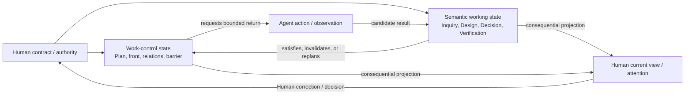

# Working Note — Task Packet State Relations and Write-Back

- **State**: accepted task-local model through `D-046`; real-task evidence may
  reopen projection and write-back boundaries
- **Sources**: accepted `D-044`, `D-045`; `V-096`, `V-101`; accepted Task
  Packet work/information topology; current-packet owner dogfood
- **Use**: Relate Human collaboration, work-control, and semantic working state
  without turning Task Packet into three independent stores, a process log, or
  a protocol runtime

## Accepted Carrier Boundary

Task Packet is the **partial persistent task-state and collaboration
substrate** on which the Agent applies Working Protocol. It is not the protocol
implementation, complete runtime state, or a filesystem state machine.

| Participant | Owns |
| --- | --- |
| Working Protocol | durable transition/control rules shared across Tasks |
| Task Packet | management-worthy task-local control state, semantic working results, Human projection, and recovery surface |
| Agent/Lead | interprets the protocol, chooses actions, integrates returns, and keeps projections coherent |
| Human | intent/preference, permission, consequential trade-offs, and acceptance authority |
| project owners and environment | durable product/technical/runtime truth, actual system state, and external observations |

The packet may persist objective/guardrails, current Plan topology, accepted
task-local decisions, material Inquiry/Design/Verification state, authority
boundaries, current Human attention, and honest continuation conditions. It
must not attempt to persist complete conversation context, chain of thought,
every tool/action event, the Working Protocol itself, duplicate durable project
truth, or inferred external state.

The protocol treats packet state as a current externalized projection that may
itself be stale or incomplete. It combines that projection with current
project/environment evidence before acting, and writes back only state whose
future management/recovery value repays maintenance.

## Three Coupled State Views, Not Three Independent Stores

The three state categories are functional views with controlled projection,
not a normalized partition of every fact:

| View | Stable question | Typical owner |
| --- | --- | --- |
| Human collaboration state | What has Human authority supplied, what consequential situation should the Human understand, and what interaction is needed now? | `packet.md` plus Human as authority |
| Work-control state | Which owner/front is pursuing what return, under which relation/barrier/authority, and what happens next? | inline/Task/Track/Phase/Cell Plan plus `task-map.md` |
| Semantic working state | What is currently supported, designed, decided, or evidenced within a distinct task-local concern? | Inquiry, Design, Decision, Verification module or applicable source owner |

### Human state is a bidirectional boundary

`packet.md` intentionally combines two directions because one returning Human
must see them together:

- **inbound collaboration contract**: Objective, Guardrails, task Verification
  horizon, Human intent/preferences, and effect/acceptance authority
- **outbound consequential projection**: integrated Current Truth, current
  control front, material residual risk, and Next Step/Human attention

This deliberate composition does not make `packet.md` the detailed owner of
every projected fact. Human factual/technical suggestions enter as candidate
inputs; Human intent, permission, preference, trade-off, and acceptance enter
their applicable authority owner. Conversation wording is integrated rather
than copied as state.

### Semantic and work-control state form a return loop

Work control asks for a semantic return; the candidate becomes task truth only
after its semantic owner integrates it. A semantic delta may satisfy a Slice,
invalidate the remaining Plan, reopen a Cell/Phase, or require no control
change. The Human surface projects only consequences and receives authority or
correction back into the appropriate owners.

### Thin semantic contracts inside control owners are legitimate

Strict zero-duplication would make control impossible. A Plan must name the
return it seeks; a Cell must state its Track obligation and Phase contribution;
a Phase must state its exit predicate; Task map must summarize satisfaction.
These are thin semantic contracts or labeled snapshots consumed by control,
not competing full semantic owners.

The boundary is management value and authority:

- control owners keep enough meaning to route, gate, integrate, or recover
- semantic modules keep enough work reference to identify the consuming Plan
- `packet.md` keeps enough of both to support the next Human interaction
- detailed evidence, alternatives, steps, and history remain with one owner
- when projections conflict, resolve from authority/fresh evidence at the
  deeper owner and then update outward; Human authority changes are integrated
  inward before re-projection

### Event-relative write-back

No single “always update Semantic, then Work, then Human” sequence covers every
event:

| Event | Primary write | Conditional propagation |
| --- | --- | --- |
| evidence, design, decision, or proof meaning changes | semantic owner | replan/satisfy work control; update Human view if consequential |
| Slice/front/dependency/Assignment/barrier state changes without new meaning | work-control owner | update Human view if attention, authority, outcome, or risk changes |
| Human intent/preference/permission/acceptance changes | applicable task/semantic/authority owner | replan work control and re-project Human view |
| Human factual/causal/technical claim arrives | candidate Inquiry/evidence input | integrate only after suitable checking; then propagate normally |
| durable system or external state changes | canonical project/environment owner first | integrate evidence, work disposition, and Human consequence |

This routing is the accepted task-local write-back contract. It should remain semantic
guidance rather than mandatory event types or a runtime journal.

## Accepted Proposition

Treat the three categories as coupled state views:

1. Human collaboration is a bidirectional contract/projection boundary.
2. Work control requests and consumes semantic returns; semantic changes may
   satisfy, invalidate, or replan work control.
3. Thin labeled projections are necessary at control and Human boundaries, but
   detailed state retains one semantic owner.
4. Route write-back by event meaning and consequence, not one mandatory update
   sequence or event log.

Reopen if this model cannot make owner conflicts and update obligations
predictable without adding a schema, or if real Tasks need a fourth independent
state lifecycle rather than a relation/projection over these three.
