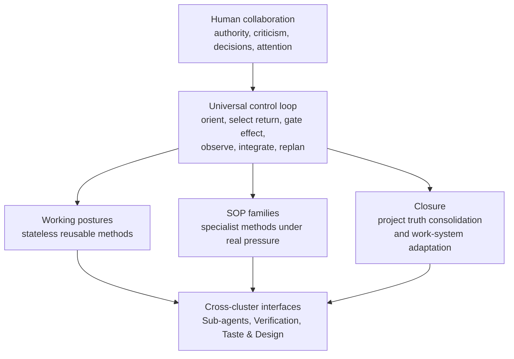

# Working Note — Working Protocol Capability Surface

- **State**: integrated historical capability map; final coverage review in
  [`design/72`](72-working-protocol-capability-coverage-and-landing-review.md)
- **Reason**: the Human projection incorrectly made three accepted foundation
  decisions look like the end of the Working Protocol Track
- **Sources**: [`design/34`](34-working-protocol-foundation.md), accepted
  `D-044..D-046`, reference-intake dossiers `02..12`, and Sir's correction
- **Use**: recover the whole capability surface before deciding working
  posture semantics and SOPs one bounded proposition at a time

**Current integration note**: `D-047..D-073` supersede the provisional posture
names and SOP framing below. Working Methods are now stateless, progressively
loaded tools; Explore, Design, and Implementation are accepted foundations.
`D-074` accepts Verification as a capability, qualification return, trusted-
verifier architecture, and Guardrail seam rather than a fourth foundation.
`D-075` accepts the provisional completeness of Explore, Design, and
Implementation; `D-076` accepts Retrospective/work-system adaptation;
`D-077` accepts project-truth consolidation as continuous integration plus a
closing residual check. `D-078` accepts use-case routing and Product,
Technical, and independent-but-claim-dependent Test Design projections. The
later `VF` and `TD` Cells supply specialist depth. `35-IQ` now derives the
universal control guidance and proposes four connected relations rather than a
universal SOP or fourth Working Method; `D-079` accepts that result. `36-IQ`
now audits the current/target domain boundary in
[`design/69`](69-working-protocol-current-target-and-domain-boundary.md).
`D-081` subsequently accepts Human collaboration and `D-082` corrects
specialist ownership; [`design/72`](72-working-protocol-capability-coverage-and-landing-review.md)
closes this map at capability-model depth. The open-area descriptions below are
the historical frontier that guided those derivations.

## What Was Settled When This Map Was Created

Only the foundation and its Task Packet seam are settled:

1. Working Protocol supplies recursive return/effect/evidence/integration
   semantics rather than a fixed Task lifecycle.
2. Task Packet is the partial persistent per-Task substrate, with linear or
   graph work-control shape selected progressively.
3. Human collaboration, work-control, and semantic working state are coupled
   views with event-relative write-back.

These decisions explain **where the protocol operates and how state returns**.
They do not yet define the complete protocol, the right posture vocabulary, a
posture's internal method, the SOP family, or the closing behavior.

## Full Working Protocol Surface

The accepted foundation covers only the center loop and part of Human/Task
Packet state routing. At least six design areas remain open.

### 1. Universal control guidance and topology transitions

Turn the accepted recursive semantics into compact usable guidance: how the Agent
orients, selects the next return, loads rules/context, gates effects, observes,
integrates, replans, pauses, and closes without a mandatory state machine. The
Protocol/Packet seam also still needs the pressure and safe transition rules
for keeping one linear Plan, promoting to scoped Plan topology, and later
retiring topology whose independent control value has ended.

### 2. Working posture model

Treat a posture as a stateless method/tool, then determine when its distinct
behavior earns a name, how several methods compose or recur inside one Slice,
and whether the current `Explore / Solidify / Execute / Diagnose` set remains
the smallest truthful set. Do not introduce one active posture, transition
events, status reporting, or Task Packet posture state. Return-scope tags such
as `IQ`, `DS`, `IM`, `VR`, and `RT` name what a Slice returns; they must not
silently become posture names.

### 3. Posture methods

Each retained posture needs a compact method: its use condition, questions,
useful feedback surfaces, continuation/return judgment, failure modes, and
composition with other methods. It should not become a mandatory form,
checklist ritual, runtime state, or linear lifecycle.

### 4. Pressure-loaded specialized SOPs

Earlier gleanings propose useful methods whose value depends on specialization
and trigger pressure: rules matching before risky work, Explorer query/tool
routing, bounded Executor feedback loops, deterministic transformation before
LLM editing, document-owner consolidation, proposer/reviewer interaction, and
possibly ablation or forgetting methods. Working Protocol must define how a
method is selected and returns; Sub-agents, Verification, or another semantic
owner may own the specialist detail.

### 5. Human collaboration behavior

The protocol still needs a usable SOP for autonomous epistemic work,
constructive disagreement, typed Human authority, one-question attention,
decision-ready returns, intervention/takeover, and separating epistemic truth,
stakeholder value, and decision economics. Accepted principles are not yet a
predictable Human-Agent interaction method.

### 6. Two closing SOPs

Project-truth consolidation and Agent work-system adaptation are different
activities with different consumers. Their trigger, inquiry method, return,
no-op behavior, evidence retention, mutation authority, and relationship to RT
planning remain open. The latter targets future Agent behavior by reducing a
recurring source of wasted work; it is not another project-memory promotion
step.

## How the Earlier Gleanings Enter

| Gleaning/reference family | Working Protocol question | Likely detail owner/interface |
| --- | --- | --- |
| critical distance from Human claims; stakeholder value and ROI | collaboration, authority, decision SOP | universal protocol + Taste & Design |
| effective design docs and constructive collaboration surfaces | how design work returns a reviewable decision | posture/SOP + corpus writing draft |
| Five Coding Hats | separate working posture from operating policy | posture model |
| Explorer and tool/query routing | how epistemic work searches, filters, cross-checks, and stops | Explore/Inquiry SOP; possibly Sub-agent role |
| rules-matching Agent | when context/rules must be actively resolved before risk | orientation SOP + Sub-agents |
| Executor and deterministic transformations | route by semantic uncertainty and feedback, not file count | Execute SOP + Sub-agents |
| doc writer / durable owner update | consolidate accepted semantic deltas into canonical owners | project-truth consolidation SOP |
| proof-carrying delegation and product-observation tests | what evidence a return carries and who may accept it | Verification + Sub-agents interface |
| ablation, status surface, forgetting, proposer-reviewer | diagnose/control/adapt only under demonstrated pressure | control visibility, Verification, adaptation, Sub-agents |
| implementation taste and ECCA ideas | how Agent forms and explains a better design judgment | Taste & Design + Human decision SOP |

This routing does not pre-accept the named mechanism or force one file/Agent per
method. It prevents the intake from disappearing merely because the foundation
model was accepted.

## Discussion Route

The discussion remains non-linear, with one foreground proposition at a time.
The Working Method abstraction, three foundational methods, Verification
category, closing seams, Design-guidance routing, universal control core,
Working Protocol domain boundary, and Human collaboration are now accepted at
capability depth through `D-081`. `D-082` corrects a discovered ownership
break: [`design/71`](71-specialist-guidance-routing.md) separates method-owned
specialist depth, independent capability seams, and role/tool realizations,
leaving Working Protocol with navigation rather than a parallel specialist
router. [`design/72`](72-working-protocol-capability-coverage-and-landing-review.md)
completes the capability-coverage and landing-boundary review and marks the
`WP` Cell satisfied/reopenable. Cross-cluster evidence may still reopen it;
this remains a coverage map, not a promised pipeline.

## Working Posture Design Anti-pattern

Do not commit **Co-occurrence Capture**: observing a behavior while a posture is
active and promoting it into that posture's SOP without showing a distinctive
posture-specific need. Universal Working Protocol behavior, Verification
discipline, another capability's method, and role/tool realization remain
interfaces unless removing them makes the posture method itself incomplete.
Co-occurrence is evidence of interaction, not semantic ownership.
