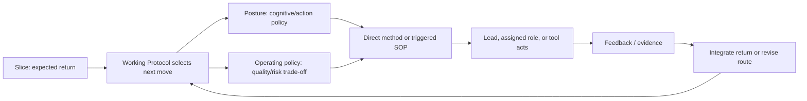

# Lead Proposal — Working Posture Boundary

- **State**: not accepted; over-modeled framing replaced by [`design/39`](39-working-posture-as-sop.md)
- **Consumer**: `WP × P1 / 06-DS`
- **Decision now**: the semantic boundary and admission test for a working
  posture
- **Not decided now**: the final posture set, names, detailed posture SOPs, or
  durable SVC file layout

## Why This Boundary Is Needed

Current and proposed vocabulary can easily collapse six different concerns
into “mode”: what a Slice returns, how the Agent is thinking, what quality/risk
trade-off applies, which repeatable method is invoked, who performs it, and
which tool acts. That makes Human-visible behavior less predictable rather than
more predictable.

A working posture earns a name only if it changes local control decisions. It
must not become a lifecycle stage, persistent task status, module owner, or
synonym for the current deliverable.

## Alternatives

| Model | Benefit | Failure pressure |
| --- | --- | --- |
| Return-aligned modes such as Inquiry/Design/Implementation/Verification | immediately recognizable work labels | binds a mixed Slice to one mode, suggests a lifecycle, and duplicates return-scope tags |
| Keep `Explore / Solidify / Execute / Diagnose` as an unexplained primitive set | smallest source change | `Solidify` hides several different methods; labels do not say when to switch or how Human should respond |
| SOP-only; remove posture | fewest abstract concepts | every SOP repeats selection logic, while Human loses a compact signal about the Agent's present cognitive policy |
| Define posture behaviorally, then admit only names that pass a value test | separates dimensions and allows the current set to survive, change, or shrink on evidence | adds one abstraction whose value disappears if it does not change action or collaboration |

The Lead recommends the fourth model. It neither assumes more postures nor
protects the current four names from later review.

## Proposed Definition

> A **working posture** is a transient, reusable local control policy for the
> kind of cognitive/action move the Agent is making. It changes how candidate
> next actions are ranked, what feedback is sought, what counts as progress or
> a reason to switch, and—when material—how the Human can help or judge the
> work.

“Transient” means the posture can change several times inside one Slice and
need not be persisted as task state. “Local control policy” means it influences
the next move without owning the result, authority, or evidence.

## Distinguish the Adjacent Concepts

| Concept | Question it answers | Owned result/state |
| --- | --- | --- |
| Slice return scope | What independently useful result must be returned, and to whom? | Plan/Cell work-control owner |
| Working posture | What kind of move should guide the Agent right now? | none by itself; at most a consequential current projection |
| Operating policy | How much speed, durability, refinement, reversibility, risk, and evidence is appropriate? | applicable work contract/guardrail when material |
| SOP | How is a recurring bounded method performed, checked, stopped, and escalated? | its method contract; task result returns elsewhere |
| Role/assignment | Who applies a specialized method under which context, authority, and return contract? | assignment/coordination relation |
| Tool | Through what deterministic or Agentic mechanism is an action performed? | tool output is candidate input, not task truth |

This is a relationship map, not a required runtime sequence or state machine.
An SOP may serve one posture, combine several postures, or implement a
cross-posture concern such as consolidation. A role may specialize in an SOP,
but an SOP does not require a sub-agent.

## Posture Admission Test

A named posture should survive all of these questions:

1. **Action selection** — does it rank plausible next actions differently from
   another posture under the same Slice return?
2. **Feedback** — does it seek a meaningfully different observation, evidence
   surface, or counterexample?
3. **Progress and switching** — does it have a distinct useful-progress test,
   failure pattern, or reason to switch posture?
4. **Collaboration value** — when surfaced, does the name help the Human supply
   information, predict Agent behavior, or judge whether it is on track?
5. **Non-duplication** — is the distinction more than a return tag, quality
   setting, SOP name, role, tool, or domain noun?
6. **Complexity return** — does the saved interpretation/control cost exceed
   the vocabulary and transition cost, including on simple tasks?

Failure does not mean the behavior disappears. It becomes an ordinary action,
SOP detail, operating-policy choice, or return-scope description instead of a
top-level posture.

## Consequences If Accepted

- `IQ`, `DS`, `IM`, `VR`, and `RT` continue to describe a Slice's primary
  return scope; none determines the posture.
- One Slice may contain several posture episodes. A design return may require
  exploring evidence, diagnosing a contradiction, shaping alternatives,
  evaluating consequences, and revising the route.
- Posture switching is usually implicit Agent control. Surface it only when it
  changes Human collaboration, expected proof, effect/authority, or the honest
  next return.
- A posture supplies a compact policy and switch criteria, not a mandatory
  form. Detailed retrieval, experiment, mutation, verification, or
  consolidation procedures belong to triggered SOPs.
- The current posture set is reviewed next against the admission test. In
  particular, `Solidify` may be too broad, `Diagnose` may be a specialized form
  of epistemic work or a distinct posture, and design/evaluation may be hidden
  despite having distinct control value. No outcome is presumed.

## Cost Boundary and Falsifiers

Reject or simplify this model if knowing the posture does not change the next
action, feedback, switch rule, or Human cooperation; if the Human must always
open the SOP to understand the label; if Agents start persisting posture
transitions as status history; or if applying the admission test produces a
large taxonomy that ordinary work must continually announce.

The smallest positive case is a mixed Slice where two plausible next moves
would optimize different information or effect goals and the posture tells the
Human why one is being chosen. The simple counterexample is a familiar local
action whose method and proof are obvious; no posture label needs to be shown.

## Requested Review

Review only this boundary: should SVC treat working posture as the transient
behavioral control policy defined above, distinct from return scope, operating
policy, SOP, role, and tool, and admit posture names only when they pass the six
management-value tests? Exact posture names and SOP contents follow separately.
