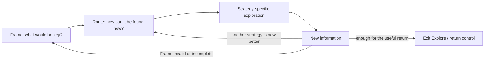

# Lead Proposal — Route After Frame

- **State**: accepted in `D-051`; catalog and outcome evidence remain open
- **Consumer**: `WP × P1 / 11-DS`
- **Accepted input**: Frame provisionally defines what information would be key
- **Question**: whether the next common Explore step is to route the current
  information need to an appropriate exploration strategy
- **Not decided now**: final strategy set, each strategy's SOP, or what content
  belongs to an Explorer sub-agent

## Does Post-Frame Non-linearity Still Hold?

Yes, as a strong design hypothesis. Frame does not imply one method of finding
the information it defines as key:

- an existing exact answer can be retrieved
- an unfamiliar system may need a map or initial focus point
- competing explanations may need discriminating observations
- an incomplete possibility space may need broader discovery
- unavailable evidence may need to be created through a probe or experiment

The software-comprehension, exploratory-search, Data/Frame, and design
co-evolution evidence in [`design/43`](43-explore-frame-method.md) also shows
movement among question scopes, frames, and problem/solution structures rather
than one stable post-Frame pipeline.

This does not imply that Explore has no method. It implies that the common
method after Frame is a **choice among methods**, followed by strategy-specific
work and another decision when information changes the situation.

## Proposed Step 2 — Route

> Given the current Frame, choose the exploration strategy most likely to find
> key information at proportionate total cost.

Route is Explore-specific only to the extent that it ranks information-seeking
moves by their ability to satisfy or revise the Frame. Generic method/tool
selection remains in the universal Working Protocol; repository-tool routing
inside a delegated Explorer remains a Sub-agent specialization.

## Candidate Strategy Distinctions

These are working comparisons, not an accepted catalog or new posture set:

| Information situation | Candidate strategy | Characteristic return |
| --- | --- | --- |
| the answer likely exists and the target is reasonably well specified | **Retrieve** | authoritative fact, artifact, precedent, or location |
| vocabulary, relevant parts, boundaries, or relations are not yet understood | **Map** | a useful structure, focus point, or relation model |
| several frames, causes, or interpretations could explain the observations | **Discriminate** | evidence that separates, weakens, or reframes candidates |
| plausible possibilities or alternatives may be missing | **Discover** | additional candidates, contrasts, or surprising structure |
| the needed information does not yet exist in observable form | **Probe** | newly produced observation from a bounded experiment, simulation, prototype, or runtime interaction |

Names and separations remain provisional. `Retrieve` may be too cheap to count
as non-trivial Explore; `Map` and `Discover` may overlap; `Discriminate` may
become part of Diagnose; and `Probe` crosses actual effect authority according
to its mechanism. The value of this comparison is whether it changes the
method selected after Frame, not whether it fills a complete table.

## Routing Questions

Use the smallest applicable discriminator:

1. Is the answer expected to exist already, with a sufficiently precise target?
2. If not, is the main gap the structure/relations of an unfamiliar domain?
3. Are there competing explanations or frames that need separation?
4. Is the candidate space itself probably incomplete?
5. Must the Agent create an observation because available sources cannot answer?

Several may apply. Select the first strategy that can materially improve the
Frame or useful return at acceptable cost; do not turn the list into a required
ordered funnel.

## Proposed Topology

The diagram states control relations, not mandatory persisted states. A direct
lookup may compress Frame, Route, and strategy into one move.

## Why Route May Earn Step Status

Compared with acting directly after Frame, explicit routing can prevent:

- using text retrieval for a structural or behavioral question
- mapping an entire system when one authoritative fact is sufficient
- gathering more of the same evidence when competing explanations need a
  discriminator
- polishing the current candidate when the real gap is missing alternatives
- searching static sources for evidence that only runtime/prototype behavior
  can produce

It should remain implicit when the appropriate strategy is obvious. It fails
to earn SOP status if ordinary Agent judgment selects the same method reliably
without guidance, or if the candidate distinctions do not change real actions.

## Review Disposition

Sir accepted the next common Explore control point and clarified an ambiguity:
“common Step” must not imply a step shared by every Working Posture.

`D-051` therefore accepts Route within non-trivial Explore, the non-linear
reframe/reroute/exit topology, and use of the five strategies as provisional
contrasts only. Their final names, separations, ownership, SOPs, and real-task
value remain open. [`design/45`](45-explore-sop-closure-and-patterns.md) owns the
next closure question.
