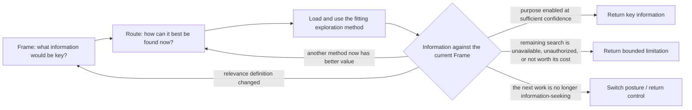

# Lead Proposal — Close the Explore Core SOP, Then Compare Its Patterns

- **State**: accepted in `D-052..D-053`; operational sufficiency and pattern
  comparison remain open
- **Consumer**: `WP × P1 / 12-DS`
- **Accepted input**: Frame defines provisional relevance; Route selects a
  proportionate information-seeking strategy; method results may reframe,
  reroute, or exit
- **Question**: what minimum activation and exit contract completes the Explore
  core SOP, and which structural observations should be carried only as
  hypotheses into later posture design
- **Not decided now**: final strategy catalog or SOPs, durable corpus wording or
  file layout, exact remaining posture set, or universal posture template

## First Clarification — Two Meanings of “Common Step”

The earlier phrase was ambiguous. `Route` is proposed and accepted as common
across **non-trivial Explore episodes**, not across every Working Posture.

Every kind of work involves method choice in a trivial sense. That does not
justify writing `Route` into every posture SOP. Explore has a distinctive
routing question: given a relevance Frame, which way of acquiring information
best changes or secures the needed distinction? Another posture earns its own
named routing point only when an analogous but posture-specific choice changes
behavior enough to repay the concept.

## Is the Explore SOP Complete?

Not quite under `D-047`. The method is now present, but the current design only
implies rather than directly states:

1. when the non-trivial SOP activates
2. what counts as a useful Explore return
3. when to continue, reframe, reroute, switch posture, or stop incomplete

This is one bounded closure contract, not evidence that Explore needs another
linear step.

## Proposed Minimal Closure

### Activation

Use non-trivial Explore when reliable progress depends on resolving a material
information need and neither the answer nor the fitting way to obtain it is
already obvious. The need may be a known question or discovery of missing
vocabulary, structures, alternatives, or observations.

A direct lookup may still be understood through the same semantics, but should
not externalize or ceremonially execute the full SOP.

### Core method

The junction is an exit/feedback rule, not provisionally a third named Explore
Step. Comparing feedback with the current state and replanning is universal;
its Explore-specific meaning is fully stated by the Frame and Route branches.

### Useful return

Return the smallest answer, model, or discriminating observation that enables
the purpose named by the current Frame. Preserve the material uncertainty and
the consequence of that uncertainty; do not return a search log, context dump,
or quantity of sources as a substitute for key information.

The caller still owns the exact return contract and integration destination.
Inquiry owns persistent synthesis/freshness where that state is needed, and
Verification owns claim-relative proof. Explore does not duplicate those
semantic owners.

### Continue, return, switch, or stop

- **Return satisfied** when the answer is reliable enough at the material
  scope to enable the stated purpose, and another observation is unlikely to
  change the needed distinction enough to justify its total cost.
- **Reframe** when information changes the purpose, answer kind, target,
  boundary, resolution, or keyness test.
- **Reroute** when the Frame remains useful but a different information-seeking
  method now has greater expected value.
- **Switch / return control** when the remaining work is principally another
  kind of work rather than information-seeking.
- **Stop bounded-incomplete** when the needed evidence is unavailable,
  unauthorized, or uneconomic to obtain. Return what is supported, the
  material unknown, its consequence, and the best known next discriminator;
  uncertainty never silently becomes success.

“Reliable enough” and “worth its cost” are contextual judgments, not required
numeric thresholds. They combine epistemic adequacy with value of additional
information, including downstream loss, reversibility, delay, Human attention,
and lifecycle consequence.

## Candidate Patterns for Later Posture Comparison

These are observations from one posture, not accepted universal requirements:

1. **A SOP can be a control skeleton plus progressively loaded methods.** It
   need not be either a rigid pipeline or an unstructured list of tips.
2. **A conceptual control point may remain implicit on cheap work.** Common
   semantics do not require persistent state, fields, or announced stages.
3. **Method routing is conditional, not universal.** Name it only when there
   are materially different strategies, the choice is not reliably obvious,
   and explicit discrimination prevents a recurring failure.
4. **Feedback can re-enter an earlier decision without restarting the work.**
   Useful findings survive a reframe or reroute unless their support changed.
5. **Exit is return-relative and economic, not certainty-maximizing.** A SOP
   should expose satisfied and bounded-incomplete returns without pretending
   that all uncertainty can or should be removed.
6. **Steps, return contracts, semantic owners, and universal controls are
   different things.** Frequent co-occurrence is insufficient to move one into
   a posture SOP.

Each later posture should be derived from its own recurring situations first.
Only then should these patterns be used as comparisons: what transfers, what
changes meaning, and what disappears? Confirmation across at least two
distinct posture SOPs is needed before promoting any pattern into common
Working Posture guidance.

## Review Disposition

Sir accepted the closure as a more complete Explore model in `D-052`. Explore
is complete at capability-model depth, not operationally proven: how to judge
information sufficiency, the strategy repertoire/SOPs, and real-task effect
remain open.

Sir also promoted bounded-incomplete return as an important common Working
Posture pattern. `D-053` records the generalization and its authority boundary;
[`design.md`](../design.md) now owns the cross-posture comparison ledger so the
remaining candidate patterns are not hidden inside this Explore dossier.
