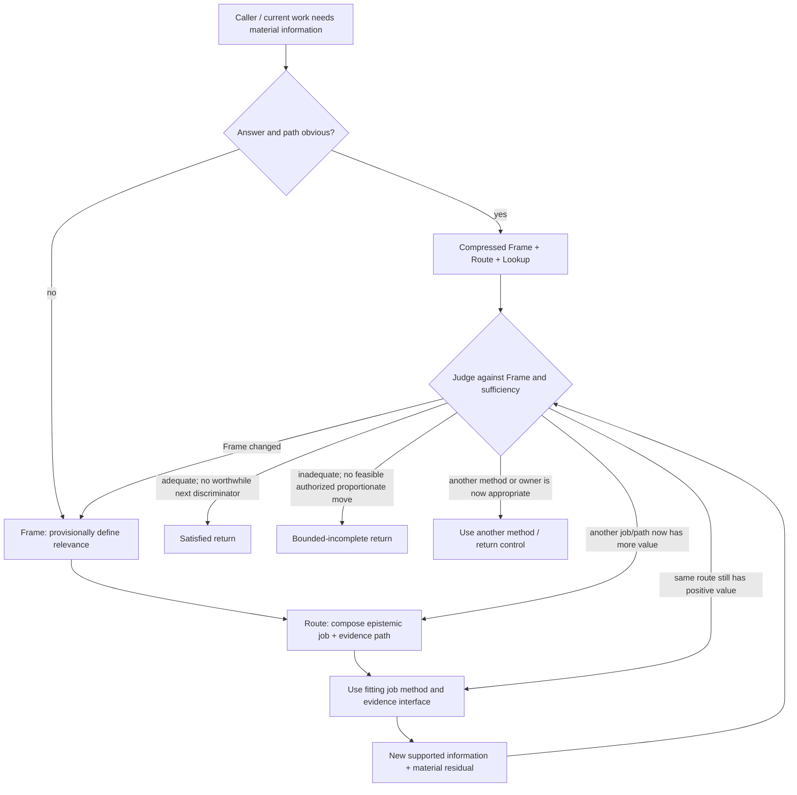
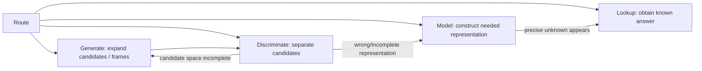

# Current Synthesis — Explore Posture SOP Topology

- **State**: topology confirmed in `D-056`; lifecycle language corrected by
  `D-057`
- **Consumer**: `WP × P1 / 15-DS`
- **Purpose**: provide one current projection of `D-049..D-055` without making
  the earlier derivation dossiers the recovery path
- **Boundary**: capability-model SOP, not durable corpus wording, a required
  artifact/state machine, or proof of real-task effect

## Purpose and Use Condition

> **Explore finds key information.**

Use the non-trivial SOP when reliable progress depends on resolving a material
information need and neither the answer nor the fitting way to obtain it is
already obvious. Compress obvious lookup into one direct move.

The caller/current Plan owns the exact useful return and integration
destination. Explore supplies a local method; it does not own Task sequencing,
effect authority, persistent semantic state, or acceptance.

## Accepted Core Topology



The diagram expresses relations inside a method, not posture runtime states,
mandatory persisted status, or a linear Task pipeline. Explore can be picked up
and put down at any point where it helps. Reframe/reroute preserves
still-supported findings; invalidated support must be marked rather than
silently carried forward.

## Frame

Frame is the provisional definition of what information would be key:

1. **purpose** — what should become possible
2. **sought answer/target** — locate, understand, explain, predict, compare, or
   another plain answer need
3. **material scope/resolution** — only boundaries that can change relevance
4. **keyness test** — what distinction the information must change or secure

For explanation/prediction/intervention, conditionally deepen with `Y/A/E/Z`,
counterfactuals, mechanisms, and invariance when their value repays cost. Frame
remains revisable and is not a Human approval gate.

## Route and Progressive Methods

Route is one control point. When the choice is non-obvious, express the move as:

```text
<epistemic job about target> through <evidence path>,
because <possible result would change or secure the key distinction>.
```

Route selects among non-exhaustive job families, not stages:



- Lookup stays compressed by default.
- Model, Generate, and Discriminate are candidates for progressively loaded,
  case-derived Explore methods.
- Evidence access—inspect/query existing sources, observe, elicit, or produce a
  bounded observation—is described in plain language. Its full method remains
  with the applicable specialist/authority owner.
- `Probe` is an evidence path, not a peer epistemic job.

## Sufficiency and Return

At a consequential/non-obvious continuation or return judgment, distinguish:

1. **return adequacy** — does the supported result enable the Frame's purpose at
   the needed scope/freshness, with material residual consequence within the
   applicable tolerance?
2. **continuation value** — is there a feasible authorized next discriminator
   whose plausible outcomes could improve the return enough to justify total
   acquisition, delay, attention, side-effect, and opportunity cost?

Operationally ask:

1. What material uncertainty remains, and what could it change?
2. What is the best known next observation/move?
3. Which plausible outcomes would change or secure the current return?
4. Is that improvement worth the total cost, and is the move authorized?

| Return adequate? | Worthwhile next discriminator? | Disposition |
| --- | --- | --- |
| yes | no | satisfied return |
| yes | yes | continue in scope/authority, or return with the opportunity exposed |
| no | yes | continue, reroute, or reframe |
| no | no | bounded-incomplete return |

Counterpressure scales with downstream loss, irreversibility, propagation,
observability difficulty, and open-world uncertainty. Cheap reversible action
that itself produces discriminating feedback may justify switching earlier.
Human authority retains material value and risk tolerance.

## Return Contracts

### Satisfied

Return the smallest answer, model, or discriminating observation that enables
the Frame's purpose, plus material residual uncertainty. Search logs, context
volume, source counts, or subjective confidence cannot substitute for the
return.

### Bounded-incomplete

Return the supported partial result, unsatisfied condition/material residual,
its downstream consequence, and best viable continuation condition/action/
decision. It is a valid control return, never success or acceptance, and does
not grant the Agent authority to abandon intent or accept risk.

### Compose another method / return control

When the next useful work is principally design, implementation, verification,
Human decision, or another recurring situation, use the applicable method or
return the information to its caller. Explore does not stretch itself to own
adjacent work merely because that work follows discovery.

Using another method is a composition/control disposition, not a third
epistemic completion state or a posture transition. If another SOP is useful to
produce the next observation, pass it the current information need/authority
boundary and reassess its return against the Frame. If information work is
over, return with satisfied or bounded-incomplete status and let the caller use
whatever method helps next.

## Interfaces, Not Explore Steps

- universal feedback integration, replanning, rules/authority selection, and
  Task Packet write-back
- Inquiry's persistent synthesis and freshness state
- Verification's claim/evidence/independence contract
- Human collaboration and material authority decisions
- effect/mutation gates for observation-producing interventions
- Explorer sub-agent repository/tool selection, filtering, context isolation,
  and return compression

These may occur during Explore but remain outside its owned SOP unless later
evidence establishes a distinctive Explore specialization.

## Still Open

1. case-derived progressive methods for Model, Generate, and Discriminate
2. whether those methods confirm, split, merge, or rename the provisional job
   families
3. real-task terminal effect and total cost, including premature/late stopping
   and routing overhead
4. top-level Working Posture corpus organization and wording

## Confirmation and Correction

Sir confirmed the topology in `D-056`. `D-057` then corrected its use model:
Explore is a stateless method at hand, not a lifecycle that activates, stays
active, switches, or exits. The reasoning relations and return dispositions
remain unchanged under the corrected terminology.
