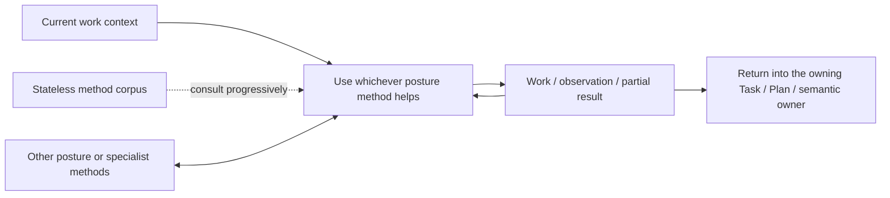

# Current Synthesis — Working Posture as a Tool, Not a Lifecycle

- **State**: accepted design correction in `D-057`
- **Consumer**: `WP × P1 / 16-DS`
- **Source**: Sir's pen-and-paper metaphor plus Lead owner/control analysis
- **Boundary**: refines how posture SOPs are used; does not remove their method,
  return discipline, progressive depth, or distinct value requirement

## Correct Model

> A Working Posture is a reusable method kept at hand. The Agent may pick it up,
> combine it with another method, and put it down whenever useful. It is not a
> runtime mode with entry, active, transition, and exit states.

The graph describes access and composition, not state transitions. A posture
does not become the container of the work; the current Task/Plan and semantic
owners remain the containers.

## What a Posture SOP Still Needs

The `D-047` minimum survives with corrected language:

1. **use condition** — the recurring situation or failure pressure where this
   method is helpful
2. **method** — how to do that kind of work better than generic improvisation
3. **continuation and return judgment** — how to recognize useful progress,
   sufficient or bounded-incomplete return, and when another method is more
   appropriate

These are affordances and correctness semantics. They do not require the Agent
to declare “enter posture,” record an active state, run every item, or emit an
exit event.

## State and Owner Boundary

| Concern | May own state? | Why |
| --- | --- | --- |
| Task / Plan / Slice / Cell | yes | controls work obligations, returns, dependencies, and current front |
| Inquiry / Design / Decision / Verification | yes, when activated by semantic pressure | owns task-local semantic synthesis and validity |
| effect/authority gate | yes, as applicable | records whether an external or durable change may occur and what evidence qualifies it |
| Human collaboration | yes, in its actual contract/decision owners | preserves intent, material decisions, attention, and acceptance |
| Working Posture method | **no runtime state** | reusable knowledge does not need a lifecycle merely because it is being applied |

An application of a method may change Plan or semantic state. That state is
written to the applicable owner, never to a `current-posture` field.

## Mandatory Rules Versus Optional Methods

If an instruction must hold regardless of the current kind of work—authority,
effect safety, evidence honesty, write-back ownership—it belongs to the
universal Working Protocol or its semantic owner, not a posture.

This does not make posture guidance casual. A method can contain local
correctness conditions: for example, Discriminate cannot claim separation when
the observation predicts the same outcome for every candidate. The condition
governs the validity of that method's return, not participation in a lifecycle.

## Progressive Disclosure

Progressive disclosure means:

- simple work uses the obvious method directly
- recurring pressure makes the Agent consult the posture's core guidance
- a non-obvious job loads only the applicable specialist depth
- tool/sub-agent/Verification/effect methods remain separate interfaces

It does **not** mean mode activation followed by required completion or exit.

## Human Collaboration Consequence

`D-064` later tightens this boundary: the Agent may explain “I will first map
the ownership surface” or “I will compare these two causes against the trace”
when the task consequence warrants it, but that is ordinary task language—not
exposure of Model/Discriminate or another Working Method.

Human predictability comes from legible task behavior, evidence, requests, and
decision points. It does not require posture transitions, method identity, or
method-system onboarding.

## Explore Terminology Correction

The accepted Explore reasoning topology remains valid after translating its
lifecycle-sounding labels:

| Former wording | Correct meaning |
| --- | --- |
| activate Explore | use the Explore method because a material information need is present |
| active Explore | Explore guidance is currently useful to one part of the work |
| switch posture | use another applicable method or return control; no exclusive mode changes |
| exit Explore | judge/return the information work; no posture lifecycle ends |

Satisfied and bounded-incomplete remain return dispositions. Frame, Route, and
sufficiency remain method relations. None requires runtime posture state.

## Failure Pressure

- **Ceremony**: Agent announces states and transitions instead of improving the
  result.
- **False exclusivity**: one named posture suppresses another useful method in
  mixed work.
- **Checklist compliance**: Agent executes every SOP item after its value has
  disappeared.
- **Hidden universal rule**: safety/evidence obligations apply only when the
  Agent believes a posture is active.
- **Unselectable tool**: making methods stateless causes them to be forgotten;
  solve first with better use conditions, progressive navigation, or a cheap
  reminder/routing mechanism rather than a lifecycle engine.

## Consequence for Later Design

Derive every later posture from its own useful method, but review it for:

1. no required posture state or transition ceremony
2. composability with other posture/specialist methods
3. local return validity separated from Task/authority state
4. cheap direct use and progressive depth

Exact durable corpus organization and wording remain the top-level Working
Posture proposition.
