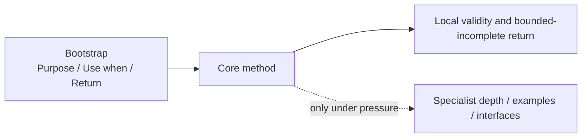
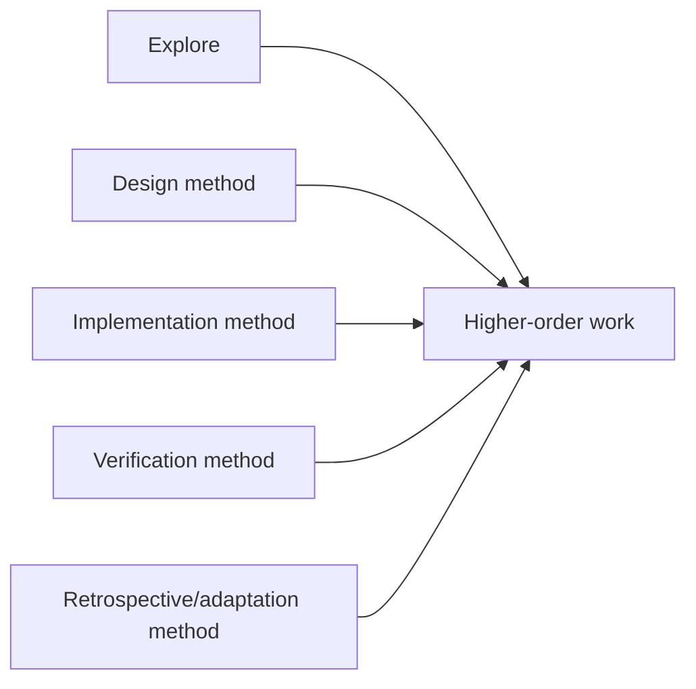

# Lead Proposal — Name the Tool, Its Guidance, and Its Guardrails Simply

- **State**: accepted as the current terminology/bootstrap design in `D-060`;
  durable corpus landing and real-task effect remain pending
- **Consumer**: `WP × P1 / 17-DS`
- **Accepted input**: posture content is a stateless composable method; provide
  a small foundational basis; minimize required SVC-specific common ground
- **Question**: whether `Working Posture` and `SOP` still earn their vocabulary
  cost, and what minimum bootstrap makes a method discoverable
- **Not decided now**: durable corpus file/directory layout, exact method set,
  specialist Model guidance, or enforcement tooling

## Naming Comparison

| Term | What it communicates | Cost / misreading |
| --- | --- | --- |
| **SOP** | a standard repeatable procedure | implies compliance, complete execution, fixed sequence, and organizational seriousness inconsistent with a pen-and-paper tool |
| **Methodology** | an organized system or theory of methods | too broad/heavy for one atomic composable tool; may recreate another framework layer |
| **Guidance** | non-ceremonial advice that can be loaded selectively | describes how content is presented, but not the thing the Agent composes |
| **Method** | a way of doing a recurring kind of work | familiar, stateless, operational, composable, and low in SVC-specific meaning |

The strongest low-concept model is:

> SVC provides a small set of **Working Methods**. Each method has concise,
> progressively disclosed **guidance**.

`Working Posture` can remain an informal metaphor during migration, but no
longer appears necessary as a durable normative object. Once its lifecycle
meaning and separate SOP layer are removed, it does not add enough beyond the
familiar word “method” to repay required common ground.

Recommendation:

1. replace the durable `Working Posture` object with **Working Method**
2. replace “posture SOP” with **method guidance** or simply the method's name
3. do not introduce `methodology` as another object; use it only in ordinary
   prose when referring to a broader body of methods

This is a semantic recommendation, not approval of source renames yet.

## Minimal Bootstrap / Metadata

A tool at hand still needs to be findable. Its smallest discoverability surface
should answer:

```text
Purpose   — what recurring result or improvement this method provides
Use when  — recognizable situation, uncertainty, or failure pressure
Return    — what useful/supported result the caller can expect
```

Then progressively disclose the method itself, local validity conditions,
composition examples, and specialist depth.

Prefer `Use when` over `Trigger` in method guidance. `Trigger` can
remain ordinary implementation language for event-driven or deterministic
mechanisms, but here it risks reintroducing activation semantics.

The three items are semantic bootstrap, not mandatory front matter or a schema.
One sentence can carry all three for a cheap method. Metadata becomes explicit
only when it improves routing, progressive loading, or mechanical discovery.

## Method Guidance Contract



Guidance should distinguish:

- the core relation or moves that make the method effective
- optional tactics and representations
- local conditions required to claim the return
- composition seams with other methods
- external guardrails/owners that remain applicable

It should not prescribe a ceremonial beginning/end, require every tactic, or
copy Task/authority/evidence state.

## Guardrail Versus Law

Use **Guardrail** as the default existing/plain-language term; do not introduce
`Working Law` now.

- `Law` suggests universal, exceptionless, foundational truth and adds a second
  SVC-specific category that must be distinguished from rules, invariants, and
  authority contracts.
- `Guardrail` already communicates a behavior boundary and can carry explicit
  scope: universal, effect-specific, Verification-specific, or method-local.
- A method guide may reference an applicable guardrail but should not duplicate
  its canonical statement.

If later evidence reveals a genuinely tiny set of universal invariants whose
force is obscured by `guardrail`, `Working Law` can be reconsidered. Current
common-ground economics rejects it preemptively.

## Composition and Atomicity

The foundation should behave like a basis, not an exhaustive catalog:



The diagram is illustrative, not an accepted final method set. A method earns
foundational status when it has a distinct useful return and method that
composes across many tasks. A higher-order composition earns its own guidance
only when Agents repeatedly fail to compose it and the named composition
reduces more cost than it adds.

Do not optimize for mathematical atomicity. Too-small primitives force the
Agent/Human to reason about a large assembly language; too-large primitives
recreate lifecycle modes. The target is the smallest **management-useful** and
behavior-changing method basis.

## Human Collaboration Boundary

`D-064` corrects the earlier projection assumption: Working Method is an
Agent-facing corpus object, not a normal Human collaboration semantic. Human
need not learn, identify, or monitor a method even when the Agent must explain
consequential work.

Project task meaning instead:

```text
task purpose / consequential action -> evidence or expected effect
-> material uncertainty, request, authority boundary, or decision
```

Use ordinary task language. “I will compare the two causes against this trace”
may be a useful explanation; calling it `Discriminate` does not improve the
Human surface. Progressive method depth serves Agent selection and execution,
not progressive Human onboarding. Direct method discussion is appropriate only
when SVC/Agent behavior itself is the object being designed, audited, or
debugged, as in this Task.

## Human Disposition

Sir accepted all three recommendations, with particular agreement that
“atomic” must mean management-useful rather than a cognitive micro-action:

1. replace `Working Posture` + `SOP` with **Working Method** + progressively
   disclosed **guidance**, keeping “posture” at most as an informal metaphor
2. use Purpose / Use when / Return as semantic bootstrap rather than mandatory
   schema, and prefer `Use when` over lifecycle-sounding `Trigger`
3. use the existing term **Guardrail** with explicit scope instead of adding
   `Working Law` now

Sir first corrected the collaboration projection toward sparse attention, then
clarified in `D-064` that ordinary Human work essentially does not contact the
Working Method surface at all.
