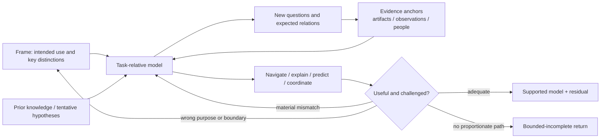

# Lead Proposal — Model as Task-Relative Grounded Compression

- **State**: accepted in `D-061` as embedded Working Method logic; durable
  corpus landing and real-task effect pending
- **Consumer**: `WP × P1 / 18-IQ`
- **Question**: whether `Model` has a distinctive useful return and method that
  earns progressive Explore guidance without becoming open-ended understanding
- **Derivation rule**: start from recurring modeling situations and research;
  compare with the cross-method ledger only after deriving the method
- **Not decided now**: durable SVC layout/wording, a mandatory model artifact,
  diagram notation, Explorer sub-agent guidance, or Verification rules

## Evidence Boundary

The program-comprehension studies are old, small in participant count, and
mostly observational; they support recurring cognition pressures rather than a
universal Agent algorithm. Architecture-reconstruction cases concern particular
tools and systems. Cognitive-fit research demonstrates representation/task
interaction in narrower decision settings. Naur provides a strong explanatory
view of programming knowledge, not a directly testable procedure.

The synthesis below is therefore a design proposition. It should change Agent
behavior in plausible cases before it earns durable SVC complexity.

## Independent Case Derivation

| Recurring situation | Why Lookup is insufficient | Useful Model return |
| --- | --- | --- |
| Change unfamiliar product behavior | Definitions, handlers, state, and consumers can each be found, but no single source states how product intent becomes behavior and effects | the smallest ownership/behavior relation that locates the change surface and material consumers |
| Diagnose an observed mismatch | Logs and code facts do not by themselves explain which conditions produce the mismatch or how competing mechanisms differ | a causal/constraint model that accounts for material observations and predicts a separating case |
| Assess a migration or architecture change | File/call graphs contain too much detail; old architecture docs may be stale or answer the wrong concern | concern-selected current-system views with traceable implementation anchors and explicit mismatches |
| Understand a domain-heavy subsystem | Domain concepts and implementation structures live at different abstraction levels; either alone leaves dangling purpose or realization | cross-level relations from domain purpose through system behavior to implementation realization |
| Explain or extend an inherited design | Texts can state what exists without supplying the judgment needed to justify it or assimilate a new demand | enough theory of problem–solution correspondence to explain choices and reason about the proposed change |

Across the cases, the missing return is not more facts in isolation. It is a
purposeful representation that relates and compresses facts without erasing the
distinctions the consuming work needs.

## Research Findings

| Source | Finding | Consequence for the method |
| --- | --- | --- |
| von Mayrhauser & Vans, 1995 | Program-comprehension models build partial or complete mental representations across abstraction levels; strategies formulate, resolve, revise, or abandon hypotheses; chunking abstracts and cross-referencing connects levels. The authors explicitly warn that whole-code understanding can be wasteful for specialized tasks. | Model must be task-relative and partial. It needs both abstraction and cross-level trace, with hypotheses treated as revisable search/control devices rather than truth. |
| von Mayrhauser & Vans, large-scale debugging study | Professional maintainers of systems of at least 40 KLOC switched frequently among program, situation, and domain representations; the pattern depended on prior code/domain knowledge. Connected cross-model knowledge was among the most frequent information needs. | Do not prescribe one top-down or bottom-up order. The method must support opportunistic movement and bridge purpose/behavior/implementation when the Task needs it. |
| Murphy, Notkin & Sullivan, Reflexion Models | A high-level structural hypothesis becomes a lens over an extracted source model; explicit mapping exposes convergence, divergence, and absence. NetBSD and Excel cases found useful system overviews without reconstructing every detail. | A useful model is not merely coherent: it should preserve anchors to evidence and make mismatch informative rather than force source facts into the preferred picture. |
| van Deursen et al., Symphony | Architecture reconstruction is problem-driven; viewpoints are selected for stakeholder concerns, evidence is extracted/abstracted/presented, and multiple views plus traceability are used only as the problem requires. | Representation follows the consuming question. No universal architecture view set or diagram type belongs in the core Model method. |
| Vessey, Cognitive Fit | Problem-solving performance depends on fit among task, representation, and the processes a representation supports; equal underlying information can behave differently when represented differently. | Choosing entities/relations and medium is part of modeling, not cosmetic presentation after the model is complete. |
| Naur, Programming as Theory Building | Programming knowledge is not reducible to program text or documentation: possessing the theory includes explaining and justifying the system and responding constructively to modifications. | The method's return is usable understanding, not document production. External artifacts are partial supports and should not be mistaken for the whole model. |

Primary sources:

- [Program Comprehension During Software Maintenance and Evolution](https://www.cs.kent.edu/~jmaletic/cs63902/Papers/ProgramComprehension/von_mayrhauser-1995.pdf)
- [Program Understanding Behavior During Debugging of Large Scale Software](https://www.cs.kent.edu/~jmaletic/cs63902/Papers/ProgramComprehension/von_mayrhauser97.pdf)
- [Software Reflexion Models: Bridging the Gap Between Source and High-Level Models](https://www.cs.ubc.ca/~murphy/papers/rm/fse95.html)
- [Reengineering with Reflexion Models: A Case Study](https://www.cs.ubc.ca/~murphy/papers/rm/rm-case-study.pdf)
- [Symphony: View-Driven Software Architecture Reconstruction](https://ir.cwi.nl/pub/4070/04070D.pdf)
- [Cognitive Fit: A Theory-Based Analysis of the Graphs Versus Tables Literature](https://doi.org/10.1111/j.1540-5915.1991.tb00344.x)
- [Programming as Theory Building](https://gwern.net/doc/cs/algorithm/1985-naur.pdf)

## Deduction — What Model Distinctively Does

> **Model constructs and revises the smallest task-relative, evidence-grounded
> compression of a target that preserves the relations and distinctions needed
> to navigate, explain, predict, or coordinate the consuming work.**

This definition excludes four misleading readings:

- `Model` is not a synonym for collecting context; it transforms observations
  into a representation with useful relations.
- “Smallest” does not mean fewest boxes. It means no retained distinction is
  irrelevant and no omitted distinction can materially change the intended use
  within the stated boundary.
- The model need not be a diagram or persistent artifact. It can be a compact
  explanation, state/sequence account, decision table, causal structure, or
  working mental representation.
- It is not final or complete system truth. The same target legitimately has
  different models for different questions, and all remain fallible.

## Semantic Bootstrap

**Purpose** — turn scattered observations into relational understanding that
supports a concrete navigation, explanation, prediction, or coordination need.

**Use when** — the required progress cannot be obtained as one isolated fact
because material structure, behavior, mechanism, boundary, or cross-level
correspondence is not understood well enough.

**Return** — the smallest grounded model adequate for the intended use,
together with material residual uncertainty or mismatch. Externalize only the
portion whose consumer, complexity, persistence, or challenge pressure warrants
an artifact.

The three meanings are a bootstrap, not required front matter.

## Core Method: Four Coupled Obligations

These are relations that reinforce and correct one another, not four mandatory
linear steps.

### 1. Fit the representation to the intended use

Let the consuming question determine which entities, relations, boundary,
resolution, and medium matter. Examples:

| Intended use | Often useful representation |
| --- | --- |
| locate ownership/change impact | boundaries, responsibilities, dependencies, consumers, authority |
| understand behavior over time | sequence, state transition, control/data flow |
| explain or predict a mismatch | mechanism, causal/constraint relations, alternative conditions |
| judge compatibility or policy | contract, invariant, decision table, allowed/forbidden transitions |
| reason about architecture | one or more concern-selected structural/runtime/deployment views |

This is not a representation catalog. Plain prose may fit better than a diagram;
a table may fit symbolic comparison better than a graph. Add another view only
when one representation cannot preserve the material distinctions cheaply.

### 2. Relate evidence and hypotheses across the needed levels

Use available facts as anchors while allowing tentative schemas, domain
knowledge, and hypotheses to direct the next observation. Move opportunistically
between bottom-up evidence and top-down expectation:

The diagram shows pressure and feedback, not a lifecycle. A direct case may
collapse the whole relation into one explanation.

Cross-reference only the levels needed by the consuming work. A code-level
fact without purpose can create a dangling implementation; a domain story
without realization can create a dangling purpose. Neither requires modeling
every intermediate level when the Task does not depend on it.

### 3. Compress while preserving consequential distinctions

Replace low-level detail with higher-level concepts only when the abstraction
still supports the intended use. Preserve or expose:

- relations whose change would alter the consuming judgment
- implementation/evidence anchors for material claims
- mismatches between expected and observed structure or behavior
- uncertain, inferred, stale, or unavailable parts whose status affects use

Do not optimize for completeness, visual elegance, or minimum node count. A
good compression makes a consequential difference cheap to see; a bad one
removes it or manufactures coherence.

### 4. Make the model perform its intended job and challenge it

A model earns its return by use, not by sounding explanatory. Depending on its
purpose, ask it to:

- navigate to the likely owner, change surface, or affected consumer
- account for observed behavior and a material contrasting case
- predict what should change under an intervention, environment, or input
- expose where current and expected structures converge, diverge, or remain
  unmapped
- let another consumer answer the relevant question or identify a disagreement

Then pursue the cheapest material anomaly, counterexample, competing
representation, or boundary case. Challenge should be proportionate to
downstream loss; it is not an obligation to verify every claim. When a claim
needs independent proof, compose with Verification rather than expanding Model
into its owner.

## Sufficiency and Bounded-Incomplete Return

Model adequacy is use-relative. A satisfied return requires enough of four
properties for the current purpose and loss tolerance:

1. **use adequacy** — it actually supports the navigation, explanation,
   prediction, or coordination that motivated it
2. **grounding** — material claims have inspectable anchors, and inference is
   distinguishable from observation
3. **distinction preservation** — no known omitted detail is likely to reverse
   the intended conclusion inside the boundary
4. **counterpressure** — a proportionate mismatch, alternative, or boundary
   challenge has not exposed a material failure

Apply `D-054`'s economic stop rule: do not keep enriching a model when no
feasible authorized next discriminator has material positive net value.

If the intended use remains unsupported but evidence, authority, or worthwhile
continuation is unavailable, return bounded-incomplete under `D-053`: preserve
the useful partial model, the unresolved bridge/mismatch, its consequence, and
the best known continuation. Coherence or the existence of a diagram never
turns this into success.

## When to Externalize

Keep trivial or short-lived models implicit when their whole useful return can
be stated directly. Externalize the smallest useful portion when pressure comes
from one or more of:

- Human review or a consequential decision
- sub-agent delegation, integration, or independent challenge
- task pause/resumption and long-lived uncertainty
- enough entities, relations, or views that working memory becomes unreliable
- a need to trace disagreement/mismatch back to evidence

The applicable semantic module or Task Plan owns any persistent return. Model
does not create a default `model.md`, diagram requirement, or durable-doc
promotion target. Freshness and durable project-truth ownership remain with
their applicable Inquiry/documentation mechanisms.

## Boundaries With Adjacent Methods and Owners

| Adjacent concern | Boundary |
| --- | --- |
| Frame | Frame defines why and what information is relevant; Model constructs the representation that preserves those relevant distinctions. A modeling mismatch may reframe. |
| Lookup | Lookup returns an applicable existing fact/artifact. Model synthesizes relations not available as one authoritative answer. |
| Generate | Model can reveal hypotheses, but Generate owns deliberate search for missing materially different candidates or frames. |
| Discriminate | Model can expose alternatives and predicted differences; Discriminate owns selecting evidence that separates compatible candidates. |
| Design | Model may represent a current, candidate, or counterfactual system; Design owns choosing/creating a form that satisfies goals and taste. Do not let an explanatory model silently choose the solution. |
| Verification | Model's grounding/challenge prevents unsupported understanding; Verification independently qualifies consequential claims against product/technical expectations. |
| Durable documentation | A Model return is volatile task knowledge unless the applicable consolidation owner promotes established project truth. |

## Characteristic Failures

- **Representation-first work**: choosing a diagram/tool/catalog before the
  consuming question and consequential distinctions are known
- **Whole-system appetite**: treating partial understanding as failure and
  expanding until the task is submerged in context
- **Coherence capture**: forcing facts into a familiar or attractive story,
  hiding divergence and absence instead of using them to revise the model
- **Ungrounded boxes**: a compact explanation with no route back to evidence,
  or links whose semantics change across the diagram
- **Wrong-view precision**: accurately modeling a static hierarchy for a
  question that depends on runtime state, causality, ownership, or policy
- **Level trapping**: remaining entirely in code mechanics or domain language
  when the return depends on their correspondence
- **Current/desired conflation**: mixing as-built facts, intended contracts,
  and candidate design into one apparently authoritative view
- **Artifact substitution**: polishing a diagram/document instead of testing
  whether the representation supports the intended judgment
- **Premature promotion**: copying a task-relative, uncertain, or stale model
  into durable truth without its owner's qualification

## Comparison With the Existing Pattern Ledger

This comparison occurred after the derivation above.

| Existing pattern | Model result |
| --- | --- |
| stateless, composable method | supported: modeling is picked up, combined, and put down without method state |
| foundational basis rather than exhaustive catalog | partly supported: Model earns specialist Explore guidance, but current evidence does not make it a separate top-level foundational method |
| control skeleton plus specialist depth | no new evidence: Model has coupled obligations, not another protocol/control skeleton |
| implicit compression on cheap work | supported: a direct relational explanation can be the entire method |
| named routing only for consequential mismatches | supported with a correction: representation choice is method-local; it does not earn a new named `Lens` control point |
| feedback re-entry | supported: mismatches revise model/evidence route and sometimes Frame without discarding valid anchors |
| satisfied return is relative and economic | supported with Model-specific adequacy conditions above |
| bounded-incomplete return | supported with partial model + unresolved bridge/mismatch + consequence |
| Step / return / owner / universal control remain distinct | supported: persistence, freshness, independent proof, authority, and durable promotion remain external owners |

New pattern candidates for comparison with later methods:

- representation must fit the consuming use, not merely contain the facts
- useful compression preserves consequential distinctions and evidence anchors
- a model is qualified by making it perform and challenging that use
- externalize a working return only under consumer/complexity/persistence/
  challenge pressure

These are not yet universal Working Method rules.

## Accepted Proposition

Do not promote `Model` into a separately selected top-level Working Method.
Keep it as embedded modeling logic available to a Working Method when that
method's return depends on constructing a representation. Explore may use
`Model` as an Agent-oriented Route/job handle and progressively disclose this
guidance, but the handle need not become Human common ground or a universal
method step.

Its compact logic is:

> Choose the smallest representation that fits the intended use. Relate
> grounded evidence and tentative hypotheses across only the needed levels;
> compress details without erasing consequential distinctions; then make the
> model navigate, explain, predict, or coordinate a material case and revise it
> on mismatch. Return the supported model and material residual, externalizing
> only what its consumers and task pressure need.

## Human Disposition

Sir accepted the method core and pressure-based externalization, with a
stronger boundary: Model should remain underlying logic of Working Methods,
not another foundational Working Method. This does not make all four coupled
obligations universal ceremony; each Working Method embeds only the modeling
logic needed for its own return. Recorded in `D-061`.
