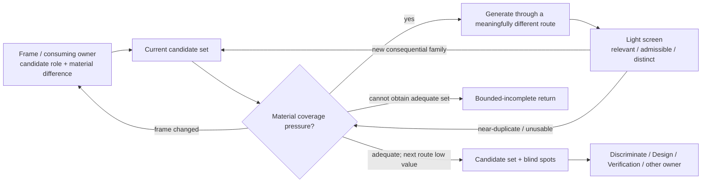

# Lead Proposal — Generate as Consequential Candidate-Space Expansion

- **State**: accepted in `D-062` as embedded candidate-space logic; durable
  corpus landing and real-task effect pending
- **Consumer**: `WP × P1 / 19-IQ`
- **Question**: what distinctive logic prevents missing-candidate failure
  without turning Explore into unbounded brainstorming or taking over Design
- **Derivation rule**: start from recurring candidate-generation situations and
  research; compare with Model and the cross-method ledger only afterward
- **Not decided now**: a new top-level Working Method, a candidate artifact or
  count, brainstorming prompts, sub-agent topology, or Design guidance

## Evidence Boundary

The sources span scientific explanation, small debugging experiments, product
ideation, engineering design, and LLM prompting. They establish recurring
fixation and candidate-pool pressures, not one universal generation recipe.

- Jansson and Smith's classic fixation findings are influential but later work
  shows that example effects depend on familiarity, representation, task, and
  context; examples are not intrinsically harmful.
- Alaboudi and LaToza studied 20 participants and three short web defects. The
  large reported benefit of supplied hypotheses motivates candidate support but
  does not establish how to generate correct hypotheses in large systems.
- Girotra, Terwiesch, and Ulrich studied product ideation/group structures, not
  Agent software work. Their set-level performance model transfers more safely
  than the exact hybrid procedure.
- Current LLM-diversity studies use particular models and narrow product-idea
  tasks. Prompt-specific findings can age quickly and must not become SVC laws.

## Independent Case Derivation

| Recurring situation | Missing-candidate failure | Useful Generate return |
| --- | --- | --- |
| Debug an unfamiliar mismatch | the first plausible cause drives all searches; correct evidence remains invisible because no query predicts it | one or more materially different, testable causal hypotheses that open distinct evidence routes |
| Interpret ambiguous Human/product language | one literal reading silently becomes intent even though another reading would change scope, value, or authority | the smallest set of materially different interpretations needed for alignment or safe continuation |
| Locate unfamiliar behavior | searching only the visible UI term misses domain synonyms, generated code, protocol names, or downstream consumers | alternative vocabulary/ownership routes that reach different plausible regions of the system |
| Explore a design problem | the first implementation idea freezes both the problem boundary and solution family | contrasting problem/solution families that expose different constraints or stakeholder consequences; Design still owns their development and choice |
| Challenge a claim or design | verification repeats expected happy-path examples and misses another failure mechanism | materially different counterexample/scenario families; Verification owns their qualification and acceptance effect |

Across these situations, the return is set-level: the candidate pool must cover
materially different possibilities. Ten paraphrases of one mechanism do not
improve it; one missing candidate that changes the evidence path or decision can.

## Research Findings

| Source | Finding | Generate consequence |
| --- | --- | --- |
| Chamberlin, multiple working hypotheses | A single favored explanation attracts confirming observations; holding several working hypotheses reduces attachment and makes observations discriminating. | Generate competing candidates before evidence collection becomes wholly conditioned on one favorite, especially when downstream loss is material. |
| Jansson & Smith, design fixation | Exposure to an example can constrain conceptual designs and reproduce even undesirable features. | Do not generate all candidates as descendants of the first example. Break lineage through genuinely different assumptions, mechanisms, or sources. |
| Alaboudi & LaToza, debugging hypotheses | Developers produced few hypotheses; early correct hypotheses strongly predicted success, and supplied potential hypotheses outperformed supplied fault locations in their small study. | Missing explanations are a distinct bottleneck: more code locations or context cannot substitute for a candidate that predicts what to inspect. Plausibility and testability matter more than raw count. |
| Girotra, Terwiesch & Ulrich, best-idea quality | Their model separates candidate-pool mean, number, variance, and selection accuracy; a hybrid independent-then-group structure improved results, while building directly on others' ideas was counterproductive in their experiment. | Evaluate generation by the useful option set, not average idea quality or count. Independent routes can reduce shared anchoring before synthesis, but are conditional tactics rather than a required team protocol. |
| Finke/Ward/Smith, Geneplore | Creative cognition iterates between producing incomplete pre-inventive structures and exploring/interpreting them under constraints. | Generation need not output finished or fully evaluated options, and it does not require a rigid generate-then-evaluate pipeline; lightweight generation and interpretation recur. |
| Meincke, Mollick & Terwiesch, GPT-4 idea variance | In one product-idea setting, GPT-4 pools were less diverse than Human pools and different prompting approaches changed dispersion. | Asking an LLM for “more” may repeatedly sample one semantic neighborhood. Vary routes/assumptions/evidence origins when diversity matters; do not hard-code one prompt technique. |
| Deng, Brucks & Toubia, 2026 preprint | Their current experiments attribute LLM idea homogeneity partly to early-output fixation and one aggregated knowledge distribution; structured and partitioned sampling cues improved diversity. | Context isolation or differently grounded routes may be useful for high-value generation, but this emerging result is narrow and belongs later in sub-agent/operational guidance, not the core contract. |

Primary sources:

- [The Method of Multiple Working Hypotheses](https://doi.org/10.1126/science.ns-15.366.92)
- [Design Fixation](https://doi.org/10.1016/0142-694X(91)90003-F)
- [Using Hypotheses as a Debugging Aid](https://arxiv.org/abs/2005.13652)
- [Idea Generation and the Quality of the Best Idea](https://doi.org/10.1287/mnsc.1090.1144)
- [Creative Cognition: Theory, Research, and Applications](https://www.routledge.com/Creative-Cognition-Theory-Research-and-Applications/Finke-Ward-Smith/p/book/9780262560962)
- [Prompting Diverse Ideas: Increasing AI Idea Variance](https://arxiv.org/abs/2402.01727)
- [Examining and Addressing Barriers to Diversity in LLM-Generated Ideas](https://doi.org/10.2139/ssrn.6332039)

## Deduction — What Generate Distinctively Does

> **Generate deliberately expands the current candidate space with materially
> different, plausible-enough possibilities when an omitted candidate could
> change the information route, interpretation, design space, or downstream
> decision.**

“Candidate” is intentionally ordinary language. It can be an explanation,
interpretation, search route, frame, counterexample, or solution family. The
owner of the consuming work defines what candidate validity means.

This is not generic creativity:

- novelty that cannot affect the consuming return has no value here
- candidate count and verbal variety do not establish coverage
- Generate does not select the winner, prove candidates, or develop every
  candidate into a finished solution
- open-world completeness is normally impossible; the return is economic and
  risk-relative coverage, not exhaustive enumeration

## Semantic Bootstrap

**Purpose** — reduce premature closure by adding a candidate whose different
assumptions, mechanism, perspective, or consequences can change subsequent
work.

**Use when** — progress depends on having at least one adequate candidate, but
the current set is absent, too narrow, or descended from one anchor, and a
missing materially different candidate could alter the route or decision.

**Return** — a bounded set of relevant, materially different, plausible-enough
candidates for the consuming owner, plus material blind spots. One new candidate
can satisfy the return when it supplies the missing consequential difference;
many near-duplicates cannot.

These are meanings, not required metadata.

## Core Logic: Four Coupled Pressures

They may recur or collapse; they are not a generate/evaluate lifecycle.

### 1. Define the candidate role and material difference

Start from the consuming question: candidate *what*, used by whom, and what
difference among candidates would change the next evidence path, scope,
trade-off, or decision?

Examples:

- a debugging hypothesis must imply a different observable or code route
- an interpretation must change intent, scope, authority, or acceptance
- an architecture family must change a material quality, dependency, migration,
  or ownership consequence
- a counterexample family must attack a different expectation or mechanism

If no consequential difference can be named, generating alternatives is likely
ceremony. If the candidate role itself is wrong, reframe rather than fill the
wrong list.

### 2. Break shared lineage when fixation is costly

Do not merely ask for mutations of the first candidate. Use an independent
route when the likely loss justifies it. Conditional tactics include:

- invert or remove a governing assumption
- seek a different causal mechanism, system boundary, scale, stakeholder, or
  environment
- use a contrasting precedent or analogy while checking where it stops fitting
- derive bottom-up from evidence not used by the current candidate
- elicit another owner/domain view
- isolate generation context or delegate a differently grounded route

The list is illustrative, not a required diversity taxonomy. “Independent”
means the route can reach a materially different region, not that another Agent
or person must always be involved.

### 3. Apply a light relevance/admissibility screen without premature selection

Candidates need enough grounding to deserve downstream attention. Remove or
merge candidates that are:

- action- and evidence-equivalent to an existing candidate
- incompatible with a known hard constraint unless explicitly exploring that
  constraint
- too vague to imply a different observation, consequence, or form
- novel only in wording, implementation detail, or decorative presentation

Do not fully score, prove, or optimize candidates during generation. Detailed
evaluation can anchor later candidates to today's favorite and consume the
benefit before the pool is adequate. Generation and light interpretation may
still alternate; strict phase separation is unnecessary.

### 4. Judge the candidate set, then return it to its owner

The topology separates candidate-set adequacy from downstream selection. It
does not require persisting a candidate list or announcing a Generate state.

## Sufficiency and Bounded-Incomplete Return

A Generate return is sufficient only relative to its consumer and loss. The
current set should be:

1. **relevant** — candidates can affect the intended return
2. **materially differentiated** — differences change predictions, evidence
   routes, constraints, consequences, or solution principles, not just wording
3. **plausible enough** — each surviving candidate merits downstream attention
   under known evidence and constraints
4. **adequately covering** — high-consequence plausible regions exposed by the
   current Frame have representation, without claiming the open world is closed

Then apply the same economic question as `D-054`: is there a feasible,
authorized, meaningfully different next route whose expected addition can repay
its acquisition, delay, attention, and integration cost? If not, hand the set
to its consumer rather than continuing for quantity.

Risk changes the pressure. A cheap reversible decision may proceed with one
credible candidate and learn from feedback. A high-loss, irreversible, or
poorly observable decision warrants more independent routes and stronger
domain/Human input.

If the set remains inadequate and no proportionate route is available, return
bounded-incomplete: preserve useful candidates, the material uncovered region
or missing expertise/evidence, its consequence, and the best continuation. Do
not turn “we brainstormed” into epistemic success.

## Boundaries With Adjacent Owners

| Adjacent concern | Boundary |
| --- | --- |
| Frame | Frame defines the candidate role and why differences matter. Generate may expose a missing stakeholder, scale, vocabulary, or value that requires reframing. |
| Model | Model relates and compresses a target; Generate expands the possible hypotheses/representations/routes when the current model may be one of several. Modeling logic may help state a candidate without owning candidate diversity. |
| Discriminate | Generate improves the set of known candidates; Discriminate chooses evidence that separates them. Generating more is waste when current candidates already cover the material space but remain unresolved. |
| Design | Design owns creating and choosing solution form under goals, constraints, and taste. It may embed Generate's diversity logic; Explore Generate returns candidate families/information, not a selected or fully developed design. |
| Verification | Verification owns qualifying claims and product/technical expectations. It may embed Generate to seek counterexample/scenario families, but novelty is not proof. |
| Human collaboration | Ambiguous wording warrants alternative interpretations only when they change work or authority. Human values/preferences constrain or decide candidates; the Agent need not ask approval merely to generate them. |
| Sub-agents | Isolated or differently grounded generation is one possible route whose delegation and verification cost belongs to Sub-agent orchestration, not a default Generate requirement. |

## Characteristic Failures

- **Count theater**: producing an arbitrary number of options, synonyms, or
  cosmetic variations and treating volume as coverage
- **Single-ancestor branching**: every candidate inherits the first idea's
  mechanism, boundary, or hidden assumption
- **Premature convergence**: fully evaluating each idea as it appears, so later
  generation optimizes around the current favorite
- **Novelty theater**: maximizing surprise without relevance, feasibility, or
  consequential difference
- **Constraint amnesia**: “diverse” candidates ignore hard product, authority,
  technical, or ROI boundaries
- **Owner capture**: Explore silently designs/selects a solution, or Generate
  silently accepts risk that belongs to Human/Design/Verification
- **Open-world denial**: presenting a bounded candidate set as exhaustive
- **Context monoculture**: repeatedly asking the same LLM context for “more” and
  mistaking stochastic paraphrases for independent routes
- **Technique cargo cult**: requiring personas, analogies, brainstorming,
  sub-agents, or a fixed prompt even when one cheap missing candidate suffices

## Comparison With Model and the Existing Ledger

This comparison occurred after the derivation above.

| Pattern | Generate result |
| --- | --- |
| stateless, composable method/tool | supported as logic that can be picked up inside several Working Methods without state |
| foundational basis rather than exhaustive catalog | does not justify another top-level method; shared candidate-space logic is cheaper than separate Explore/Design/Verification generation objects |
| implicit compression on cheap work | supported: one consciously different candidate may be the entire useful move |
| named routing only for consequential mismatches | supported: Explore's Agent-facing `Generate` handle is useful only when candidate-set inadequacy, not evidence shortage, is causal |
| feedback re-entry | supported: candidates can reframe the role or reveal that Model/Discriminate/Design is now the useful method |
| satisfied return is relative and economic | supported with set-level relevance/difference/plausibility/coverage semantics |
| bounded-incomplete return | supported with candidates + uncovered region/missing capability + consequence |
| owner boundaries remain distinct | strongly supported because candidate generation recurs across Explore, Design, and Verification with different validity/decision owners |

New candidates for later comparison:

- some returns are qualified at the **set** level, not by validating each item
- route independence matters when shared ancestry causes correlated blind spots
- diversity means consequential difference, not count or surface variance
- temporarily lighter evaluation can preserve search breadth without imposing a
  rigid divergent/convergent pipeline

## Accepted Proposition

Do not create a top-level `Generate` Working Method. Treat consequential
candidate-space expansion as embedded logic that a Working Method uses when
missing candidates are causal to its failure. Explore may retain `Generate` as
an Agent-facing Route/job handle distinguishing candidate shortage from missing
evidence; Design and Verification embed their own candidate types and validity
conditions under their respective owners.

Compact logic:

> Define what candidate difference would matter; generate through a route that
> can break the current candidates' shared assumptions; keep only relevant,
> plausible-enough, consequentially different candidates; stop when the set is
> adequate for its consumer and another independent route is not worth its cost.

## Human Disposition

Sir accepted all three propositions: embedded placement plus an optional
Agent-facing Explore handle, set-level adequacy rather than count, and light
generation-time evaluation without taking over downstream selection or
qualification. Recorded in `D-062`.
