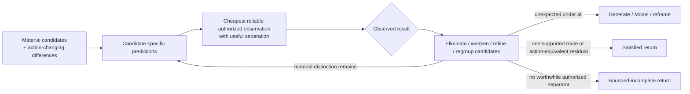

# Lead Proposal — Discriminate Through Consequence-Changing Observations

- **State**: accepted as embedded candidate-separation logic in `D-063`;
  durable corpus landing and real-task effect pending
- **Consumer**: `WP × P1 / 20-IQ`
- **Question**: what logic efficiently separates competing material candidates
  without conflating epistemic resolution with Verification or Human judgment
- **Derivation rule**: start from recurring discrimination situations and
  research; compare with Model, Generate, and the ledger only afterward
- **Not decided now**: durable naming (`Discriminate` versus plain language), a
  test artifact, probe authority, Verification methods, or sub-agent validation

## Evidence Boundary

The sources supply useful but conditional structures:

- Platt's Strong Inference is an influential normative argument, not proof that
  one scientific procedure explains progress. Critics correctly note that
  alternatives are incomplete, experiments rely on auxiliary assumptions, and
  apparently crucial results rarely eliminate every rival.
- Query-by-Committee and Bayesian experimental design operate under explicit
  probabilistic/model assumptions unavailable in much software work. Their
  transferable insight is candidate-relative query value, not a required
  entropy calculation.
- Medical/diagnostic test selection formalizes cost, risk, and information in
  specialized settings. SVC can preserve the decision-relative relation without
  fabricating probabilities.
- Differential and metamorphic testing are powerful when a direct oracle is
  unavailable, but disagreement or violated relations still require diagnosis;
  they do not automatically identify the correct candidate.

## Independent Case Derivation

| Recurring situation | Why more evidence is insufficient | Useful Discriminate return |
| --- | --- | --- |
| Debug several plausible causes | another broad log or code search is compatible with cache staleness, lost invalidation, and wrong tenant state alike | an observation at which the candidates predict materially different state/sequence, reducing them to a useful residual |
| Determine static versus runtime ownership | source dependencies allow several runtime routes; tracing every call creates noise | one bounded trace/request identity observation separating the active path from merely possible paths |
| Resolve requirement interpretations | both readings fit the Human's original words, but imply different scope/authority | a consequence-bearing question or example that lets the Human distinguish intended meanings |
| Compare technical options | benchmark volume grows while options differ only under a particular load/failure condition | a scenario whose possible outcomes change the technical trade-off; taste/value differences remain with Design/Human |
| Test without a trusted direct oracle | one implementation's output cannot establish correctness | comparison across independent implementations or a relation among transformed inputs that exposes inconsistency for later diagnosis |

The common return is not “more confidence.” It is an observation that partitions
the current candidates into different downstream consequences, or establishes
that the candidates still remaining are equivalent for the current action and
loss tolerance.

## Research Findings

| Source | Finding | Discriminate consequence |
| --- | --- | --- |
| Platt, Strong Inference | Frame alternative hypotheses and seek experiments with possible outcomes that exclude different candidates, then iterate. | State candidate-specific predictions before acquiring evidence. Preserve the useful contrast while rejecting the fantasy of a universally decisive experiment. |
| Lindley, information from an experiment | Experiment value depends on how expected results change prior uncertainty, not the amount of collected data alone. | Compare prospective observations by expected candidate separation; use qualitative judgments when probabilities are not grounded. |
| Seung, Opper & Sompolinsky, Query by Committee | In their learning models, choose queries where candidate models disagree rather than random examples; disagreement sustains information gain. | Candidate disagreement is a useful route selector. Do not generalize their asymptotic guarantees beyond their assumptions. |
| Madigan & Almond, diagnostic test selection | Information acquisition is iterative; test choice depends on expected evidential value and cost, with full value of information preferred when decisions/utilities are modeled. | Select observations relative to the consuming decision and total cost, not raw information gain or one-test accuracy. |
| McKeeman, differential testing | Run comparable implementations on generated inputs and investigate divergent results; this can reveal failures without a direct single-system oracle. | Independent predictions/results can make disagreement observable, but comparability, correlated defects, and “which is right” remain separate problems. |
| Metamorphic testing | When individual outputs lack an oracle, known relations across transformed inputs can reveal inconsistency. | A discriminator can be a relation among observations rather than a direct expected value; the relation's validity remains a Verification concern. |
| Causal equivalence research | Different causal models can imply the same observational distributions; interventions may refine, but do not always collapse, the equivalence class. | Observationally indistinguishable candidates are a legitimate residual. Use an intervention only when authorized, safe, and materially valuable. |

Primary sources:

- [Strong Inference](https://doi.org/10.1126/science.146.3642.347)
- [On a Measure of the Information Provided by an Experiment](https://doi.org/10.1214/aoms/1177728069)
- [Query by Committee](https://doi.org/10.1145/130385.130417)
- [On Test Selection Strategies for Belief Networks](https://proceedings.mlr.press/r0/madigan95a.html)
- [Differential Testing for Software](https://www.cs.tufts.edu/comp/150FP/archive/bill-mckeeman/DifferentailTesting.pdf)
- [Metamorphic Testing: A New Approach for Generating Next Test Cases](https://www.cse.ust.hk/~scc/publ/CS98-01-metamorphic.pdf)
- [Characterizing and Learning Equivalence Classes of Causal DAGs under Interventions](https://arxiv.org/abs/1802.06310)

## Deduction — What Discriminate Distinctively Does

> **Discriminate chooses and obtains a proportionate observation whose possible
> outcomes imply materially different consequences under the current
> candidates, then updates until the remaining distinctions no longer affect
> the consuming action or no worthwhile authorized separator remains.**

“Observation” includes inspecting existing evidence, asking a consequence-
bearing Human question, observing runtime behavior, or producing a controlled
probe. It is not synonymous with an automated test or mutation.

“Candidate” can be an explanation, interpretation, route, model, or technical
option. Discriminate operates on the current set; it never proves that Generate
found every material candidate.

## Semantic Bootstrap

**Purpose** — resolve a material choice among candidates by seeking evidence
that they predict differently.

**Use when** — two or more relevant candidates remain compatible with current
information and choosing, acting, or continuing differently depends on which
one holds.

**Return** — a supported separation or decision-useful residual: which current
candidates remain compatible, what observation changed that state, and what
material distinctions still affect action. It may legitimately return several
candidates that are indistinguishable or action-equivalent at the current
boundary.

These are meanings, not a schema or state machine.

## Core Logic: Prediction Before Acquisition

The method has four coupled obligations rather than a mandatory pipeline.

### 1. State the consequential candidate contrast

Make the competing candidates precise enough to answer:

- what would be different if each candidate held?
- which difference changes the next action, risk, scope, or decision?
- which current candidates are already action-equivalent for this purpose?

If no candidates exist or material families may be missing, use Generate. If
the candidates are incoherent descriptions rather than predictive models, use
Model. If the difference is purely stakeholder value or taste, prepare the
Human/Design decision instead of inventing an empirical separator.

### 2. Derive possible observations from differing predictions

For a proposed observation, write or reason through the relevant branches:

```text
if candidate A: observation should materially look like ...
if candidate B: observation should materially look like ...
if both predict the same result: this observation does not discriminate A/B
```

A useful observation need not uniquely identify one winner. It may partition
five candidates into two groups that lead to different next moves. Prefer the
smallest distinction that changes the consumer's action over maximal detail.

### 3. Select a proportionate evidence path

Compare candidate observations using qualitative value of information:

- **separation** — how differently do material candidates predict the outcomes?
- **decision effect** — would those differences change or secure the consuming
  return?
- **reliability** — can the observation distinguish reality rather than tool,
  fixture, environment, timing, or correlated-oracle artifacts?
- **cost/effect** — acquisition, delay, Human attention, side effects,
  opportunity cost, and authority

Prefer existing authoritative evidence when it separates enough. Produce a
probe only when passive evidence cannot resolve a material distinction and the
effect is authorized/proportionate. Raw information gain is not valuable when
it does not change the decision.

### 4. Update candidates and expose equivalence honestly



The observation can reveal that all candidates were wrong, the measurement was
invalid, or a missing variable makes them observationally equivalent. Do not
force every result into elimination, and do not treat one failed prediction as
proof of an alternative unless the relevant auxiliary assumptions hold.

## Sufficiency and Bounded-Incomplete Return

Discriminate is sufficient when:

1. the surviving candidate distinction is small enough for the consuming
   action/risk tolerance—possibly because one route is adequately supported,
   or because all survivors imply the same authorized next action
2. the separating observation is reliable and applicable enough for that use
3. material outcome branches and residual candidates remain explicit
4. no feasible authorized next separator has material positive net value

This does not prove a candidate globally true, close the open world, or qualify
the final product/technical expectation.

Return bounded-incomplete when material candidates remain and observations are
unavailable, unreliable, unauthorized, uneconomic, or observationally
equivalent. Preserve the supported candidate groups, why they cannot currently
be separated, the consequence for downstream action, and the best known future
observation/intervention condition. Never choose the most narratively coherent
candidate merely to avoid an unresolved return.

## Boundaries With Adjacent Owners

| Adjacent concern | Boundary |
| --- | --- |
| Generate | Generate improves coverage of the candidate set; Discriminate acquires evidence that separates the current set. Unexpected evidence may return to Generate. |
| Model | Model makes candidate mechanisms/relations predictive enough to contrast. Discriminate selects the observation; it does not own whole-target understanding. |
| Diagnosis | Diagnosis is an observed-mismatch Inquiry situation that composes Model, Generate, Discriminate, evidence access, and planning. It does not duplicate this logic or become a separate information module. |
| Verification | Discriminate resolves which current candidate better fits evidence. Verification qualifies whether a consequential claim/return satisfies product and technical expectations using an applicable observation/proof surface. Either can use tests; their questions and success semantics differ. |
| Test/probe | A test, trace, experiment, differential run, or Human question is an evidence path. It does not become the Discriminate owner, and an effectful path still crosses the mutation/effect gate. |
| Design and taste | Empirical observations may distinguish performance, compatibility, or behavior. They cannot decide stakeholder value, aesthetic quality, acceptable loss, or a preference among empirically equivalent designs. |
| Acceptance | Candidate separation supplies evidence; applicable Human/system authority decides whether residual risk and the actual return are accepted. |

## Characteristic Failures

- **evidence accumulation**: collecting logs, tests, benchmarks, or sources
  without stating which candidates predict different outcomes
- **confirmation route**: selecting an observation only because the favored
  candidate predicts a positive result, while alternatives predict it too
- **shotgun testing**: maximizing coverage or test count instead of separation
  value and decision effect
- **false crucial experiment**: treating one result as decisive while ignoring
  environment, measurement, fixture, timing, or auxiliary assumptions
- **proxy non-separation**: measuring an easy proxy that all candidates can
  produce, or whose relation to the material outcome is unqualified
- **correlated oracle**: differential implementations share the same bug,
  fixture, generated expectation, or source and appear to confirm one another
- **unauthorized intervention**: mutating production, data, dependencies, or
  Human commitments merely because passive evidence is insufficient
- **winner fabrication**: hiding observational equivalence, open-world residual,
  or an all-candidates-failed result behind subjective confidence
- **value laundering**: using a benchmark or metric to decide a stakeholder
  preference or risk tolerance it never represented
- **Verification capture**: claiming that separating explanations also proves
  the delivered system meets product/technical expectations

## Comparison With Model, Generate, and the Ledger

This comparison occurred after the derivation above.

| Pattern | Discriminate result |
| --- | --- |
| stateless, composable logic | supported: it can be applied locally inside Explore/Diagnosis/Design evidence work without method state |
| foundational basis | does not justify another top-level Working Method; its epistemic logic composes under Explore and other owners |
| implicit compression | supported: one consequence-bearing question or existing observation may complete the useful separation |
| named Route handle | supported inside Explore when several candidates—not missing candidates or missing modeling—are the actual bottleneck; durable wording remains open |
| feedback re-entry | strongly supported: unexpected evidence may require Model, Generate, reframe, or another discriminator |
| satisfied return is relative and economic | supported with action-equivalent residual and separator-value semantics |
| bounded-incomplete return | supported; observational equivalence is a first-class incomplete condition, not failure to be hidden |
| owner boundaries remain distinct | strongly supported: the same test/probe may serve discrimination and Verification but their claims/returns differ |

New candidates for later comparison:

- a useful information move is defined by different candidate predictions, not
  evidence volume
- residual alternatives may be sufficient when they are action-equivalent at
  the current loss boundary
- observational equivalence and intervention authority should be explicit
- evidence-path independence/reliability is distinct from candidate separation
  value, even though both determine the useful return

## Accepted Proposition

Do not create a top-level `Discriminate` Working Method. Embed candidate-
separating observation logic where a Working Method faces material competing
candidates. Explore may retain an Agent-facing Route/job handle; the final
durable corpus can use plainer “distinguish competing candidates” wording if
that lowers vocabulary cost.

Compact logic:

> State what material candidates predict differently; choose the cheapest
> reliable authorized observation whose outcomes change the consuming action;
> update without forcing a winner; stop when the residual is action-equivalent
> or no worthwhile separator remains, and keep unresolved equivalence explicit.

## Human Disposition

Sir accepted all three propositions in `D-063`:

1. Discriminate remains embedded candidate-separation logic plus an optional
   Agent-facing Explore handle, not a foundational Working Method.
2. Its distinctive core is “different predictions → proportionate observation
   → decision-useful residual,” including strictly bounded action-equivalent
   sufficiency.
3. Discriminate and Verification may reuse evidence but do not share success
   semantics: the former resolves current alternatives; the latter qualifies
   consequential expectations or claims.
