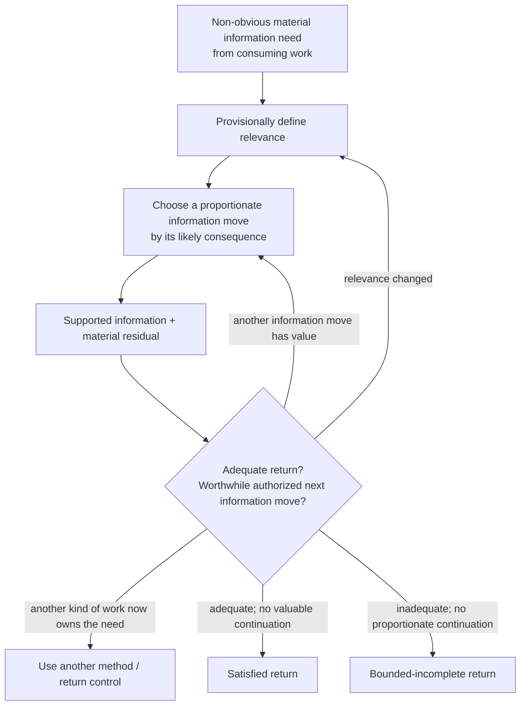
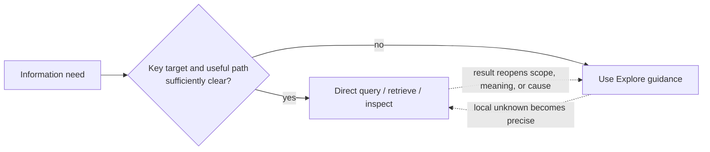

# Accepted Synthesis — Explore Is Foundational, Not a Query Wrapper

- **State**: accepted at capability-model depth in `D-065`; durable corpus
  landing and real-task effect pending
- **Consumer**: `WP × P1 / 21-DS`
- **Question answered**: after Model, Generate, and Discriminate cease to be
  top-level methods, Explore still earns foundational Working Method status;
  its scope begins where material information finding becomes non-obvious
- **Inputs**: `D-049..D-063`, especially the confirmed topology in
  [`design/48`](48-explore-posture-sop-synthesis.md), the stateless/use model in
  [`design/49`](49-working-posture-as-tool-not-lifecycle.md), and the Working
  Method admission test in
  [`design/50`](50-working-method-guidance-bootstrap-and-guardrails.md)
- **Not decided now**: durable `src/` layout or wording, a required artifact,
  method-selection automation, Explorer sub-agent behavior, or real-task effect
- **Verification state**: `V-155..V-160` separate accepted design/input from
  still-pending real-task effect

## Why Reconciliation Is Necessary

The confirmed Explore topology originally described Lookup, Model, Generate,
and Discriminate as Route jobs and left the latter three as candidate
specialist methods. Independent derivation then made each one embedded logic:

- Model improves a return that depends on a useful representation.
- Generate repairs a consequentially incomplete candidate set.
- Discriminate resolves material competing candidates through observations
  they predict differently.

That removes three possible top-level methods but does not automatically remove
Explore. The correct test is not whether Explore contains independently named
submethods. It is whether Explore still has a distinct, stable, composable
return and behavior-changing control logic whose management benefit exceeds
its selection and vocabulary cost.

## Admission Test

| Foundational-method test | Explore result |
| --- | --- |
| distinct useful return | supported key information that enables the consuming work, or an honest bounded-incomplete information return |
| recurring recognizable pressure | progress depends on a material information need whose answer or useful acquisition path is not obvious |
| stable behavior-changing logic | define provisional relevance, choose an evidence move by its likely consequence, then judge return adequacy against continuation value |
| broad composition value | used locally inside design, implementation, verification, diagnosis, planning, and Human decision preparation without owning them |
| management value | prevents irrelevant context accumulation, tool/search lock-in, unbounded inquiry, premature stopping, and hidden uncertainty |
| bounded owner | does not own persistent Inquiry state, Task sequencing, effect authority, Verification, acceptance, or an Explorer sub-agent |
| cheap simple case | an obvious target and authoritative path use direct query/retrieval without consulting or declaring Explore |

Explore therefore earns foundational status. Its distinctive
object is not “doing research” or executing all epistemic jobs. It controls a
material information need from relevance through an economical supported
return.

Its ubiquity reinforces, but does not alone prove, foundational status. The
stronger reason is that non-obvious information needs recur inside almost every
kind of Task and Slice, while the relevance/routing/return logic stays stable
and management-useful across those contexts.

## Minimal Semantic Bootstrap

> **Purpose** — find the key information needed by the consuming work.
>
> **Use when** — reliable progress depends on a material information need and
> the answer or a fitting way to obtain it is not already obvious.
>
> **Return** — the smallest supported information return adequate for the
> consuming purpose, with material residual uncertainty; or a bounded-
> incomplete return explaining what remains, its consequence, and the best
> viable continuation condition.

These are semantics, not required headings, persisted fields, or a posture
lifecycle.

## Smallest Stable Core

Explore needs three coupled judgments, not a universal linear checklist:

1. **Define relevance provisionally.** State what the information must enable,
   the sought answer/target, only material scope or resolution, and the
   distinction that would make an answer key. Keep this Frame revisable.
2. **Choose the next information move for its consequence.** Choose or compose
   the reasoning move and evidence path whose plausible return is most likely
   to change or secure the key distinction at proportionate cost and authority.
3. **Judge the return economically.** Ask whether the supported result is
   adequate for the consuming purpose and whether another feasible authorized
   information move still has material positive net value. Continue, reframe,
   use another method, return satisfied, or return bounded-incomplete
   accordingly.

The graph shows reasoning relations, not active states or a mandatory linear
sequence. Explore can be consulted, put down, recomposed, or resumed at any
point. It owns no paused/active/exit state.

## Query Boundary

`Query` here is an ordinary information operation, not another accepted
foundational Working Method:

A query can be one move inside Explore, and one Explore episode may coordinate
many queries across repositories, runtime observations, documents, or Human
sources. But wrapping a direct lookup in Frame/Route/return ceremony would add
cost without changing behavior.

Prefer “find” or “obtain key information” over “collect” in durable guidance.
Collection is a possible tactic, while the useful return may require filtering,
relating, modeling, generating missing candidates, or discriminating causes;
evidence volume is not the purpose.

## Progressive Specialist Depth

The old Route job catalog should not be required Human vocabulary or a
four-way ceremony. Its useful distinctions survive as Agent-facing failure
diagnostics loaded only when the next move is not obvious:

| Current bottleneck | Embedded logic to consult |
| --- | --- |
| facts exist but their consequential relations are not intelligible enough for the return | construct/challenge the smallest task-fit model |
| plausible routes, explanations, frames, or options may be materially missing | expand the candidate space beyond shared lineage |
| several material candidates fit current evidence but imply different action | seek an observation they predict differently |
| a local answer and authoritative path become clear | query it directly as an ordinary move |

`Model`, `Generate`, and `Discriminate` can remain compact Agent navigation
handles if they improve retrieval of guidance. `Route` likewise names an Agent
choice of information move. None belongs to the ordinary Human collaboration
surface; this is not a thresholded disclosure decision.

When a consequential move needs explanation, translate its task meaning into
plain language—what the Agent will inspect/compare/construct and why its result
matters—without projecting Working Method identity. This Task discusses the
names only because SVC's Agent behavior is itself the design object.

## Boundaries

| Adjacent owner | Explore boundary |
| --- | --- |
| Inquiry module | Inquiry persists task-local information synthesis and freshness when pressure warrants; Explore is a stateless way to obtain or improve information and may return without creating an Inquiry artifact. |
| Design | Explore can reveal constraints, mechanisms, options, and evidence; Design judges and constructs the intended solution under value, taste, and technical concerns. |
| Verification | Explore seeks information sufficient for its caller; Verification qualifies a consequential claim or expectation on the applicable product/technical observation surface. |
| Human collaboration | Sir may supply evidence, intent, value judgments, resources, or decisions through ordinary task semantics. Explore does not project its identity or internal Route vocabulary into that surface. |
| effect authority | Observation-producing mutations remain behind the applicable effect gate; inability to intervene can produce a bounded-incomplete return. |
| Explorer sub-agent | The agent role may execute repository search and compress evidence; it is one possible executor/interface, not the Explore method itself. |

## What Was Removed From the Earlier Synthesis

- `Working Posture` and `SOP` are replaced in the current mutable design by
  **Working Method** and progressively disclosed **guidance**.
- Model, Generate, and Discriminate are no longer candidate top-level methods.
- The job taxonomy and `Route` name are progressive Agent depth, not Human
  collaboration objects or mandatory declared steps.
- “Activation / switch / exit” language has no lifecycle meaning.
- Explore does not require a persistent artifact, exhaustive context, a fixed
  retrieval-tool sequence, or proof that all material information is known.
- Direct query is outside the minimum Explore core, while remaining a common
  tactic inside non-trivial Explore.

The earlier dossier remains the historical confirmation record for `D-056`;
this dossier is the current post-`D-063` reconciliation rather than a rewrite
of that decision history.

## Failure Pressure and Falsifiers

Keep Explore foundational only while its core changes behavior at acceptable
cost. Reconsider if real work shows that:

- “find key information” is too broad to select any distinctive guidance
- defining relevance and judging continuation are already supplied more
  economically by every consuming method, making Explore a redundant wrapper
- the progressive bottleneck distinctions are routinely forgotten or
  misclassified without a stronger navigation mechanism
- explicit Explore guidance adds classification/reporting ceremony to obvious
  lookup more often than it prevents wrong-context or stopping failures
- its return cannot be kept distinct from Inquiry persistence or Verification
  qualification in practice

## Human Disposition and Integration

Sir accepted Explore as foundational in `D-065`: non-obvious information
finding is the beginning of and recurs throughout almost every kind of work;
defect-cause diagnosis, cross-repository reconciliation, and multi-source
research are characteristic examples. Sir also distinguished it from direct
query and reaffirmed that it is a non-ritual tool whose reasoning can be used
or set aside anywhere in the work.

The integration preserves two guardrails from earlier accepted decisions:

- “set aside” creates no method lifecycle event and does not erase the caller's
  information need or Task obligation
- when control is returned while the need remains unsatisfied, preserve the
  supported partial result and material residual through bounded-incomplete
  return semantics; local intermediate state belongs to the applicable Task or
  information owner, never to an Explore runtime state

`D-064` separately settles projection: Model / Generate / Discriminate and
`Route` remain Agent-facing guidance; ordinary Human collaboration receives
only consequential task meaning.
