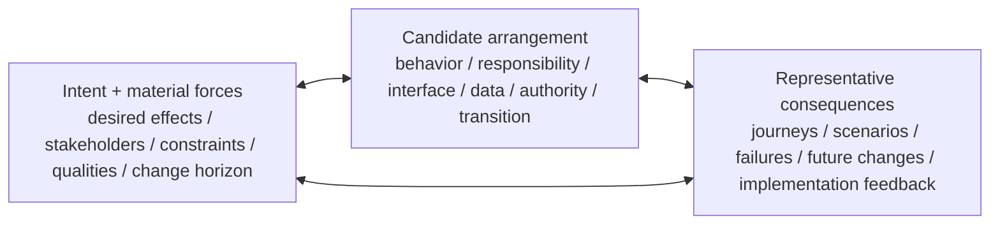

# Lead Proposal — Design Constructs a Coherent Future Arrangement

- **State**: independent case/research derivation complete; Sir finds
  foundational status likely but explicitly pending completed discussion;
  input/output and planning seam continue in [`design/56`](56-design-input-output-and-plan-seam.md)
- **Consumer**: `WP × P1 / 22-IQ`
- **Question**: whether Design has a distinct foundational return and stable
  method, or is only a higher-order composition of Explore, Generate,
  Discriminate, taste, Decision, Implementation, and Verification
- **Derivation rule**: start from recurring design situations and primary
  research, then compare with the accepted Working Method ledger
- **Not decided now**: durable layout/wording, a design document template,
  architecture/UI rules, ECCA or another named methodology, implementation
  authority, or the Tastes & Design Ability Track

## Evidence Boundary

The research establishes useful pressures, not one universal design procedure:

- Rittel and Webber analyze social-policy planning, where goals and value
  disputes can make definitive problem formulation impossible. This warns
  against freezing problem statements, but many software design questions are
  more bounded and testable.
- Dorst and Cross observed nine experienced industrial designers and found
  problem/solution co-evolution associated with creative design. The sample and
  domain do not prove a universal Agent loop.
- Cross argues that design has constructive, solution-focused ways of knowing;
  this is a disciplinary thesis rather than a software algorithm.
- Ralph and Wand supply a conceptual definition around agent, object,
  environment, goals, primitives, requirements, and constraints. The ontology
  helps identify missing relations but would be too heavy as mandatory SVC
  metadata.
- Parnas shows through a concrete software example that different
  decomposition criteria create materially different changeability and
  comprehensibility. Information hiding is a powerful design principle, not a
  complete product/UI/system design method.
- QOC and later architecture-rationale work show value in linking issues,
  options, criteria, decisions, and later evolution. Recording the full design
  space can cost more than it returns and is not a default artifact contract.
- Parallel interface prototyping can improve comparative exploration, but its
  small studies and tool-specific settings do not establish that more
  alternatives or prototypes always improve the final design.

## Independent Case Derivation

| Recurring situation | Why adjacent logic is insufficient | Useful Design return |
| --- | --- | --- |
| Shape a product interaction with loading, error, retry, cancellation, and accessibility behavior | Explore can reveal user/system facts and Generate can propose flows, but neither binds states, actions, feedback, and priorities into one experience | a coherent interaction arrangement whose representative journeys expose intended behavior and trade-offs |
| Add a cross-unit capability spanning API, policy, storage, and notifications | Candidate comparison does not allocate semantic ownership, contracts, failure handling, and propagation obligations | an arrangement of responsibilities and interfaces that produces the product behavior while localizing change and failure |
| Choose a module boundary in a system expected to evolve | A dependency map explains the present but does not decide which volatile knowledge to hide or what interface should remain stable | a boundary/contract shaped around consequential change axes, with known costs and residual coupling |
| Plan a compatibility migration | A target architecture alone omits coexistence, ordering, rollback, observability, and authority across time | a coherent transition design connecting current, intermediate, and target states under operational constraints |
| Tune a handwriting-to-glyph algorithm through real replay | A complete paper design is impossible before seeing produced glyphs; implementation creates observations that reshape the solution | the smallest current arrangement embodied in code/parameters plus learned constraints, revised through implementation feedback |
| Make an obvious local mechanical edit | The intended arrangement and consequences are already clear | no explicit Design guidance or artifact; implement directly under applicable guardrails |

Across the non-trivial cases, the missing return is not information, candidate
coverage, alternative separation, or approval. It is a **constructed coherent
future arrangement**: product behavior and system elements are related in a way
that is intended to produce the desired effects under material forces.

## Deduction — What Design Distinctively Does

> **Design shapes a coherent future arrangement that can produce the intended
> product/system effects under material constraints, qualities, and change
> horizons, then challenges that arrangement through representative
> consequences until downstream work can act on it economically.**

“Arrangement” is resolution-neutral. It may be an interaction, responsibility
boundary, data/authority flow, algorithm, interface, migration, rollout shape,
or an implementation already acting as the cheapest design medium. It is not a
mandatory diagram or pre-code specification.

“Coherent” does not mean globally complete or aesthetically uniform. Material
commitments should not contradict one another, and the arrangement's behavior
should follow intelligibly from those commitments at the consumer's required
scope.

## Semantic Bootstrap

**Purpose** — shape a coherent and worthwhile solution arrangement for an
intended product/system change.

**Use when** — the desired effect is known enough to work with, but how behavior,
responsibilities, interfaces, data, authority, or transition should fit together
is non-obvious or materially consequential.

**Return** — a downstream-usable arrangement with its consequential commitments,
trade-offs, and material residual; or a bounded-incomplete design return that
states which unresolved force or authority prevents a coherent actionable
arrangement.

These are Agent guidance semantics, not required Human vocabulary, a design.md
schema, or a lifecycle phase.

## Smallest Stable Core: Intent/Forces ↔ Arrangement ↔ Consequences

Design has three mutually revising concerns rather than a linear procedure:

1. **Hold intent and material forces.** Preserve the desired effect, applicable
   stakeholder value, hard constraints, quality trade-offs, and consequential
   future-change horizon. Do not freeze an initial requirement when candidate
   arrangements reveal a missing or contradictory need.
2. **Construct an arrangement, not a list.** Bind the material elements into a
   candidate that explains who/what does what, through which relation, and how
   that produces the intended behavior. Use embedded Generate when shared
   assumptions may hide a materially different arrangement.
3. **Make it answer to consequences.** Walk the candidate through the scenarios,
   failure modes, interactions, change axes, or small embodiments most likely
   to expose a wrong commitment. Use Explore/Model/Discriminate,
   Implementation, or Verification interfaces as applicable; revise the intent
   and arrangement instead of defending sunk work.

This is constructive synthesis plus consequential challenge. It is not a
mandatory divergence/convergence pipeline, a fixed order, or a promise to model
the whole system.

## Design Sufficiency and Return

A Design return is sufficient for its current consumer when:

1. the arrangement produces the intended effects across the representative
   product/system scenarios that matter at the current loss boundary
2. material responsibilities, relations, and commitments are mutually
   coherent and precise enough for the downstream action
3. consequential trade-offs, rejected alternatives, and residuals are visible
   to the owner/authority that needs them—without requiring exhaustive rationale
4. the arrangement remains acceptable under the material change/failure horizon
   or explicitly bounds the debt being accepted
5. no feasible authorized next design move is likely to improve the consuming
   return enough to justify its total cost

The return may stay implicit in an obvious implementation, live in code or a
prototype, be summarized in a Cell/Slice return, or externalize into a Design
information module when Human review, delegation, recovery, multi-consumer
coordination, durable promotion, or challenge pressure justifies it.

Return bounded-incomplete when no coherent actionable arrangement can yet be
formed because intent, constraint, evidence, authority, or an unavoidable
trade-off remains material and no proportionate authorized move can resolve it.
Do not launder a preferred sketch into “the design” merely to start coding.

## Why Design Appears Foundational

| Foundational-method test | Design result |
| --- | --- |
| distinct return | a constructed coherent future arrangement, not merely information, candidates, comparison, proof, or approval |
| recurring pressure | desired effect exists but the fitting behavior/structure/transition is non-obvious or consequential |
| stable behavior-changing logic | intent/forces, arrangement, and representative consequences revise one another |
| broad composition | operates at UI/UX, product behavior, algorithm, component, architecture, migration, rollout, and work-system levels |
| management value | prevents solution lists without integration, local elegance that breaks product/system behavior, frozen requirements, and implementation rediscovery |
| cheap simple case | obvious local arrangements remain implicit; no design ceremony or artifact |
| bounded owner | does not own factual exploration, stakeholder authority, claim qualification, implementation effects, or durable project truth |

Design therefore appears to earn foundational Working Method status. It cannot
be reduced to its embedded helpers: Generate expands possible arrangements;
Discriminate separates current alternatives; Explore obtains key information;
Decision/authority selects or accepts material commitments. None alone performs
the constructive integration that makes an arrangement coherent.

## Boundaries With Adjacent Owners

| Adjacent concern | Boundary |
| --- | --- |
| Explore | Explore finds key information; Design commits that information into a proposed future arrangement. Either may recursively expose a need for the other. |
| Model | Model supplies a task-fit representation; Design uses or changes representations to construct the intended arrangement. A descriptive model is not yet a design. |
| Generate | Generate improves candidate-space coverage. Design integrates and develops candidate elements; it need not preserve every generated option. |
| Discriminate | Discriminate obtains evidence that separates candidates. Design decides which distinctions matter to arrangement quality and may revise all candidates after unexpected evidence. |
| Decision / Human authority | Design makes many local construction choices within delegated authority and exposes material trade-offs. A Decision owner records/authorizes consequential commitments; Design does not appropriate stakeholder preference, permission, or acceptance. |
| Tastes & Design Ability | Taste, product judgment, UI/UX principles, architecture/implementation principles, and ECCA-like reasoning improve what counts as a good arrangement. They are capability/guidance inputs, not substitutes for the Design method. |
| Implementation | Implementation materializes a design and often supplies the cheapest feedback that reshapes it. Design is not a pre-implementation phase, and code/prototypes may carry its current return. External effects remain gated. |
| Verification | Design's scenario challenge is method-local qualification. Verification independently qualifies consequential product/technical claims on applicable observation surfaces; a convincing design rationale is not proof. |
| Task Packet / durable docs | A task-local Design module owns the current design result only under pressure. Durable owners receive consolidated truth later; full rationale is not copied by default. |

## Characteristic Failures

- **analysis-only design**: more facts and diagrams without constructing a
  future arrangement
- **option-list design**: several ideas are named but their behaviors,
  responsibilities, interfaces, and consequences are never integrated
- **premature commitment**: one familiar arrangement becomes the problem frame
  before material alternatives or forces are understood
- **frozen brief**: evidence from a candidate or prototype reveals a wrong need,
  but the original requirement is treated as untouchable fact
- **local optimum**: a component is elegant while the product journey,
  cross-owner contract, failure behavior, migration, or change cost worsens
- **diagram coherence**: boxes and arrows appear consistent but cannot explain a
  representative runtime/user/change scenario
- **quality laundering**: a metric, pattern, benchmark, or personal preference
  silently decides stakeholder value or acceptable loss
- **rationale exhaust**: documenting every considered option consumes more than
  it saves and makes the current arrangement harder to see
- **design-before-reality**: paper detail grows past the point where a small
  implementation/prototype would produce more valuable feedback
- **implementation capture**: accidental code structure is retroactively called
  design without checking intent, consequences, or future change
- **Verification capture**: scenario plausibility or internal elegance is
  reported as proof that the delivered system meets expectations

## Research Findings

| Primary source | Transferable finding | SVC consequence |
| --- | --- | --- |
| Rittel & Webber, *Dilemmas in a General Theory of Planning* | Some consequential problems resist definitive formulation and objective optimum because problem understanding, values, and interventions are entangled. | Keep intent revisable and value authority explicit; do not make every software task “wicked.” |
| Simon, *The Structure of Ill-Structured Problems* | Structuredness is relative to solver knowledge and available memory/observations; ill-structured work can still use ordinary problem-solving mechanisms. | Prefer progressive methods/composition over a mystical Design lifecycle or special all-purpose framework. |
| Cross, *Designerly Ways of Knowing* | Design is constructive and solution-focused, dealing with ill-defined problems through artifact representations. | Design needs a constructive arrangement return, not analysis alone. |
| Dorst & Cross, *Creativity in the Design Process* | In their protocol study, problem and solution spaces co-evolved; creative events involved coupled reframing rather than a one-way brief-to-solution path. | Let intent/forces and arrangements revise one another; avoid a fixed requirements-then-design pipeline. |
| Ralph & Wand, *A Proposal for a Formal Definition of the Design Concept* | Design relates an agent, object, environment, goals, primitives, requirements, and constraints. | Preserve the relations needed to judge an arrangement, but do not require a seven-field schema. |
| Hatchuel & Weil, C-K theory | Innovative design can be modeled as joint expansion of concepts and knowledge rather than ordinary selection from known alternatives. | Generate and Explore may expand arrangement/knowledge spaces recursively, but C-K is optional specialist theory, not the foundation itself. |
| Parnas, *On the Criteria to Be Used in Decomposing Systems into Modules* | Decomposition criteria determine flexibility/comprehensibility; hiding changeable design knowledge can outperform decomposition by processing steps. | Judge boundaries by product/system change forces and concealed knowledge, not diagram neatness or current call sequence alone. |
| MacLean et al., QOC | Questions, options, and criteria can represent the design space and rationale around an artifact. | Externalize only consequential issues/options/criteria under consumer/evolution pressure; do not mandate QOC or exhaustive rationale. |
| Hartmann et al., *Design as Exploration* | Parallel authoring/execution made comparison of interface alternatives accessible in a small study. | Prototypes and parallel alternatives are optional tactics when comparison value repays production cost, not required Design stages. |

Primary sources:

- [Rittel & Webber](https://doi.org/10.1007/BF01405730)
- [Simon](https://doi.org/10.1016/0004-3702(73)90011-8)
- [Cross](https://doi.org/10.1016/0142-694X(82)90040-0)
- [Dorst & Cross](https://doi.org/10.1016/S0142-694X(01)00009-6)
- [Ralph & Wand](https://ojs.unbc.ca/index.php/design/article/view/537)
- [Hatchuel & Weil](https://www.designsociety.org/publication/24204/A%2BNEW%2BAPPROACH%2BOF%2BINNOVATIVE%2BDESIGN%2B%3A%2BAN%2BINTRODUCTION%2BTO%2BC-K%2BTHEORY.)
- [Parnas](https://doi.org/10.1145/361598.361623)
- [MacLean et al.](https://doi.org/10.1080/07370024.1991.9667168)
- [Hartmann et al.](https://hci.stanford.edu/research/juxtapose/)

## Comparison With the Working Method Ledger

This comparison occurred after the independent derivation above:

| Ledger pattern | Design result |
| --- | --- |
| stateless/composable | supported; Design can occur locally at any resolution and recurse with other methods without method state |
| management-useful foundation | supported provisionally by a distinct constructive return and broad composition pressure |
| progressive specialist depth | strongly supported; UI/UX, architecture, migration, algorithm, taste, and rationale tactics load by pressure rather than forming one universal checklist |
| implicit compression | strongly supported; code, prototype, or a few explicit commitments may carry a cheap/local design |
| feedback re-entry | supported through intent/arrangement/consequence co-evolution, preserving still-valid constraints and commitments |
| bounded-incomplete return | supported, with unresolved intent/force/authority/trade-off and downstream consequence |
| return-relative/economic sufficiency | supported, but Design needs coherence, representative consequence, change-horizon, and downstream-actionability tests |
| artifact externalization pressure | supported; no default `design.md`, QOC, architecture decision record, or diagram follows merely from using the method |
| owner separation | required; product value, Decision authority, Verification proof, Implementation effects, and durable truth stay distinct |

New candidates for later comparison:

- a foundational method may construct a future arrangement rather than only
  return information or proof
- problem/intent and solution arrangement can co-evolve without making every
  Task a wicked problem
- method-local scenario challenge and independent Verification can use similar
  surfaces while qualifying different returns
- implementation can be a design medium without making accidental code
  structure authoritative design
- externalize rationale by future consumer/evolution pressure, not because a
  choice occurred

## Proposition for Human Review

1. Keep **Design** as a foundational Working Method because it owns the
   constructive integration of intent/forces into a coherent future arrangement;
   its embedded helpers do not supply that return independently.
2. Use **intent/forces ↔ arrangement ↔ representative consequences** as the
   smallest stable core, not a linear discover/define/ideate/prototype/test
   pipeline.
3. Let Design stay implicit or be embodied in code/prototypes when cheap, and
   externalize only the smallest useful arrangement/rationale under real
   review, delegation, recovery, coordination, promotion, or challenge pressure.

## First Human Disposition

Sir did not yet accept proposition 1: Design is likely the second foundational
Working Method, but the status must follow completed discussion rather than the
initial derivation. The definition and minimum core look directionally correct
without yet reaching final essence. Sir accepts implicit/code/prototype
embodiment as different expressions of a Design solution. The initial input →
solution → implementation-planning model now drives [`design/56`](56-design-input-output-and-plan-seam.md).
