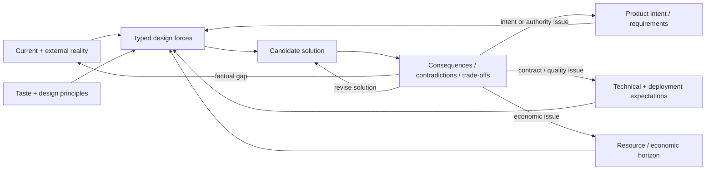
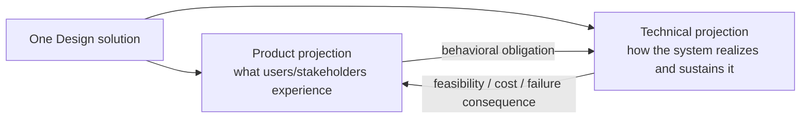
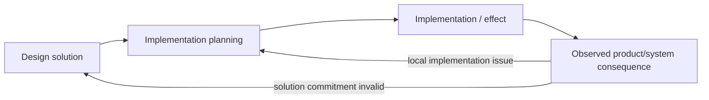

# Lead Proposal — Design Input, Solution Return, and the Planning Seam

- **State**: integrated and accepted in `D-068`; minimum resolution and
  representation pressure continue in [`design/57`](57-design-resolution-and-representation.md)
- **Consumer**: `WP × P1 / 23-DS`
- **Question**: what Design actually consumes and returns, how “方案规划” differs
  from implementation planning, and whether that contract exposes a more exact
  essence than “construct a coherent future arrangement”
- **Inputs**: `V-161..V-166`, Sir's model, and the first derivation in
  [`design/55`](55-design-foundational-method.md)
- **Not decided now**: Design's foundational status, exact corpus wording,
  product/technical artifact layout, implementation-planning guidance, or
  durable source mutation

## Sir's Initial Model

```text
reality (repository + external)
+ product requirements
+ technical requirements (including deployment)
+ resource constraints
        ↓ analysis / decisions / discussion
product design + technical design (solution)
        ↓
implementation planning
```

This is a strong operational starting point. It identifies a real consumer and
keeps Design oriented toward a solution rather than an analysis dossier. Three
parts require refinement before it can become the method contract:

1. the inputs do not share one truth/authority/mutability model
2. analysis, decision, and discussion are not three Design stages or co-equal
   owners
3. “方案规划” risks merging the future-system solution with the work plan used
   to realize it

## Input Forces Are Typed, Not One Requirement Bundle

| Input family | What Design needs from it | Authority / correction behavior |
| --- | --- | --- |
| current repository and system reality | existing behavior, structure, contracts, data, dependencies, failures, technical debt, migration state | factual/evidential and freshness-sensitive; challenge mismatches through Explore and applicable truth owner |
| external reality | user environment, platform/service behavior, law/policy, market/organizational conditions, operational incidents | source/applicability/freshness-sensitive; neither Human assertion nor one source is automatically current truth |
| product intent and requirements | desired user/stakeholder outcomes, behavior, priority, unacceptable loss, acceptance meaning | stakeholder/Human or product-owner authority over value/intent; Design may expose conflict and propose revision, not silently rewrite it |
| technical and deployment expectations | compatibility, security, reliability, performance, observability, operability, runtime/deployment contracts, evolution qualities | applicable technical/deployment owner; distinguish hard contract from rebuttable default or heuristic |
| resource and economic constraints | time, people, skill, budget, infrastructure, operational capacity, opportunity cost, option value | decision-relative and often temporary; distinguish solution/lifecycle constraint from delivery scheduling pressure |
| taste and design principles | product/UI/UX/architecture/implementation quality lens, coherent preferences, known anti-patterns | personal authority or rebuttable expert guidance depending on claim; never disguised as factual requirement |

This typing prevents two symmetrical failures:

- treating every stated requirement or current implementation as immutable truth
- treating all constraints as suggestions the Agent may optimize away

Resource constraints need an additional seam. “The team cannot operate Kafka
for the product's lifetime” can shape the solution. “Only one engineer is free
this week” normally shapes implementation planning; baking it into the durable
architecture without lifecycle justification creates accidental design debt.

## Design Does Not Receive a Frozen Brief

Inputs constrain Design, but the candidate solution can expose:

- a product requirement that conflicts with another stakeholder outcome
- a technical expectation whose cost exceeds its benefit
- repository reality that makes the stated scope wrong
- a resource assumption that is only a temporary scheduling condition
- an unexpressed failure, transition, or future-change requirement



The feedback arrow proposes a correction or decision at the applicable owner;
it does not authorize Design to mutate product intent, technical truth, or
resource commitments silently.

## Analysis, Decision, and Discussion Have Different Roles

**Analysis** is an ordinary description of reasoning, not a distinctive Design
step. Design composes Explore, Model, Generate, Discriminate, scenario reasoning,
and specialist taste as needed. Naming an “analysis stage” does not say how a
solution becomes coherent.

**Decision** appears at two resolutions:

- construction choices within already delegated scope are inseparable from
  shaping a candidate solution
- material commitments involving stakeholder value, authority, risk, durable
  contract, or disputed trade-off return to the applicable Decision/Human owner

Design can return a proposed commitment without pretending it is authorized.
The task-local Decision module records consequential dispositions; it need not
record every local construction choice.

**Discussion** is a collaboration/evidence interface, not an inherent Design
operation. An Agent can perform Design autonomously until it needs information,
authority, taste review, a material decision, or acceptance from Sir. Ordinary
Human interaction discusses the solution and consequences, not the Working
Method identity.

## What “Solution” Must Mean

The output should remain the familiar word **solution/方案**, but its semantic
contract needs more than “an idea” or “a document”:

> A Design solution is a coherent set of proposed commitments about future
> product behavior and technical realization, shaped by current reality,
> requirements, constraints, resource horizons, and material consequences.

The commitments may cover, only as applicable:

- user-visible behavior, interaction, state, and failure/recovery experience
- semantic responsibilities and ownership
- interfaces, contracts, data, authority, and dependency direction
- runtime/deployment behavior, compatibility, migration, rollback, and
  observability
- quality and change-horizon trade-offs
- deliberately preserved freedom for later local design
- unresolved material alternatives, assumptions, debt, or required decisions

Product Design and Technical Design are best understood initially as coupled
views of one solution, not a mandatory two-stage pipeline or always two files:



They separate into artifacts only when different consumers, owners, scales, or
review/freshness pressures make the split useful. Neither projection should be
designed independently enough to make the other infeasible or semantically
false.

## Design Versus Implementation Planning

“方案规划” is useful colloquially because Design gives shape to future action,
but `Plan` already has a precise Task Packet meaning. The seam should be:

| Concern | Design owns | Implementation planning owns |
| --- | --- | --- |
| primary question | what future product/system arrangement should exist, and why can it realize the intended effects? | how will current reality be transformed into that arrangement through controllable work? |
| commitments | behavior, responsibilities, interfaces, data/authority flow, qualities, transition semantics | Slice/Step sequence, dependencies, assignments, checkpoints, integration, effect order, TBC horizon |
| return | coherent solution plus trade-offs/residuals sufficient for downstream action | executable partial linear Plan or scoped Plans with useful implementation returns |
| feedback | consequences may revise intent and solution | implementation return may satisfy, falsify, or reopen Design |

Boundary examples:

- “old and new API versions coexist with dual-read semantics and this rollback
  behavior” is transition **Design**.
- “first deploy the compatible reader, then migrate writers, then remove the
  old path after evidence X” is implementation **Plan**.
- “prototype these two interactions to learn which state model works” contains
  a Design probe need; the concrete work Slice/Steps belong to the Plan.

Implementation planning is therefore the primary consumer of a non-trivial
Design return, but not the only consumer. Material solution commitments may also
be consumed by Human/Decision review, Verification design, sub-agent assignment,
durable product/technical documentation, migration/operation, or later system
evolution.

The relation is not one-way:



## A Closer Essence Candidate

Four definitions expose different parts:

| Candidate | Strength | Failure |
| --- | --- | --- |
| solution planning / 方案规划 | intuitive; points toward a useful downstream result | conflates future-system commitments with work sequencing |
| construct a coherent future arrangement | preserves synthesis and cross-element relation | describes the output's shape more than Design's fundamental operation |
| satisfy requirements under constraints | precise for closed engineering optimization | freezes requirements, hides value conflict and co-evolution, suggests one objective optimum |
| shape possible futures into proposed commitments | captures construction, choice, option reduction, revisability, and downstream consequence | “commitment” can be misread as already authorized; needs the word proposed and an authority boundary |

The current best synthesis is:

> **Design shapes possible futures into a coherent solution: proposed product
> and technical commitments that can realize intended effects within current
> reality, constraints, and resource horizons.**

This moves closer to essence than “arrangement” because the fundamental action
is selectively reducing and organizing possible futures into commitments that
downstream work can realize and evaluate. It remains provisional: real cases
may show that “commitment shaping” overemphasizes choice and underrepresents
invention, embodiment, or aesthetic judgment.

## Accepted Disposition and Remaining Boundary

Sir accepted the complete proposition in this dossier:

- Design is plausibly the second foundation, but foundational status waits for
  completed discussion
- the first definition and intent/forces ↔ arrangement ↔ consequences core look
  directionally correct but do not yet claim final essence
- solution is the return and implementation planning is its likely primary
  downstream consumer
- Design may remain implicit or be expressed through code/prototypes because
  those are representation/embodiment forms
- the typed input families and their owner/correction behavior
- Product Design and Technical Design as coupled projections of one solution
- the Design/implementation-Plan seam across migration, prototypes, and
  iterative feedback
- commitment-shaping as the current closer essence

This acceptance establishes the task-local model, not final corpus wording or
real-task effect. It also does not yet settle Design's foundational status.
The remaining boundary—what information is minimally sufficient for the current
implementation horizon without over-designing local choices—is now owned by
[`design/57`](57-design-resolution-and-representation.md).
