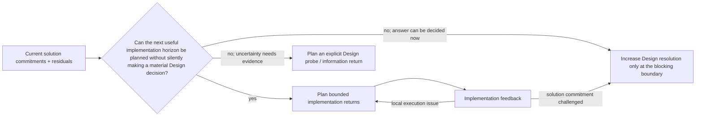

# Lead Proposal — Design Resolution and Representation at the Implementation Boundary

- **State**: integrated with Sir's lifecycle/representation corrections;
  accepted in `D-069`
- **Consumer**: `WP × P1 / 24-DS`
- **Question**: how much Design is enough for implementation planning without
  either hiding material solution decisions inside implementation or demanding
  a complete upfront specification
- **Inputs**: `D-026`, `D-039..D-041`, `D-053`, `D-066`, `D-068`,
  `V-161..V-170`, and [`design/55..56`](56-design-input-output-and-plan-seam.md)
- **Not decided now**: Design's foundational status, a mandatory Design file or
  schema, exact Task Packet/corpus layout, Verification qualification, or
  durable source mutation

## The Boundary Is Horizon-Relative

“Enough Design” cannot mean that every future implementation choice is already
made. That would erase the distinction accepted in `D-068`, create speculative
work, and make early uncertainty look like false precision. It also cannot mean
“the Agent feels ready to code”: implementation can silently settle product,
contract, authority, migration, or lifecycle questions that no applicable
owner ever reviewed.

The useful consumer is the **current bounded implementation horizon**—the next
set of implementation returns that can be planned with meaningful control, not
the unknowable remainder of the Task.

> A Design return is sufficient for the current implementation horizon when
> that horizon can be planned without silently deciding a material product or
> system commitment, and remaining solution uncertainty is explicit enough to
> be contained, deferred, or returned without unacceptable loss.

This is not a new readiness gate, handoff, pause/exit condition, or required
status. It is the consumer-relative adequacy test for one Design return. Design
may be used before, inside, after, or concurrently with planning and
implementation whenever solution obligations need it; `D-066` remains intact.

Design and Plan therefore advance at different but coupled resolutions. A
partial solution can be coherent for one horizon while later behavior remains
open. A partial Plan can stop at TBC rather than demanding speculative Design.

## Which Choices Are Material Design Commitments?

The distinction is consequence-based, not “high level versus low level,” file
location, or whether code is involved. A choice normally needs Design treatment
before dependent implementation when one or more of these are true:

- it changes intended product behavior, user-visible state, failure, recovery,
  or stakeholder value
- it assigns or changes semantic responsibility, source of truth, interface,
  contract, data meaning, authority, security, or privacy boundary
- it determines compatibility, migration, rollout, rollback, observability,
  operability, or a material future-change property
- multiple implementation Slices, units, repositories, agents, or owners must
  make mutually consistent assumptions about it
- choosing accidentally would be expensive to reverse, difficult to observe,
  or capable of causing material loss before correction

A choice can normally remain implementation freedom when its alternatives are
equivalent with respect to current product/system commitments, local to one
bounded return, cheap to change, observable through applicable checks, and
unable to impose hidden obligations on another consumer.

This does not create two permanent classes of decisions. A local choice can
become material after new scale, reuse, ownership, or failure evidence; a once-
material alternative can become implementation-equivalent after Design fixes
the relevant boundary.

### Concrete Contrasts

| Situation | Design resolution needed before dependent work | Freedom that should usually remain local |
| --- | --- | --- |
| subscription interaction | visible states, retry/duplicate behavior, entitlement meaning, failure/recovery experience | component-local naming, spacing token already governed by the design system, helper structure |
| cross-service event change | event meaning and owner, compatibility horizon, ordering/idempotency assumptions, rollout/rollback semantics | mechanically generated adapters, local parsing helper organization |
| data migration | target data meaning, coexistence/source-of-truth rule, loss tolerance, rollback boundary | batching implementation that satisfies those constraints |
| architecture refactor | intended responsibility/dependency direction and preserved external behavior | exact extraction sequence and internal representation where reversible |
| interaction prototype | question the prototype must resolve and consequential alternatives it embodies | throwaway implementation details that cannot leak into the production contract |

The same piece of code can therefore be a Design commitment, an implementation
choice, or an evidence-producing prototype depending on the consequence and
consumer—not its syntax.

## Deferral Must Preserve Freedom, Not Hide Debt

Unresolved Design is legitimate when implementation can avoid locking it in.
The return should preserve only what downstream control actually needs:

1. the currently proposed product/technical commitments
2. the intended effects and material constraints those commitments serve
3. assumptions or unresolved alternatives that can change the current horizon
4. the containment boundary: what may proceed without deciding them
5. any consequential decision or evidence need that must return before the
   boundary is crossed

These are semantic obligations, not five mandatory fields or a checklist.
Cheap work can compress them into the task conversation, a small code change,
or the Plan context. Large or contested work may need a Design module,
prototype, diagram, contract, or durable semantic owner.

The key anti-pattern is **accidental commitment by implementation**: an open
solution question disappears from view because the first implementation makes
one alternative costly to undo. The opposite anti-pattern is **speculative
closure**: Design chooses details that no current consumer needs, reducing
option value while adding review and maintenance cost.

## Representation Belongs to Collaboration and Memory

Sir's correction changes the owner of this question. Design does not inherently
need a document, and code/prototype is not a preferred endpoint. A persistent
representation becomes useful because meaning must cross a Human/Agent,
context, review, handoff, or time boundary without costly or lossy
reconstruction. That is a collaboration and memory pressure which happens to
consume a Design return.

Choose the carrier by the information's structure and the consumer's cognitive
task:

- prose for a compact invariant or nuanced rationale
- a table for repeated-field comparison or exact mappings
- topology or Mermaid sequence for dependency, branching, authority, timing,
  and feedback relations
- pseudocode for precise behavior or transformation without committing to
  implementation details
- prototype for making an interaction or consequence observable
- executable code when the implementation itself is the cheapest truthful,
  reviewable embodiment

Sir's “code/prototype can carry Design” point was principally about this
representation fitness, especially pseudocode—not about privileging production
code. A payment process that needs a deeply nested hundred-line list may be
communicated more accurately and cheaply by a fifty-line sequence diagram.

The corrected representation principle is:

> When a Design return must survive a collaboration or memory boundary, use the
> cheapest truthful carrier that preserves its material relations, scope, and
> residuals for the actual consumers.

Pressure rises with more Humans/Agents/owners, more dependent Slices or units,
longer context/time separation, material authority review, higher reversal or
loss cost, and rationale that cannot be reconstructed from the resulting
behavior. These pressures justify durable/reviewable information, not a
mandatory Design document or artifact taxonomy. Exact owner and location remain
a later landing question.

## Relation to Bounded-Incomplete Return

A Design return can be useful and still incomplete. The common `D-053` rule
becomes concrete here:

- **supported partial**: commitments currently coherent enough to rely on
- **material residual**: open solution question or assumption
- **consequence**: which implementation horizon or effect it blocks or risks
- **viable continuation**: decision, Explore, prototype, implementation probe,
  or later Design work that could resolve it

It is a satisfied Design return only relative to the stated consumer/horizon.
Neither a polished document nor executable code proves that the solution is
adequate; later Verification owns evidence that product and technical
expectations actually hold.

## Accepted Disposition

1. **Planning sufficiency is horizon-relative.** Design is enough when the next
   useful implementation horizon can be planned without silently taking a
   material Design decision.
2. **Materiality follows consequences.** Cross-product/system commitments,
   multi-consumer coupling, and expensive or hidden irreversibility require
   Design resolution; cheap bounded reversible choices remain implementation
   freedom.
3. **Design and Plan co-evolve.** Residual Design may be explicitly contained or
   planned as a probe; neither a complete upfront solution nor accidental
   implementation closure is required.
4. **Representation follows collaboration and memory pressure.** Design itself
   does not require a document. When its return must cross actor, context, or
   time boundaries, select a truthful efficient carrier—often pseudocode,
   table, diagram, prototype, code, or prose—by information shape and consumer.

Sir accepted the first three propositions and corrected the fourth as above.
He also identified the apparent planning handoff as a lifecycle risk; the
consumer-relative interpretation now makes explicit that there is no Design
pause/exit state. `D-069` records the integrated result. Foundational admission
is reviewed next in [`design/58`](58-design-foundational-admission.md).
