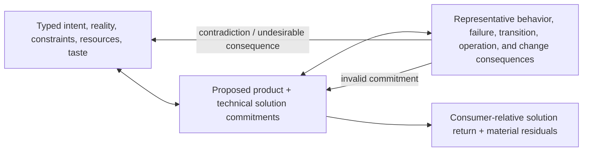

# Lead Proposal — Design Foundational-Method Admission

- **State**: accepted in `D-070`; progressive Design guidance and taste seam
  continue in [`design/59`](59-design-guidance-and-taste-seam.md)
- **Consumer**: `WP × P1 / 25-DS`
- **Question**: whether Design now has enough distinctive management value to
  become the second foundational Working Method, or should remain an unnamed
  composition of other guidance
- **Inputs**: `D-053`, `D-058..D-066`, `D-068..D-069`, `V-161..V-176`, and
  [`design/55..57`](57-design-resolution-and-representation.md)
- **Not decided now**: exact corpus wording/location, specialist UI/UX or
  architecture taste, a Design document/template, Verification semantics,
  implementation guidance, or durable source mutation

## Admission Standard

`D-058` does not require a foundational method to be cognitively indivisible.
It requires the smallest **stable, management-useful** behavior that changes how
recurring work is conducted and can compose without creating another lifecycle.
The relevant test is therefore:

1. Is there a recurring pressure which ordinary direct action handles poorly?
2. Does the method have a distinctive useful return?
3. Is there stable behavior that improves that return across domains?
4. Are its owner, authority, success, residual, and composition boundaries
   distinguishable?
5. Can trivial use compress away while non-trivial use repays its concept and
   guidance cost?
6. Does naming it outperform the strongest smaller composition?

## Design Passes the First Five Tests

| Test | Design result | Remaining risk |
| --- | --- | --- |
| recurring pressure | desired future product/system behavior and realization are materially underdetermined, coupled, or conflicting | “underdetermined” could be used to over-design every implementation choice |
| distinctive return | one coherent solution: proposed product and technical commitments at the resolution useful to the current consumer | `solution` may remain broad enough to hide weak reasoning |
| stable behavior | relate typed intent/forces, candidate commitments, and representative consequences; revise any side as contradictions or feedback appear | the relation may be too abstract without progressive specialist guidance |
| boundary | proposal is not Human authority; information belongs to Explore, proof to Verification, work sequence to Plan, realization to Implementation | real work is recursive and can blur each seam |
| cost control | familiar term, Agent-facing guidance, no lifecycle, no mandatory artifact, cheap/local/reversible choices remain implementation freedom | Agents may still ritualize Design or externalize too much |

The stable core is a relation, not a linear SOP:



An Agent may use Explore, Model, Generate, Discriminate, scenario analysis,
pseudocode, diagrams, prototypes, specialist taste, or implementation feedback
at any point. Those are supporting logic and carriers; they are not mandatory
Design stages. The method can be set aside and reused without state, while the
Task's unsatisfied solution obligations remain with their actual owners.

## The Strongest Alternative: Leave Design as Composition

The alternative is not “do no design.” It is to let an Agent compose:

```text
Explore reality and requirements
→ Generate alternatives
→ Discriminate consequences
→ ask for material Decisions
→ Plan and implement
→ use feedback
```

This alternative initially looks smaller because every component already
exists or will exist. It fails one owner/return test:

- Explore returns key information, not a future solution.
- Generate expands a candidate set, not a coherent selected arrangement.
- Discriminate separates candidates relative to a purpose, but need not combine
  product and technical obligations into one feasible whole.
- Decision authorizes a consequential choice; it does not construct or maintain
  the solution in which many choices must cohere.
- Plan sequences controlled work, and Implementation realizes it; allowing
  either to own the missing synthesis creates accidental design by ordering or
  by first code.

Even if all components execute correctly, something must own the evolving
relationship among intent, constraints, commitments, and consequences. Leaving
that relation unnamed does not remove it; it makes each Task reconstruct its
purpose, adequacy, and residual boundary ad hoc. `Design` is the familiar,
semantically compressed name for that owner and return.

## Why Design Is Foundational Rather Than a Higher-Order Workflow

Design can contain many methods, but its management unit is smaller than a
product-development workflow:

- it has no discover/define/ideate/prototype/test pipeline
- it has no required artifact or document
- it has no handoff, activation, phase, or exit state
- it does not require multiple alternatives when one construction is obvious
- it can operate on one UI state, one interface, a migration, an architecture,
  or an entire product at the resolution currently useful
- it returns one kind of value—coherent solution commitments and material
  residuals—regardless of which reasoning tactics or carriers were used

This meets the accepted meaning of atomic/foundational: not a cognitive atom,
but a stable management-useful primitive that can be composed recursively.

## Progressive Guidance Boundary

The universal Design entry can stay small:

- **Purpose**: shape possible futures into a coherent solution.
- **Use when**: intended product/system behavior or realization is materially
  underdetermined, conflicting, or likely to become incoherent through local
  choices.
- **Core guidance**: relate typed forces, proposed commitments, and
  representative consequences; revise them until the current consumer can act
  without silently taking a material solution decision.
- **Return**: a coherent solution at the currently useful resolution, with
  material assumptions, alternatives, consequences, and residuals preserved as
  needed.
- **Guardrails**: a proposed solution does not grant authority or prove its
  effects; preserve cheap local freedom; no document or lifecycle is implied.

Progressive specialist depth may later cover product interaction, UI/UX,
architecture, data/authority, deployment/transition, or implementation taste.
Those belong partly to the later Tastes & Design Ability cluster. Their absence
does not invalidate the foundational owner; adding them prematurely would turn
the foundation into a design handbook.

## Marginal Cost and Falsifier

**Added cost**: one familiar Agent-facing method name, a compact semantic
bootstrap, and progressive guidance. Human need not learn or track the method
in ordinary collaboration; no persistent method state or Design artifact is
created by default.

**Expected avoided loss**: solution coherence being invented independently by
Slices/Agents; product and technical views diverging; temporary delivery
pressure becoming durable architecture; implementation or Plan silently taking
material authority; rationale and residuals becoming irrecoverable where they
matter.

**Falsifier**: representative tasks show that naming/using Design does not
improve solution coherence, terminal product/system quality, Human alignment,
or future change cost relative to ordinary planning and implementation, while
it measurably adds ceremony, documents, premature decisions, or context load.

## Human Disposition

Sir accepted **Design as the second foundational Working Method** at capability-
model depth and confirmed the topology as primitive. He retained a material
concern: the highest practical value may lie in teaching the Agent substantive
design-thinking patterns—stakeholder/ROI, first principles, structural
representations, complexity/module reasoning, change-force analysis, and taste.
[`design/59`](59-design-guidance-and-taste-seam.md) now owns whether that content
belongs inside Design, outside it, or across a progressive seam.
