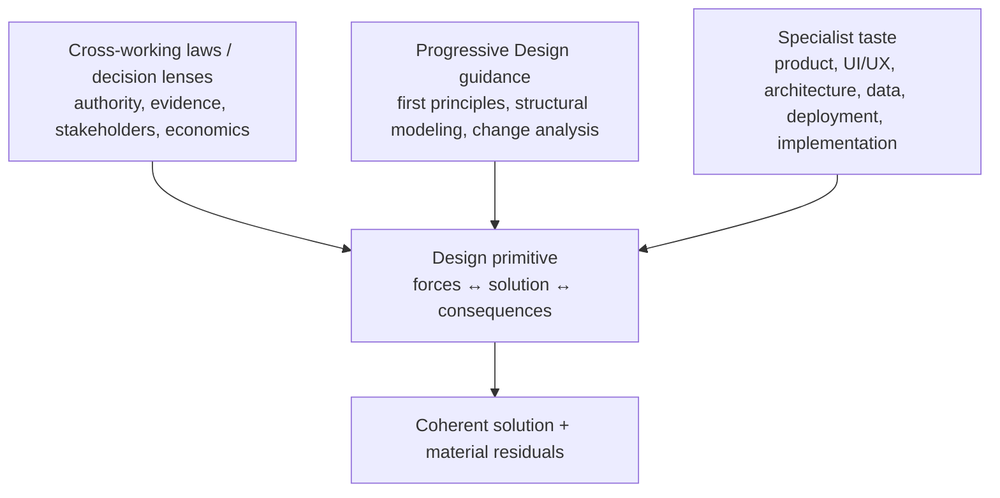

# Lead Proposal — Design Guidance and Taste Seam

- **State**: seam accepted in `D-071` and refined by `D-078`;
  [`design/67`](67-design-use-case-routing-and-test-design.md) routes guidance
  through use cases and three solution projections
- **Consumer**: `WP × P1 / 26-DS`; establishes an interface hypothesis for the
  later `TD × P1` Cell without advancing that Cell
- **Question**: where substantive design-thinking patterns and taste should live
  so that Design improves task outcomes without becoming either an empty shell
  or a monolithic handbook
- **Inputs**: Sir's examples in `V-178`, `D-058..D-060`, `D-067..D-070`, current
  `src/index.md`, `src/sections/working-protocol.md`, and
  `src/sections/implementation-taste.md`
- **Not decided now**: exact files/directories, a complete taste catalog,
  rewriting current Implementation Taste, durable source mutation, or the full
  `TD` capability model

## The Examples Do Not Have One Semantic Owner

Sir's examples all improve Design, but they make different kinds of claims:

| Example | Actual role | Provisional owner |
| --- | --- | --- |
| stakeholder value, ROI, opportunity/lifecycle cost | cross-working value/economic judgment and authority lens | universal protocol / Decision-Human seam; Design consumes it |
| first-principles reasoning | general reasoning technique that challenges inherited assumptions | progressive Design guidance when shaping a solution; reusable elsewhere |
| topology and sequence diagrams | representation/modeling technique selected when relation, timing, authority, or feedback matters | progressive guidance plus consumer-specific writing rules; never a mandatory Design artifact |
| dependency/obscurity, deep modules, interface semantics, naming/docs | substantive causal model and taste for software structure | Tastes & Design Ability; current `implementation-taste.md` is a foothold |
| impediments and attractions when removing an entity | change-design heuristic for migration, adoption, and option analysis | progressive Design guidance, with domain depth when needed |
| UI/UX, architecture, implementation taste | domain quality priors, causal models, exemplars, trade-offs, and preferences | Tastes & Design Ability specialist depth |

Putting all of them in the primitive Design contract would confuse working law,
reasoning technique, representation, domain knowledge, and taste. Moving all of
them outside Design would make the method correct but practically weak and easy
to under-supply.

## Taste Is Compressed Consequence Knowledge

Taste is not merely a list of personal likes. Mature product/technical taste
often compresses repeated experience about which structures, interactions, and
trade-offs tend to produce desirable consequences. It supplies:

- priors about which alternatives are worth generating
- attention to qualities a requirement may omit
- causal models for predicting maintenance, interaction, failure, and evolution
- exemplars and counterexamples that make an otherwise abstract principle usable
- aesthetic/value preferences where the Human legitimately owns the choice

These have different authority. Sir is authoritative for personal product and
aesthetic preference. A software-design heuristic such as “prefer a deep
module” is rebuttable expert guidance: its scope and predicted consequence must
fit the actual system, evidence, stakeholders, and ROI.

The examples themselves need qualification before durable admission:

- first principles must expose which assumptions are being removed and which
  constraints remain; otherwise it is motivational prose
- deep modules are a strong information-hiding mechanism, not the sole repair
  for dependency complexity; dependency direction, cohesion, stable contracts,
  data authority, distribution, performance, and organizational boundaries can
  dominate
- obscurity is reduced by naming, comments, and documentation, but also by
  deleting concepts/states/special cases, making invariants executable, and
  enabling local reasoning
- removal analysis benefits from impediment/attraction forces, but transition,
  stranded consumers, option value, and asymmetric loss may also determine the
  solution

This is why specialist taste guidance needs causal explanation, applicability,
counter-pressure, and consequences—not commandments copied into the core.

## Recommended Progressive Seam



The seam has three content depths around the accepted primitive:

1. **Small Design entry** — purpose, use condition, primitive topology, return,
   authority/Verification/Plan guardrails, and routes to deeper guidance.
2. **Progressive general guidance** — solution-shaping techniques that recur
   across domains: stakeholder/force mapping as applicable, first-principles
   reconstruction, topology/sequence/causal representations, counterfactual and
   representative-consequence challenge, removal/addition/change-force analysis,
   option/reversibility reasoning.
3. **Specialist taste guidance** — substantive product/UI/UX/architecture/data/
   deployment/implementation quality models, heuristics, examples, and
   counterexamples selected by the problem's pressure.

Design owns choosing and integrating useful lenses into one solution. It does
not copy or become the semantic owner of every law or specialist claim it
consumes. The specialist owner explains what the lens means, when it helps,
what it predicts, and where it fails.

## Why Placement Changes Task Effectiveness

With perfect retrieval and integration, file placement would be cosmetic. An
LLM has finite context, imperfect recall, and strong sensitivity to salient
instructions, so placement changes behavior through four probabilities/costs:

```text
expected net task effect
= P(relevant guidance loaded and integrated) × quality gain
- P(relevant guidance missed) × omission loss
- P(irrelevant guidance loaded) × context / distraction / ritual cost
- routing, reconciliation, and maintenance cost
```

| Shape | Likely gain | Likely loss |
| --- | --- | --- |
| everything inside Design | high discoverability and one coherent reading | large default context, checklist behavior, conflicting domain heuristics, premature sophistication |
| primitive Design only; all depth elsewhere | cheap universal entry and clean ownership | method becomes an empty shell; Agents may never retrieve the lens that creates solution quality |
| small entry + pressure-routed general/domain depth | relevant guidance can improve candidate quality while irrelevant depth stays unloaded | routing can fail; fragmented claims can drift or cost more to integrate |

The third shape is recommended, not because it is taxonomically neat, but
because progressive disclosure should maximize terminal solution quality per
Human attention, Agent context, elapsed work, correction, and future-change
cost. Its critical dependency is a good trigger/index: an elegant directory
with weak retrieval is worse than one moderately sized coherent document.

## Current Corpus Footholds and Rough Landing

Current source inspection shows:

- `src/sections/working-protocol.md` already owns posture selection,
  progressive loading, Task/effect control, and documentation quality. A future
  authorized landing should keep only Design's small entry and routing here, or
  link from here to one deeper method surface if the guidance cannot remain
  compact.
- `src/sections/implementation-taste.md` already owns authority/provenance,
  durable naming, data/boundary shape, complexity return, and projecting Design
  into code. It is a strong specialist foothold for software implementation
  taste, but cannot coherently own all product, UI/UX, architecture, deployment,
  and general reasoning content.
- `src/index.md` currently exposes only Working Protocol and Implementation
  Taste as these two relevant owners. Broader specialist surfaces would require
  a later `TD` owner/trigger/consumer/verification argument rather than being
  pre-created now.

The likely landing direction is therefore:

- compact Design bootstrap/routing under Working Protocol ownership
- one progressively loaded general Design-guidance surface only if the content
  earns a separate deep interface
- keep/refine Implementation Taste for its current software-implementation
  scope
- add product/UI/UX/architecture or other taste surfaces only when the `TD`
  discussion establishes distinct content and retrieval pressure

Exact paths and whether the general guidance is a section or file remain open.
Progressive disclosure determines the shape after content, not vice versa.

## Expected Effect on the Three Outcomes

- **O-INTERACTION**: Design integrates stakeholder value, personal preference,
  consequences, and appropriate diagrams into ordinary solution discussion;
  Human need not learn the lens taxonomy. Overloading the core would increase
  review burden and obscure the actual decision.
- **O-TASK**: relevant lenses improve framing, alternative quality, coherence,
  and detection of hidden commitments; routing prevents unrelated architecture
  or UI rules from consuming every Task. Missing retrieval is the main risk.
- **O-SYSTEM**: software complexity, ownership, boundary, migration, and
  evolution taste can reduce future change cost; keeping heuristics scoped
  prevents a fashionable principle from becoming universal architecture.

## Accepted Disposition

Sir accepted the progressive seam, not a hard separation:

> **Design owns solution synthesis and the selection/integration of relevant
> lenses. Cross-working owners retain universal laws and decision authority;
> progressive Design guidance supplies general solution-shaping techniques;
> Tastes & Design Ability owns specialist quality models and taste consumed by
> Design.**

Judge future placement by observed task-effect economics—relevant retrieval and
solution-quality gain versus omission, irrelevant context, ritual, integration,
and maintenance cost—not by conceptual purity alone.

He judged the model correct and potentially excellent because it gives Design
practical judgment while preventing over-doing at multiple layers. `D-071`
records that result. The Working Protocol discussion now returns from the `TD`
interface to independent derivation of Implementation in [`design/60`](60-implementation-foundational-method.md).
