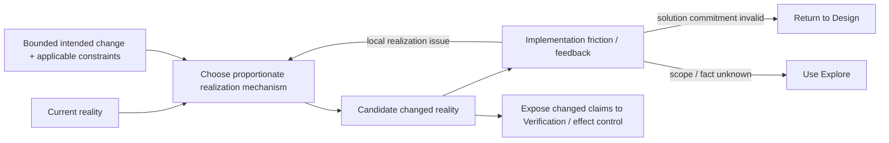

# Independent Derivation — Implementation as a Foundational Working Method

- **State**: integrated; boundary and realization-feedback core accepted in
  `D-072`, foundational admission continues in [`design/61`](61-implementation-development-loop-and-admission.md)
- **Consumer**: `WP × P1 / 27-IQ`
- **Question**: whether Implementation has a distinctive stable method and
  return, rather than merely naming an `IM` Slice, an effect, an Executor role,
  or ordinary command execution
- **Inputs**: `D-039`, `D-041`, `D-044`, `D-053`, `D-058..D-060`, `D-066`,
  `D-068..D-071`, earlier Executor/deterministic-transformation findings in
  [`design/06`](06-working-mode-and-transformation-routing.md) and
  [`design/03`](03-role-based-sub-agent-orchestration.md), and current
  `working-protocol.md` / `implementation-taste.md`
- **Not decided now**: foundational status, exact name, corpus landing,
  Executor/sub-agent design, Verification method, mutation policy, or durable
  source mutation

## First Separate Six Things Commonly Called “Implementation”

| Concern | Actual owner/question | Not implied by Implementation method |
| --- | --- | --- |
| `IM` Slice | what independently useful implemented return the Plan manages | which cognitive/technical method performs it |
| Implementation Working Method | how an intended product/system change becomes real under actual feedback | permission, work topology, or proof by itself |
| implementation Plan | sequence, dependencies, assignment, integration/effect order, and TBC horizon | the realized state change |
| Executor | a Lead/sub-agent role specialized around one bounded realization-feedback loop | that every edit needs delegation or an Agent role |
| mutation/effect authority | whether this actor may change which state and external surface | correctness, quality, or acceptance |
| Verification | whether changed product/technical claims hold on a discriminating observation surface | construction of the change itself |

`D-041` already establishes Implementation as a Slice return contract rather
than a default `implementation.md` module. That information-topology decision
does not answer whether a reusable Working Method helps produce the return.

## Recurring Realization Cases

### 1. Direct bounded change

The intended result, owner, local structure, and verification are clear. A
small edit can directly realize the delta. Method overhead should compress to
almost nothing; adding an explicit loop or artifact would be waste.

### 2. Deterministic structural transformation

A large repetitive refactor has one expressible relation among edits. The
valuable implementation work is often to design and qualify a deterministic
AST/rewrite rule, then apply it mechanically. File count does not justify an
LLM writer or many Executor assignments.

### 3. Adaptive feedback development

The desired effect is judgeable but the implementation mapping is not known in
advance—for example, mapping real pen input to acceptable canvas glyphs. A
bounded loop of representative input, candidate change, product-level
observation, and local refinement has value. The implementation return emerges
through feedback rather than one precomputed edit.

### 4. Migration or rollout realization

Design owns coexistence, compatibility, authority, and rollback semantics; Plan
owns the sequence. Each realization step still meets actual data, deployment,
dependency, and operational friction that can require local adaptation or can
falsify the solution itself.

These cases differ in policy but share a pressure: a desired solution or bounded
state diff does not yet exist in the actual artifact/system.

## Candidate Distinctive Return

> **Implementation realizes an intended product/system change in actual
> artifacts or runtime state.**

This is distinct from:

- information about how it might be done
- a coherent proposed Design solution
- a Decision authorizing the change
- a Plan scheduling the work
- a patch that has not produced the relevant intended state
- Verification or Human acceptance of the resulting claims

“Realized” must not mean “a command exited” or “files changed.” The current
consumer determines the relevant state: source/schema/configuration for one
Slice, deployed coexistence for a migration return, or observed interactive
behavior for an adaptive development return. Independent qualification remains
Verification-owned.

## Candidate Primitive Core

The stable behavior is not a mandatory edit-test loop. It is:

1. relate the intended bounded change to current reality and applicable
   constraints
2. choose the cheapest mechanism that can faithfully realize it—direct action,
   deterministic transformation, adaptive feedback loop, or specialized
   execution as needed
3. let changed reality and implementation friction update local tactics or
   return a falsifier to Design/scope rather than burying the mismatch
4. expose the resulting change and claims to their applicable integration,
   effect, and Verification consumers

These are semantic relations, not lifecycle states or required persistent
Steps. A clear local change compresses them into one action. Implementation may
also occur inside a prototype or Design inquiry and can be set aside/reused
without method state.

## Is This Truly Foundational?

The case is plausible but not yet closed.

**For admission**:

- recurring pressure: intended solution is not real
- distinctive return: materialized product/system change
- stable cross-case behavior: delta/reality fit, proportionate realization,
  friction feedback, honest mismatch return
- composition: consumes Design and Plan; may use Explore, deterministic tools,
  Executor specialization, and later Verification
- simple compression: direct edits need no named ceremony

**Against admission**:

- “make the change” may be too obvious to improve Agent behavior
- mechanism selection could belong to generic operating policy
- feedback routing could belong to the universal protocol
- changed state and effect authority may be inseparable enough that a separate
  method only restates execution rules
- the useful adaptive loop may belong specifically to Executor guidance rather
  than universal Implementation

The strongest alternative is to keep `Implementation` only as a familiar Slice
return and let direct action, deterministic transforms, Executor loops, effect
control, and Verification provide all behavior. This is cheaper if they remain
coherent without a shared realization owner.

## Initial Proposition for Review

Two judgments should be separated:

1. **Boundary**: the distinctive implementation concern is realizing a bounded
   intended change in actual product/system state; it is not the Plan, role,
   permission, command, patch, or proof.
2. **Method value**: the candidate reusable core is intended delta + current
   reality → proportionate realization → changed reality + friction/feedback,
   with local refinement or honest return when the solution/scope is wrong.

If this boundary is faithful, the next Design Slice can determine whether that
core changes Agent behavior enough to earn third-foundation status or should
remain embedded realization logic under `IM` work and Executor guidance.

## Human Disposition

Sir accepts both the distinctive boundary and the topology: Implementation is
about making a bounded intended change actual in product/system reality, not
merely editing files, executing a command, planning work, holding permission,
or proving the result. Sir further identifies the potentially valuable method
as a development loop—change code/configuration/runtime state, obtain
verification or other realization feedback, then adjust the implementation or
the solution.

This acceptance does not yet decide that Implementation is foundational. It
also exposes three seams for the next design:

- implementation planning remains the linear organization of useful returns,
  not a transcript of every feedback-loop iteration
- Executor remains a sub-agent design; its important reusable pattern is
  specialization around a bounded loop with a discriminating feedback surface
- verification exists at several levels: a solution may design its verification
  obligations and observability; an implementation loop consumes fast steering
  feedback; independent Verification still qualifies claims; tests automate a
  verification mechanism rather than exhausting the concept
