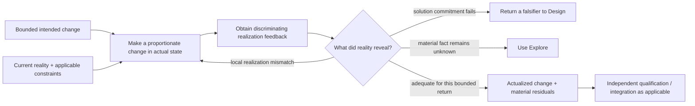

# Implementation Development Loop and Foundational Admission

- **State**: integrated; Implementation accepted as the third foundational
  Working Method in `D-073`
- **Consumer**: `WP × P1 / 28-DS`
- **Question**: whether a realization-specific development loop changes Agent
  behavior enough for Implementation to become the third foundational Working
  Method
- **Inputs**: `D-041`, `D-053`, `D-058..D-060`, `D-066`, `D-068..D-072`,
  `V-077`, `V-182..V-186`, and
  [`design/60`](60-implementation-foundational-method.md)
- **Not decided now**: complete Verification architecture, testing guidance,
  Executor design, implementation-taste content, corpus layout, or durable
  source mutation

## What the Development Loop Adds

If Implementation only meant “perform the planned edit,” it would not deserve
a Working Method. Its non-trivial pressure is the gap between a proposed
solution and resistant reality: repositories, dependencies, runtime behavior,
real input, deployment platforms, and migration state reveal information that
cannot always be known during Design or enumerated in a Plan.

The method therefore needs to make construction empirical:

“Change → feedback → adjust” is a semantic loop, not a required sequence
of named Steps or a command-test ritual. Direct, obvious work may compress it
into one edit and one cheap observation. A UI behavior may need representative
interaction; an AST transformation may need dry-run/diff/static checks; a
migration may need staged effects and operational observation.

## Primitive, Guidance, and Interfaces

The smallest stable Implementation core is:

> **Make a bounded intended change actual, use realization feedback to adapt
> the change, and expose rather than bury any mismatch that invalidates the
> solution or remaining obligation.**

Three adjacent concerns should not be captured as primitive Steps:

- choosing among direct action, deterministic transformation, adaptive
  development, and specialized execution is progressive Implementation
  guidance
- returning an unknown or falsifier to Explore/Design is a Working Protocol
  interface
- independent qualification, effect permission, and acceptance retain their
  Verification, authority, and Human owners

This keeps the primitive useful without making it own every activity that
co-occurs during development.

## Verification Has Different Jobs Around the Loop

The word “verification” currently hides at least three relations:

| Relation | Job | Owner consequence |
| --- | --- | --- |
| verification intent/design | decide which product/technical claims, observation surfaces, observability/testability, and residual-loss boundaries make the proposed solution judgeable | part of Design when material; it is a solution commitment, not proof that the solution works |
| realization feedback | provide low-latency, discriminating information for the next implementation adjustment | consumed inside Implementation; may be local, correlated, or provisional |
| independent qualification | determine whether changed claims actually hold with evidence adequate for the applicable loss boundary | Verification-owned; can reject or reopen Design/Implementation |

Tests are automated verification mechanisms. The same test or observation
surface may serve in-loop steering and later qualification, but reuse does not
make their semantics identical: the loop optimizes actionable feedback;
qualification optimizes confidence, independence, coverage, and false-accept
loss. Human acceptance remains a separate authority disposition.

## Plan and Executor Seams

An `IM` Slice names an independently useful implemented return. Its Plan may
put Design, Inquiry, Implementation, and Verification returns in one linear
order, and may stop at TBC when feedback determines the next useful move. Loop
iterations do not automatically become Plan Steps. They earn external planning
state only when they have management value—for example material cost, external
effect, dependency, delegation, long latency, irreversibility, or Human review.

Executor remains a role/sub-agent design rather than the method. Its promising
specialization pattern is:

> **own one bounded realization loop whose intended return, input snapshot,
> effect authority, discriminating feedback surface, residuals, and integration
> consumer are clear.**

This explains why an Executor can add value for adaptive development while a
generic LLM writer for causally related bulk edits often loses to a qualified
deterministic transformation.

## Foundational Admission

Implementation now passes the current admission test:

- **recurring pressure**: intended product/system meaning is not yet actual and
  reality reveals construction-specific friction
- **distinctive return**: an actualized bounded change, with material
  realization feedback and residuals—not information, a solution, a Plan, or a
  proof
- **behavioral value**: replaces one-shot patch production with proportionate
  empirical adjustment and honest escalation of solution mismatch
- **stable composition**: can use Explore and Design, consumes mechanisms and
  tools, and supplies changed claims to Verification without absorbing them
- **simple-task compression**: a clear edit remains a clear edit; no method
  state, artifact, loop log, or mandatory test ceremony is created

The strongest alternative—leave Implementation as only an `IM` Slice return
and put feedback under Executor/Verification—loses the general behavior for
direct work, deterministic transformation, migration, and single-Agent
development. It also makes the role, rather than the work, own the reason to
respond to resistant reality.

## Proposition

Accept Implementation as the third foundational Working Method, with:

- **Purpose**: make a bounded intended product/system change actual under real
  implementation feedback
- **Use when**: a useful return requires changing actual artifact or runtime
  state, from a direct local edit through adaptive development or migration
- **Return**: the actualized bounded change, material realization feedback, and
  unresolved obligations; independent Verification owns qualification
- **Primitive topology**: bounded intent + current reality ↔ proportionate
  change ↔ discriminating feedback, with honest return when reality
  falsifies the solution or scope

This proposition admits the method, not a mandatory implementation phase,
artifact, Agent role, loop transcript, test suite, or source layout.

## Human Disposition

Sir accepts the foundational admission and specifically endorses the
`actualized change` versus `qualified claim` correction. Implementation owns
making a bounded change real under feedback; independent Verification owns
whether the resulting claims are adequately established. This semantic split
is retained even when the same observation or automated test participates in
both activities.
