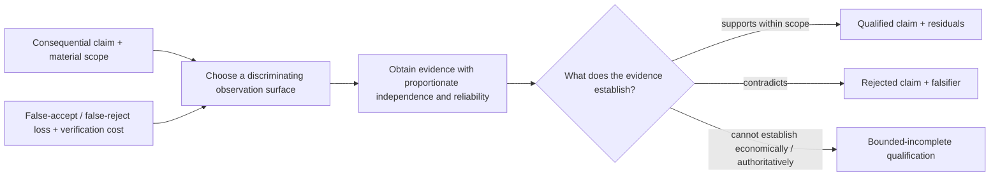

# Independent Derivation — Verification as a Foundational Working Method

- **State**: challenged by Human review; the topology is retained as candidate
  Verification-solution Design guidance, while foundational admission is
  rejected by the current proposition in [`design/63`](63-verification-capability-and-trusted-verifier.md)
- **Consumer**: `WP × P1 / 29-IQ`
- **Question**: whether Verification has a distinctive stable method and
  return, rather than being only a universal “check your work” rule, an
  Implementation-loop observation, automated tests, or Human acceptance
- **Inputs**: `D-042..D-043`, `D-053..D-055`, `D-058..D-060`, `D-063`,
  `D-066`, `D-069`, `D-072..D-073`, `V-078..V-082`, and `V-182..V-187`
- **Not decided now**: the detailed `VF` capability model, claim taxonomy,
  complete product/technical evidence strategy, testing guidance, delegation
  certificates, acceptance policy, corpus layout, or durable source mutation

## First Separate Related Meanings

| Concern | Distinctive job |
| --- | --- |
| Design verification intent | make material solution claims judgeable through appropriate behavior, observability, testability, and failure boundaries |
| Implementation feedback | quickly discriminate the next realization adjustment; it may be local, provisional, or correlated with the producer |
| Verification Working Method | qualify whether consequential claims hold with evidence adequate for their scope and the consequences of error in either direction |
| automated test | repeatedly execute one encoded verification mechanism |
| acceptance | an authorized disposition after consuming evidence, residual risk, stakeholder value, and constraints |

These relations can reuse one observation surface without becoming one owner.
A passing test can steer Implementation while still being insufficient to
qualify the product claim; conversely, a direct external observation may
qualify a bounded claim without becoming a permanent automated test.

## Recurring Qualification Cases

### Product behavior

The material claim is stated at a product observation surface. Internal state
can support diagnosis, but asserting a database cell alone does not establish
that a subscription action gives the user the promised notification behavior.

### Technical contract

Types, schemas, compilers, compatibility checks, invariants, differential
behavior, and operational signals qualify different technical claims. More
tests do not compensate for observing the wrong contract.

### Delegated return

An untrusted executor can return a candidate plus a compact certificate. The
lead need not trust the actor, but the validator must actually discriminate the
specified claim and bound what remains unverified.

### Cheap local claim

A clear, low-loss claim may need only one direct static or behavioral check.
Verification must compress rather than force a test plan or independent Agent.

Across the cases, the recurring pressure is not missing information in
general. It is that a consequential claim is about to be relied upon without a
sufficiently discriminating basis.

## Candidate Primitive Topology

The candidate stable behavior is:

1. identify the consequential claim, its material scope, and what accepting or
   rejecting it incorrectly would risk
2. select observations that can actually distinguish the claim from material
   failure, preferring the product or technical surface where the expectation
   is owned
3. obtain evidence with independence, reliability, and cost proportionate to
   false-accept loss, false-reject/rework loss, delay, and verification cost
4. return a scoped qualification, rejection, or bounded-incomplete result with
   residual uncertainty rather than equating activity with proof

These are semantic relations, not mandatory fields, test phases, or a demand
for certainty. Verification may use Explore, Discriminate, specialized tools,
tests, reviewers, or Human observation without making each one part of its
primitive.

## Why This May Be Foundational

**For admission**:

- distinctive pressure: a consequential claim is about to be relied upon
- distinctive return: claim qualification/rejection with evidence and
  residuals—not information, a solution, or a changed state
- stable behavior: claim/scope → discriminating surface → proportionate
  evidence → scoped disposition
- behavioral value: prevents command success, test count, internal fixtures,
  producer confidence, and implementation feedback from impersonating proof
- simple compression: cheap claims retain cheap checks

**Against admission**:

- evidence discipline may be a universal Guardrail rather than a method
- Explore plus Discriminate may already find and evaluate the necessary
  evidence
- deep guidance belongs to the separate `VF` Track, so a WP-level method could
  duplicate it
- “qualification” may remain too abstract unless it changes observation and
  evidence selection in practice

The strongest alternative is a universal rule requiring evidence for material
claims, with all concrete method owned by `VF`. That is cheaper in concepts but
does not provide a reusable Agent behavior for deciding what claim, surface,
evidence, independence, and residual are sufficient.

## Protocol / Capability Seam

If admitted, Working Protocol should own only the compact Working Method:

- **Purpose**: establish whether a consequential claim can be relied upon
- **Use when**: downstream work, effect, acceptance, or delegation integration
  depends materially on a claim
- **Return**: scoped qualified/rejected/bounded-incomplete claim, supporting
  evidence, and material residuals
- **Primitive**: claim + loss boundary → discriminating observation →
  proportionate evidence → qualification disposition

The later `VF` capability owns progressive depth: product/technical observation
surfaces, modular verification composition, test economics, independence,
metamorphic/differential/fuzz/shadow methods, certificate/validator design,
evidence retention, acceptance interfaces, and failure patterns.

## Initial Proposition for Review

Verification appears to pass the foundational-method test, but the next Human
judgment should remain narrow: whether **qualifying a consequential claim on a
discriminating observation surface, relative to scope and the cost of either
misclassification** is a distinctive reusable Working Method rather than only
a Guardrail or the later `VF` specialist capability.

## Human Challenge

Sir challenges the category, not the topology. Verification should usually be
delegated to an external, deterministic verifier—a small trusted computing base
such as a compiler, type checker, schema validator, differential/metamorphic
test, shadow observation, or fuzzing harness. On review, the topology above
mainly explains how to **design a verification solution**: identify claims,
choose observation surfaces and error economics, and construct a trustworthy
verdict path. It does not yet show a distinct Working Method once that verifier
exists.
