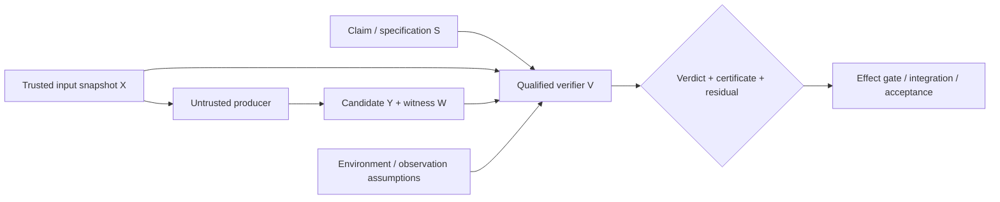

# Verification as a Capability and Trusted-Verifier Architecture

- **State**: integrated; accepted in `D-074`
- **Consumer**: `WP × P1 / 30-DS`
- **Question**: whether Verification should be rejected as a foundational
  Working Method and instead modeled as a cross-cutting capability whose
  solution is designed, implemented, executed, and consumed through existing
  methods and protocol semantics
- **Inputs**: `D-043`, `D-053`, `D-058`, `D-063`, `D-066`, `D-069`,
  `D-072..D-073`, `V-078..V-082`, `V-188..V-193`, Sir's verifier/TCB
  correction, and [`design/62`](62-verification-foundational-method-boundary.md)
- **Not decided now**: detailed verifier catalog, testing guidance, proof
  certificates, acceptance policy, effect gates, `VF` source layout, or
  durable mutation

## Decompose by Whether a Verifier Exists

| Situation | Actual work | Existing owner/method |
| --- | --- | --- |
| a qualified verifier already exists | provide the controlled input/candidate, execute it, retain the verdict/certificate, and integrate the result | ordinary action plus Working Protocol evidence/integration semantics |
| the right verifier does not exist | decide which claims, observations, witnesses, error economics, and residuals form an adequate verification solution | Design using progressive `VF` guidance |
| the verifier is specified but not real | implement and qualify the compiler rule, test harness, replay, oracle, shadow path, or other mechanism | Implementation, recursively consuming verification feedback |
| evidence is ambiguous or assumptions are unknown | locate missing facts or distinguish competing explanations | Explore / embedded Discriminate logic |
| a verdict is available | decide whether downstream action/effect may rely on it under authority, stakeholder value, and residual risk | Working Protocol integration; Human/other acceptance authority as applicable |

After this decomposition, no management-useful behavior remains that requires a
separate foundational Verification Working Method. There is still a distinctive
**qualification return** and an important Verification capability; method,
return type, and capability do not need one-to-one names.

## Verification Solution Topology

Sir's proof-carrying delegation model gives the stronger center:

The producer can be an Agent, Human, compiler pass, migration tool, or other
mechanism. Trust moves from the producer's process or prose to one candidate
judgment made by a smaller trusted computing base.

The trusted base is not only the verifier binary. Depending on the claim it can
include:

- the claim/specification and its semantic owner
- integrity and representativeness of input snapshot `X`
- verifier implementation, oracle, metamorphic relation, or comparison target
- instrumentation and environment through which behavior is observed
- verdict interpretation, error thresholds, and residual-scope statement
- the gate that limits what an unqualified result can change

Proof-carrying work is valuable when it shrinks this base and makes it cheaper
to challenge; it does not make specification, observation, or oracle errors
disappear.

## Determinism Is a Preference, Not the Full Definition

External and deterministic verifiers are usually the best default when they
can faithfully encode the claim: they are repeatable, cheap to rerun, compact
to inspect, and decoupled from the candidate generator. But three corrections
prevent false confidence:

1. A deterministic verifier can prove the wrong proposition. A compiler or type
   checker qualifies only encoded properties under its assumptions.
2. Differential systems can agree on the same error; shadow traffic can be
   unrepresentative; fuzzing and distributed/runtime observations may be
   stochastic even when seeds and procedures are reproducible.
3. Some product, UI/UX, migration, and emergent-system claims still require
   structured Human judgment or statistical evidence. The goal is sufficient
   independence, reproducibility, and bounded residual risk—not determinism as
   a ritual.

“External” should therefore mean sufficiently independent of the untrusted
production path, not necessarily another service or Agent.

## Reinterpret the Previous Model

The earlier relation:

> claim/scope → discriminating observation surface → proportionate evidence →
> scoped disposition

remains useful. Its proper identity is progressive **Verification-solution
Design guidance**, owned in depth by `VF` and consumed by Design when the
solution needs explicit product/technical qualification, observability,
testability, certificates, or gates.

Execution of that solution returns evidence. It is not itself a creative
Working Method. A `VR` Slice can still manage an independently useful
qualification return, just as a return type need not name the method used to
produce it.

## Revised Ownership Seam

- **Working Protocol** owns evidence/integration Guardrails: actualized does not
  imply qualified; material reliance needs adequate evidence; contradictory or
  bounded-incomplete verdicts remain explicit; authority consumes rather than
  fabricates qualification.
- **Task Packet** owns `VR` Slice/control state and shared cross-return evidence
  pressure; it does not prescribe a Verification method.
- **VF capability** owns how verification solutions, verifiers, observation
  surfaces, modular tests, certificates, independence, residuals, and
  acceptance interfaces are designed and qualified.
- **Design** consumes that guidance to include material verification structure
  in a coherent solution.
- **Implementation** builds or applies the verifier and realizes the candidate.
- **Explore/Discriminate** handle unknowns or ambiguous observations.

## Corrected Proposition

Do **not** admit Verification as a fourth foundational Working Method.

Retain it as:

1. a cross-cutting capability and semantic qualification concern
2. a possible `VR` Slice return
3. progressive specialist guidance for designing a small, trustworthy verifier
   and limiting the effect of unqualified results
4. universal evidence/integration Guardrails in Working Protocol

This conclusion should reopen if real work repeatedly requires a stable,
non-trivial qualification behavior that cannot be economically decomposed into
Design, Implementation, Explore, verifier execution, and protocol integration.

## Human Disposition

Sir accepts the corrected category: Verification is not a fourth foundational
Working Method. The qualification return, verification capability, trusted-
verifier architecture, Design guidance, and evidence/integration Guardrails
remain independently important.
