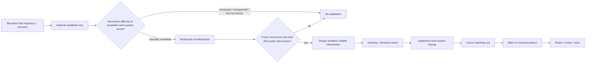

# Agent Work-System Retrospective Guidance

- **State**: integrated; accepted in `D-076`
- **Consumer**: `WP × P1 / 32-IQ`
- **Question**: what minimum composed closing guidance can turn one Task
  trajectory into a credible improvement of future Agent work without
  compulsory ceremony, self-rationalizing memory, or mechanism accumulation
- **Inputs**: `D-053`, `D-058`, `D-066`, `D-075`, `V-017`, `V-020`,
  `V-197..V-200`, [`design/08`](08-agent-work-system-retrospective.md),
  [`design/64`](64-foundational-working-method-basis-audit.md), and the
  accepted consumer chain
- **Comparative references**:
  [Army after-action review](https://www.armyupress.army.mil/Journals/Journal-of-Military-Learning/Journal-of-Military-Learning-Archives/April-2022/Cates-Action-Review/),
  [Google SRE postmortem culture](https://sre.google/workbook/postmortem-culture/),
  [Argyris's double-loop learning](https://hbr.org/1977/09/double-loop-learning-in-organizations),
  and [Reflexion](https://arxiv.org/abs/2303.11366); used as contrasts, not an
  imported SOP
- **Not decided now**: automation/hook, telemetry schema, score, mandatory
  artifact, sub-agent, exact source layout, mutation authority, or real-task
  acceptance experiment

## Separate Three Learning Concerns

| Concern | Target | Immediate return / consumer |
| --- | --- | --- |
| task-internal correction | complete the current return better | changed current tactic consumed inside the Task |
| project-truth consolidation | preserve newly established product/technical/operational meaning | accepted semantic delta consumed by its canonical project owner |
| Agent work-system retrospective | reduce recurrence of avoidable loss in future Agent work | supported adaptation disposition consumed by Design/Implementation and applicable authority |

Reflexion-style text memory mainly improves another attempt by placing verbal
feedback into the Agent's later context. Incident postmortems mainly improve
the product/operating system and organization. Both offer useful structures,
but neither is identical to changing the Agent-in-project work system through
scripts, constraints, feedback, methods, tools, or delegation boundaries.

## What the Retrospective Actually Returns

The future Agent is the terminal beneficiary, not the immediate semantic
consumer. The Retrospective should return one of two dispositions:

1. **No adaptation**—the observed cost was necessary, non-recurring,
   insufficiently supported, outside useful control, or cheaper to tolerate.
2. **Supported adaptation opportunity**—a material avoidable loss, its
   work-system cause and counterfactual, the matching future situations, the
   smallest credible intervention direction, applicable owner/authority, and
   what later evidence should retain, revise, or retire it.

Design may then shape the intervention; Implementation may realize it in the
same Task's `RT` Slice; a future Task supplies behavioral-effect evidence. A
large or unauthorized intervention may remain an explicit obligation, but the
model does not force Retrospective into a new Task or default artifact.

## Minimal Topology

This is a cross-Task learning loop, not a lifecycle state machine. The guidance
can be picked up after a successful, failed, cancelled, or handed-off episode
when enough trajectory and outcome evidence exists; a host stop event or green
completion marker is not the trigger.

## Four Questions, Not an Eight-Step Ceremony

### 1. What loss was material, and was it avoidable?

Use observable trajectory evidence: repeated blind searches, retries, rework,
late-discovered constraints, unnecessary context reload, preventable Human
correction, weak feedback, or expensive verification detours. Token, time,
command, or failure counts are navigation signals, not waste by themselves.

Compare the episode with a credible counterfactual. Necessary exploration,
one-time unfamiliarity, external outage, or an unavoidable trade-off should
usually return no adaptation.

### 2. Which work-system relation produced it?

Diagnose the earliest modifiable decision or feedback point, not the visible
symptom. The cause may be unavailable project truth, repeated reconstruction of
a deterministic operation, late invalid-move detection, non-discriminating
feedback, unsuitable method/routing, context coupling, or a bad interface.

The Agent's narrative is a hypothesis. Commands, queries, diffs, verifier
results, Human corrections, and terminal outcome are stronger trajectory
anchors. Consequential interventions need more independent challenge than the
same context praising its own explanation.

### 3. What smallest intervention changes that future path economically?

State the behavioral counterfactual: in which matching situation would the
intervention change which Agent move, available affordance, constraint, or
feedback loop?

Prefer interventions that remove a needless decision or make the correct path
cheap and visible. Stable deterministic relations favor scripts, schemas,
types, linters, codemods, preflights, and diagnostic interfaces; remaining
judgment may justify concise guidance, a Skill, Working Method, or specialized
role. This is a preference, not a fixed ladder.

Count future context, false positives/rejects, maintenance, version drift,
authority, opportunity cost, and terminal-quality risk. A plausible lesson
does not justify a durable rule.

### 4. What future observation could revise or remove it?

State a modest effect horizon: what matching future work would reveal that the
Agent found the right path earlier, avoided the bad move, preserved result
quality, or merely encountered a different task mix? Give every adaptation a
normal revision/retirement route through its semantic owner.

Absence of observed use is not automatically proof of no value, especially for
rare safety constraints; ablation and comparison remain claim-relative.

## Progressive Use and Task Packet Seam

- Do not run a mandatory retrospective on every Task. Use the guidance when a
  material, plausibly avoidable work-system loss or unusually high-leverage
  improvement is visible.
- `No adaptation` should be common and normally creates no file or durable
  record.
- Use an `RT` Slice when the Task needs to manage a retrospective/adaptation
  return. The Slice may compose Explore, Design, and Implementation; `RT` names
  its scope, not a fourth method.
- Do not add `retrospective.md` by default. `packet.md` mentions the concern
  only when it changes current Human judgment, authority, or continuation.
- Reuse the intervention's actual semantic owner and mutation gate. “Agent
  improvement” is not a durable owner.
- Project-truth consolidation remains a separate closing procedure even when a
  missing durable fact caused the observed waste.

## Reference Corrections

- After-action review contributes comparison among intent, observed outcome,
  causal explanation, and improvement, but importing a scheduled meeting or
  fixed questionnaire would violate the non-ritual model.
- SRE postmortems contribute evidence-grounded learning, action ownership, and
  blame-resistant analysis, but their primary object is a production incident,
  not an Agent work policy.
- Double-loop learning contributes changing the governing rule or affordance
  rather than only correcting one action, but “deeper” change is not
  automatically higher ROI.
- Reflexion demonstrates that feedback carried into later attempts can improve
  Agent behavior, but episodic self-written text can remain task-specific,
  consume context, rationalize causes, and accumulate without an owner or
  retirement path.

## Initial Proposition for Review

Retrospective is not a fourth foundational Working Method. It is a
pressure-triggered, composed closing guidance that uses Explore to establish an
avoidable work-system cause, Design to shape the smallest credible adaptation,
and Implementation to realize it under authority. Its distinctive discipline
is the cross-Task behavioral counterfactual and later retain/revise/retire
horizon.

The minimum useful return is a supported adaptation opportunity or an honest
no-adaptation disposition. No automatic hook, score, memory append, artifact,
or durable mutation follows from the concept.

## Human Disposition

Sir accepts the low-commitment Retrospective model: composed closing guidance,
the causal/counterfactual discipline, no-adaptation return, future effect and
retirement horizon, Task Packet seam, and separation from project-truth
consolidation.
