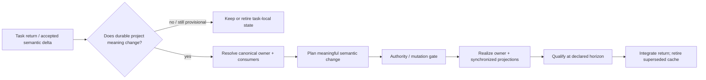

# Project-Truth Consolidation — Continuous Integration and Closing Residual Check

- **State**: integrated; accepted in `D-077`
- **Consumer**: `WP × P1 / 33-DS`
- **Question**: whether project-truth consolidation is best modeled as
  continuous semantic integration with a closing residual check, rather than a
  symmetric end-of-Task SOP or deletion-time promotion review
- **Inputs**: `D-024..D-025`, `D-040`, `D-043..D-046`, `D-076`,
  `V-050`, `V-052`, `V-083`, `V-088`, `V-202..V-203`, current canonical
  Working Protocol, and [`design/34`](34-working-protocol-foundation.md)
- **Not decided now**: exact corpus wording/layout, templates, automation,
  multi-repo protocol revision, CLI behavior, or durable source mutation

## Retrospective and Consolidation Are Not Symmetric

Agent work-system Retrospective benefits from a bounded episode and outcome:
only then can the trajectory support a cross-Task counterfactual.

Project truth should instead be integrated when an accepted semantic delta
becomes sufficiently stable and authorized. Deferring known owner updates until
Task deletion creates three avoidable risks:

- later work consumes stale product/technical/operational truth
- task-local cache becomes an accidental shadow authority
- closure becomes a broad rescan/promotion ceremony that reconstructs meaning
  from paths or history

The closing concern is therefore a safety net, not the primary integration
time.

## Four States of a Task-Local Delta

| Delta state | Correct treatment |
| --- | --- |
| hypothesis, alternative, or mutable working model | keep task-local; never promote because it was discussed |
| accepted meaning whose realization/authority is still pending | create meaningful Plan work or return an explicit residual; a file path alone is not a plan |
| accepted meaning already represented in its canonical owner and qualified at the declared horizon | no consolidation work; retire the task-local cache when no longer useful |
| accepted/realized meaning still stranded in Task Packet or contradicted by a canonical owner/projection | reconcile the owner and affected consumers before claiming closure at that truth horizon |

“Accepted” remains scope- and authority-relative. Human conversation, a Design
candidate, implementation reality, a passing test, and durable product truth
do not silently promote one another.

## Continuous Semantic Integration

The actual work uses existing methods and scopes:

- Explore when the changed meaning, evidence, freshness, or owner is unclear
- Design when the durable product/technical meaning itself needs solution work
- Implementation when the accepted delta must become actual in code,
  configuration, schema, test, automation, or documentation
- qualified verifiers and applicable acceptance/authority for the claimed
  horizon

No `Consolidate` foundation or same-named Slice tag is required.

## A Meaningful Consolidation Plan Item

When a stranded delta exists, Plan the semantic obligation—not a promotion
target list. The useful return identifies:

- what meaning changes, preferably as current → intended truth
- why it is accepted: evidence, Decision, realized behavior, or contract basis
- which canonical owner and material consumers must reconcile it
- conflicts, compatibility, migration, or projection consequences
- applicable authority and qualification horizon

The file or symbol address is supporting data. “Update `foo.md`” has no
independent management value and can be wrong before owner resolution.

Consolidation does not mean copying the Task Packet. Preserve only truth whose
future consumer and recovery cost justify durable expression. Remove or revise
obsolete owner content and synchronized projections rather than appending a
second explanation. Rationale is durable only when future change/review needs
it to preserve the intended boundary.

## Closing Residual Check

At a proposed Task/Cell/Phase return, ask one compact question:

> **Does any accepted semantic delta still exist only in volatile task state,
> or materially contradict the owner/consumer that future work will trust?**

- **No**: create no artifact and do not rescan unrelated Task history.
- **Yes, actionable and authorized**: add/continue the smallest meaningful
  `IQ`/`DS`/`IM`/`VR` Plan work and integrate it normally.
- **Yes, blocked or intentionally deferred**: return the exact residual,
  consumer consequence, owner/authority need, and viable continuation. Closure
  is honest only at the lower declared horizon; deletion must not erase the
  obligation.
- **Uncertain but material**: Explore the delta/owner; uncertainty is not
  evidence that nothing needs consolidation.

This check may occur at any consequential return, not only one global Task end.
It is an invariant of integration plus a final residual guard, not a new Phase
barrier or lifecycle event.

## Task Packet and Retention Seam

- Task Packet may cache a selective baseline and candidate/accepted working
  delta while that locality has management value.
- Do not maintain promotion targets in cache metadata, Track entries, or a
  default close checklist.
- Once the delta becomes meaningful planned work, the applicable Plan owns its
  return and state.
- Do not create `consolidation.md` by default. Existing Inquiry, Design,
  Decision, Verification, Plan, and semantic owners carry their actual states.
- Packet deletion follows retention policy. It neither triggers consolidation
  nor proves it happened.
- `packet.md` exposes consolidation only when it changes current Human
  judgment, authority, risk, or continuation.

## Relationship to the Two Closing Concerns

| Concern | Temporal character | Normal return |
| --- | --- | --- |
| project-truth consolidation | integrate continuously; check for stranded accepted deltas at consequential returns | canonical owner synchronized, no-op, or explicit residual |
| Agent work-system Retrospective | inspect a bounded trajectory/outcome under material pressure | no adaptation or supported adaptation opportunity with future effect horizon |

They remain separate, but they are not two symmetric end stages. A
Retrospective can discover that missing project truth caused waste and route an
owner repair; that repair is then ordinary consolidation work, not a memory
owned by Retrospective.

## Initial Proposition for Review

Treat project-truth consolidation as a **continuous semantic-integration
obligation with a closing residual check**, not a fourth method, mandatory
closing phase, deletion-time promotion review, path list, or default artifact.

The key completion invariant is that no accepted material semantic delta may
remain stranded only in volatile task state while the Task claims closure at a
horizon whose future consumers rely on the stale canonical owner.

## Human Disposition

Sir accepts the correction: project-truth consolidation is distinct from
Retrospective, integrates accepted meaning during work, and applies a mandatory
but cheap residual check before formal Task closure. “Promotion to durable
docs” remains only one possible canonical-owner update, not the universal
destination.
