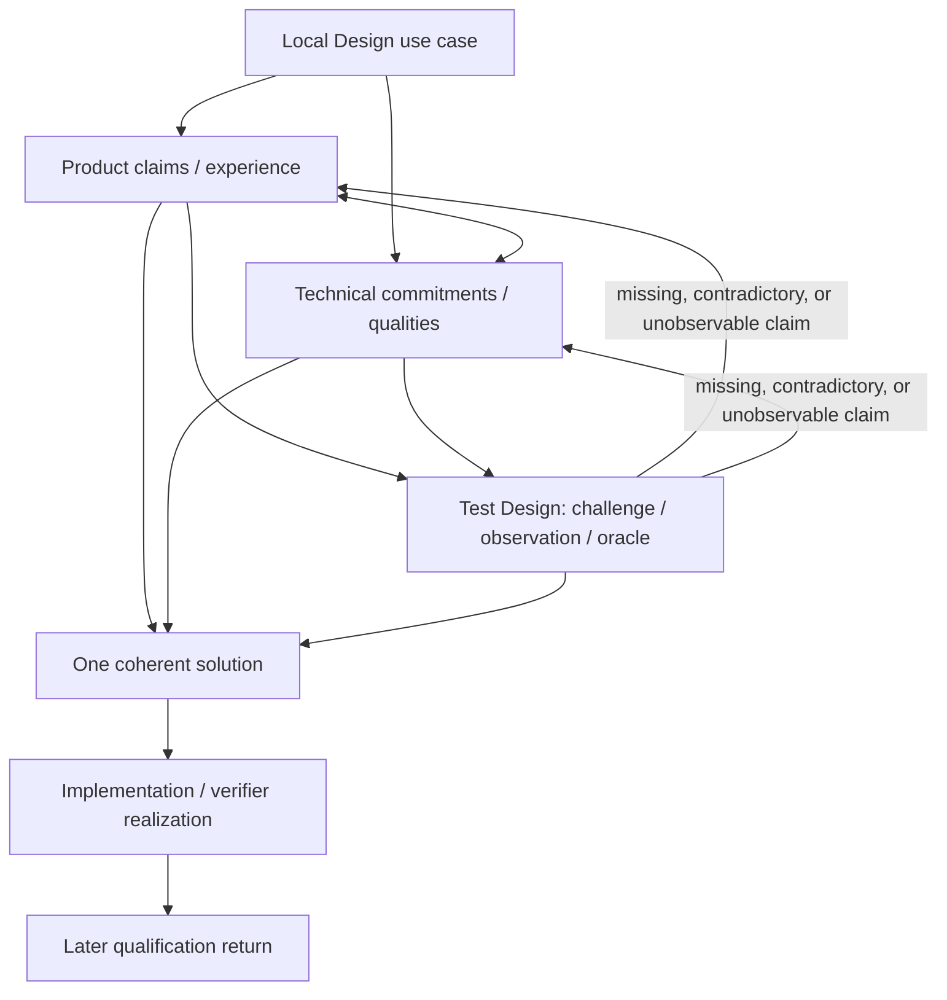

# Design Use-Case Routing and Test Design

- **State**: integrated; accepted at capability-model depth in `D-078`
- **Consumer**: `WP × P1 / 34-DS`; refines the `WP` / `TD` seam accepted in
  `D-071`
- **Question**: how Design should retrieve and compose methodology, thinking
  patterns, and taste through real use cases; how Product Design, Technical
  Design, and Test Design should relate
- **Inputs**: `D-068..D-071`, `D-073..D-075`, `D-077`, `V-178..V-181`,
  `V-205..V-208`, current `implementation-taste.md`, and Sir's corrections
- **Not decided now**: complete use-case catalog, exact files/directories,
  rewriting `implementation-taste.md`, templates, skills/sub-agents, or durable
  source mutation

## What `D-071` Solved and Missed

The accepted seam correctly separates:

- a small Design primitive
- cross-working authority/evidence/economic rules
- progressive general solution-shaping guidance
- specialist product/technical taste

It does not yet provide a reliable retrieval key. “First principles,” “deep
modules,” “sequence diagrams,” “ROI,” “removal forces,” and “UI taste” can sit
in their correct owners and still never be used at the decision where they
change the solution. A categorized shelf is not progressive disclosure unless
the Agent can recognize which shelf and items serve the current design problem.

The missing relation is:

> **design use case → relevant solution claims/forces → useful methods and
> taste → representative challenge/test → solution return**

Here a use case is a local recurring design pressure or decision, not a Task
type, lifecycle stage, document, or exclusive mode. One mixed Task can compose
many use cases.

## One Design Solution Has Three Projections

Retain the accepted one-solution model, but give three projections independent
management surfaces:

| Projection | Governing concern | Example use-case families |
| --- | --- | --- |
| **Product Design** | what users/stakeholders can perceive, do, understand, trust, recover from, and value | outcome/policy, workflow/interaction, information/state as experienced, feedback/error/recovery, permissions/explanation, adoption/change |
| **Technical Design** | how the system realizes, sustains, changes, and operates those obligations | responsibility/authority boundary, data/state lifecycle, interface/dependency, concurrency/failure/recovery, migration/compatibility, deployment/operability, performance/security/changeability |
| **Test Design** | how material Product and Technical claims will be challenged and observed well enough to guide realization and qualification | representative scenario/environment, observation surface, oracle/invariant, comparison/metamorphic relation, Human judgment, independence/TCB, residual qualification |

These are coupled projections, not phases or mandatory files. Independence
means each has a distinct design question, return, review pressure, and
downstream consumer. It does not mean three unrelated solutions or three
mandatory artifacts.

Product obligations constrain Technical Design; feasibility, cost, latency,
failure, and migration consequences can revise Product Design. Test Design is
semantically downstream of their claims: it has no authority to invent a
product expectation or technical contract merely to obtain a convenient
fixture or assertion. Its pressure can instead expose a missing,
contradictory, or unobservable Product/Technical claim and return that gap for
solution revision.

Product/Technical alone are still too broad to solve retrieval. They are the
first route, not the final content buckets.

## Organize Guidance Around Use Cases

A progressively loaded use-case unit should make five semantic relations easy
to recover without imposing a form:

1. **Use when / pressure** — what decision, ambiguity, coupling, risk, or
   quality concern makes this guidance useful
2. **Design question and return** — which portion of the product/technical
   solution must become coherent
3. **Consequential forces and claims** — which stakeholders, states,
   boundaries, failures, costs, or future changes materially constrain it
4. **Methods and taste that change the solution** — relevant reasoning,
   representation, causal model, heuristic, exemplar/counterexample, and
   counter-pressure
5. **Challenge / test design** — how representative consequences or
   discriminating observations can expose a wrong solution before or after
   realization

This is a semantic contract, not a mandatory card schema. One paragraph may
carry it for a small use case; a complex migration or interaction system may
need topology, sequence, examples, and deeper specialist guidance.

General techniques can keep one owner and be referenced from several use cases.
Do not copy “deep modules” or “first principles” into every section. But a
technique with no discoverable use case, predicted consequence, or
counter-pressure is inert content and should not enter the corpus merely
because it sounds wise.

## Concrete Routing Examples

| Local design use case | Product/technical obligations | Useful guidance loaded under pressure | Test-design projection |
| --- | --- | --- | --- |
| asynchronous user action | visible commitment, loading/cancel/retry/error experience; underlying authority and idempotency | interaction state/feedback taste, sequence/state representation, failure and reversibility reasoning | representative interaction including delay, retry, duplicate, cancellation, and external-result observation |
| introduce or move data authority | what the user/business believes is current; one canonical owner, provenance, consistency and migration | authority/data-shape taste, topology, deep-boundary and dependency reasoning | invariant/oracle across writes, reads, replicas, failure and migration states |
| remove a capability/entity | user transition and stranded expectations; dependency consumers, data, compatibility and rollback | impediment/attraction forces, stakeholder/ROI, topology, option/reversibility | representative old/new/coexistence paths and evidence that consumers no longer rely on the removed meaning |
| cross-version migration | continuity and recovery promise; coexistence, ordering, rollout and observability | sequence diagram, transition design, failure containment, operational taste | replay/shadow/differential or manual operational scenarios with rollback and residual boundaries |

These rows demonstrate the routing grammar; they are not the accepted final
catalog.

## Test Design Is Independent but Claim-Dependent

Test Design asks:

> **How will the important product and technical claims of this solution be
> challenged and observed well enough to guide realization and later
> qualification?**

Its possible return includes, only as useful:

- material product/technical claims and scope
- representative scenarios, inputs, environments, and failure conditions
- observation surfaces and discriminating outcomes
- oracle, invariant, metamorphic relation, comparison target, or Human judgment
- independence/TCB assumptions and error economics
- residual claims that remain unqualified

Automation is one later Implementation choice. A prototype walkthrough,
representative pen-input replay, usability observation, compiler/type relation,
manual migration drill, shadow traffic, or fuzzing harness can all realize a
Test Design differently.

Test Design is the third independently managed solution projection. Its
semantic input, however, must remain traceable to owned Product or Technical
claims. With no such claim, a proposed expected result is not a valid oracle;
the return is a specification gap rather than invented test design.
An exploratory probe may still be designed to discover behavior, constraints,
or risk, but its observation remains Inquiry/Design evidence rather than a
normative pass/fail qualification until an applicable claim is owned.

Independence prevents test reasoning from disappearing inside Product or
Technical prose and gives scenario/oracle/observation/TCB composition a clear
consumer surface. Claim-dependence prevents a late generic test plan, tests
that merely restate the implementation, and fabricated fixtures that prove an
expectation nobody owns. Keep local claim/testability pressure near its source
use case, while loading specialist Test Design depth for non-trivial
composition:

Each use case keeps its local material claims and testability close. The Test
Design projection owns reusable scenario/oracle/observation/TCB composition
when that work is non-trivial. Later automation or probe construction is
Implementation; verifier execution remains Verification capability. A passing
mechanism does not retroactively make either its oracle or the Design correct.

## Corrected Progressive Loading

The revised depth is:

1. **Design bootstrap** — Purpose / Use when / Return and the coupled
   forces ↔ solution ↔ consequences primitive
2. **projection route** — Product Design, Technical Design, Test Design, or a
   coupled use case; Test Design starts from owned Product/Technical claims
3. **use-case guidance** — load the smallest recurring decision/quality unit
   that fits the local problem
4. **methods and taste** — retrieve only causal models, techniques, heuristics,
   examples, and counterexamples attached to that use case
5. **Test Design depth** — load reusable verification-solution guidance when
   claim composition, observation, oracle, independence, or residual risk is
   non-trivial; return a specification gap rather than manufacture an oracle

The Agent enters through the design problem, not through a library taxonomy.
The same taste owner can serve several routes; the use case is a retrieval
projection, not a new authority or duplicate truth.

## Current Corpus Implication

`implementation-taste.md` already contains valuable Technical Design depth for
authority, provenance, naming, data/boundaries, complexity, and projecting
Design into code. Its current trigger—any non-trivial structural change—is too
broad to route among these concerns, and its topical headings do not connect
them to concrete design use cases across the three projections.

The eventual landing likely needs:

- compact Design bootstrap and routing under Working Protocol
- discoverable Product Design, Technical Design, and Test Design entries
- use-case-oriented progressive depth beneath or across those entries
- an independent but claim-dependent Test Design entry for non-trivial
  verification-solution work
- current Implementation Taste content retained or reorganized as Technical
  Design/implementation use-case depth rather than discarded

This is a functional shape, not an approved directory tree. Exact files wait
until the `TD` capability establishes enough real content, consumers, change
cadence, and retrieval pressure.

## Revised Proposition

Retain `D-071`'s ownership seam but refine progressive disclosure around
**Product Design / Technical Design claims ↔ local design use case → relevant
methods and taste ↔ independent Test Design → coherent solution**.

Treat Test Design as the third independent solution projection for how material
Product/Technical claims will be challenged and observed. It is independent in
information lifecycle and consumer, but dependent in semantic authority. It is
not automated testing, verifier execution, a late phase, or a source of new
requirements.

The decisive admission rule for a methodology or taste item is no longer only
“which owner holds it?” It must also answer: **for which recurring design use
case does loading this content change the solution enough to repay retrieval,
context, integration, and maintenance cost?**
