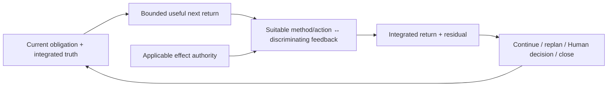

# Universal Working Control Guidance

- **State**: integrated; accepted at capability-model depth in `D-079`
- **Consumer**: `WP × P1 / 35-IQ`
- **Question**: what universal Working Protocol guidance remains after Task
  Packet control, foundational Working Methods, Verification capability, and
  closing concerns have distinct owners
- **Inputs**: `D-044..D-046`, `D-053..D-060`, `D-064..D-078`, current SVC
  Working Protocol, current-task dogfood, and the failure cases below
- **Not decided now**: durable wording/layout, specialist role behavior,
  detailed Human decision presentation, Verification depth, runtime/CLI state,
  or source mutation

**Terminology integration**: `D-080` retains the binding semantics below but
does not admit `Working Law` as another durable corpus concept. Prefer universal
or scoped Guardrail/invariant wording under the common-ground budget.

## The Problem Is Broken Connections, Not a Missing Process

A locally competent Agent can still fail a Task when:

- an action no longer serves the current Task obligation
- an activity is chosen before its useful return or consumer is clear
- confidence is mistaken for effect authority
- activity produces output without a discriminating feedback surface
- a tool, sub-agent, test, or Human comment remains an unintegrated candidate
- an actualized change, qualified claim, and accepted result are conflated
- new evidence does not replan, stop, or expose a residual obligation

Task Packet externalizes management-worthy state. Explore, Design, and
Implementation provide reusable ways of working. Verification qualifies claims.
None alone owns the relations that keep these parts attached to Task completion.
That connective contract is the remaining universal Working Protocol concern.

## Independent Case Derivation

| Case | Cheapest healthy behavior | Failure if universal control is absent |
| --- | --- | --- |
| clear, authorized, deterministic edit | make the bounded change, run a cheap relevant check, integrate/report | a mandatory process adds cost; no check or wrong owner creates silent damage |
| ambiguous defect | pursue the next discriminating information return, then revise cause/solution/work route | familiar activity drifts into premature implementation or evidence accumulation |
| Human design collaboration | independently explore and shape a decision-ready proposition; ask only for Human-owned judgment/authority | micro-approval wastes attention, while silent value/taste decisions appropriate Human authority |
| long multi-front Task | advance one owned Plan return, integrate its semantic consequence, then update only affected control/Human projections | local progress leaves stale Cells, false barriers, or a misleading `packet.md` |
| delegated candidate result | treat the return as a candidate, qualify the relevant claim, then integrate or reject it | actor trust or exhaustive rereading replaces bounded verification and ownership |
| low-uncertainty external effect without authority | stop at the effect boundary and return the exact authority need | epistemic confidence silently becomes permission |
| high-uncertainty reversible inquiry | investigate autonomously while the expected information value remains positive | uncertainty is mistaken for a reason to interrupt the Human |

The common behavior is not an Explore → Design → Implementation → Verification
pipeline. It is a small set of relations preserved around whichever method and
work topology the current situation needs.

## The Minimum Control Topology

This topology expresses four stable connections:

1. **Obligation → return** — consequential work advances a current Task/Track/
   Phase/Cell/Plan obligation through a bounded useful return and known
   consumer. For a trivial Task, the objective and final answer/change may
   carry this relation without a Plan or packet.
2. **Return → method and feedback** — choose Explore, Design, Implementation,
   a verifier, specialist guidance, tool, or delegated role because it can
   economically produce that return and import information that could change
   the next move.
3. **Action → effect authority** — bound durable/external state change by
   applicable permission, reversibility, blast radius, and guardrails.
   Confidence and uncertainty do not grant or revoke authority.
4. **Observation → integration and disposition** — observed output is a
   candidate until the applicable semantic/control owner integrates its
   meaning. Propagate only consequential changes, state residuals honestly,
   and continue from the resulting truth rather than the activity marker.

These are relations, not four fields or four mandatory spoken steps. Familiar
safe work compresses them into “understand, act, check, report.” A non-trivial
Task externalizes only the portions whose recovery, coordination, authority,
or review value repays maintenance.

## Guidance and Working Laws Have Different Force

The universal guidance is adaptive:

- choose a bounded return large enough to have management/consumer value, not
  the smallest possible action
- use the cheapest suitable method and most deterministic faithful action
  surface
- obtain feedback that can distinguish a material wrong result, proportionate
  to false-accept loss and rework cost
- reframe, replan, or return bounded-incomplete when the route is no longer
  supported; `TBC` is preferable to fictitious foresight

The stronger cross-working laws are narrower:

- a method, Slice tag, Plan position, confidence level, or successful command
  never grants mutation or external-effect authority
- a candidate output never becomes task truth merely because an Agent, tool,
  test, or Human stated it; integrate it according to semantic meaning and
  typed authority
- do not let `found`, `designed`, `actualized`, `qualified`, and `accepted`
  imply one another
- a bounded-incomplete return must expose its supported portion, material
  residual, consequence, and viable continuation; it is not success

The laws prevent authority and truth corruption. The adaptive guidance should
remain rebuttable when a cheaper route preserves the same obligations.

## Human Collaboration Is a Projection, Not Method Telemetry

The Human normally need not see which Working Method, internal action, or
feedback move the Agent is using. Human-facing control appears only when it
changes useful collaboration:

- before a consequential choice/effect: intended outcome, material boundary,
  relevant consequence, and the judgment/authority needed
- when current understanding changes materially: the resulting proposition,
  evidence horizon, uncertainty, recommendation, and consequence
- at handoff/closure: achieved horizon, qualification/acceptance boundary,
  residual obligation, and continuation if any

Safe read-only inquiry, review, reasoning, Task Packet maintenance, and option
generation proceed without approval. Pause when progress truly requires
Human-only intent, preference/taste, information, permission, material
trade-off, or acceptance—not merely because uncertainty or complexity exists.
Detailed decision-ready interaction remains a later proposition; it should not
inflate this universal control core.

## Why This Is Not a Lifecycle or Fourth Working Method

- No posture/method activation, pause, transition, or exit state is stored.
- No fixed order among Explore, Design, Implementation, and Verification is
  implied; any can call or reopen another through a new return.
- No Plan, packet module, progress event, status bar, or runtime interpreter is
  required by the topology.
- The Agent may stop any method at any point, while unsatisfied Task obligations
  remain visible in the applicable control owner.
- Write-back remains event-relative under `D-046`; there is no mandatory
  Semantic → Work → Human update sequence.

## Binding to the Three Outcomes

- **O-INTERACTION**: reserve Human attention for their information, values,
  authority, consequential judgment, and acceptance; expose decisions and
  residuals without method telemetry.
- **O-TASK**: every meaningful move remains connected to an obligation, useful
  return, feedback surface, integrated truth, and honest next disposition,
  reducing drift and false completion in long work.
- **O-SYSTEM**: effect authority, semantic ownership, and qualification verbs
  prevent locally successful changes from silently corrupting system meaning;
  replanning keeps low-cost change possible when reality disagrees.
- **S-SIMPLE**: simple work compresses to ordinary language and action; deeper
  control state appears only under real management pressure.

## Proposition for Review

Do not add a universal control SOP or new top-level Working Method. Retain one
compact Working Protocol topology connecting:

> **current obligation and truth → bounded useful return → suitable bounded
> action with discriminating feedback → integrated return and residual → next
> disposition**

Use effect authority as an independent gate on action. Treat the topology as
Agent guidance and the truth/authority distinctions as Working Laws. Project
only consequential state and Human-owned needs onto the collaboration surface.

Reopen if a relation cannot guide concrete action without a mandatory schema,
if ordinary work repeatedly pays translation cost, or if representative Tasks
need a stable control behavior not expressible by these relations plus the
three foundational Working Methods.
