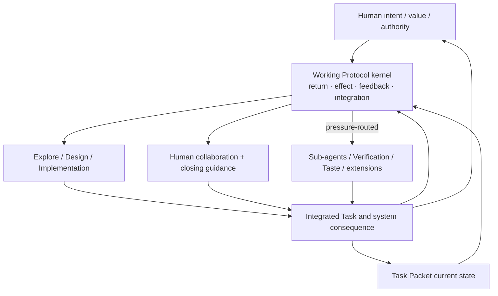

# Working Protocol: Current Inventory, Target Capability, and Domain Boundary

- **State**: integrated; accepted at capability-model depth in `D-080` and
  specialist-routing ownership refined by `D-082`
- **Consumer**: `WP × P1 / 36-IQ`
- **Question**: what Working Protocol contains today, what it should contain at
  the target capability depth, which outcomes it serves, and whether it is an
  umbrella domain
- **Inputs**: canonical `src/index.md` and `src/sections/working-protocol.md`,
  accepted `D-044..D-079`, and the five-cluster capability map
- **Not decided now**: exact files/directories, durable source mutation,
  migration compatibility, template changes, or final corpus wording

## Current Source Inventory

The current `src/index.md` states that Working Protocol owns “routing, task
state, mutation permission, and verification.” The current
`working-protocol.md` calls itself the consumer's single operational contract
and contains nine materially different concerns:

| Current section | Actual concern | Target pressure |
| --- | --- | --- |
| Interpret the Request | four request lenses | retain only if they improve orientation/routing; do not make request type a workflow |
| Resolve the Owner | semantic owner selection and durable destination | retain the universal owner/integration law |
| Agent Task Analysis | a specialized telemetry-evidence analysis method | move behind a specialist trigger; it is not universal work behavior |
| Choose the Working Posture | `Explore / Solidify / Execute / Diagnose` labels | replace with the accepted stateless Explore/Design/Implementation bootstraps and progressive depth |
| Keep a Task Control Surface | exact five-field `packet.md`, one template, optional diagnostics matrix | Task Packet owns package shape; Protocol owns only read/integrate/write-back and topology-pressure semantics |
| Load and Search Progressively | context/search loading and exclusions | retain progressive loading law; route deep query/tool behavior to Explore/specialist guidance |
| Mutation Gate | permission and Impact Handshake | retain typed effect authority; make ceremony proportional to real blast/owner pressure |
| Execute and Verify | owner-first mutation and proportional proof | split actualization from qualification; retain their universal seam and route specialist depth |
| Documentation Quality | durable-claim uniqueness and writing economy | keep semantic-owner integrity; route corpus/document style to its proper writing owner |

This is already an umbrella in practice: universal laws, local methods,
Task Packet shape, specialized analysis, verification, and writing policy share
one flat file. The problem is not only file length. Their triggers, consumers,
change cadence, and verification paths differ, so one owner encourages broad
loading, hidden coupling, and another monolith as new capabilities arrive.

## Target Purpose

Working Protocol should be the Agent-facing operational contract that answers:

> **Given the current Task obligation, integrated truth, and authority, how
> does the Agent choose and control a useful next return, use feedback, and
> integrate its consequence into an honest next disposition?**

The direct consumer is the acting/Lead Agent. Human benefit is mostly indirect:
predictable autonomy, decision-ready interaction, bounded effects, and honest
returns. Task Packet is its partial per-Task carrier, not its implementation.
Specialist guidance supplies deeper methods, not alternative protocol kernels.

## How It Serves the Three Outcomes

| Outcome | Working Protocol contribution | What it cannot supply alone |
| --- | --- | --- |
| **O-INTERACTION** | typed Human authority, autonomous safe epistemic work, critical but constructive treatment of Human claims, attention only for Human-owned information/judgment/effects/acceptance, consequential projections rather than method telemetry | product intent, personal taste, stakeholder legitimacy, or acceptance itself |
| **O-TASK** | obligation-to-return traceability, suitable Working Methods, feedback, event-relative integration, replan/TBC/bounded-incomplete/closure behavior, and recoverable Task Packet write-back | complete context, runtime cognition, or proof that a plan/task is correct |
| **O-SYSTEM** | semantic owner discipline, bounded effect authority, actualized/qualified/accepted separation, continuous accepted-delta integration, and routing to design/verification depth | the product/technical truth, design taste, verifier, or implementation mechanism itself |

It is therefore a causal mechanism serving all three outcomes, not a fourth
product goal. Its contribution is strongest where local Agent action must stay
connected to task completion, Human authority, and coherent system change.

## Target Ownership Shape

### Working Protocol directly owns

1. **Compact entry and universal Guardrails** — the four control connections,
   typed authority, truth/qualification verb boundaries, progressive loading,
   and honest bounded-incomplete behavior.
2. **Task-control seam** — how the Agent reads the current obligation/front,
   when control topology must grow/shrink/replan, and how event meaning writes
   back across semantic, work-control, and Human projections. Task Packet still
   owns the filesystem shapes.
3. **Foundational Working Method entry** — semantic bootstraps and progressive
   routes for Explore, Design, and Implementation, without method lifecycle or
   Human-facing telemetry.
4. **Human collaboration guidance** — typed authority, constructive challenge,
   decision-ready returns, attention/interruption boundaries, and acceptance
   seam.
5. **Integration and closing guidance** — continuous canonical-owner
   integration, pre-close stranded-delta check, pressure-triggered Agent
   work-system Retrospective, and honest no-op/residual returns.
6. **Navigation and capability seams** — make method-owned progressive depth
   and independent capability owners discoverable while universal authority,
   effect, feedback, and integration invariants remain intact; do not operate
   a parallel specialist router.

### It routes to, but does not semantically own

| Routed capability | Its own semantic depth |
| --- | --- |
| Task Packet | package growth, modules, Track/Phase/Cell/Plan/Slice/Step shapes, templates |
| Sub-agents | delegation economics, assignment interface, context isolation, certificate/verifier/effect/integration behavior, role specialization |
| Verification | claim surfaces, Test Design consumption, verifier/TCB choice, evidence composition, qualification and acceptance horizons |
| Tastes & Design Ability | Product/Technical/Test Design use cases, causal quality models, personal taste authority, heuristics and counterexamples |
| Corpus/document guidance | SVC corpus writing standard, durable-document-specific content contracts, controlled-language technique |
| Optional extensions and tools | multi-repo coordination, alignment, telemetry analysis, rules matching, query/tool specialization, deterministic transformations |

## Umbrella or Domain?

Two meanings must be separated:

- **Navigation umbrella: yes, narrowly.** An Agent can enter through one compact
  Working Protocol page for non-trivial work, learn the universal contract, and
  follow pressure-based links to deeper guidance.
- **Semantic umbrella: no.** Working Protocol must not become the authority for
  every method, artifact, role, proof technique, taste rule, or writing rule
  that it invokes.

The better model is **operational kernel + router**:

“Kernel” does not imply runtime software or a state-machine engine. It means
the small semantic contract every non-trivial move relies on. “Router” does not
mean a complete taxonomy; it exposes only triggers sufficient to find the next
relevant owner.

## Progressive Corpus Shape, Not Yet a Directory Decision

At the capability level, the target should disclose three depths:

1. **Always-cheap entry**: purpose, universal Guardrails, compressed control topology,
   Human/effect boundary, and routes.
2. **Working depth**: Explore, Design, Implementation, collaboration, Task
   Packet seam, integration, and closing guidance loaded when relevant.
3. **Specialist depth**: Sub-agent, Verification, Design/Taste, role/tool, and
   extension owners reached through pressure rather than copied into Working
   Protocol.

This may eventually use one entry plus several files, but capability ownership
must precede directory design. A single file is acceptable only while it
remains the cheapest clear projection; one file must not imply one semantic
owner for all routed content.

## Proposition for Review

Working Protocol is not the umbrella owner of “everything the Agent does.” It
is the small Agent-facing operational kernel that preserves task obligation,
return, authority, feedback, semantic integration, Human collaboration, and
honest disposition across different work topologies and specialist methods.
It may be the navigation entry for those concerns, while Task Packet,
Sub-agents, Verification, and Tastes & Design retain their own semantic owners.

Reopen if this boundary scatters indispensable rules so Agents cannot retrieve
them reliably, or if keeping method/capability depth under one semantic owner
performs better than kernel-plus-routing after progressive-loading cost is
counted.
