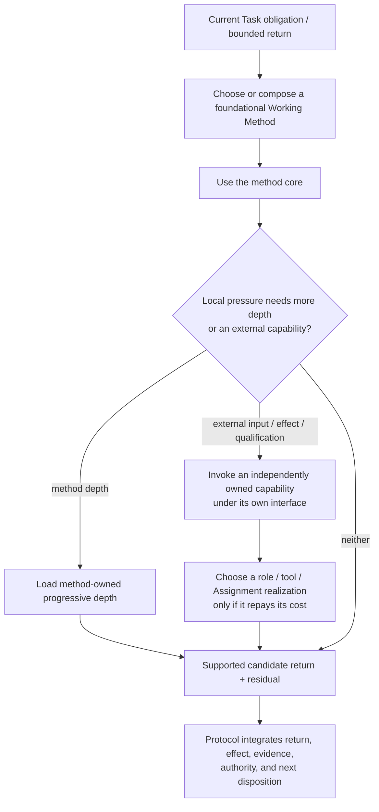

# Specialist Depth and Capability Seams

- **State**: accepted in `D-082`; exact corpus placement and real retrieval
  effect remain open
- **Consumer**: `WP × P1 / 38-IQ`
- **Question**: where pressure-loaded Working Method depth ends, and where
  independent specialist capabilities, roles, tools, and corpus navigation begin
- **Inputs**: `D-055`, `D-060`, `D-071`, `D-074`, `D-079..D-081`, the earlier
  version of this dossier, and Sir's observation that specialist guidance had
  become detached from Working Methods
- **Not decided now**: accepted role catalog, Sub-agent dispatch contract,
  verifier architecture, exact files/directories, tool realization, or source
  mutation

## The Earlier Proposition Mixed Three Different Things

The prior model put an Explorer method, Executor role, deterministic transform,
verifier, rule resolver, and document integrator behind one Working Protocol
`specialist route`. They do not have the same owner or use semantics:

| Object | What it changes | Natural owner |
| --- | --- | --- |
| **Working Method depth** | how the current method obtains its return under a recognizable harder case | the applicable Working Method and its progressively loaded guidance |
| **Cross-cutting capability** | supplies an independent input, observation, qualification, authority, or effect channel | Verification, Human collaboration, Sub-agent, context/rule, or another capability owner |
| **Realization** | packages who or what performs bounded work | role/profile, Assignment, deterministic tool, external system, or Human |

Calling all three `specialist guidance` hid the first object's attachment to a
Working Method and made Working Protocol look like a parallel method selector.
That is the ownership break Sir identified.

The causal mistake was:

> **Discoverable from the Working Protocol entry does not imply selected or
> semantically owned by Working Protocol.**

## Corrected Topology



The branch occurs **inside the work being performed**, after a Working Method
or concrete action exposes a pressure. It is not a sibling of Working Methods
under Working Protocol.

This remains stateless and non-ritual. A method may load one useful paragraph,
use a capability once, compose another method, or return bounded-incomplete;
none of those creates a specialist lifecycle.

## Local Progressive Guidance Stays With the Method

The already accepted method contract remains the primary shape:

```text
Purpose / Use when / Return
  -> core method
  -> local validity and bounded-incomplete behavior
  -> pressure-routed techniques, examples, taste, and interfaces
```

Examples:

- Explore owns routing to deeper system modeling, candidate generation,
  discrimination, and repository/tool-search guidance when those help obtain
  the framed information return.
- Design owns selecting and integrating Product, Technical, and Test Design
  guidance and relevant taste into a coherent solution.
- Implementation owns feedback-loop depth such as replay-driven adjustment and
  the local route to a known deterministic transformation when it helps realize
  the bounded intended change; the transformation tool remains its own
  realization/owner.

A substantive source may still have an independent semantic owner. For
example, architecture taste need not be copied into Design. But **Design owns
the use seam**: its guidance makes the pressure and route discoverable, loads
the relevant taste owner, and integrates the lens into the solution. Shared
ownership of content does not require top-level runtime routing.

## Cross-cutting Capabilities Are Interfaces, Not Guidance Depth

Some needs cannot be honestly modeled as more instructions for one Working
Method:

- Verification supplies a qualified observation or verdict about a claim.
- Sub-agent delegation supplies isolated execution under an Assignment,
  authority boundary, evidence, and integration contract.
- Human collaboration supplies intent, preference, consequential authority,
  or acceptance that an Agent cannot manufacture.
- A rule/context resolver may supply applicable constraints before a
  consequential action when ordinary source loading is unreliable.

The applicable method/action invokes these interfaces when needed. Their
owners define what they return, what authority they have, what evidence or
feedback qualifies the return, and when their cost is justified. Working
Protocol's universal connections from `D-079` already prevent candidate output
from silently becoming truth or effect; a second generic specialist-routing
algorithm would duplicate that control.

## What Working Protocol Still Owns

Working Protocol remains an operational kernel and a compact navigation entry.
It owns:

- discoverable entry to the foundational Working Methods
- the universal obligation/return, feedback, effect-authority, integration,
  and honest-disposition connections
- the Task Packet read/write-back seam and Human collaboration projection
- navigation to independent capability owners whose interfaces may be needed

It does **not** own one runtime `direct versus specialist` decision or a
catalog-wide specialist admission checklist. Method-local guidance owns local
depth selection; capability owners own their use/interface economics; later
Sub-agent or tool design owns the realization.

Therefore `D-080` needs a narrow refinement:

> Replace **specialist-routing contract** with **navigation and independent
> capability seams**. Keep kernel-plus-navigation; remove the implication that
> Working Protocol selects specialist guidance beside the Working Methods.

## What Survives From the Earlier Admission Test

The earlier six considerations remain useful, but at a different level:

1. recognizable recurring pressure
2. distinct result-changing capability
3. bounded return and consumer
4. authority/effect boundary
5. feedback/qualification path
6. net value versus the best simpler alternative

They test whether a **new reusable corpus surface, role, tool, or capability**
earns existence and maintenance cost. They are not ordinary runtime questions
for Working Protocol, and they need not appear together as a schema. Each
future owner may retain only the considerations that its own realization needs.

The direct/simple route also survives as a progressive-disclosure default, but
locally: do not load deeper method guidance, delegate, or add a capability when
the current bounded return can be produced reliably and economically without
it.

## Human Surface

The Human still need not see Working Method or specialist routing telemetry.
Expose the choice only when it materially changes outcome, cost, risk, effect
authority, taste/decision need, acceptance, or residual uncertainty. Explain
that consequence in Task language.

## Implication for the Rest of SVC

Working Protocol is one connective component, not the container for all SVC
substance. The target corpus still needs independently owned answers to several
different questions:

| Content domain | Question it answers | Relation to Working Protocol |
| --- | --- | --- |
| project truth and system contracts | what the product/system promises and where an expensive durable claim belongs | Protocol integrates an accepted delta; it does not own the claim |
| Task Packet | what volatile Task state and work topology must persist for Agent continuity and Human coordination | Protocol reads and writes through the Task-control seam; Packet owns the filesystem shape |
| Working Methods and their guidance | how to obtain a particular kind of useful return | Protocol makes the small basis discoverable and preserves control invariants; each method owns its method |
| Sub-agent capability | who may perform bounded work, with which snapshot, authority, certificate, verification, and integration cost | Protocol consumes the candidate return; Sub-agent design owns delegation |
| Verification capability | why a product/technical claim is qualified within a stated observation horizon | Protocol prevents qualification from being confused with actualization or acceptance |
| Tastes and Design Ability | what qualities, causal models, preferences, and trade-offs make one solution better | Design consumes the relevant lens; Protocol does not own the judgment content |
| corpus engineering and Developer Experience | how these owners remain concise, discoverable, versioned, packaged, migrated, and mechanically checked | Protocol is one routed corpus consumer, not the distribution/runtime owner |

This can be compressed into seven orthogonal questions:

```text
what is true?       -> project/system truth
what work persists? -> Task Packet
how is it done?     -> Working Methods
who may do it?      -> Human / Sub-agent / tool authority
why rely on it?     -> Verification
what is good?       -> Taste and Design Ability
how is it found and sustained? -> corpus / CLI / DX
```

Working Protocol answers a different question: **how do the current obligation,
method, actor, effect, evidence, authority, and integrated disposition remain
connected while work proceeds?** If the broad phrase `Working Protocol` absorbs
the seven answers above, it has become the semantic umbrella rejected by
`D-080`, regardless of the directory layout.

The current five Tracks are discussion obligations, not a promised final
directory taxonomy. In particular, discussing the foundational Working Methods
inside the `WP` Track does not prove that every line of method guidance belongs
to the universal protocol owner. Physical nesting may still support cheap
navigation, but it cannot decide semantic ownership.

## Revised Proposition for Review

Specialist **guidance** is progressively loaded from within an applicable
Working Method. Cross-cutting **capabilities** are independently owned
interfaces invoked by the current method/action, and roles/tools/Assignments
are later realizations of bounded work. Working Protocol makes these owners
discoverable and preserves universal integration/authority invariants; it does
not operate a parallel specialist router.

Reopen if real retrieval shows that method-local routes repeatedly miss
cross-method depth, if duplicated links cost more than a small common index, or
if a capability cannot be invoked consistently through the accepted universal
connections.
