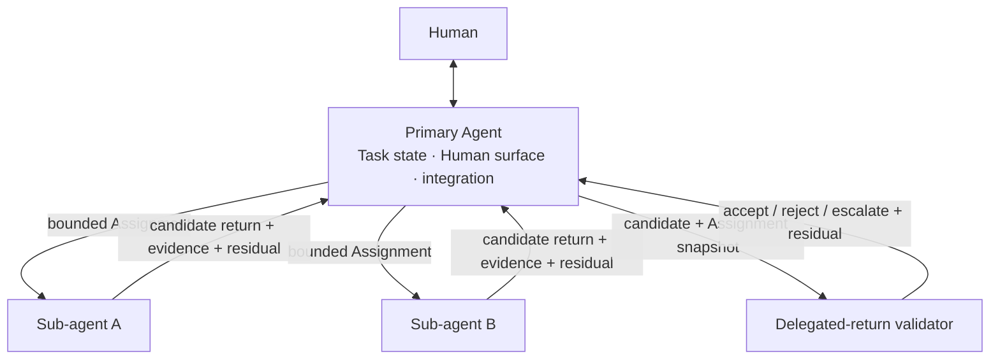

# Sub-agent Surfaces, Star Ownership, and Context Loading

- **State**: core split, authority-star ownership, and self-loading context are
  accepted in `D-083`; transport is successively refined by `D-085` and
  `D-087`. This dossier preserves earlier reasoning; current result routes are
  owned by [`design/78`](78-consumer-relative-sub-agent-result-routes.md)
- **Consumer**: `SA × P1 / 01-IQ`
- **Question**: what top-level Sub-agent capability surfaces SVC needs, and how
  context isolation changes when a child can load SVC and project instructions
  itself
- **Inputs**: Sir's two-part proposal and self-loading correction,
  [`design/02`](02-verifiable-context-isolated-delegation.md),
  [`design/03`](03-role-based-sub-agent-orchestration.md), and `D-079..D-082`
- **Not decided now**: preset role catalog, exact Assignment shape, five-level
  validator details, nesting, runtime APIs, files/directories, or
  source mutation

## Two Capability Surfaces

Sir's division is sufficient at capability-model depth:

1. **SVC-provided Sub-agent profiles** — reusable specialist work contracts for
   recurring pressures that genuinely repay a named role/profile.
2. **Sub-agent use guidance** — when to delegate, how to form an Assignment,
   project context, select a consumer-relative report or candidate/effect
   route, and integrate or reject its result.

Runtime spawning, waiting, cancellation, and host-specific model/profile
configuration are realizations behind those surfaces, not a third stable SVC
semantic domain. Consumer/project-specific roles may extend the profile set
without becoming SVC presets.

The surfaces are coupled. The earlier line below is retained as the problem
being corrected, not the current transport proposal:

```text
reusable profile + Task-specific Assignment + accessible shared context
  -> one Sub-agent invocation
  -> candidate return + evidence/certificate + residual
  -> delegated-return validation and Lead integration/disposition
```

It accidentally implies both that the Primary relays all `Y/W` and that every
delegated result needs validation. `design/76` repairs the candidate/effect
case; `design/78` adds the separate information-report route.

A preset profile is not useful merely because its name is familiar. Its value
must be measured through repeated Assignments under the use model.

## Star Ownership Model

The diagram in this section records the earlier, now-superseded data-flow
implication. It must be read only for the retained ownership rule: Primary
holds global authority; Child holds bounded work/effect authority. `design/78`
owns the active consumer-relative routes.



The Primary retains the coupled Task objective, Human interface, Task Packet
control, unresolved decisions, cross-return integration, and residual-risk
disposition. A Sub-agent owns only its Assignment and authorized effect surface.
Sub-agents do not coordinate hidden shared commitments with one another; the
Primary mediates cross-Assignment dependency and integration.

The star runtime does not imply that all work is serial. Independent frontier
Assignments may run concurrently. Shared-worktree concurrency still requires
one writer per mutable target or another explicit authority boundary; context
isolation does not provide state isolation.

## Context Is Loaded, Not Necessarily Transmitted

The earlier phrase “give the smallest sufficient context” is too easy to read
as “Primary must serialize every applicable instruction and fact.” Separate
three sources:

| Context source | Default supply | Purpose |
| --- | --- | --- |
| reusable profile/instructions | already present in the selected profile or loaded through its canonical SVC handle | stable method, invariants, return expectations, and role boundaries |
| shared discoverable context | Sub-agent reads applicable SVC corpus, root/local instructions, durable docs, and source progressively | canonical reusable/project truth; avoid prompt duplication and version drift |
| Task-specific projection | Primary sends the bounded delta the child cannot safely infer from shared sources | objective, current interpretation, relevant Task state, scope/effect authority, material assumptions, return/stop/integration need |

Therefore the default delegation brief is **delta plus handles, not a bundled
copy of SVC or the Lead conversation**. The isolation benefit comes mainly from
excluding accidental conversational history, unrelated branches, discarded
hypotheses, and broad Task state. Stable shared rules are not harmful merely
because both Agents know them.

Self-loading still has boundaries:

- access to SVC/project instructions must actually exist in the execution
  environment
- the selected profile must know where to start and load progressively rather
  than read the whole corpus
- a decisive but non-obvious local constraint may deserve an explicit handle
  in the Assignment even if it is technically discoverable
- when concurrent mutation or stale-state loss is material, the Assignment may
  need a bounded snapshot identity, owned-file boundary, or freshness
  precondition; this is pressure-loaded, not universal ceremony
- the Sub-agent should cite the material sources/rules it relied on when that
  affects validation or integration

This transforms the context paradox from “how much text must the Primary copy”
into two narrower judgments: what Task-specific state crosses the boundary, and
what reusable/shared sources the child must discover for its return.

## Profile and Assignment Stay Distinct

A **profile** supplies recurring specialization: recognizable purpose, distinct
method/knowledge/interface, default authority boundary, characteristic return,
tools, and failure modes. It should remain stable across Tasks.

An **Assignment** binds one invocation: bounded objective/return, relevant Task
projection and source handles, allowed effect surface, material assumptions,
stop/escalation condition, evidence expectation, and integration consumer.
These are semantic obligations, not mandatory fields; a cheap Assignment may
compress them into one sentence.

Do not put Task-specific facts in the profile or recopy generic SVC method
guidance into every Assignment. Conversely, do not rely on a role name to
communicate a Task-specific decision, snapshot, authority, or acceptance
horizon.

## Delegated-return Validator and Reviewer Are Different Categories

Use **delegated-return validator** as the full term and **validator** inside the
Sub-agent surface when a candidate/effect route actually needs one. It judges
whether one candidate satisfies a bounded Assignment/integration property with
acceptable validation cost and residual risk. Explorer-style semantic reports
have no generic validator under `D-087`.
The name points to the object being judged and avoids reading “Sub-agent
verifier” as an Agent role.

Sir's current five-level scaffold belongs specifically to delegated-return
validation:

1. exact validator
2. relational validator
3. probabilistic validator
4. structured argument
5. not cheaply verifiable

These are not five Sub-agent types and are not proposed as a taxonomy for
general Verification solutions. They estimate the cost and reliability of
accepting one delegated return. Moving toward structured argument or no cheap
validation normally raises Lead review, false-accept, false-reject, and rework
pressure; exact or relational validation can make delegation economical when
it faithfully covers the Assignment return. The precise levels and their
effect on delegation admission belong to `SA`.

A **Reviewer Agent is not a validator** merely because it reviews. It may:

- challenge a claim, specification, candidate, or verification plan
- find counterexamples or missing observation surfaces
- construct, execute, and orchestrate a complex delegated-return validation
  plan over actual mechanisms
- collect certificates, reconcile conflicts, and report uncovered residuals

Those activities still produce an Agent candidate. Trust remains in the
invoked mechanisms and applicable integration/acceptance authority. Any
Reviewer synthesis not entailed by those results remains structured argument,
not an inherited verdict. A fresh Agent using the same model and evidence path
is therefore not an independent trusted computing base.

The `SA` Track owns the validator model because validation cost and residual
loss are part of whether delegation is worthwhile. General `VF` mechanisms may
later be reused by a validator, but this five-level scaffold neither defines
nor constrains the general Verification capability.

## Recommended Discussion Order

The two surfaces need not be discussed in the order listed. Derive **use**
first, then admit **presets**, because a role's value cannot be judged without
the Assignment, cost, validator, authority, and integration model it will use:

1. causal delegation benefits, validator strength/cost, and total-cost admission
2. Assignment/context/effect/return boundary in the star model
3. validation, independence, integration, reuse/freshness, and concurrency
4. candidate SVC preset profiles derived from recurring profitable boundaries
5. rough corpus/profile landing and simple-task counter-pressure

This is a discussion route, not a runtime delegation lifecycle.

## Historical Proposition

The following proposition led to `D-083` but predates the consumer-relative
route correction in `D-087`; do not use it as the current complete SA model.

Model SVC Sub-agents through two coupled surfaces: reusable SVC-provided
profiles and general use guidance. In the default star model, the Primary owns
global Task/Human/integration state; each child owns one bounded Assignment.
The child obtains stable SVC/project context from its profile and canonical
sources, while the Primary sends only the Task-specific projection and material
handles needed at the boundary. A delegated-return validator is a mechanism
for deciding whether one candidate is economical and safe enough to integrate,
not a Sub-agent role or a general Verification taxonomy. A Reviewer Agent may
execute or orchestrate a complex validation plan but does not become the
validator by role. Derive the use/economics contract before selecting the
preset role catalog.
