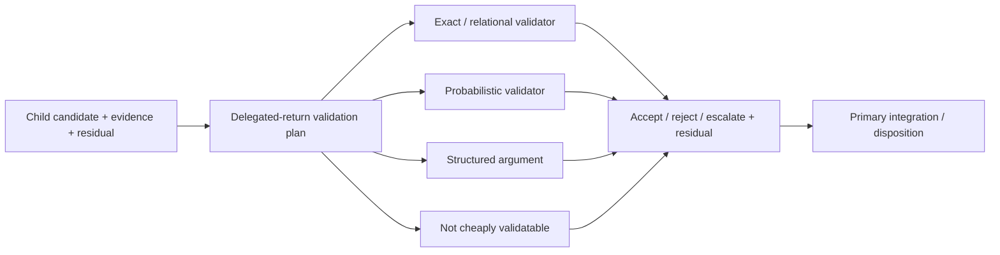

# Sub-agent Causal Benefits and Admission

- **State**: three causal levers and lever-specific economics accepted in
  `D-084`; result-validation assumptions are refined by `D-087`. For report
  routes, semantic consumption/claim-checking replaces generic validator cost
- **Consumer**: `SA × P1 / 01-IQ`
- **Question**: what a child Agent can causally improve over the best direct
  alternative, and when that improvement repays the new boundary
- **Inputs**: `D-083`, Sir's delegation-cost and proof-carrying-work gleanings,
  [`design/02`](02-verifiable-context-isolated-delegation.md),
  [`design/03`](03-role-based-sub-agent-orchestration.md), and the corrected
  validator/Reviewer boundary in [`design/73`](73-sub-agent-surfaces-and-context-loading.md)
- **Not decided now**: numeric thresholds, runtime policy, nesting, preset
  profiles, exact Assignment schema, validator-level details, or source layout

## The Counterfactual Is the Best Direct Alternative

“A child can do this work” is not an admission reason. Compare delegation with
the cheapest credible alternative:

- the Primary does the work directly
- the Primary progressively loads the same specialist guidance or tool
- a deterministic search/transformation/verifier performs it
- the Human or another real authority supplies the irreducible judgment

Delegation is useful only when a distinct causal advantage improves the return,
Lead capacity, or elapsed time enough to repay boundary formation, child work,
delegated-return validation, integration, conflict, false-accept, and rework
cost. Sir's existing cost model supplies the error economics; no new pseudo-
precise score is needed.

## Validator Is an Assignment-local Economic Mechanism

The formula below identifies the object of validation, not a mandatory message
route. `D-085` rejects the old reading—Child sends `Y/W` to Primary, which then
forwards or reviews them—because it defeats attention partition. The accepted
capability-level carrier/validator/escalation route is in
[`design/76`](76-sub-agent-transport-and-escalation-reopening.md).

For one Assignment, use the scoped form:

```text
Assignment/specification S + relevant snapshot X
  + candidate return Y + evidence/certificate W
  -> delegated-return validator
  -> accept / reject / escalate + explicit residual
```

Its purpose is not to prove the product or system generally correct. It makes
one integration decision cheaper and safer. The five levels directly change
the delegation calculation:

| Validator level | Delegation consequence |
| --- | --- |
| exact | low repeated validation cost and compact verdict can strongly favor delegation, within the encoded Assignment |
| relational | economical when an invariant, baseline, metamorphic relation, or independent comparison captures the material return obligation |
| probabilistic | useful when confidence and false-accept loss remain compatible; the residual must stay visible |
| structured argument | Lead reading/challenge cost rises and may consume much of the delegation saving |
| not cheaply validatable | delegation normally needs a narrower return, bounded/advisory effect, exceptional causal benefit, or should not occur |

Therefore validator design is left-shifted into Assignment shaping. When a
useful return initially lands at an expensive level, first try to narrow the
claim, change the return carrier, add a certificate, expose an invariant, or
separate the cheaply validatable portion. Do not assume every Task can or
should be forced into exact validation; the purpose is economic discrimination,
not proof ceremony.

## A High-leverage Production Boundary Resembles a Deep Module

The useful analogy is not a miniature employee but a **deep module**:

```text
compact profile + bounded Assignment + material handles
  -> substantial isolated internal work and local feedback
  -> compact candidate return + evidence + residual
  -> Primary integration / disposition
```

The boundary is attractive when the internally relevant context and work are
large, but the Task-specific input and integration return are comparatively
small and stable. A child may read a great deal; the Primary should not have to
absorb the same local context merely to delegate or integrate it.

This gives the context paradox a sharper test for sustained inquiry or
production work: **is there a low-coupling, high-internal-work boundary?** If
the Primary must transmit the whole Task, continuously coordinate decisions,
or reread the child's full trajectory, the proposed boundary is shallow and
context isolation probably loses.

This is an ideal shape, not a universal admission condition. A short,
independent challenge may be worthwhile because it changes candidate coverage
even though little work is hidden behind the boundary. Conversely, a deep
boundary is not sufficient when its return cannot be consumed or validated
economically. Boundary depth predicts the leverage of recurring production
delegation; it does not define every legitimate Sub-agent use.

## Three Causal Levers

| Lever | Causal change over direct work | When it is real | Common false substitute |
| --- | --- | --- | --- |
| **attention partition** | local high-volume facts, hypotheses, and feedback stay out of the Primary's coupled Task context, preserving its global synthesis capacity | a bounded return compresses substantial locally relevant context or isolates a distracting branch | giving a child a small prompt for work whose global coupling it must rediscover |
| **trajectory shaping** | the child follows a deliberately focused, specialized, or meaningfully different search/feedback path instead of extending the Primary's current path | a stable method/tool/local loop improves execution, or a genuinely different lineage improves candidate coverage | naming a role whose guidance the Primary could load once; treating a correlated second opinion as validation |
| **capacity scaling** | ready, low-coupling work progresses concurrently and can reduce critical-path time | inputs and effects are sufficiently independent and returns do not create serial integration rework | parallelizing coupled work and moving the elapsed time into coordination, merge, or conflict repair |

The two forms of trajectory shaping have different returns. Specialization aims
to improve one candidate through a better local method or feedback loop;
diversification aims to change candidate coverage or expose a blind spot. The
latter can justify a shallow challenge, but it does not qualify the challenged
result. Attention partition is the central long-Task benefit, while trajectory
and capacity gains can multiply it. Capacity scaling changes elapsed time, not
total work, and the Primary's fan-in/integration bandwidth remains the star
topology's scaling ceiling.

## Each Lever Has Different Economics

The three levers do not merely use different coefficients in one delegation
formula. They change different scarce quantities and therefore require
different counterfactual returns. Let `C_extra` denote the incremental boundary,
child-resource, validation, integration, coordination, conflict, and expected
residual/rework cost of delegation relative to the best direct alternative.
The following expressions are reasoning forms, not measurable universal scores.

### Execution capability is a constraint, not a fourth benefit

A Child may run with a different or weaker effective model, tool access, or
context budget than the Primary. That does not create another causal benefit;
it changes the probability of a useful return and the cost of trusting it.
Assignment size and ambiguity must therefore fit the actual execution
capability, not the role's aspirational name. A broad synthesis that would
require high global reasoning, many mutually dependent sources, or recovery
from ambiguous evidence stays with the Primary unless the Child's model and
validator make that risk economical. Otherwise apparently freed attention is
merely moved into Primary reconstruction and rework.

### Attention partition: value scarce Primary capacity

```text
V(Primary attention freed
  + context interference/recovery avoided
  + best alternative use of preserved capacity)
> C_extra
```

The observation target is not token count. It is whether the Primary avoids
absorbing local evidence/trajectory while retaining enough compressed return
to integrate globally, and whether this reduces rereading, forgotten global
obligations, branch interference, or displaced high-value work. Primary review
inside the validator belongs on the cost side and can erase this benefit.

### Trajectory shaping: value a changed result distribution

Specialization and diversification share a causal family but not an economic
return:

```text
specialization:
E[value or avoided loss from better candidate / fewer local feedback failures]
> C_extra

diversification:
P(materially different supported finding)
  * value of the decision it can change or loss it can avoid
> generation + comparison + follow-up cost
```

The second form is an expected-value-of-information judgment. A challenge can
be useful without qualifying the original candidate: its bounded return may be
that a material counterexample, assumption, or alternative deserves entry into
the candidate set. Its evidential burden follows that claim rather than
pretending the challenger has proven the final decision wrong.

### Capacity scaling: value critical-path time

```text
V(reduction in critical-path time)
> parallel resource premium
  + orchestration/conflict/speculation cost
  + serialized validation/integration burden
```

Parallel completion outside the critical path has no time return. If inputs are
not ready, effects conflict, or the Primary cannot consume the fan-in, apparent
parallelism becomes speculative work or a later serial bottleneck.

### Combine through Task value, not a universal numeric score

One Assignment may produce multiple levers. Do not add independently estimated
benefits when they describe the same avoided work—for example, counting fewer
Primary work hours once as attention savings and again as elapsed-time savings.
Keep the consequence vector visible instead:

```text
Primary attention/coupling | expected result/information value
| critical-path time | resource cost | residual loss
```

The Task's stakeholders, constraints, reversibility, and cost of delay determine
the trade. SVC needs causal discriminators and counterfactuals, not fictional
globally comparable units or a mandatory calculator.

## What Is Not an Intrinsic Benefit

- **More Agents or tokens**: resources matter only through one of the causal
  changes above.
- **Responsibility transfer**: the Primary retains Task integration and Human
  accountability.
- **Effect containment**: useful and sometimes mandatory, but created by real
  authority/runtime boundaries, not by a role label.
- **Validation**: accepting the delegated return has its own cost/control
  surface. A Reviewer Agent does not become the validator by role.
- **Complete context copying**: shared SVC/project truth should be discovered
  canonically; copying it adds drift and boundary cost.

## Minimum Economic Admission Test

The following are reasoning questions, not required fields or a spawn ritual:

1. **Boundary and return** — is there a bounded candidate return that the
   Primary knows how to consume, and how much local work/context can it avoid
   absorbing? A shallow boundary may still be valid for a cheap challenge.
2. **Distinct advantage** — which causal lever changes the counterfactual
   compared with direct work or a deterministic tool?
3. **Validation and integration** — can the return be validated at the needed
   level and integrated more cheaply than redoing the work?
4. **Effect and freshness** — can mutation authority, shared-state conflict,
   stale inputs, and unqualified impact be bounded proportionately?

Failure of one question does not prove that delegation is forbidden. It names
the cost or risk that must be outweighed. Cheap reversible exploratory
delegation may tolerate weak validation; a high-impact mutation cannot.

## Delegated-return Validation Consequence

The return path should not be modeled as `Executor Agent -> Reviewer Agent ->
truth`. A more faithful topology is:



A Reviewer Agent may execute/orchestrate the plan when validation is complex.
It can select and run mechanisms, preserve input/certificate identity, expose
conflict, and assemble residuals. Its choice of coverage and any non-entailed
synthesis remain structured argument; the role name lends it no validator
authority. This topology is scoped to Sub-agent result admission and does not
claim to model general Verification solutions.

## Simple Discriminators

| Work | Better default and reason |
| --- | --- |
| known symbol/file lookup | direct query; no deep internal boundary |
| causally related mechanical multi-file rewrite expressible in AST rules | deterministic transform plus verifier; an Agent adds little |
| ambiguous multi-repository dependency inquiry with a compact supported map as return | child may repay through focused context capacity |
| bounded implementation/replay loop with a task-specific discriminator | specialist child may repay through a persistent local trajectory |
| another Agent given the same prose to “validate” a return | at most diversified critique or structured argument; not independent validator authority |
| compiler/type/test execution for a delegated return | invoke the mechanism directly; use an Agent only if the validation plan is complex |
| two ready Assignments with disjoint effect ownership | concurrency may reduce critical-path time |

## Proposition for Review

Admit delegation by counterfactual value, not role familiarity. Recurring
production delegation should usually expose a deep boundary: compact
Task-specific input and return around substantial isolated work. Short
challenges may instead repay through changed candidate coverage. The causal
levers are attention partition, trajectory shaping, and capacity scaling;
delegated-return validation cost, effect containment, and responsibility remain
distinct control concerns. A Reviewer Agent can execute or orchestrate a
complex validation plan, but role identity cannot turn correlated reasoning
into a trusted verdict.
