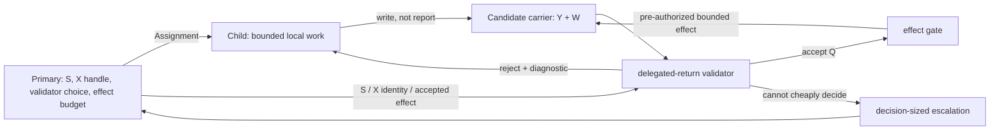

# Sub-agent Transport, Validation, and Escalation Reopening

- **State**: `D-085` remains accepted for candidate/effect work and is refined
  by `D-087`; the topology below is not a universal delegated-result route
- **Consumer**: `SA × P1 / 01-IQ`
- **Question**: how can the Primary retain Task authority without becoming the
  default relay or validator for every Child result
- **Accepts**: `D-085`, refining the candidate/Return transport implied by
  `design/73` and `design/74`; it does not reopen the accepted two-surface,
  authority-star, or context-self-loading boundaries in `D-083`

## Failure Exposed by the Field Study

The earlier shape treated a Child's “Return + evidence + residual” as a message
for the Primary, followed by validator and integration. This conflates an
**authority star** with a **data-flow star**. It makes the Primary either:

1. the de facto delegated-return validator, which imports the local evidence
   and trajectory that isolation was meant to exclude; or
2. a forwarding hub between Child and validator, which still imports and
   serializes every local result.

The failed cross-session dogfood was a concrete instance: the Child's broad
synthesis could not be judged from its Return, so the Primary had to reconstruct
raw telemetry. Shortening the report would reduce volume, but would not repair
the topology.

## Separate the Objects Before Choosing a Transport

Do not use one unqualified word, `Return`, for four different objects:

| Object | Consumer | Meaning |
| --- | --- | --- |
| **Candidate `Y`** | validator / effect gate | the proposed patch, source map, probe result, or other work product |
| **Certificate `W`** | validator | machine-checkable proof, cited observations, logs, tests, provenance, or structured argument supporting the bounded claim |
| **Verdict `Q`** | effect gate; occasionally Primary | accept, reject, or cannot-cheaply-decide for the particular `S, X, Y, W` relation |
| **Escalation `E`** | Primary, then perhaps Human | the smallest validated or explicitly unvalidated issue that materially changes global route, authority, or a decision |

A local limitation is carried with `Y/W` for validation. It reaches the
Primary only when it becomes a **material residual**: something that prevents
the current global obligation, changes its loss/risk, or requires a new owner.

## Provisional Transport Topology

This topology now applies only when the delegated product is a candidate meant
to enter a controlled effect/integration surface. Information work whose
consumer needs a semantic answer uses the report route in
[`design/78`](78-consumer-relative-sub-agent-result-routes.md).



The **carrier** is an assignment-specific, directly addressable place: for
example an isolated branch/patch, structured evidence file, test result,
artifact, or external-system record. SVC need not prescribe its runtime form.
What matters is that the validator can consume `Y/W` without the Primary
copying their contents into conversational context.

On rejection, the diagnostic returns directly to the Child's local loop. On
acceptance, a pre-authorized bounded effect may be applied or marked ready by
the effect gate. The Primary receives an ordinary status notification at most;
it need not read the candidate or certificate. An escalation is exceptional and
must be decision-sized rather than a dump of local work.

## Consequence for the Star Model

The default star remains an **authority and commitment topology**:

- Primary defines the Assignment, selects/authorizes its validator and effect
  budget, owns cross-Assignment conflict, Task state, and Human authority.
- Child owns local execution within the Assignment boundary.
- Validator owns the bounded predicate, not global product correctness.

It must not be read as “every Child message first enters Primary.” Evidence and
repair traffic can bypass the Primary through a carrier and validator. A
Primary is a valid direct validator only when the return is intentionally so
small and consequential that this review cost survives the admission test; it
is not the default meaning of integration.

If a candidate necessarily requires broad semantic synthesis by the Primary,
it is a **decision-support escalation**, not a normal attention-partition
return. It may still be worth delegating for trajectory diversification, but
its structured-argument and Primary-consumption cost must be stated honestly.

## Working-Method Consequence

A Working Method specifies how an Agent locally transforms its current state;
it does not specify that its local result becomes a Primary-facing message.
Within a Child Assignment, a method result becomes either a semantic report or
`Y/W` in a candidate carrier according to its consumer. The Sub-agent
capability owns the additional routing question:

```text
local Method result
  -> semantic consumer report
  OR
  -> candidate/support carrier -> validator/local repair -> effect/escalation
```

Thus a Primary may use Explore directly; an Explorer-shaped Child may use
Explore plus Model/Discriminate and return a compressed report; and an
Executor-shaped Child may use an Implementation loop plus local Explore/Design
when its discriminator finds a mismatch. A profile is justified only when it
supplies a recurring work boundary and an economical consumer-appropriate
route—not merely another copy of Method guidance.

## Current Open Tests

1. What is the smallest Primary-facing acceptance/status notice that retains
   useful Task control without becoming another report?
2. Which candidate/validator routes can be generic SVC guidance, versus being
   project-specific mechanisms?
3. How should a rejecting validator re-enter the Child's local feedback loop
   while observing retry/effect budgets?
4. Does an Explorer report save more context than its semantic consumption
   costs, and does an Executor-shaped profile have a sufficiently recurring
   realization/qualification route?
