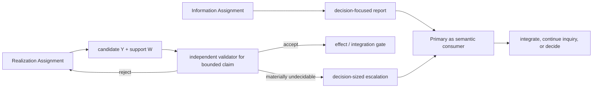

# Consumer-relative Sub-agent Result Routes

- **State**: accepted correction in `D-087`
- **Consumer**: `SA × P1`
- **Question**: when should delegated work return a report to the Primary, and
  when should a candidate bypass the Primary through a validator and effect
  gate

## Correction

`D-085` correctly separated the authority star from candidate/evidence
transport, but overgeneralized one transport topology. A delegated result is
not defined by who produced it. Its route follows what the downstream consumer
needs to do with it.

Two recurring routes are sufficient at this depth:

### Report route

Use this when the Primary or another semantic owner needs an answer, model, or
decision support. The report should be shaped by the original question:

- answer or material findings first;
- decisive source handles and observations;
- conflicts, uncertainty, freshness limits, and scope limits that change use;
- the next discriminator only when the answer remains materially incomplete.

There is no generic delegated-return validator. The Primary must understand
the report because understanding is the intended benefit. Selective source
inspection, comparison, or follow-up inquiry checks claims as needed; it is
semantic consumption, not proof that the Child “completed its work.” The
delegation pays only when avoiding the local retrieval trajectory costs more
than reading the compressed report and checking consequential claims.

### Candidate/effect route

Use this when a Child produces a patch, configuration, artifact, migration, or
other candidate intended to enter a controlled effect surface. Here `Y/W/Q/E`
and proof-carrying ideas apply:

- `Y` is the candidate;
- `W` is only as strong as its actual form: mechanical proof, traceable
  evidence, or structured argument must not be conflated;
- a validator judges a bounded relation or property, not the actor and not
  global correctness;
- bounded rejection returns to the local feedback loop;
- accepted verdict enters only the authorized effect/integration gate;
- only material global ambiguity or authority change reaches the Primary as
  escalation.

Determinism does not make a wrong proposition trustworthy. The trusted base
still includes the claim/owner, inputs, oracle/relation, environment, verdict
interpretation, and effect boundary.

## Consequences

- The default authority star remains: Primary owns Task/Human/cross-boundary
  authority; Child owns a bounded Assignment and authorized effect surface.
- No universal `Return + evidence + residual`, result envelope, certificate,
  validator, or Reviewer stage is admitted.
- Working Methods describe local work. The Sub-agent profile adds the
  isolation boundary and consumer-appropriate result route; it does not copy
  method guidance.
- Child model, context window, tools, freshness/snapshot, and recovery ability
  constrain Assignment size. Delegation does not make context rot disappear.
- A report route can later feed Verification claim by claim. That does not
  retroactively turn the whole report into a validator candidate.

## Pressure Tests

- **Direct lookup**: Primary should query directly; an Explorer report adds
  briefing and reading cost without isolating meaningful work.
- **Broad synthesis requiring all raw evidence**: keep it with Primary or split
  by independently useful question; delegation otherwise moves rather than
  removes context load.
- **Mechanical multi-file transformation**: prefer a deterministic transform;
  use an Executor only for uncertainty, exceptions, and feedback.
- **Human taste judgment**: a Child can prepare alternatives/replay, but the
  Human-facing acceptance remains with the Primary/Human authority.

