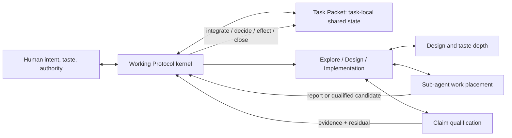

# P1 Capability Reconciliation

- **State**: accepted; `P1 — Capability Model` closed
- **Consumer**: `P1 — Capability Model`
- **Scope**: reconcile the five capability returns without selecting the exact
  source migration or claiming real-task effect

## One System, Five Owners

- Task Packet carries only the task-local state whose persistence and sharing
  reduce coordination/recovery cost.
- Working Protocol is the compact operational kernel and navigation seam, not
  the semantic owner of every capability.
- Working Methods organize local problem solving without lifecycle ceremony.
- Sub-agents decide where bounded work should run and how its consumer receives
  the result; they do not create a fixed team pipeline.
- Verification qualifies owned claims; acceptance remains with the consuming
  authority/effect gate.
- Taste provides progressive Design judgment while preserving project truth,
  Sir's preference, and rebuttable general guidance as different authorities.

## Cross-seam Corrections

1. An Explorer report is consumed semantically; it is not forced through a
   delegated-return validator. An Executor candidate intended for effect is.
2. Test Design chooses meaningful challenges from Product/Technical claims;
   Implementation builds their mechanisms; Verification executes/interprets
   them; authority disposes the result.
3. Taste may determine what “good” means and which consequence to inspect, but
   Verification cannot turn a preference into universal truth. Human/visual
   judgment is a valid observation surface when the claim calls for it.
4. Task Packet can project current claims, Plans, decisions, evidence, and
   residuals, but does not acquire their semantic ownership or require a new
   module for each capability.
5. Every deeper surface is progressive: direct Primary work, existing owners,
   deterministic mechanisms, and simple local evidence remain the default
   counterfactuals.

## Provisional Landing Set

The capability model predicts a small source change set, not implementation
authority:

- shrink `src/sections/working-protocol.md` into the kernel/router already
  designed by `WP`;
- keep the accepted task-packet growth surface and templates under `TP`;
- add compact `sub-agents.md` and `verification.md` capability owners;
- add one compact Design/taste router and reuse `implementation-taste.md`;
- update `src/index.md` navigation and generated projections/tests only as the
  later Impact Handshake requires.

No CLI semantic orchestrator, runtime state machine, universal schema,
mandatory role pipeline, fixed test ladder, or prebuilt taste taxonomy is
predicted. Exact file names and migration may still be revised during landing.

## Evidence Horizon

`P1` establishes a coherent capability model and rough landing, not outcome
proof. Representative Consumer tasks must later test retrieval, Human attention,
terminal quality, delegation economics, proof quality, change cost, and simple-
task overhead. Any Cell remains reopenable when those results falsify its seam.
